# 1.数据库理论

## OLTP 与 OLAP  

### OLTP（关系型数据库）

OLTP 即联机事务处理， 就是我们经常说的关系数据库， 意即记录即时的增、 删、 改、 查，就是我们经常应用的东西， 这是数据库的基础。  
对于各种数据库系统环境中大家最常见的 OLTP 系统， 其特点是并发量大， 整体数据量比较多， 但每次访问的数据比较少， 且访问的数据比较离散， 活跃数据占总体数据的比例不是太大。 对于这类系统的数据库实际上是最难维护， 最难以优化的， 对主机整体性能要求也是最高的。 因为不仅访问量很高， 数据量也不小。

针对上面的这些特点和分析， 我们可以对 OLTP 的得出一个大致的方向。

- 虽然系统总体数据量较大， 但是系统活跃数据在数据总量中所占的比例不大， 那么我们可以通过扩大内存容量来尽可能多的将活跃数据 cache 到内存中；
- 虽然 IO 访问非常频繁， 但是每次访问的数据量较少且很离散， 那么我们对磁盘存储的要求是 IOPS(Input/Output Operations Per Second， 即每秒进行读写操作的次数)表现要很好，吞吐量是次要因素；
- 并发量很高， CPU 每秒所要处理的请求自然也就很多， 所以 CPU 处理能力需要比较强劲；
- 虽然与客户端的每次交互的数据量并不是特别大， 但是网络交互非常频繁， 所以主机与客户端交互的网络设备对流量能力也要求不能太弱  

### OLAP（数据分析挖掘）

用于数据分析的 OLAP 系统的主要特点就是数据量非常大， 并发访问不多， 但每次访问所需要检索的数据量都比较多， 而且数据访问相对较为集中， 没有太明显的活跃数据概念。

OLAP 即联机分析处理， 是数据仓库的核心部心， 所谓数据仓库是对于大量已经由 OLTP 形成的数据的一种分析型的数据库， 用于处理商业智能、 决策支持等重要的决策信息； 数据仓库是在数据库应用到一定程序之后而对历史数据的加工与分析基于 OLAP 系统的各种特点和相应的分析， 针对 OLAP 系统硬件优化的大致策略如下：

- 数据量非常大， 所以磁盘存储系统的单位容量需要尽量大一些；
- 单次访问数据量较大， 而且访问数据比较集中， 那么对 IO 系统的性能要求是需要有尽可能大的每秒 IO 吞吐量，所以应该选用每秒吞吐量尽可能大的磁盘；
- 虽然 IO 性能要求也比较高， 但是并发请求较少， 所以 CPU 处理能力较难成为性能瓶颈， 所以 CPU 处理能力没有太苛刻的要求；
- 虽然每次请求的访问量很大， 但是执行过程中的数据大都不会返回给客户端， 最终返回给客户端的数据量都较小， 所以和客户端交互的网络设备要求并不是太高；
- 此外， 由于 OLAP 系统由于其每次运算过程较长， 可以很好的并行化， 所以一般的 OLAP系统都是由多台主机构成的一个集群， 而集群中主机与主机之间的数据交互量一般来说都是非常大的， 所以在集群中主机之间的网络设备要求很高。  

## 数据库完整性

### 实体完整性

**primary key （ 列级约束和表级约束）**

定义主码之后， 每当用户程序对基本表插入一条记录或对主码列进行更新操作时， DBMS将会检查

1. 检查主码值是否唯一： 一种方法是全表扫描， 耗时长； DBMS 一般在主码上自动建立一个索引， 通过索引查找基本表中是否已经存在新的主码值将大大提供效率。
2. 检查主码值是否为空  

### 参照完整性  

**foreign key references ...**  

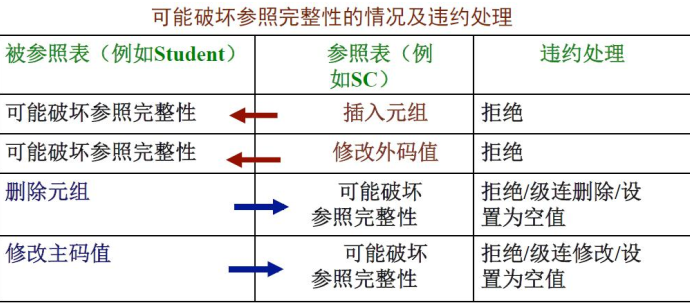

当上述的不一致发生时， 系统可以采用以下策略加以处理：

1. 拒绝执行（ No action）
2. 级联操作（ Cascade）： 当删除或修改被参照表时的一个元组导致与参照表不同时， 删除或修改参照表中的所有导致不一致的元组。
3. 设置为空值： 当删除或修改被参照表时的一个元组导致与参照表不同时， 则将参照表中的所有造成不一致的元组的对应属性设置为空值。    

## 关系查询处理和查询优化

### 关系数据库系统的查询处理

查询处理是 RDBMS 执行查询语句的过程， 其任务是把用户提交给 RDBMS 的查询语句转换为高效的查询执行计划。

查询处理步骤：

1. 查询分析（语法）
   对查询语句进行扫描、 词法分析、 语法分析
2. 查询检查（语义）
   对合法的查询语句进行语义检查， 即根据数据字典中有关的模式定义检查语句中的数据库对象， 如关系名、 属性名等是否存在和有效。 然后进行安全性、 完整性检查。 检查通过后把 SQL 语句转换成等价的关系代数表达式。 RDBMS 一般采用查询树（语法树） 来表示拓展的关系代数表达式。
3. 查询优化
   查询优化就是选择一个高效执行的查询处理策略。分为代数优化和物理优化
   1. 代数优化是指关系代数表达式的优化， 即按照一定的规则， 通过对关系代数表达式进行等价变换， 改变代数表达式中操作的次序和组合， 使查询执行更高效
   2. 物理优化是指通过存取路径和底层操作算法的选择进行的优化选择的依据可以是基于规则的、 基于代价的、 基于语义的。
4. 查询执行
   依据优化器得到的执行策略生成查询执行计划， 由代码生成器生成执行这个查询计划的代码， 然后加以执行， 回送查询结果。

### 实现查询操作的算法示例

#### 1、 选择操作的实现

（1） 全表扫描方法 (Table Scan)
对查询的基本表顺序扫描， 逐一检查每个元组是否满足选择条件， 把满足条件的元组作为结果输出。
适合小表， 不适合大表
（2） 索引扫描方法 (Index Scan)
适合于选择条件中的属性上有索引(例如 B+树索引或 Hash 索引)
通过索引先找到满足条件的元组主码或元组指针， 再通过元组指针直接在查询的基本表中找到元组  

[例1]`Select * from student where<条件表达式>；`

1） 全表扫描算法
假设可以使用的内存为 M 块， 全表扫描算法思想：

1. 按照物理次序读 Student 的 M 块到内存
2. 检查内存的每个元组 t， 如果满足选择条件， 则输出 t
3. 如果 student 还有其他块未被处理， 重复①和②  

2） 索引扫描算法
[例 9.1-C2] `SELECT * FROM Student WHERE Sno='201215121'`

- 假设 Sno 上有索引(或 Sno 是散列码)
- 算法：
  - 使用索引(或散列)得到 Sno 为‘ 201215121’ 元组的指针
  - 通过元组指针在 Student 表中检索到该学生

[例 9.1-C3] `SELECT * FROM Student WHERE Sage>20`

- 假设 Sage 上有 B+树索引
- 算法：
  - 使用 B+树索引找到 Sage=20 的索引项， 以此为入口点在 B+树的顺序集上得到 Sage>20 的所有元组指针
  - 通过这些元组指针到 student 表中检索到所有年龄大于 20 的学生。

[例 9.1-C4] `SELECT * FROM Student WHERE Sdept='CS' AND Sage>20;`

- 假设 Sdept 和 Sage 上都有索引
- 算法一： 分别用索引扫描找到 Sdept＝ ’CS’的一组元组指针和 Sage>20 的另一组元组指针
  - 求这两组指针的交集
  - 到 Student 表中检索
  - 得到计算机系年龄大于 20 的学生
- 算法二： 找到 Sdept=’CS’的一组元组指针，
  - 通过这些元组指针到 Student 表中检索
  - 并对得到的元组检查另一些选择条件(如 Sage>20)是否满足
  - 把满足条件的元组作为结果输出。

当选择率较低时， 基于索引的选择算法要优于全表扫描算法。 但在某些情况下， 例如选择率较高， 或者要查找的元组均匀地分布在查找的表中， 这是基于索引的选择算法性能不如全表扫描算法。 因此除了对表的扫描操作， 还要加上对 B+树索引的扫描操作， 对每一个检索码， 从 B+树根节点到叶子结点路径上的每个结点都要进行一次 IO 操作。  

#### 2、 连接操作的实现

连接操作是查询处理中最耗时的操作之一

[例 9.2] `SELECT * FROM Student, SC WHERE Student.Sno=SC.Sno;`

1） 嵌套循环算法(nested loop join)

- 对外层循环(Student 表)的每一个元组(s)， 检索内层循环(SC 表)中的每一个元组(sc)
- 检查这两个元组在连接属性(Sno)上是否相等
- 如果满足连接条件， 则串接后作为结果输出， 直到外层循环表中的元组处理完为止。

2） 排序-合并算法(sort-merge join 或 merge join)

- 如果连接的表没有排好序， 先对 Student 表和 SC 表按连接属性 Sno 排序

- 取 Student 表中第一个 Sno， 依次扫描 SC 表中具有相同 Sno 的元组

- 当扫描到 Sno 不相同的第一个 SC 元组时， 返回 Student 表扫描它的下一个元组， 再扫描 SC 表中具有相同 Sno 的元组， 把它们连接起来

- 重复上述步骤直到 Student 表扫描完 
  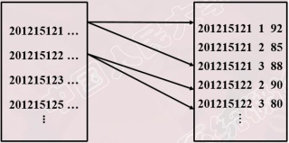

- > Student 表和 SC 表都只要扫描一遍。如果两个表原来无序， 执行时间要加上对两个表的排序时间。对于大表， 先排序后使用排序-合并连接算法执行连接， 总的时间一般仍会减少  

3） 索引连接(index join)算法

1. 在 SC 表上已经建立属性 Sno 的索引。

2. 对 Student 中每一个元组， 由 Sno 值通过 SC 的索引查找相应的 SC 元组。

3. 把这些 SC 元组和 Student 元组连接起来

4. 循环执行②③， 直到 Student 表中的元组处理完为止

5. > 只有表 2 需要索引

4） Hash Join 算法

- 把连接属性作为 hash 码， 用同一个 hash 函数把 Student 表和 SC 表中的元组散列到hash 表中。

- 划分阶段（ Build）

  - 对包含较少元组的表(如 Student 表)进行一遍处理
  - 把它的元组按 hash 函数分散到 hash 表的桶中

- 试探阶段（ Probe）

  - 对另一个表(SC 表)进行一遍处理
  - 把 SC 表的元组也按同一个 hash 函数（hash 码是连接属性） 进行散列
  - 把 SC 元组与桶中来自 Student 表并与之相匹配的元组连接起来

- > 将小表转为哈希表， 用表 1 的匹配字段用哈希函数映射到哈希表
  >
  > 上面 hash join 算法前提： 假设两个表中较小的表在第一阶段后可以完全放入内存的 hash 桶中  

### 关系数据库系统的查询优化

查询优化在关系数据库系统中有着非常重要的地位。关系查询优化是影响关系数据库管理系统性能的关键因素。由于关系表达式的语义级别很高， 使关系系统可以从关系表达式中分析查询语义， 提供了执行查询优化的可能性

#### 查询优化概述

关系系统的查询优化

- 是关系数据库管理系统实现的关键技术又是关系系统的优点所在
- 减轻了用户选择存取路径的负担

非关系系统

- 用户使用过程化的语言表达查询要求， 执行何种记录级的操作， 以及操作的序列是由用户来决定的
- 用户必须了解存取路径， 系统要提供用户选择存取路径的手段， 查询效率由用户的存取策略决定
- 如果用户做了不当的选择， 系统是无法对此加以改进的

查询优化的优点

1. 用户不必考虑如何最好地表达查询以获得较好的效率
2. 系统可以比用户程序的“优化” 做得更好
   （1） 优化器可以从数据字典中获取许多统计信息， 而用户程序则难以获得这些信息。
   （2） 如果数据库的物理统计信息改变了， 系统可以自动对查询重新优化以选择相适应的执行计划。 在非关系系统中必须重写程序， 而重写程序在实际应用中往往是不太可能的。
   （3） 优化器可以考虑数百种不同的执行计划， 程序员一般只能考虑有限的几种可能性。
   （4） 优化器中包括了很多复杂的优化技术， 这些优化技术往往只有最好的程序员才能掌握。 系统的自动优化相当于使得所有人都拥有这些优化技术。    

关系数据库管理系统通过某种代价模型计算出各种查询执行策略的执行代价，然后选取代价最小的执行方案

- 集中式数据库
  - 单用户系统：总代价=I/O代价+CPU代价
  - 多用户系统：总代价=I/O代价+CPU代价+内存代价
- 国分布式数据库
  - 总代价=I/O代价+CPU代价+内存代价+通信代价（I/O代价是最主要的）

查询优化的总目标

- 选择有效的策略
- 求得给定关系表达式的值
- 使得查询代价最小（实际上是较小）

### 代数优化

### 物理优化

## 事务与数据库恢复技术

事务处理技术包括数据库恢复技术和并发控制技术。
数据库恢复机制和并发控制机制是 DBMS 的重要组成部分。  

### 事务的基本概念
事务： 是用户定义的一个数据库操作序列， 这些操作要么全做， 要么全不做， 是一个不可分割的工作单位。

事务和程序比较

- 在关系数据库中， 一个事务可以是一条或多条 SQL 语句,也可以包含一个或多个程序。
- 一个程序通常包含多个事务

显式定义方式： ` begin transaction....commit/rollback  `

隐式方式：当用户没有显式地定义事务时， DBMS 按缺省规定自动划分事务。AutoCommit 事务是 SQL Server 默认事务方式

事务的特性(ACID 特性)

1. 原子性（atomicity）： 一个事务是一个不可分割的工作单位， 事务中包括的诸操作要么都做， 要么都不做；
2. 一致性（consistency）： 事务必须使数据库从一个一致性状态变成另一个一致性状态；
3. 隔离性（isolation）： 一个事务的执行不能被其他事务干扰；
4. 持续性（durability）： 也称永久性， 指一个事务一旦提交， 它对数据库中数据的改变就应该是永久性的．  

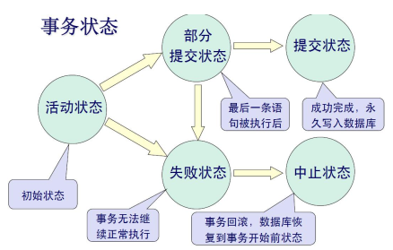

### 数据库恢复概述
 故障是不可避免的

- 系统故障： 计算机软、 硬件故障
- 人为故障： 操作员的失误、 恶意的破坏等。

 数据库的恢复

- 把数据库从错误状态恢复到某一已知的正确状态(亦称为一致状态或完整状态)

故障的种类

1. 事务内部的故障：
   1. 有的是可以通过事务程序本身发现的
   2. 有的是非预期的， 不能由应用程序处理（如运算溢出、 死锁等）以后， 事务故障仅指非预期的故障
      事务故障的恢复： UNDO 撤销
2. 系统故障
   1. 造成系统停止运转的任何事件， 使得系统要重新启动。（硬件错误、 断电等）
   2. 影响正在运行的所有事务， 但不破坏数据库。 此时内存， 尤其是数据库缓冲区中的内容全部丢失， 所有运行事务非正常终止。
   3. 恢复：
      1） 未提交的事务： UNDO 撤销所有未完成的事务
      2） 已提交的事务， 但缓冲区内容未完全写入磁盘： REDO 重做所有已提交的事务
3. 介质故障
   1. 系统故障称为软故障， 介质故障称为硬故障（ 外存故障， 如磁盘损坏）
   2. 恢复： 装入数据库发生介质故障前某个时刻的数据副本；
      REDO 自此时开始的所有成功事务， 将这些事务已提交的结果重新写入数据库
4. 计算机病毒
   1. 计算机病毒是一种人为的故障或破坏， 是一些恶作剧者研制的一种计算机程序。
   2. 可以繁殖和传播， 并造成对计算机系统包括数据库的危害。  

总之： 各类故障， 对数据库的影响有两种可能性

- 一是数据库本身被破坏
- 二是数据库没有被破坏， 但数据可能不正确， 这是由于事务的运行被非正 常终止造成的。  

### 恢复的实现技术
恢复操作的基本原理： 冗余

恢复机制涉及的两个关键问题

1. 如何建立冗余数据
   1. 数据转储（backup）
   2. 登录日志文件（logging）
2. 如何利用这些冗余数据实施数据库恢复  

 #### 数据转储

 数据转储定义：转储是指 DBA 将整个数据库复制到其他存储介质上保存起来的过程， 备用的数据称为后备副本或后援副本

如何使用

1. 数据库遭到破坏后可以将后备副本重新装入
2. 重装后备副本只能将数据库恢复到转储时的状态

转储方法

1. 静态转储与动态转储
2. 海量转储与增量转储

静态转储：

1. 定义： 在系统中无事务运行时进行的转储操作。 转储开始的时刻数据库处于一致性状态， 而转储不允许对数据库的任何存取、 修改活动。 静态转储得到的一定是一个数据一致性的副本。
2. 优点： 实现简单
3. 缺点： 降低了数据库的可用性
   转储必须等待正运行的用户事务结束才能进行； 新的事务必须等待转储结束才能执行

动态转储：

1. 定义： 转储期间允许对数据库进行存取或修改。 转储和用户事务可以并发执行。
2. 优点： 不用等待正在运行的用户事务结束； 不会影响新事务的运行。
3. 实现： 必须把转储期间各事务对数据库的修改活动登记下来， 建立日志文件。
   后备副本加上日志文件就能把数据库恢复到某一时刻的正确状态。

海量转储：

1. 定义： 每次转储全部数据库
2. 特点： 从恢复角度， 使用海量转储得到的后备副本进行恢复更方便一些。

增量转储：

1. 定义： 每次只转储上一次转储后更新过的数据
2. 特点： 如果数据库很大， 事务处理又十分频繁， 则增量转储方式更实用更有效。  

#### 日志文件

什么是日志文件：日志文件(log)是用来记录事务对数据库的更新操作的文件

日志文件的格式：

1. 以记录为单位：
   1. 日志文件中需要登记的内容包括：
      各个事务的开始标记(BEGIN TRANSACTION)
      各个事务的结束标记(COMMIT 或 ROLLBACK)
      各个事务的所有更新操作
   2. 每个日志记录的内容：
      **1 事务标识（标明是哪个事务）**
      **2 操作类型（插入、 删除或修改）**
      **3 操作对象（记录内部标识）**
      **4 更新前数据的旧值（对插入操作而言， 此项为空值）**
      **5 更新后数据的新值（对删除操作而言, 此项为空值）**
2. 以数据块为单位:
   1. 日志记录内容包括：
      事务标识（标明是哪个事务）
      被更新的数据块

日志文件的作用：

1. 进行事务故障恢复
2. 进行系统故障恢复
3. 协助后备副本进行介质故障恢复
   1. 事务故障恢复和系统故障恢复必须用日志文件
      2） 在动态转储方式中必须建立日志文件， 后备副本和日志文件结合起来才能有效地恢复数据库
      3） 静态转储方式中也可以建立日志文件（ 重新装入后备副本， 然后利用日志文件把已完成的事务进行重做， 对未完成事务进行撤销）  

登记日志文件：
基本原则

1. 登记的次序严格按并行事务执行的时间次序
2. 必须先写日志文件， 后写数据库
3. 为什么要先写日志文件？
   1） 写数据库和写日志文件是两个不同的操作， 在这两个操作之间可能发生故障
   2） 如果先写了数据库修改， 而在日志文件中没有登记下这个修改， 则以后就无法恢复这个修改了
   3） 如果先写日志， 但没有修改数据库， 按日志文件恢复时只不过是多执行一次不必要的 UNDO 操作， 并不会影响数据库的正确性  

### 恢复策略

#### 事务故障的恢复
事务故障： 事务在运行至正常终止点前被终止

恢复方法：由恢复子系统应利用日志文件撤消（UNDO） 此事务已对数据库进行的修改

事务故障的恢复由系统自动完成， 对用户是透明的， 不需要用户干预

事务故障的恢复步骤

1. **反向扫描文件日志， 查找该事务的更新操作。**
2. **对该事务的更新操作执行逆操作。 即将日志记录中“更新前的值” 写入数据库。**
** 插入操作， “更新前的值” 为空， 则相当于做删除操作**
** 删除操作， “更新后的值” 为空， 则相当于做插入操作**
** 若是修改操作， 则相当于用修改前值代替修改后值**
3. **继续反向扫描日志文件， 查找该事务的其他更新操作， 并做同样处理。**
4. **如此处理下去， 直至读到此事务的开始标记， 事务故障恢复就完成了。**

#### 系统故障的恢复

 系统故障造成数据库不一致状态的原因

- 未完成事务对数据库的更新已写入数据库
- 已提交事务对数据库的更新还留在缓冲区没来得及写入数据库  

恢复方法

1. Undo 故障发生时未完成的事务
2. Redo 已完成的事务

系统故障的恢复由系统在重新启动时自动完成， 不需要用户干预

系统故障的恢复步骤  

1. 正向扫描日志文件
   1. 重做(REDO) 队列: 在故障发生前已经提交的事务
      这些事务既有 BEGIN TRANSACTION 记录， 也有 COMMIT 记录
   2. 撤销 (Undo)队列: 故障发生时尚未完成的事务
      这 些 事 务 只 有 BEGIN TRANSACTION 记 录 ， 无 相 应 的COMMIT 记录

2. 对撤销(Undo)队列事务进行撤销(UNDO)处理
反向扫描日志文件， 对每个 UNDO 事务的更新操作执行逆操作
3. 对重做(Redo)队列事务进行重做(REDO)处理
正向扫描日志文件， 对每个 REDO 事务重新执行登记的操作

#### 介质故障的恢复

恢复步骤

1. 重装数据库
   1. 装入最新的后备副本， 使数据库恢复到最近一次转储时的一致性状态。
      1. 对于静态转储的数据库副本， 装入后数据库即处于一致性状态
      2. 对于动态转储的数据库副本， 还须同时装入转储时刻的日志文件副本， 利用恢复系统故障的方法（即 REDO+UNDO）， 才能将数据库恢复到一致性状态。
   2. 装入有关的日志文件副本， 重做已完成的事务。
      1. 首先扫描日志文件， 找出故障发生时已提交的事务的标识， 将其记入重做队列。
      2. 然后正向扫描日志文件， 对重做队列中的所有事务进行重做处理。

介质故障的恢复需要 DBA 介入
DBA 的工作

- 重装最近转储的数据库副本和有关的各日志文件副本
- 执行系统提供的恢复命令， 具体的恢复操作仍由 DBMS 完成

### 具有检查点的数据恢复

利用日志技术进行数据库恢复存在两个问题

- 搜索整个日志将耗费大量的时间  

- REDO 处理： 事务实际上已经执行， 又重新执行， 浪费了大量时间  

具有检查点（checkpoint） 的恢复技术

- 在日志文件中增加检查点记录（checkpoint）
- 增加重新开始文件， 并让恢复子系统在登录日志文件期间动态地维护日志

检查点记录的内容

- 建立检查点时刻所有正在执行的事务清单
-  这些事务最近一个日志记录的地址

重新开始文件的内容

- 记录各个检查点记录在日志文件中的地址  

动态维护日志文件的方法 ：周期性地执行如下操作： 建立检查点， 保存数据库状态。
具体步骤是：

1. 将当前日志缓冲区中的所有日志记录写入磁盘的日志文件上
2. 在日志文件中写入一个检查点记录
3. 将当前数据缓冲区的所有数据记录写入磁盘的数据库中
4. 把检查点记录在日志文件中的地址写入一个重新开始文件  

使用检查点方法可以改善恢复效率

- 当事务 T 在一个检查点之前提交
  - T 对数据库所做的修改一定都已写入数据库
  - 写入时间是在这个检查点建立之前或在这个检查点建立之时
  - 在进行恢复处理时， 没有必要对事务 T 执行 REDO 操作  

使用检查点的恢复步骤

1. 从重新开始文件中找到最后一个检查点记录在日志文件中的地址， 由该地址在日志文件中找到最后一个检查点记录
2. 由 该 检 查 点 记 录 得 到 检 查 点 建 立 时 刻 所 有 正 在 执 行 的 事 务 清 单
   ACTIVE-LIST
   1. 建立两个事务队列
      – UNDO-LIST
      – REDO-LIST
   2. 把 ACTIVE-LIST 暂时放入 UNDO-LIST 队列， REDO 队列暂为空
   3. 从检查点开始正向扫描日志文件， 直到日志文件结束 
      1. 如有新开始的事务 Ti， 把 Ti暂时放入 UNDO-LIST 队列
      2. 如有提交的事务 Tj， 把 Tj从 UNDO-LIST 队列移到 REDO-LIST 队列
   4. 对 UNDO-LIST 中的每个事务执行 UNDO 操作
      对 REDO-LIST 中的每个事务执行 REDO 操作

### 数据库镜像
为避免硬盘介质出现故障影响数据库的可用性， 许多 DBMS 提供了数据库镜像（mirror） 功能用于数据库恢复。

将整个数据库或其中的关键数据复制到另一个磁盘上， 每当主数据库更新时， DBMS 自动把更新后的数据复制过去， 由 DBMS 自动保证镜像数据与主数据库的一致性。 一旦出现介质故障， 可由镜像磁盘继续提供使用， 同时 DBMS 自动利用磁盘数据进行数据库的恢复， 不需要关闭系统和重装数据库副本。

在没有出现故障时， 数据库镜像还可以用于并发操作， 即当一个用户对数据库加排它锁修改数据时， 其他用户可以读镜像数据库上的数据， 而不必等待该用户释放锁。

由于数据库镜像是通过复制数据实现的， 频繁地赋值数据自然会降低系统运行效率。 因此在实际应用中用户往往只选择对关键数据和日志文件进行镜像。  

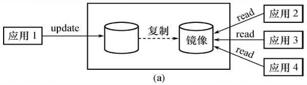

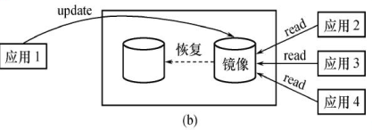

## 并发控制

多用户数据库： 允许多个用户同时使用的数据库（订票系统）
不同的多事务执行方式：

1. 串行执行： 每个时刻只有一个事务运行， 其他事务必须等到这个事务结束后方能运行。
2. 交叉并发方式：单处理机系统中， 事务的并发执行实际上是这些并行事务的并行操作轮流交叉运行（不是真正的并发， 但是提高了系统效率）
3. 同时并发方式：多处理机系统中， 每个处理机可以运行一个事务， 多个处理机可以同时运行多个事务， 实现多个事务真正的并行运行

并发执行带来的问题：

- 多个事务同时存取同一数据（共享资源）
- 存取不正确的数据， 破坏事务一致性和数据库一致性  

### 并发控制概述

并发操作带来的数据不一致性包括

1. 丢失修改（lost update）
2. 不可重复读（non-repeatable read）
3. 读脏数据（dirty read）

并发控制机制的任务：

1. 对并发操作进行正确的调度
2. 保证事务的隔离性
3. 保证数据库的一致性

并发控制的主要技术

1. 封锁（locking）（主要使用的）
2. 时间戳（timestamp）
3. 乐观控制法（optimistic scheduler）
4. 多版本并发控制（multi-version concurrency control ， MVCC）  

### 封锁
封锁： 封锁就是事务 T 在对某个数据对象（ 例如表、 记录等） 操作之前， 先向系统发出请求， 对其加锁。 加锁后事务 T 就对该数据对象有了一定的控制， 在事务 T 释放它的锁之前，其它的事务不能更新此数据对象

确切的控制由封锁的类型决定
基本的封锁类型有两种： **排它锁（X 锁， exclusive locks）、 共享锁（S 锁， share locks）**  

- 排它锁又称写锁， 对 A 加了排它锁之后， 其他事务不能对 A 加 任何类型的锁（排斥读和写）
- 共享锁又称读锁， 对 A 加了共享锁之后， 其他事务只能对 A 加 S 锁， 不能加 X 锁（ 只排斥写）  

#### 封锁协议
在运用 X 锁和 S 锁对数据对象加锁时， 需要约定一些规则： 封锁协议（Locking Protocol）

- 何时申请 X 锁或 S 锁
- 持锁时间、 何时释放

对封锁方式制定不同的规则， 就形成了各种不同的封锁协议。
常用的封锁协议： 三级封锁协议
三级封锁协议在不同程度上解决了并发问题， 为并发操作的正确调度提供一定的保证。  

1. 一级封锁协议
   **事务 T 在修改数据 R 之前， 必须先对其加` X 锁`， 直到事务结束（commit/rollback） 才释放。**
   一级封锁协议可以防止丢失修改
   **如果是读数据， 不需要加锁的， 所以它不能保证可重复读和不读“脏” 数据。**  
   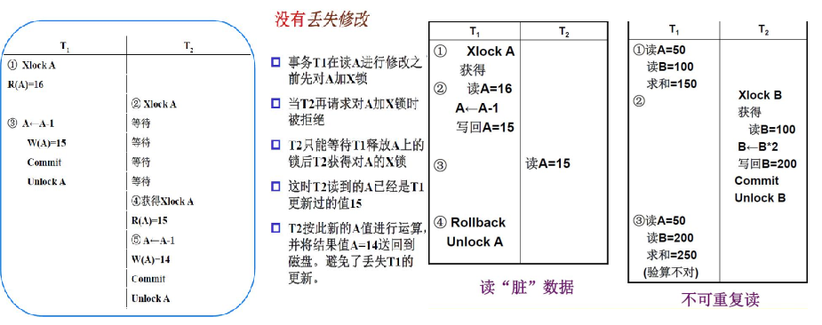

2. 二级封锁协议
   **在一级封锁协议的基础（ 写要加 X 锁， 事务结束释放） 上， 增加事务 T 在读入数据 R之前必须先对其加 `S 锁`， 读完后即可释放 S 锁。（读要加 S 锁， 读完即释放）**
   二级封锁协议除了可以防止丢失修改， 还可以防止读脏数据
   **由于读完数据即释放 S 锁， 不能保证不可重复读**  
   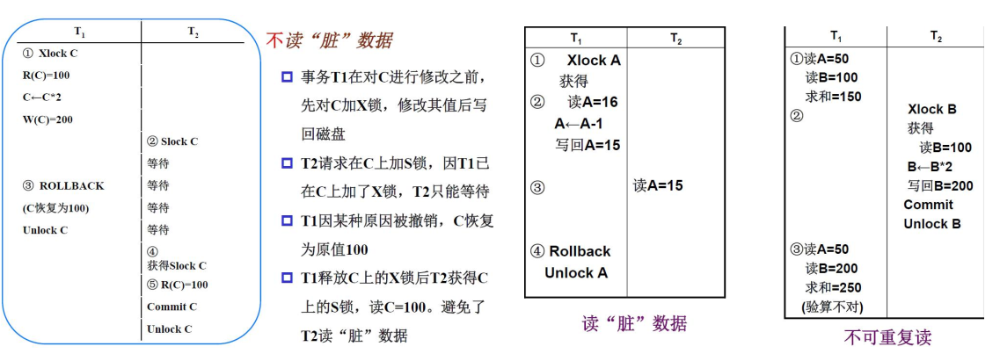
   3. 三级封锁协议：
      **在一级封锁协议基础上增加事务 T 在读取数据 R 之前必须先对其加` S 锁`， 直到事务结束后释放。**
      三级封锁协议除了可以防止丢失修改和读脏数据外， 还防止了不可重复读  
      

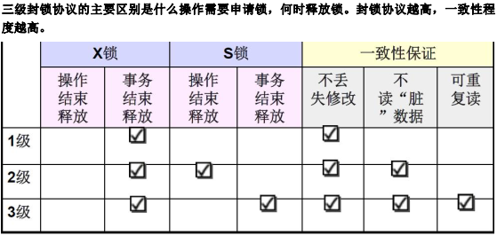

### 饥饿和死锁

饥饿： 事务 T1 封锁了数据 R， 事务 T2 又请求封锁 R， 于是 T2 等待。 T3 也请求封锁 R， 当T1 释放了 R 上的封锁之后， 系统首先批准了 T3 的请求， T2 仍然等待。 T4 又请求封锁 R，当 T3 释放了 R 上的封锁之后系统又批准了 T4 的请求……T2 有可能永远等待， 这就是饥饿的情形  

避免饥饿的方法： 先来先服务，当多个事务请求封锁同一数据对象时， 按请求封锁的先后次序对这些事务排队，该数据对象上的锁一旦释放， 首先批准申请队列中第一个事务获得锁。  

死锁： 事务 T1 封锁了数据 R1， T2 封锁了数据 R2。 T1 又请求封锁 R2， 因 T2 已封锁了 R2，于是 T1 等待 T2 释放 R2 上的锁。 接着 T2 又申请封锁 R1， 因 T1 已封锁了 R1， T2 也只能等待 T1 释放 R1 上的锁。 这样 T1 在等待 T2， 而 T2 又在等待 T1， T1 和 T2 两个事务永远不能结束， 形成死锁。  

解决死锁的方法： 预防、 诊断和解除

1. 死锁的预防
   产生死锁的原因是两个或多个事务都已经封锁了一些数据对象， 然后又都请求对已被其他事务封锁的数据对象加锁， 从而出现死等待。
   预防死锁发生就是破坏产生死锁的条件
   1. 一次封锁法：要求每个事务必须一次将所有要使用的数据全部加锁， 否则就不能继续执行。存在的问题： 降低系统的并发度； 难以实现精确确定封锁对象    
   2. 顺序封锁法：预先对数据对象规定一个封锁顺序， 所有事务都按这个顺序实施封锁。
      存在的问题：
      维护成本： 数据库系统中的封锁对象极多， 并且在不断地变化
      难以实现： 很难实现确定每一个事务要封锁哪些对象  

2. 死锁的诊断和解除
   方法： 超时法和事务等待图法
   1. 超时法： 如果一个事务的等待时间超过了规定的时限， 就认为发生了死锁
      优点： 实现简单
      缺点： 误判死锁； 时限若设置太长， 死锁发生后不能及时发现。
   2. 事务等待图法： 用事务等待图动态反映所有事务的等待情况事务
      等待图是一个有向图 G=(T， U)， T 为结点的集合， 每个结点表示正运行的事务， U为边的集合， 每条边表示事务等待的情况。 若 T1 等待 T2， 则 T1、 T2 之间划一条有向边， 从 T1 指向 T2。  
      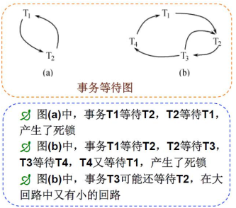并发控制子系统周期性地（ 比如每隔数秒） 生成事务等待图， 检测事务。 如果发现图中存在回路， 则表示系统中出现了死锁。
      解除死锁： 并发控制子系统选择一个处理死锁代价最小的事务， 将其撤销。释放该事务持有的所有的锁， 使其他事务能够继续运行下去。  

### 并发调度的可串行性

定义： 多个事务的并发执行是正确的， 当且仅当其结果与按某一次序串行地执行这些事务时的结果相同， 称这种调度策略为可串行化调度（serializable）。

可串行性是并发事务正确调度的准则。 按这个准则规定， 一个给定的并发调度， 当且仅当它是可串行化的， 才认为是正确调度。  

冲突可串行化调度：判断可串行化调度的充分条件
**冲突操作： 不同的事务对同一个数据的读写和写写操作**  

冲突可串行化调度：
一个调度 Sc 在保证冲突操作的次序不变的情况下， 通过交换两个事务不冲突操作的次序得到另一个调度 Sc’ ， 如果 Sc’ 是串行的， 称调度 Sc 为冲突可串行化的调度。  

### 两段锁协议
DBMS 的并发控制机制必须提供一定的手段来保证调度是可串行化的。 目前 DBMS 普遍采用两段锁协议（TwoPhase Locking， 简称 2PL） 的方法来显示并发调度的可串行性。

两段锁协议是指所有事务必须分两个阶段对数据对象进行加锁和解锁。

1. 在对任何数据进行读写操作以前， 首先要申请并获得对该数据的锁。
2. 在释放一个锁之后， 事务不再申请和获得其他任何的锁。

“两段” 锁的含义： 事务分为两个阶段

- 第一阶段是获得封锁， 也称为扩展阶段
  事务可以申请获得任何数据对象上的任何类型的锁， 但是不能释放任何锁
- 第二阶段是释放封锁， 也称为收缩阶段
  事务可以释放任何数据对象上的任何类型的锁， 但是不能再申请任何锁  

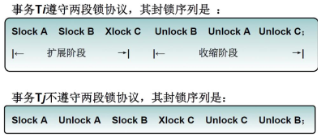

事务遵守两段锁协议是可串行化调度的充分条件， 而不是必要条件。
若并发事务都遵守两段锁协议， 则对这些事务的任何并发调度策略都是可串行化的。
若并发事务的一个调度是可串行化的， 不一定所有事务都符合两段锁协议。  

两段锁协议与防止死锁的一次封锁法

- 一次封锁法要求每个事务必须一次将所有要使用的数据全部加锁， 否则就不能继续执行， 因此一次封锁法遵守两段锁协议
- 但是两段锁协议并不要求事务必须一次将所有要使用的数据全部加锁， 因此遵守两段锁协议的事务可能发生死锁  

### 封锁的粒度
封锁对象的大小称为封锁粒度（granularity）。
封锁的对象可以是逻辑单元（属性值、 属性值集合、 元组、 关系、 索引项、 数据库）， 也可以是物理单元（页、 物理记录）。
选择封锁粒度原则：封锁粒度和系统的并发度和并发控制的开销密切相关  

- 封锁的粒度越大， 数据库所能够封锁的数据单元就越少， 并发度就越低， 系统开销也越小；
- 封锁的粒度越小， 并发度较高， 但系统开销也就越大  

#### 多粒度封锁
如果在一个系统中同时支持多种封锁粒度供不同的事务选择， 这种封锁方法称为多粒度封锁。（multiple granularity locking）
选择封锁粒度应该同时考虑封锁开销和并发度两个因素， 适当选择封锁粒度以求得最优的效果。

- 需要处理多个关系的大量元组的用户事务： 以数据库为封锁单位
- 需要处理大量元组的用户事务： 以关系为封锁单元
- 只处理少量元组的用户事务： 以元组为封锁单位  

多粒度树：以树形结构来表示多级封锁粒度。 根结点是整个数据库， 表示最大的数据粒度， 叶结点表示最小的数据粒度 。

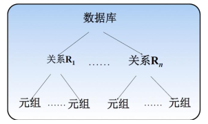

多粒度封锁协议： 允许多粒度树中的每个节点被独立地加锁， 对一个节点加锁意味着这个节点的所有子节点也被加以同样类型的锁。 因此， 在多粒度封锁中一个数据对象可能以显式封锁和隐式封锁两种方式封锁。

- 显式封锁： 直接加到数据对象上的封锁
- 隐式封锁： 该数据对象没有独立加锁， 是由于其上级结点加锁而使该数据对象加上了锁
- 显式封锁和隐式封锁的效果是一样的

系统检查封锁冲突时要检查显式封锁， 还要检查隐式封锁 。

例如事务 T 要对关系 R1 加 X 锁， 系统必须搜索其上级结点数据库、 关系 R1， 还要搜索 R1的下级结点， 即 R1 中的每一个元组。 如果其中某一个数据对象已经加了不相容锁， 则 T 必须等待。

对某个数据对象加锁， 系统要检查该数据对象上有无显式封锁与之冲突； 再检查其所有上级节点， 看本事务的显式封锁是否与该数据对象上的隐式封锁（ 由于上级节点已加的封锁造成的） 冲突； 还要检查其所有下级节点， 看它们的显式封锁是否与本事务的隐式封锁（将加到下级节点的封锁） 冲突。

这种检查方法效率较低， 引入一种新的锁， **意向锁**。 有了意向锁， DBMS 就无须逐个检查下一级节点的显式封锁。  

#### 意向锁
意向锁： 如果对一个节点加意向锁， 则可说明该节点的下层节点正在被加锁； 对任一节点加锁时， 必须先对它的上层节点加意向锁。

例如， 对任一元组加锁时， 必须先对它所在的数据库和关系加意向锁。

三种常用的意向锁： **意向共享锁（Intent Share Lock， IS 锁）； 意向排它锁（Intent Exclusive Lock，IX 锁）； 共享意向排它锁（Share Intent Exclusive Lock， SIX 锁）。**  

1. IS 锁
   如果对一个数据对象加 IS 锁， 表示它的子节点拟加 S 锁。
   例如： 事务 T1 要对 R1 中某个元组加 S 锁， 则要首先对关系 R1 和数据库加 IS 锁
2. IX 锁
   如果对一个数据对象加 IX 锁， 表示它的子节点拟加 X 锁。
   例如： 事务 T1 要对 R1 中某个元组加 X 锁， 则要首先对关系 R1 和数据库加 IX 锁
3. SIX 锁
   如果对一个数据对象加 SIX 锁， 表示对它加 S 锁， 再加 IX 锁， 即 SIX = S + IX。

例如： 对某个表加 SIX 锁， 则表示该事务要读整个表（所以要对该表加 S 锁）， 同时会更新个别元组（所以要对该表加 IX 锁）  

意向锁相容矩阵：

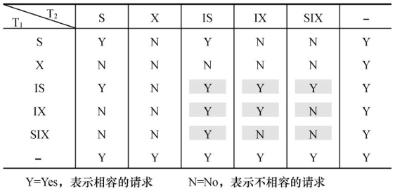

意向锁的强度： 锁的强度是指它对其他锁的排斥程度。 一个事务在申请封锁时以强锁代替弱锁是安全的， 反之则不然。

具有意向锁的多粒度封锁方法 ：

- 申请封锁时应该按自上而下的次序进行
- 释放封锁时则应该按自下而上的次序进行  

> 例如：事务T1要对关系R1加S锁
> 即首先对数据库加IS锁;
> 检查数据库和R1是否已加了不相容的锁（X或IX);
> 不再需要搜索和检查R1中的元组是否加了不相容的锁（X锁）

优点：
1） 提高了系统并发度
2） 减少了加锁和解锁的开销
在实际的 DBMS 产品中得到广泛应用。  

### 其他并发控制机制

并发控制的方法除了封锁技术外， 还有时间戳方法、 乐观控制法和多版本并发控制。

- 时间戳方法： 给每一个事务盖上一个时标， 即事务开始的时间。 每个事务具有唯一的时间戳， 并按照这个时间戳来解决事务的冲突操作。 如果发生冲突操作， 就回滚到具有较早时间戳的事务， 以保证其他事务的正常执行， 被回滚的事务被赋予新的时间戳被从头开始执行。
- 乐观控制法认为事务执行时很少发生冲突， 所以不对事务进行特殊的管制， 而是让它自由执行， 事务提交前再进行正确性检查。 如果检查后发现该事务执行中出现过冲突并影响了可串行性， 则拒绝提交并回滚该事务。 又称为验证方法  
- 多版本控制是指在数据库中通过维护数据对象的多个版本信息来实现高效并发的一种策略。  

## 范式

函数依赖：A→B， A 和 B 是两个属性集， 来自同一关系模式， 对于同样的 A 属性值， B 属性值也相同

平凡的函数依赖：X→Y， 如果 Y 是 X 的子集

非平凡的函数依赖：X→Y， 如果 Y 不是 X 的子集

部分函数依赖：X→Y， 如果存在 W→Y， 且 W⊂X

传递函数依赖：在 R(U)中， 如果 X→Y(非平凡函数依赖,完全函数依赖)， Y→Z， 则称 Z 对 X 传递函数依赖。  记为： X→ Z  

1. super key： 在关系中能唯一标识元素的属性集
2. candidate key 或 key： 不含有多余属性的 super key
3. primary key： 在 candidate key 中任选一个
   1. candidate key 中 X 决定所有属性的函数依赖是完全函数依赖
   2. 包含在任何一个 candidate key 中的属性 ， 称为主属性
   3. 不包含在 candidate key 中的属性称为非主属性  

- 1NF：列不可分
- 2NF 消除了非主属性对键的部分函数依赖
  在关系 T 上有函数依赖集 F， F+是 F 的闭包。
  F 满足 2NF， 当且仅当 每个非平凡的函数依赖 X->A(F+),A 是单个非主属性， 要求 X 不是任何 key 的真子集（有可能是 super key， 也有可能是非 key） 。
- 3NF 消除了非主属性对键的传递函数依赖
  F 满足 3NF， 当且仅当 每个非平凡的函数依赖 X->A(F+),A 是单个非主属性， 要求 X 是 T 的super key。  
- BCNF 消除了主属性对键的部分函数依赖和传递函数依赖
  F 满足 BCNF， 当且仅当 每个非平凡的函数依赖 X->A(F+),A 是单个属性， 要求 X 是 T 的 super key。
  对于 F+中 的任意一个 X->A， 如果 A 是单个属性， 且 A 不在 X 中， 那么 X 一定是 T 的 super key  

### 反范式（减少连接， 提高查询效率）  

#### Pattern1：

 合并 1 对 1 关系  

例： 学院给老师配车， 车少人多， 车完全参与， 人部分参与
car

| car_id | car_name |
| ------ | -------- |
| 1      | c1       |
| 2      | c2       |
| 3      | c3       |

teacher

| teacher_id | teacher_name |
| ---------- | ------------ |
| 1          | t1           |
| 2          | t2           |
| 3          | t3           |
| 4          | t4           |

合并后
car_and_teacher

| car_id | car_name | teacher_id | teacher_name |
| ------ | -------- | ---------- | ------------ |
| 1      | c1       | 1          | t1           |
| 2      | c2       | 2          | t2           |
| 3      | c3       | 3          | t3           |
| NULL   | NULL     | 4          | t4           |

问题： 会产生大量空值， 若两边都部分参与则不能合并；
部分参与为大部分参与时比较适合 Pattern1

#### Pattern2： 

1 对 N 关系中复制非键属性以减少连接

两表连接时复制非键属性以减少连接
例： 查询学生以及所在学院名， 可以在学生表中不仅存储学院 id， 并且存储学院名  

faculty

| fid  | fname |
| ---- | ----- |
| 1    | f1    |

student

| sid  | sname | fid  | fname |
| ---- | ----- | ---- | ----- |
| 1    | s1    | 1    | f1    |

维护时：

- 如果在 UI 中， 只允许用户进行选择， 不能自行输入， 保证输入一致性
- 如果是程序员， 对于类似学院名这种一般不变的代码表， 在修改时直接对两张表都进行修改； 如果经常变化， 则可以加一个触发器。

#### Pattern3： 

1 对 N 关系中复制外键以减少连接

把另一张表的主键复制变成外键  

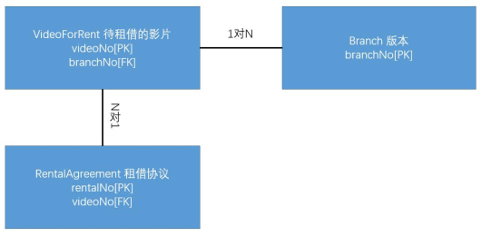

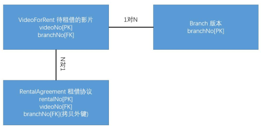

#### Pattern4： 

N 对 N 关系中复制属性， 把两张表中经常需要的内容复制到中间关系表中以减少连接  

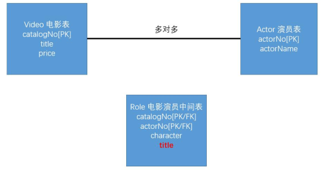

#### Pattern5：引入重复值

通常对于一个多值属性， 值不太多， 且不会经常变， 可以在表中建立多个有关此属性的列
address1 | address2 | address3 | address4

#### Pattern6： 建立提取表

为了解决查询和更新之间不可调和的矛盾， 可以将更新和查询放在两张表中， 从工作表中提取查询表， 专门用于查询。 只适用于查询实时性不高的情况。

#### Pattern7： 分表

水平拆分
垂直拆分  