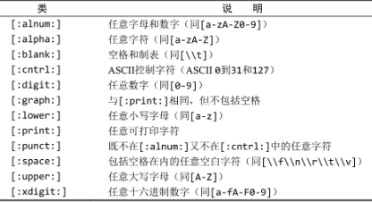
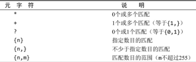

# 数据库基础


# 使用MySQL

**结束SQL语句**: 多条SQL语句必须以分号（;）分隔。

**SQL语句和大小写:** 请注意，SQL语句不区分大小写，因此SELECT与select是相同的。

> 一定要认识到虽然SQL是不区分大小写的，但有些标识符（如数据库名、表名、列名）可能不同：在MySQL 4.1及之前的版本中，这些标识符默认是区分大小写的；在MySQL 4.1.1版本中，这些标识符默认是不区分大小写的。最佳方式是按照大小写的惯例，且使用时保持一致。

**使用空格**: 在处理SQL语句时，其中所有空格都被忽略。SQL语句可以在一行上给出，也可以分成许多行。

## 选择数据库并查看信息

`USE dataSource;`使用dataSource数据库

`SHOW DATABASES；`返回可用数据库的一个列表。包含在这个列表中的可能是MySQL内部使用的数据库

`SHOW TABLES;`返回当前选择的数据库内可用表的列表

`show columns from city;`显示city表中的表列；它对每个字段返回一行，行中包含字段名、数据类型、是否允许NULL、键信息、默认值以及其他信息

- DESCRIBE语句：MySQL支持用DESCRIBE作为·`SHOW COLUMNS FROM`的一种快捷方式。换句话说，`DESCRIBE customers；`是`SHOW COLUMNS FROM customers；`的一种快捷方式。

所支持的其他SHOW语句还有：

- `SHOW STATUS`，用于显示广泛的服务器状态信息；
- `SHOW CREATE DATABASE`和`SHOW CREATE TABLE`，分别用来显示创建特定数据库或表的MySQL语句；
- `SHOW GRANTS`，用来显示授予用户（所有用户或特定用户）的安全权限；
- `SHOW ERRORS`和`SHOW WARNINGS`，用来显示服务器错误或警告消息。

## 检索数据select

`select name from city;`检索单个列

`select city.name from city;`使用完全限定的表名检索列

`select name, district, population  from city;`检索多个列

`select * from city;`检索所有列

> **当心逗号**: 在选择多个列时，一定要在列名之间加上逗号，但最后一个列名后不加。
>
> **使用通配符:** 一般，除非你确实需要表中的每个列，否则最好别使用*通配符。虽然使用通配符可能会使你自己省事，不用明确列出所需列，但检索不需要的列通常会降低检索和应用程序的性能。

`select distinct pro_id from city;`检索不同的行;`DISTINCT`关键字返回不同的值

> **不能部分使用DISTINCT** :DISTINCT关键字应用于所有列而不仅是前置它的列。如果给出SELECT DISTINCT vend_id, prod_price，除非指定的两个列都不同，否则所有行都将被检索出来。

`select * from city limit 10;`限制输出结果数量；`limit 10`表示返回不多于10行

`select * from city limit 10, 10;`第一个表示开始的位置，第二个表示显示的行数

> **行0** :MySQL从0开始计数，因此检索出来的第一行为行0而不是行1。因此，`LIMIT 1, 1`将检索出第二行而不是第一行。
>
> **在行数不够时:** LIMIT中指定要检索的行数为检索的最大行数。如果没有足够的行（例如，给出LIMIT 10, 5，但只有13行）, MySQL将只返回它能返回的那么多行。

## 排序检索order by

> **子句（clause）:** SQL语句由子句构成，有些子句是必需的，而有的是可选的。一个子句通常由一个关键字和所提供的数据组成。

`select name from city order by name;`按单列排序显示（默认升序从A到Z）；根据name列进行排序显示

> **通过非选择列进行排序:** 通常，ORDER BY子句中使用的列将是为显示所选择的列。但是，实际上并不一定要这样，用非检索的列排序数据是完全合法的。

`select * from city order by name, countrycode;`按多个列排序;首先按名字，名字相同继续按照城市代码排序

`select name from city order by name DESC;`结果降序排序（从Z到A）

`select price, name from products order by price desc, name;`用多个列排序；price降序排序，name仍然升序排序

> DESC关键字只应用到直接位于其前面的列名；如果想在多个列上进行降序排序，必须对每个列指定DESC关键字。

`select price, name from products order by price desc limit 1;`使用ORDER BY和LIMIT的组合，能够找出一个列中最高或最低的值

> **ORDER BY子句的位置:** 在给出ORDER BY子句时，应该保证它位于FROM子句之后。如果使用LIMIT，它必须位于ORDER BY之后。

## 过滤数据where

`SELECT prod_name,prod_price FROM products WHERE prod_price=2.50；`

> **WHERE子句的位置:** 在同时使用ORDER BY和WHERE子句时，应该让ORDER BY位于WHERE之后，否则将会产生错误

`SELECT prod_ name,prod_price FROM products WHERE prod_name='fuses';`查询时不区分大小写，fuses和Fuses都会查出来

`SELECT prod_ name,prod_price FROM products WHERE prod_price is null;`

> **NULL 无值（no value）**，它与字段包含0、空字符串或仅仅包含空格不同。
>
> **NULL与不匹配** 在通过过滤选择出不具有特定值的行时，你可能希望返回具有NULL值的行。但是，不行。因为未知具有特殊的含义，数据库不知道它们是否匹配，所以在匹配过滤或不匹配过滤时不返回它们。

### 组合子句过滤数据

> **操作符（operator）** 用来联结或改变WHERE子句中的子句的关键字。也称为逻辑操作符（logical operator）。

- **and/or操作符**

`SELECT prod_id,prod_price,prod_ name FROM products WHERE vend_id=1003 AND prod_price<=10;`AND操作符

`SELECT prod_name,prod_price FROM products WHERE vend_id=1002 OR vend_id=1003;`OR操作符

> 注意：WHERE可包含任意数目的AND和OR操作符。允许两者结合以进行复杂和高级的过滤。但是SQL（像多数语言一样）在处理OR操作符前，**优先处理AND操作符**。

`SELECT prod name,prod price FROM products WHERE vendid=1002 OR vend_id=1003 AND prod price >=10;`的结果不同于`SELECT prod name,prod price FROM products WHERE (vendid=1002 OR vend_id=1003) AND prod price >=10;`

> **在WHERE子句中使用圆括号** 任何时候使用具有AND和OR操作符的WHERE子句，都应该使用圆括号明确地分组操作符。不要过分依赖默认计算次序，即使它确实是你想要的东西也是如此。使用圆括号没有什么坏处，它能消除歧义。

- **in操作符**

> IN操作符用来指定条件范围，范围中的每个条件都可以进行匹配。IN取合法值的由逗号分隔的清单，全都括在圆括号中

`SELECT prod_ name,prod_price FROM products WHERE vend_id IN(1002,1003) ORDER BY prod_name;`

等同于`SELECT prod_ name,prod_price FROM products WHERE vend_id =1002 or vend_id = 1003 ORDER BY prod_name;`

> IN操作符一般比OR操作符清单执行更快

- **not操作符**

> WHERE子句中的NOT操作符有且只有一个功能，那就是否定它之后所跟的任何条件。

`SELECT prod_ name,prod_price FROM products WHERE vend_id NOT IN (1002,1003) ORDER BY prod_name;`

### 使用通配符过滤LIKE

> **通配符（wildcard）** 用来匹配值的一部分的特殊字符。
>
> **搜索模式（search pattern）**由字面值、通配符或两者组合构成的搜索条件
>
> 在搜索子句中使用通配符，必须使用`LIKE操作符`。LIKE指示MySQL，后跟的搜索模式利用通配符匹配而不是直接相等匹配进行比较。
>
> like是全值匹配

- %通配符

> 在搜索串中，%表示任何字符出现任意次数；除了一个或多个字符外，%还能匹配0个字符。%代表搜索模式中给定位置的0个、1个或多个字符。

`SELECT prod_id,prod_name FROM products WHERE prod_name LIKE 'jet%';`%告诉MySQL接受jet之后的任意字符，不管它有多少字符。

> **区分大小写** 根据MySQL的配置方式，搜索可以是区分大小写的。如果配置中确定区分大小写，'jet%’与JetPack将不匹配。
>
> 通配符可在搜索模式中任意位置使用，并且可以使用多个通配符

`SELECT prod_id,prod_name FROM products WHERE prod_name LIKE '%jet%';`

> **注意NULL** 虽然似乎%通配符可以匹配任何东西，但有一个例外，即NULL。即使是WHERE prod_name LIKE '%’也不能匹配用值NULL作为产品名的行。

- 下划线_通配符

> 下划线的用途与%一样，但下划线只匹配单个字符，不能多也不能少

`SELECT prod_id,prod_name FROM products WHERE prod_name LIKE'_ ton anvil';`匹配如“1 ton anvil”

通配符搜索的处理一般要比前面讨论的其他搜索所花时间更长。

-  不要过度使用通配符。如果其他操作符能达到相同的目的，应该使用其他操作符。
- 在确实需要使用通配符时，除非绝对有必要，否则不要把它们用在搜索模式的开始处。把通配符置于搜索模式的开始处，搜索起来是最慢的。
- 仔细注意通配符的位置。如果放错地方，可能不会返回想要的数据

## 正则表达式搜索

> 正则表达式的作用是匹配文本，将一个模式（正则表达式）与一个文本串进行比较。

`SELECT prod_name FROM products WHERE prod_name REGEXP '1000' ORDER BY prod_name;`REGEXP后所跟的东西作为正则表达式处理。

> LIKE与REGEXP 在LIKE和REGEXP之间有一个重要的差别:
>
> `SELECT prod_name FROM products WHERE prod_name LIKE '1000' ORDER BY prod_name;`  
>
> `SELECT prod_name FROM products WHERE prod_name REGEXP '1000' ORDER BY prod_name;`
>
> 如果执行上述两条语句，会发现第一条语句不返回数据，而第二条语句返回一行。
>
> - 因为LIKE匹配整个列。如果被匹配的文本在列值中出现，LIKE将不会找到它，相应的行也不被返回（除非使用通配符）。
> - REGEXP在列值内进行匹配，如果被匹配的文本在列值中出现，REGEXP将会找到它，相应的行将被返回。
>
> 这是一个非常重要的差别。那么，REGEXP能不能用来匹配整个列值（从而起与LIKE相同的作用）？答案是肯定的，使用^和$定位符（anchor）即可
>
> `．`是正则表达式语言中一个特殊的字符。它表示匹配任意一个字符

- or匹配

> 为搜索两个串之一（或者为这个串，或者为另一个串），使用`|`

`SELECT prod_name FROM products WHERE prod_name REGEXP '1000|2000|300' ORDER BY prod_name;`

- 匹配几个字符**之一**

> 如果你只想匹配特定的字符，怎么办？可通过指定一组用[和]括起来的字符来完成

`SELECT prod_name FROM products WHERE prod_name REGEXP '[123] Ton' ORDER BY prod_name;`[123]定义一组字符，它的意思是匹配1或2或3,因此，1 ton/2 ton/3 ton都匹配且返回

> 为否定一个字符集，在集合的开始处放置一个^即可。因此，尽管`[123]`匹配字符1、2或3，但`[^123]`却匹配除这些字符外的任何东西。
>
> **匹配范围**: 例如，下面的集合将匹配数字0到9：`[0123456789]`为简化这种类型的集合，可使用`-`来定义一个范围。下面的式子功能上等同于上述数字列表：`[0-9]`

- 匹配特殊字符

> 为了匹配特殊字符，必须用`\\`为前导。`\\-`表示查找`-`,` \\．`表示查找`．`。这种处理就是所谓的转义（escaping）

`SELECT vend_name FROM vendors WHERE vend_name REGEXP '\\.' ORDER BY vend_name;`

> 匹配`\ `为了匹配反斜杠（\）字符本身，需要使用`\\\`。
>
> **`\`或`\\？`** 多数正则表达式实现使用单个反斜杠转义特殊字符，以便能使用这些字符本身。但MySQL要求两个反斜杠（MySQL自己解释一个，正则表达式库解释另一个）

- 匹配字符类



- 匹配多个实例



`SELECT prod_name FROM products WHERE prod_ name REGEXP '\\([O-9] sticks?\\)' ORDER BY prod_name;`正则表达式`\\([0-9] sticks? \\)`需要解说一下。`\\(`匹配`)`, `[0-9]`匹配任意数字（这个例子中为1和5）, `sticks？`匹配`stick`和`sticks`（s后的？使s可选，因为？匹配它前面的任何字符的0次或1次出现）, \\)匹配)。

`SELECT prod_ name FROM products WHERE prod_ name RECEXP'[[:digit:]]{4}' ORDER BY prod_name;`匹配连在一起的4位数字

- 定位符

> 为了匹配特定位置的文本需要使用定位符


`SELECT prod_name FROM products WHERE prod_name REGEXP '^[O-9\\.]' ORDER BY prod_name;`找出以一个数（包括以小数点开始的数）开始的所有产品

> **^的双重用途** ^有两种用法。在集合中（用[和]定义），用它来否定该集合，否则，用来指串的开始处。
>
> **使REGEXP起类似LIKE的作用** LIKE和REGEXP的不同在于，**LIKE匹配整个串而REGEXP匹配子串**。利用定位符，通过用^开始每个表达式，用$结束每个表达式，可以使REGEXP的作用与LIKE一样。
>
> **简单的正则表达式测试** 可以在不使用数据库表的情况下用SELECT来测试正则表达式。REGEXP检查总是返回0（没有匹配）或1（匹配）。可以用带文字串的REGEXP来测试表达式，并试验它们。

## 创建计算字段

> 存储在数据库表中的数据一般不是应用程序所需要的格式，需要进一步计算、转换或格式化才能得到想要的形式则需要用到计算字段。
>
> 我们需要直接从数据库中检索出转换、计算或格式化过的数据；而不是检索出数据，然后再在客户机应用程序或报告程序中重新格式化。

> 字段（field）** 基本上与列（column）的意思相同，经常互换使用，不过数据库列一般称为列，而术语字段通常用在计算字段的连接上。

> 只有数据库知道SELECT语句中哪些列是实际的表列，哪些列是计算字段。从客户机（如应用程序）的角度来看，计算字段的数据是以与其他列的数据相同的方式返回的。
>
> **客户机与服务器的格式** 可在SQL语句内完成的许多转换和格式化工作都可以直接在客户机应用程序内完成。但一般来说，在数据库服务器上完成这些操作比在客户机中完成要快得多，因为DBMS是设计来快速有效地完成这种处理的。

### 拼接字段

> **拼接（concatenate）** 将值联结到一起构成单个值。
>
> **MySQL的不同之处** 多数DBMS使用+或||来实现拼接，MySQL则使用Concat()函数来实现。当把SQL语句转换成MySQL语句时一定要把这个区别铭记在心。

`SELECT Concat(vend_name,' (',vend_country,')') FROM vendors ORDER BY vend_name；`供应商的名字中按照name(location)这样的格式列出供应商的位置

> Concat()拼接串，即把多个串连接起来形成一个较长的串。Concat()需要一个或多个指定的串，各个串之间用逗号分隔

`SELECT Concat(RTRIM(vend_name),' (',RTRIM(vend_country),')') FROM vendors ORDER BY vend_name；`RTrim()函数去掉值右边的所有空格。通过使用RTrim()，各个列都进行了整理。

> Trim函数 MySQL除了支持RTrim()（正如刚才所见，它去掉串右边的空格），还支持LTrim()（去掉串左边的空格）以及Trim()（去掉串左右两边的空格）。

`SELECT Concat(RTRIM(vend_name),' (',RTRIM(vend_country),')') AS vend_title FROM vendors ORDER BY vend_name；`

> **别名（alias）**是一个字段或值的替换名。别名用AS关键字赋予。

> **别名的其他用途** 别名还有其他用途。常见的用途包括在实际的表列名包含不符合规定的字符（如空格）时重新命名它，在原来的名字含混或容易误解时扩充它，等等。
>
> **导出列** 别名有时也称为导出列（derived column），不管称为什么，它们所代表的都是相同的东西。

### 执行算术计算

`SELECT prod_id, quantity, item_price, quantity*item_price AS expanded_price
FROM orderitems
WHERE order_num=20005；`

> 如何测试计算 SELECT提供了测试和试验函数与计算的一个很好的办法。虽然SELECT通常用来从表中检索数据，但可以省略FROM子句以便简单地访问和处理表达式。例如，SELECT 3*2；将返回6, SELECT Trim('abc')；将返回abc，而SELECT Now()利用Now()函数返回当前日期和时间。通过这些例子，可以明白如何根据需要使用SELECT进行试验。

## 数据处理函数

### 文本处理函数

- `Trim()`去除空格
- `RTrim()`去掉串右边的空格
- `LTrim()`去掉串左边的空格
- `Upper()`将文本转换为大写
- `Lower()`将串转换为小写
- `Left()`返回串左边的字符
- `Right()`返回串右边的字符
- `Length()`返回串的长度
- `Locate()`找出串的一个子串
- `Substring()`返回子串的字符
- `Soundex()`返回串的SOUNDEX值

> SOUNDEX是一个将任何文本串转换为描述其语音表示的字母数字模式的算法。SOUNDEX考虑了类似的发音字符和音节，使得能对串进行发音比较而不是字母比较。

### 日期时间处理函数

- AddDate()增加一个日期(天、周等）
- AddTime()增加一个时间（时、分等）
- curDate()返回当前日期
- curTime()返回当前时间
- Date()返回日期时间的日期部分
- DateDiff()计算两个日期之差
- Date_Add()高度灵活的日期运算函数
- Date_Format()返回一个格式化的日期或时间串
- Day()返回一个日期的天数部分
- Dayofweek()对于一个日期，返回对应的星期几
- Hour()返回一个时间的小时部分
- Minute()返回一个时间的分钟部分
- Month()返回一个日期的月份部分
- Now()返回当前日期和时间
- second()返回一个时间的秒部分
- Time()返回一个日期时间的时间部分
- Year()返回一个日期的年份部分

> **MySQL使用的日期格式**：无论你什么时候指定一个日期，不管是插入或更新表值还是用WHERE子句进行过滤，日期必须为格式`yyyy-mm-dd`。

`SELECT cust_id,order_num FROM orders WHERE order_date='2005-09-01'；`存储的order_date值为2005-09-01 11:30:05，则WHERE order_date = '2005-09-01’失败

正确：`SELECT cust_id,order_num FROM orders WHERE DATE(order_date)='2005-09-01'；`Date(order_date)指示MySQL仅提取列的日期部分

> MySQL的日期及时间值数据类型为`datetime`。

`SELECT cust_id,order_num FROM orders WHERE DATE(order_date) between '2005-09-01' and '2005-09-30'；`检索出2005年9月下的所有订单

或者：`SELECT cust_id,order_num FROM orders WHERE YEAR(order_date)=2005 and Month(order_date)=9 `

### 数值处理函数

- Abs()返回一个数的绝对值
- Cos()返回一个角度的余弦
- Exp()返回一个数的指数值
- Mod()返回除操作的余数
- Pi()返回圆周率
- Rand()返回一个随机数
- Sin()返回一个角度的正弦
- Sqrt()返回一个数的平方根
- Tan()返回一个角度的正切

## 汇总数据-聚集函数

> 聚集函数（aggregate function） 运行在行组上，计算和返回单个值的函数。聚集函数使得计算直接在数据库进行，计算结束才返回给客户机

- `AVG()`返回某列的平均值
- `COUNT()`返回某列的行数
- `MAX()`返回某列的最大值
- `MIN()`返回某列的最小值
- `SUM()`返回某列值之和

`SELECT AVG(prod_price)AS avg_price FROM products WHERE vend_id=1003；`计算特定行列的平均值

> **只用于单个列** AVG()只能用来确定特定数值列的平均值，而且列名必须作为函数参数给出。为了获得多个列的平均值，必须使用多个AVG()函数。

> COUNT()函数进行计数。可利用COUNT()确定表中行的数目或符合特定条件的行的数目。
>
> **NULL值** 如果指定列名，则指定列的值为空的行被COUNT()函数忽略，但如果COUNT()函数中用的是星号（*），则不忽略。
>
> - 使用COUNT(*)对表中**所有行**的数目进行计数，不管表列中包含的是空值（NULL）还是非空值。
> - 使用COUNT(column)对特定列中具有值的行进行计数，**忽略NULL值**。

> **NULL值** `MAX()`和`MIN()`和`SUM()`和`AVG()`函数忽略列值为NULL的行。

以上5个聚集函数都可以如下使用：

- 对所有的行执行计算，指定ALL参数或不给参数（因为ALL是默认行为）；
- 只包含不同的值，指定DISTINCT参数。

`SELECT AVG(DISTINCT prod_price)AS avg_price FROM products;`使用了DISTINCT参数，因此平均值只考虑各个不同的价格

> **注意** 如果指定列名，则DISTINCT只能用于COUNT()。DISTINCT不能用于COUNT(*)，因此不允许使用COUNT（DISTINCT），否则会产生错误。类似地，DISTINCT必须使用列名，不能用于计算或表达式。
>
> **将DISTINCT用于MIN()和MAX()** 虽然DISTINCT从技术上可用于MIN()和MAX()，但这样做实际上没有价值。一个列中的最小值和最大值不管是否包含不同值都是相同的。

> SELECT语句可根据需要包含多个聚集函数。

## 分组查询

`SELECT vend_id, COUNT(*) AS num_prods FROM products GROUP BY vend_id;`GROUP BY子句指示MySQL按vend_id排序并分组数据。这导致对每个vend_id而不是整个表计算num_prods一次。

> GROUP BY子句指示MySQL分组数据，然后对每个组而不是整个结果集进行聚集。

- GROUP BY子句可以包含任意数目的列。这使得能对分组进行嵌套，为数据分组提供更细致的控制。
- 如果在GROUP BY子句中嵌套了分组，数据将在最后规定的分组上进行汇总。换句话说，在建立分组时，指定的所有列都一起计算（所以不能从个别的列取回数据）。
- GROUP BY子句中**列出的每个列都必须是检索列或有效的表达式（但不能是聚集函数）**。
- **如果在SELECT中使用表达式，则必须在GROUP BY子句中指定相同的表达式，不能使用别名**。
- **凡是在group by后面出现的字段，必须同时在select后面出现；凡是在select后面出现的、同时未在聚合函数中出现的字段，必须同时出现在group by后面**。
- 如果分组列中具有NULL值，则**NULL将作为一个分组返回**。如果列中有多行NULL值，它们将分为一组。
- GROUP BY子句必须出现在**WHERE子句之后，ORDER BY子句之前**。

> 使用ROLLUP使用WITH ROLLUP关键字，可以得到每个分组以及每个分组汇总级别（针对每个分组）的值，如下所示：
> `SELECT vend_id,COUNT(*)AS num_prods FROM products
> GROUP BY vend_id WITH ROLLUP;`

> HAVING非常类似于WHERE。事实上，目前为止所学过的所有类型的WHERE子句都可以用HAVING来替代。唯一的差别是**WHERE过滤行，而HAVING过滤分组。**
>
> 这里有另一种理解方法，**WHERE在数据分组前进行过滤，HAVING在数据分组后进行过滤**。这是一个重要的区别，WHERE排除的行不包括在分组中。这可能会改变计算值，从而影响HAVING子句中基于这些值过滤掉的分组。

> **不要忘记ORDER BY** 一般在使用GROUP BY子句时，应该也给出ORDER BY子句。这是保证数据正确排序的唯一方法。千万不要仅依赖GROUP BY排序数据。

- select子句顺序：
- SELECT要返回的列或表达式
- FROM从中检索数据的表
- WHERE 行级过滤
- GROUP BY分组说明
- HAVING组级过滤
- ORDER BY输出排序顺序
- LIMIT要检索的行数

## 使用子查询

- **利用子查询进行过滤**

> 在SELECT语句中，子查询总是从内向外处理。

```sql
SELECT cust_name, cust_contact FROM customers
WHERE cust_id IN (SELECT cust_id FROM orders 
									WHERE order_num IN (SELECT order_num FROM orderitems 
																			WHERE prod_1d='TNT2'));
```

> **格式化SQL** 包含子查询的SELECT语句难以阅读和调试，特别是它们较为复杂时更是如此。如上所示把子查询分解为多行并且适当地进行缩进，能极大地简化子查询的使用。
>
> **列必须匹配** 在WHERE子句中使用子查询，应该保证SELECT语句具有与WHERE子句中相同数目的列。通常，子查询将返回单个列并且与单个列匹配，但如果需要也可以使用多个列。

- **作为计算字段使用子查询**

> 使用子查询的另一方法是创建计算字段。

假如需要显示customers表中每个客户的订单总数。订单与相应的客户ID存储在orders表中。为了执行这个操作，遵循下面的步骤。(1) 从customers表中检索客户列表。(2) 对于检索出的每个客户，统计其在orders表中的订单数目。

查询单个人的订单数量：`SELECT COUNT(*) AS orders FROM orders WHERE cust_ id = 10001;`  

```mysql
SELECT cust_name,cust_state,(SELECT COUNT(*)FROM orders WHERE orders.cust_id=customers.cust_id) AS orders
FROM customers
ORDER BY cust_name;
```

> **逐渐增加子查询来建立查询** 用子查询测试和调试查询很有技巧性，特别是在这些语句的复杂性不断增加的情况下更是如此。用子查询建立（和测试）查询的最可靠的方法是逐渐进行，这与MySQL处理它们的方法非常相同。
>
> - 首先，建立和测试最内层的查询。
> - 然后，用硬编码数据建立和测试外层查询，并且仅在确认它正常后才嵌入子查询。
> - 这时，再次测试它。
> - 对于要增加的每个查询，重复这些步骤。这样做仅给构造查询增加了一点点时间，但节省了以后（找出查询为什么不正常）的大量时间，并且极大地提高了查询一开始就正常工作的可能性。

## 联结表

联结是一种机制，用来在一条SELECT语句中关联表

```mysql
SELECT vend_name,prod_name,prod_price
FROM vendors,products
WHERE vendors.vend_id=products.vend_id
ORDER BY vend_name,prod_name;
```

> **外键（foreign key）** 外键为某个表中的一列，它包含另一个表的主键值，定义了两个表之间的关系。
>
> **完全限定列名** 在引用的列可能出现二义性时，必须使用完全限定列名（用一个点分隔的表名和列名）

- **笛卡儿积（cartesian product）** 由没有联结条件的表关系返回的结果为笛卡儿积。检索出的行的数目将是第一个表中的行数乘以第二个表中的行数

> **不要忘了WHERE子句** 应该保证所有联结都有WHERE子句，否则MySQL将返回比想要的数据多得多的数据(笛卡尔积)。同理，应该保证WHERE子句的正确性。不正确的过滤条件将导致MySQL返回不正确的数据。

- 内联结INNER JOIN

```mysql
SELECT vend_name,prod_name,prod_price
FROM vendors INNER JOIN products
ON vendors.vend_id=products.vend_id；
```

- 自联结

```mysql
#查询生产有产品ID是'DTNTR'的产品的供应商生产的所有商品
#使用子查询
SELECT prod_id,prod name FROM products
WHERE vend_id=(SELECT vend_id
							FROM products	WHERE prod_id='DTNTR');
#使用自联结：两个表实际上是相同的表
SELECT p1.prod_id,pl.prod_name
FROM products AS pl,products AS p2
WHERE p1.vend_id=p2.vend_id
AND p2.prod_id=‘DTNTR’;
```

> **用自联结而不用子查询** 自联结通常作为外部语句用来替代从相同表中检索数据时使用的子查询语句。虽然最终的结果是相同的，但有时候处理联结远比处理子查询快得多。

- 外部联结OUTER JOIN

> **外部联结的类型** 存在两种基本的外部联结形式：左外部联结和右外部联结。它们之间的唯一差别是所关联的表的顺序不同。换句话说，左外部联结可通过颠倒FROM或WHERE子句中表的顺序转换为右外部联结。因此，两种类型的外部联结可互换使用，而究竟使用哪一种纯粹是根据方便而定。

- 使用带聚集函数的联结

```mysql
SELECT cuStomers.cust_name, customers.cust_id, COUNT(orders.order_num)AS num_ord
FROM customers INNER JOIN orders ON customers.cust_id=orders.cust_id
GROUP BY customers.cust_id;
```

## 组合查询UNION

> 多数SQL查询都只包含从一个或多个表中返回数据的单条SELECT语句。MySQL也允许执行多个查询（多条SELECT语句），并将结果作为单个查询结果集返回。这些组合查询通常称为并（union）或复合查询（compound query）。

有两种基本情况，其中需要使用组合查询：

- 在单个查询中从不同的表返回类似结构的数据；
- 对单个表执行多个查询，按单个查询返回数据。

```mysql
SELECT vend_id,prod_id,prod_price
FROM products
WHERE prod_price<=5
UNION
SELECT vend_id,prod_id,prod_price
FROM products
WHERE vend id IN(1001.1002):
#相当于将两个子句的结果在一个表中显示
```

UNION规则：

- UNION必须由两条或两条以上的SELECT语句组成，语句之间用关键字UNION分隔（因此，如果组合4条SELECT语句，将要使用3个UNION关键字）
- UNION中的每个查询必须包含相同的列、表达式或聚集函数（不过各个列不需要以相同的次序列出）。
- 列数据类型必须兼容：类型不必完全相同，但必须是DBMS可以隐含地转换的类型（例如，不同的数值类型或不同的日期类型）

> UNION会从查询结果集中自动去除重复的行（换句话说，它的行为与单条SELECT语句中使用多个WHERE子句条件一样）
>
> 如果想返回所有匹配行，可使用UNION ALL而不是UNION。

> **UNION与WHERE** : UNION几乎总是完成与多个WHERE条件相同的工作。UNION ALL为UNION的一种形式，它完成WHERE子句完成不了的工作。如果确实需要每个条件的匹配行全部出现（包括重复行），则必须使用UNION ALL而不是WHERE。

> 在用UNION组合查询时，只能使用一条ORDER BY子句，它必须出现在最后一条SELECT语句之后。对于结果集，不存在用一种方式排序一部分，而又用另一种方式排序另一部分的情况，因此不允许使用多条ORDER BY子句。

## 插入INSERT

插入可以用几种方式使用：

- 插入完整的行；
- 插入行的一部分；
- 插入多行；
- 插入某些查询的结果。

### 插入完整的行

`INSERT INTO customers VALUES(NULL,‘Pep E.LaPew',‘100 Main Street',‘Los Angeles',‘CA'，‘90046'，‘USA',NULL，NULL)`

编写INSERT语句的更安全（不过更烦琐）的方法如下：

```mysql
INSERT INTO customers (cust_name,cust_address,cust_city,cust_state,cust_zip,cust_country,cust_contact,cust_email)
VALUES('Pep E.LaPew',‘100 Main Street',‘Los Angeles',CA',‘90046’,‘USA',NULL,NULL);

```

> 因为提供了列名，VALUES必须以其指定的次序匹配指定的列名，不一定按各个列出现在实际表中的次序。其优点是，即使表的结构改变，此INSERT语句仍然能正确工作。
>
> 使用这种语法，还可以省略列。这表示可以只给某些列提供值，给其他列不提供值。省略的列必须满足以下某个条件。
>
> - 该列定义为允许NULL值（无值或空值）
> - 在表定义中给出默认值。这表示如果不给出值，将使用默认值。
>
> 不管使用哪种INSERT语法，都必须给出VALUES的正确数目。如果不提供列名，则必须给每个表列提供一个值。如果提供列名，则必须对每个列出的列给出一个值

> **提高整体性能** : 数据库经常被多个客户访问，对处理什么请求以及用什么次序处理进行管理是MySQL的任务。INSERT操作可能很耗时（特别是有很多索引需要更新时），而且它可能降低等待处理的SELECT语句的性能。如果数据检索是最重要的（通常是这样），则你可以通过在INSERT和INTO之间添加关键字LOW_PRIORITY，指示MySQL降低INSERT语句的优先级，如下所示：`insert low_priority into`顺便说一下，这也适用于UPDATE和DELETE语句。

### 插入多个行

```mysql
INSERT INTO customers(cust_name,cust_address,cust_city,cust_state,cust_zip,cust_country)
VALUES('Pep E.LaPew', '1100 Main Street','Los Angeles', 'CA','90046','USA'), 
			('M.Martian', '42 Galaxy way','New York','NY','11213', 'USA');

```

> 其中单条INSERT语句有多组值，每组值用一对圆括号括起来，用逗号分隔。

### 插入检索出的数据

INSERT一般用来给表插入一个指定列值的行。但是，INSERT还存在另一种形式，可以利用它将一条SELECT语句的结果插入表中。这就是所谓的INSERT SELECT，顾名思义，它是由一条INSERT语句和一条SELECT语句组成的。

```mysql
INSERT INTO customers ( cust_id,cust_contact,cust_email,cust_name,cust_address,cust_city,cust_state,cust_zip,cust_country )
SELECT 
cust_id,cust_contact,cust_email,cust_name,cust_address,cust_city,cust_state,cust_zip,cust_country
FROM custnew;
```

> SELECT语句从custnew检索出要插入的值，而不是列出它们。SELECT中列出的每个列对应于customers表名后所跟的列表中的每个列。这条语句将插入多少行有赖于custnew表中有多少行。
>
> **INSERT SELECT中的列名**：为简单起见，这个例子在INSERT和SELECT语句中使用了相同的列名。但是，不一定要求列名匹配。事实上，MySQL甚至不关心SELECT返回的列名。它使用的是列的位置，因此SELECT中的第一列（不管其列名）将用来填充表列中指定的第一个列，第二列将用来填充表列中指定的第二个列，如此等等。

## 更新数据UPDATE

基本的UPDATE语句由3部分组成，分别是：

- 要更新的表；
- 列名和它们的新值；
- 确定要更新行的过滤条件。

```mysql
#更新单个列
UPDATE customers
SET cust_email='elmer@fudd.com'
WHERE cust_id=10005;
#更新多个列
UPDATE customers
SET cust_name='The Fudds', cust_email='elmer@fudd.com'
WHERE cust_id=10005:
```

```mysql
#为了删除某个列的值，可设置它为NULL（假如表定义允许NULL值）
UPDATE customers
SET cust_email=NULL
WHERE cust_id=10005;
```

## 删除数据DELETE

为了从一个表中删除（去掉）数据，使用DELETE语句。可以两种方式使用DELETE：

- 从表中删除特定的行
- 从表中删除所有行

```mysql
DELETE FROM cuStomers
WHERE cust_id=10006；
```

> DELETE不需要列名或通配符。DELETE删除整行而不是删除列。为了删除指定的列，请使用UPDATE语句。
>
> **删除表的内容而不是表** ：DELETE语句从表中删除行，甚至是删除表中所有行。但是，DELETE不删除表本身。
>
> **更快的删除：** 如果想从表中删除所有行，不要使用DELETE。可使用TRUNCATE TABLE语句，它完成相同的工作，但速度更快（TRUNCATE实际是删除原来的表并重新创建一个表，而不是逐行删除表中的数据）。

使用UPDATE或DELETE时所遵循的习惯。

- 除非确实打算更新和删除每一行，否则绝对不要使用不带WHERE子句的UPDATE或DELETE语句。
- 保证每个表都有主键，尽可能像WHERE子句那样使用它（可以指定各主键、多个值或值的范围）。
- 在对UPDATE或DELETE语句使用WHERE子句前，应该先用SELECT进行测试，保证它过滤的是正确的记录，以防编写的WHERE子句不正确。
- 使用强制实施引用完整性的数据库，这样MySQL将不允许删除具有与其他表相关联的数据的行。

## 创建表CREATE TABLE

为利用CREATE TABLE创建表，必须给出下列信息：

- 新表的名字，在关键字CREATE TABLE之后给出；
- 表列的名字和定义，用逗号分隔。

```mysql
CREATE TABLE cuStomers
cust_id int NOT NULL AUTO_INCREMENT,
cust name char(50) NOT NULL,
cust_address char(50)NULL,
cust_city char(50)NULL,
cust state char(5)NULL,
cust_zip char(10)NULL,
cust_country char(50)NULL DEFAULT china,
cust_contact char(50)NULL,
cust_email char(255)NULL,
PRIMARY KEY(cust_id)
)ENGINE=InnoDB;

```

- NULL 值

> NULL值就是没有值或缺值。允许NULL值的列也允许在插入行时不给出该列的值。不允许NULL值的列不接受该列没有值的行，换句话说，在插入或更新行时，该列必须有值。每个表列或者是NULL列，或者是NOT NULL列，这种状态在创建时由表的定义规定。
>
> **理解NULL:** 不要把NULL值与空串相混淆。NULL值是没有值，它不是空串。如果指定''（两个单引号，其间没有字符），这在NOT NULL列中是允许的。空串是一个有效的值，它不是无值。NULL值用关键字NULL而不是空串指定。

- 主键

> 主键值必须唯一。即，表中的每个行必须具有唯一的主键值。如果主键使用单个列，则它的值必须唯一。如果使用多个列，则这些列的组合值必须唯一。
>
> 主键中只能使用不允许NULL值的列。允许NULL值的列不能作为唯一标识。
>
> 其中主键用以下的类似的语句定义：`PRIMARY KEY(cust_id)`
>
> 创建由多个列组成的主键以逗号分隔的列表给出各列名:`PRIMARY KEY(cust_id,cust_name)`

- 自增属性

> 每个表只允许一个`AUTO_INCREMENT`列，而且它必须被索引（如，通过使它成为主键）
>
> 如果一个列被指定为AUTO_INCRE-MENT，则它需要使用特殊的值吗？你可以简单地在INSERT语句中指定一个值，只要它是唯一的（至今尚未使用过）即可，该值将被用来替代自动生成的值。后续的增量将开始使用该手工插入的值。
>
> **覆盖AUTO_INCREMENT：** 如果一个列被指定为AUTO_INCREMENT，则它需要使用特殊的值吗？你可以简单地在INSERT语句中指定一个值，只要它是唯一的（至今尚未使用过）即可，该值将被用来替代自动生成的值。后续的增量将开始使用该手工插入的值。
>
> **确定AUTO_INCREMENT值：** 让MySQL生成（通过自动增量）主键的一个缺点是你不知道这些值都是谁。考虑这个场景：你正在增加一个新订单。这要求在orders表中创建一行，然后在orderitems表中对订购的每项物品创建一行。order_num在orderitems表中与订单细节一起存储。这就是为什么orders表和orderitems表为相互关联的表的原因。这显然要求你在插入orders行之后，插入orderitems行之前知道生成的order_num。那么，如何在使用AUTO_INCREMENT列时获得这个值呢？可使用`last_insert_id()`函数获得这个值，如下所示：`SELECT last_insert_id()`此语句返回最后一个AUTO_INCREMENT值，然后可以将它用于后续的MySQL语句。

- 指定默认值

> 如果在插入行时没有给出值，MySQL允许指定此时使用的默认值。默认值用CREATE TABLE语句的列定义中的`DEFAULT`关键字指定。
>
> **不允许函数:** 与大多数DBMS不一样，MySQL不允许使用函数作为默认值，它只支持常量。

- 引擎类型

> 以下是几个需要知道的引擎：
>
> - InnoDB是一个可靠的事务处理引擎，它不支持全文本搜索；
> - MEMORY在功能等同于MyISAM，但由于数据存储在内存（不是磁盘）中，速度很快（特别适合于临时表）；
> - MyISAM是一个性能极高的引擎，它支持全文本搜索，但不支持事务处理。
>
> **外键不能跨引擎:** 混用引擎类型有一个大缺陷。外键（用于强制实施引用完整性）不能跨引擎，即使用一个引擎的表不能引用具有使用不同引擎的表的外键

## 更新表ALTER TABLE

> 理想状态下，当表中存储数据以后，该表就不应该再被更新

为了使用ALTER TABLE更改表结构，必须给出下面的信息：

- 在ALTER TABLE之后给出要更改的表名（该表必须存在，否则将出错）；
- 所做更改的列表。

```mysql
#添加一个列
ALTER TABLE vendors
ADD vend_phone CHAR(20)；
#删除一个列
ALTER TABLE vendors
DROP COLUMN vend_phone;
#定义外键
ALTER TABLE orderitems
ADD CONSTRAINT fk_orderitems_orders
FOREIGN KEY (order_num) REFERENCES orders (order_num);
```

## 删除表DROP TABLE

`DROP TABLE vendors;`

## 重命名表RENAME TABLE

`RENAME TABLE vendors2 TO vendors;`