02.MySQL

1. 多语言支持： MySQL 为 C、 C++、 Python、 Java、 Perl、 PHP、 Ruby 等多种编程语言提供了 API， 访问和使用方便。
2. 可以移植性好： MySQL 是跨平台的。 
3. 高效： MySQL 的核心程序采用完全的多线程编程。
4. 支持大量数据查询和存储： MySQL 可以承受大量的并发访问  

## 数据类型

### 数值类型

MySQL支持所有标准SQL数值数据类型。

这些类型包括严格数值数据类型(INTEGER、SMALLINT、DECIMAL和NUMERIC)，以及近似数值数据类型(FLOAT、REAL和DOUBLE PRECISION)。

关键字INT是INTEGER的同义词，关键字DEC是DECIMAL的同义词。

BIT数据类型保存位字段值，并且支持MyISAM、MEMORY、InnoDB和BDB表。

作为SQL标准的扩展，MySQL也支持整数类型TINYINT、MEDIUMINT和BIGINT。下面的表显示了需要的每个整数类型的存储和范围。

| 类型         | 大小                                     | 范围（有符号）                                               | 范围（无符号）                                               | 用途            |
| :----------- | :--------------------------------------- | :----------------------------------------------------------- | :----------------------------------------------------------- | :-------------- |
| TINYINT      | 1 字节                                   | (-128，127)                                                  | (0，255)                                                     | 小整数值        |
| SMALLINT     | 2 字节                                   | (-32 768，32 767)                                            | (0，65 535)                                                  | 大整数值        |
| MEDIUMINT    | 3 字节                                   | (-8 388 608，8 388 607)                                      | (0，16 777 215)                                              | 大整数值        |
| INT或INTEGER | 4 字节                                   | (-2 147 483 648，2 147 483 647)                              | (0，4 294 967 295)                                           | 大整数值        |
| BIGINT       | 8 字节                                   | (-9,223,372,036,854,775,808，9 223 372 036 854 775 807)      | (0，18 446 744 073 709 551 615)                              | 极大整数值      |
| FLOAT        | 4 字节                                   | (-3.402 823 466 E+38，-1.175 494 351 E-38)，0，(1.175 494 351 E-38，3.402 823 466 351 E+38) | 0，(1.175 494 351 E-38，3.402 823 466 E+38)                  | 单精度 浮点数值 |
| DOUBLE       | 8 字节                                   | (-1.797 693 134 862 315 7 E+308，-2.225 073 858 507 201 4 E-308)，0，(2.225 073 858 507 201 4 E-308，1.797 693 134 862 315 7 E+308) | 0，(2.225 073 858 507 201 4 E-308，1.797 693 134 862 315 7 E+308) | 双精度 浮点数值 |
| DECIMAL      | 对DECIMAL(M,D) ，如果M>D，为M+2否则为D+2 | 依赖于M和D的值；其中 M 表示十进制数字总的个数， D 表示小数点后面数字的位数。 | 依赖于M和D的值                                               | 小数值          |

### 字符串类型

字符串类型指CHAR、VARCHAR、BINARY、VARBINARY、BLOB、TEXT、ENUM和SET。该节描述了这些类型如何工作以及如何在查询中使用这些类型。

| 类型       | 大小                | 用途                            |
| :--------- | :------------------ | :------------------------------ |
| CHAR       | 0-255字节           | 定长字符串，不足填充空格        |
| VARCHAR    | 0-65535 字节        | 变长字符串                      |
| TINYBLOB   | 0-255字节           | 不超过 255 个字符的二进制字符串 |
| TINYTEXT   | 0-255字节           | 短文本字符串                    |
| BLOB       | 0-65 535字节        | 二进制形式的长文本数据          |
| TEXT       | 0-65 535字节        | 长文本数据                      |
| MEDIUMBLOB | 0-16 777 215字节    | 二进制形式的中等长度文本数据    |
| MEDIUMTEXT | 0-16 777 215字节    | 中等长度文本数据                |
| LONGBLOB   | 0-4 294 967 295字节 | 二进制形式的极大文本数据        |
| LONGTEXT   | 0-4 294 967 295字节 | 极大文本数据                    |

> CHAR 和 VARCHAR 类型类似，但它们保存和检索的方式不同。它们的最大长度和是否尾部空格被保留等方面也不同。在存储或检索过程中不进行大小写转换。
>
> BINARY 和 VARBINARY 类似于 CHAR 和 VARCHAR，不同的是它们包含二进制字符串而不要非二进制字符串。也就是说，它们包含字节字符串而不是字符字符串。这说明它们没有字符集，并且排序和比较基于列值字节的数值值。
>
> BLOB 是一个二进制大对象，可以容纳可变数量的数据。有 4 种 BLOB 类型：TINYBLOB、BLOB、MEDIUMBLOB 和 LONGBLOB。它们区别在于可容纳存储范围不同。
>
> 有 4 种 TEXT 类型：TINYTEXT、TEXT、MEDIUMTEXT 和 LONGTEXT。对应的这 4 种 BLOB 类型，可存储的最大长度不同，可根据实际情况选择。

### 日期和时间类型

表示时间值的日期和时间类型为DATETIME、DATE、TIMESTAMP、TIME和YEAR。

每个时间类型有一个有效值范围和一个"零"值，当指定不合法的MySQL不能表示的值时使用"零"值。

TIMESTAMP类型有专有的自动更新特性，将在后面描述。

| 类型      | 大小 (字节) | 范围                                                         | 格式                | 用途                     |
| :-------- | :---------- | :----------------------------------------------------------- | :------------------ | :----------------------- |
| DATE      | 3           | 1000-01-01/9999-12-31                                        | YYYY-MM-DD          | 日期值                   |
| TIME      | 3           | '-838:59:59'/'838:59:59'                                     | HH:MM:SS            | 时间值或持续时间         |
| YEAR      | 1           | 1901/2155                                                    | YYYY                | 年份值                   |
| DATETIME  | 8           | 1000-01-01 00:00:00/9999-12-31 23:59:59                      | YYYY-MM-DD HH:MM:SS | 混合日期和时间值         |
| TIMESTAMP | 4           | 1970-01-01 00:00:00/2038结束时间是第 **2147483647** 秒，北京时间 **2038-1-19 11:14:07**，格林尼治时间 2038年1月19日 凌晨 03:14:07 | YYYYMMDD HHMMSS     | 混合日期和时间值，时间戳 |

DATE, DATETIME, 和 TIMESTAMP 类型 这三者其实是关联的， 都用来表示日期或时间 .

当 你 需 要 **同 时 包 含 日 期 和 时 间 信 息 的 值 时** 则 使 用 DATETIME 类 型 。 MySQL 以'YYYY-MM-DD HH:MM:SS'格式检索和显示 DATETIME 值。 支持的范围为'1000-01-01 00:00:00'到'9999-12-31 23:59:59'。

当你**只需要日期值而不需要时间部分时**应使用 DATE 类型。 MySQL 用'YYYY-MM-DD'格式检索和显示 DATE 值。 支持的范围是'1000-01-01'到 '9999-12-31'。

TIMESTAMP类型同样包含日期和时间， 范围从'1970-01-01 00:00:01' UTC 到'2038-01-1903:14:07' UTC。

TIME 值的范围可以从'-838:59:59'到'838:59:59'。 小时部分会因此大的原因是 TIME 类型不仅可以用于表示一天的时间(必须小于 24 小时)， 还可能为某个事件过去的时间或两个事件之间的时间间隔(可以大于 24 小时， 或者甚至为负)

两者的存储方式不一样
对于 TIMESTAMP， 它把客户端插入的时间从当前时区转化为 UTC（世界标准时间） 进行存储。 查询时， 将其又转化为客户端当前时区进行返回。
而对于 DATETIME， 不做任何改变， 基本上是原样输入和输出。

YEAR 类型是一个单字节类型用于表示年。  

## 逻辑架构

MySQL 的特点体现在其存储引擎的架构上。
插件式的存储引擎架构将**查询处理和其他的系统任务以及数据的存储提取相分离**， 这种架构可以让用户根据业务需求和实际需要选择合适的存储引擎。  

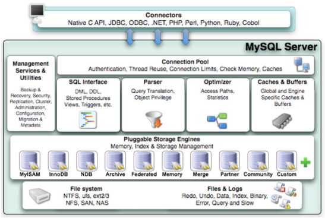

### 连接层（管理客户端的连接， 维护线程池）

最上层是一些客户端和连接服务， 引入了线程池的概念； 实现基于 SSL 的安全连接
每个客户端都会在服务器进程中拥有一个线程， 这个连接的查询只会在这个单独的线程中执行。

当客户端连接到 MySQL 服务器时， 服务器需要对其进行认证。 如果使用了 SSL 安全套接字的方式连接， 还会使用 X.509 证书认证。 一旦客户端连接成功， 服务器会继续验证该客户端是否具有执行某个特定查询的权限。

### 服务器（与具体存储引擎解耦， 服务器通过 API 与存储引擎进行通信）

- SQL 接口
- SQL 分析与优化
- 存储过程
- 触发器
- 视图

MySQL 会解析查询， 并创建内部数据结构（解析树） ， 然后对其进行各种优化， 包括重写查询、 决定表的读取顺序， 以及选择合适的索引等。
优化器并不关心表使用的是什么存储引擎， 但存储引擎对优化查询是有影响的。 优化器会请求存储引擎提供容量或某个具体操作的开销信息， 以及表数据的统计信息等。
对于 SELECT 语句， 在解析查询前， 服务器会先检查查询缓存， 如果能够在其中找到对应的查询， 服务器就不再执行查询解析、 优化和执行的整个过程， 而是直接返回查询缓存中的结果集。

### 存储引擎层（负责数据的存储和存取）
存储引擎层， 存储引擎真正的负责了 MySQL 中数据的存储和提取。
存储引擎 API 包含了几十个底层函数， 用于执行诸如“开启一个事务”或者“根据主键提取一行记录”等操作。 但存储引擎不会去解析 SQL（InnoDB 是一个例外， 它会解析外键定义， 因为服务器没有实现该功能） ， 不同存储引擎之间也不会相互通信， 而只是简单地响应上层服务器的请求。

### 存储层（将数据存储到文件系统上）

数据存储层， 主要是将数据存储在运行于裸设备的文件系统之上， 并完成与存储引擎的交互。  

| 对比项   | MyISAM                                                 | InnoDB                                                       |
| -------- | ------------------------------------------------------ | ------------------------------------------------------------ |
| 主外键   | 不支持                                                 | 支持                                                         |
| 事务     | 不支持，崩溃后无法安全恢复                             | 支持                                                         |
| 行表锁   | 表锁，即使操作一条记录也会锁住整个表，不适合高并发操作 | 行锁，操作时只锁某一行，不对其它行有影响，适合高并发         |
| 缓存     | 只缓存索引，不缓存真实数据                             | 不仅缓存索引，也缓存真实数据，对内存要求较高，而且内存大小对性能有决定性的影响 |
| 表空间   | 小                                                     | 大                                                           |
| 关注点   | 性能                                                   | 事务                                                         |
| 默认安装 | Y                                                      | Y                                                            |

## 约束

- 主键约束 ： 不允许重复记录， 避免数据冗余
- 外键约束： 保证本事务所关联的其他事务是存在的（主键表中的这个字段）
- check 约束： 限制某一个值在某一个范围之内
  - check()：（）内是关系表达式和逻辑表达式的嵌套
    注意逻辑运算符是 not and or
- default 约束： 确定默认值(可以更改) 保证事务的某个属性一定会有一个值
  - 有默认值的话如果不想对其更改， 可以用 insert 对其他字段进行赋值， 跳过有默认值的字段，但是不能在整体 insert 的时候跳过这个字段
- unique 约束 唯一键： 唯一的值不可重复， 但允许为空
  - 就是该记录的这个值不会有重复的值。 unique 和 not null 可以组合使用， 顺序任意。
    注意空值可以写为 null， 注意空值的这个值也不能重复， 只能有一条记录的这个字段可以是空值 （而 oracle 中可以允许多个有唯一键的记录为空值）  
- not null 约束 要求用户必须为该字段赋一个值， 否则出错
  - 如果非空的话必须赋值， 不能采用部分 insert 的办法来跳过对这个字段的赋值 
  - 不写 not null/null 的话默认就是允许有空值， 如果没赋值的话字段的值默认是 null.

> null 和 default 关系： 都允许不对某字段进行赋值， 但是结果不同， 一个是空值， 另一个是默认值   
>
> 主键和唯一键的关系：不要用业务逻辑字段当做主键， 应添加一个没有任何实际意义的字段（代理主键） 当做主
> 键 一般是主键（或者唯一键） 作为其他表的外键。  
>
> 将有实际业务含义的、 不能重复的、 不是主键的一个字段作为唯一键  

## 常用函数

### 文本处理函数

| 函数                        | 描述                                                         | 示例                                                         |
| --------------------------- | ------------------------------------------------------------ | ------------------------------------------------------------ |
| CHAR_LENGTH(s)              | 返回字符串 s 的字符数                                        | 返回字符串 RUNOOB 的字符数`SELECT CHAR_LENGTH("RUNOOB") AS LengthOfString;` |
| CONCAT(s1,s2...sn)          | 字符串 s1,s2 等多个字符串合并为一个字符串                    | 合并多个字符串`SELECT CONCAT("SQL ", "Runoob ", "Gooogle ", "Facebook") AS ConcatenatedString;` |
| CONCAT_WS(x, s1,s2...sn)    | 同 CONCAT(s1,s2,...) 函数，但是每个字符串之间要加上 x，x 可以是分隔符 | 合并多个字符串，并添加分隔符：`SELECT CONCAT_WS("-", "SQL", "Tutorial", "is", "fun!")AS ConcatenatedString;` |
| FORMAT(x,n)                 | 函数可以将数字 x 进行格式化 "#,###.##", 将 x 保留到小数点后 n 位，最后一位四舍五入。 | 格式化数字 "#,###.##" 形式：`SELECT FORMAT(250500.5634, 2);     -- 输出 250,500.56` |
| INSERT(s1,x,len,s2)         | 字符串 s2 替换 s1 的 x 位置开始长度为 len 的字符串           | 从字符串第一个位置开始的 6 个字符替换为 runoob：`SELECT INSERT("google.com", 1, 6, "runnob");  -- 输出：runoob.com` |
| LOCATE(s1,s)                | 从字符串 s 中获取 s1 的开始位置                              | 获取 b 在字符串 abc 中的位置：`SELECT LOCATE('st','myteststring');  -- 5` |
| LCASE(s)                    | 将字符串 s 的所有字母变成小写字母                            | 字符串 RUNOOB 转换为小写：`SELECT LCASE('RUNOOB') -- runoob` |
| LEFT(s,n)                   | 返回字符串 s 的前 n 个字符                                   | 返回字符串 runoob 中的前两个字符：`SELECT LEFT('runoob',2) -- ru` |
| LOWER(s)                    | 将字符串 s 的所有字母变成小写字母                            | 字符串 RUNOOB 转换为小写：`SELECT LOWER('RUNOOB') -- runoob` |
| LTRIM(s)                    | 去掉字符串 s 开始处的空格                                    | 去掉字符串 RUNOOB开始处的空格：`SELECT LTRIM("    RUNOOB") AS LeftTrimmedString;-- RUNOOB` |
| MID(s,n,len)                | 从字符串 s 的 n 位置截取长度为 len 的子字符串，同 SUBSTRING(s,n,len) | 从字符串 RUNOOB 中的第 2 个位置截取 3个 字符：`SELECT MID("RUNOOB", 2, 3) AS ExtractString; -- UNO` |
| REPLACE(s,s1,s2)            | 将字符串 s2 替代字符串 s 中的字符串 s1                       | 将字符串 abc 中的字符 a 替换为字符 x：`SELECT REPLACE('abc','a','x') --xbc` |
| REVERSE(s)                  | 将字符串s的顺序反过来                                        | 将字符串 abc 的顺序反过来：`SELECT REVERSE('abc') -- cba`    |
| RIGHT(s,n)                  | 返回字符串 s 的后 n 个字符                                   | 返回字符串 runoob 的后两个字符：`SELECT RIGHT('runoob',2) -- ob` |
| RTRIM(s)                    | 去掉字符串 s 结尾处的空格                                    | 去掉字符串 RUNOOB 的末尾空格：`SELECT RTRIM("RUNOOB     ") AS RightTrimmedString;   -- RUNOOB` |
| SUBSTR(s, start, length)    | 从字符串 s 的 start 位置截取长度为 length 的子字符串         | 从字符串 RUNOOB 中的第 2 个位置截取 3个 字符：`SELECT SUBSTR("RUNOOB", 2, 3) AS ExtractString; -- UNO` |
| SUBSTRING(s, start, length) | 从字符串 s 的 start 位置截取长度为 length 的子字符串         | 从字符串 RUNOOB 中的第 2 个位置截取 3个 字符：`SELECT SUBSTRING("RUNOOB", 2, 3) AS ExtractString; -- UNO` |
| TRIM(s)                     | 去掉字符串 s 开始和结尾处的空格                              | 去掉字符串 RUNOOB 的首尾空格：`SELECT TRIM('    RUNOOB    ') AS TrimmedString;` |
| UCASE(s)                    | 将字符串转换为大写                                           | 将字符串 runoob 转换为大写：`SELECT UCASE("runoob"); -- RUNOOB` |

### 日期与时间函数

AddDate() – 增加一个日期（天， 周等）
AddTime() – 增加一个时间（时， 分等）
CurDate() – 返回当前日期
CurTime() – 返回当前时间
Date() – 返回日期时间的日期部分
DateDiff() – 计算两个日期之差
Date_Add() – 日期运算函数
Date_Format() – 返回一个格式化的日期或时间串
Day() – 返回一个日期的天数部分
DayOfWeek() – 返回日期对应的星期几
Hour() – 返回一个时间的小时部分
Minute() – 返回一个时间的分钟部分
Second() – 返回一个时间的秒部分
Month() – 返回一个日期的月部分
Now() – 返回当前日期和时间
Time() – 返回一个日期时间的时间部分
Year() – 返回一个日期的年份部分

日期首选格式：` yyyy-mm-dd`; 如 `2005-09-01`

检索某日期下的数据：
·`SELECT cust_id, order_num FROM orders WHERE Date(order_date) = ‘2005-09-01’;`
检索某月或日期范围内的数据：
`SELECT cust_id, order_num FROM orders WHERE Year(order_date) = 2005 AND
Month(order_date) = 9;`
– or
`SELECT cust_id, order_num FROM orders WHERE date(order_date) BETWEEN ‘2005-09-01’
AND ‘2005-09-30’;  `

### 数值处理函数
代数、 三角函数、 几何运算等
常用数值处理函数：
abs(); cos(); exp(); mod()（取余） ; Pi(); Rand(); Sin(); Sqrt(); Tan();  

## 视图

视图是虚拟的表， 与包含数据的表不同， 视图只包含使用时动态检索数据的查询,主要是用于查询  

视图可以：

1. 重用 sql 语句
2. 简化复杂的 sql 操作， 在编写查询后， 可以方便地重用它而不必知道他的基本查询细节。
3. 使用表的组成部分而不是整个表。
4. 保护数据。 可以给用户授予表的特定部分的访问权限而不是整个表的访问权限。
5. 更改数据格式和表示。 视图可返回与底层表的表示和格式不同的数据。

注意：

- 在视图创建之后， 可以用与表基本相同的方式利用它们。 可以对视图执行 select 操作，过滤和排序数据， 将视图联结到其他视图或表， 甚至能添加和更新数据。
- 重要的是知道视图仅仅是用来查看存储在别处的数据的一种设施。 **视图本身不包含数据，因此它们返回的数据时从其他表中检索出来的。** 在添加和更改这些表中的数据时， 视图将返回改变过的数据。
- 因为视图不包含数据， 所以每次使用视图时， 都必须处理查询执行时所需的任一检索。如果你使用多个联结和过滤创建了复杂的视图或者嵌套了视图， 可能会发现性能下降得很厉害。 因此， 在部署使用了大量视图的应用前， 应该进行测试。

视图的规则和限制：

- 与表一样， 视图必须唯一命名；
- 可以创建任意多的视图；
- 为了创建视图， 必须具有足够的访问权限。 这些限制通常由数据库管理人员授予。
- 视图可以嵌套， 可以利用从其他视图中检索数据的查询来构造一个视图。
- Order by 可以在视图中使用， 但如果从该视图检索数据 select 中也是含有 order by，那么该视图的 order by 将被覆盖。
- 视图不能索引， 也不能有关联的触发器或默认值
- 视图可以和表一起使用

视图的创建：

- 利用 create view 语句来进行创建视图
- 使用 show create view viewname； 来查看创建视图的语句
- 用 drop view viewname 来删除视图
- 更新视图可以先 drop 在 create， 也可以使用 create or replace view。

视图的更新：

- 视图是否可以更新， 要视情况而定。
  通常情况下视图是可以更新的， 可以对他们进行 insert， update 和 delete。 更新视图就是更新其基表(视图本身没有数据)。 如果你对视图进行增加或者删除行， 实际上就是对基表进行增加或者删除行。
- 但是， 如果 MySQL 不能正确的确定更新的基表数据， 则不允许更新(包括插入和删除)， 这就意味着视图中如果存在以下操作则不能对视图进行更新：
  -  (1)分组(使用 group by 和having )；
  -  (2)联结；
  -  (3)子查询；
  -  (4)并；
  -  (5)聚集函数;
  - (6)dictinct;
  - (7)导出(计算)列。【注意： 基于5.0 版本的规则， 不排除后续变化】  

## 存储过程

存储过程就是为了以后的使用而保存的**一条或者多条 MySQL 语句的集合**。可将视为批文件，虽然他们的作用不仅限于批处理。

为什么使用储存过程？

1. 通过把处理封装在容易使用的单元中， 简化复杂的操作；
2. 由于不要求反复建立一系列处理步骤， 保证了数据的完整性。 如果所有开发人员和应用程序都使用同一(实验和测试)存储过程， 则所使用的代码都是相同的。 这一点的延伸就是防止错误。 需要执行的步骤越多， 出错的可能性就越大， 防止错误保证了数据的一致性。
3. 简化对变动的管理， 如果表名。 列名或者业务逻辑等有变化， 只需要更改存储过程的代码。使用它的人员甚至不需要知道这些变化。 这一点延伸就是安全性， 通过存储过程限制对基数据的访问减少了数据讹误的机会。
4. 提高性能。 因为使用存储过程比使用单独的 sql 语句更快。
5. 存在一些只能用在单个请求的 MySQL 元素和特性， 存储过程可以使用他们来编写功能更强更灵活的代码
6. 综上：三个主要的好处： 简单、 安全、 高性能。
7. 两个缺陷：
   1. 存储过程的编写更为复杂， 需要更高的技能更丰富的经验。
   2. 可能没有创建存储过程的安全访问权限。 许多数据库管理员限制存储过程的 创建权限，允许使用， 不允许创建。  

### 执行存储过程

Call 关键字： Call 接受存储过程的名字以及需要传递给他的任意参数。 存储过程可以显示结果， 也可以不显示结果。

```mysql
CREATE PROCEDURE productpricing()
BEGIN
SELECT AVG( prod_price) as priceaverage FROM products;
END;
```

创建名为 productpricing 的储存过程。 如果存储过程中需要传递参数， 则将他们在括号中列举出来即可。 括号必须有。 BEGIN 和 END 关键字用来限制存储过程体。 上述存储过程体本身是一个简单的 select 语句。 注意这里只是创建存储过程并没有进行调用。

储存过程的使用：`Call productpring(); `

### 使用参数的存储过程 

一般存储过程并不显示结果， 而是把结果返回给你指定的变量上。

变量： 内存中一个特定的位置， 用来临时存储数据。

````mysql
CREATE PROCEDURE prod(
out pl decimal(8,2),
out ph decimal(8,2),
out pa decimal(8,2)
) 
begin
select Min(prod_price) into pl from products;
select MAx(prod_price) into ph from products;
select avg(prod_price) into pa from products;
end;
call prod(@pricelow,@pricehigh,@priceaverage);
select @pricelow;
select @pricehigh;
select @pricelow,@pricehigh,@priceaverage;
````

解释：
此存储过程接受 3 个参数， pl 存储产品最低价， ph 存储产品最高价， pa 存储产品平均价。
每个参数必须指定类型， 使用的为十进制， 关键字 OUT 指出相应的参数用来从存储过程传出一个值(返回给调用者)。

MySQL 支持 in(传递给存储过程)、 out(从存储过程传出， 这里所用)和 inout(对存储过程传入和传出)类型的参数。 存储过程的代码位于 begin 和 end 语句内。 他们是一系列 select 语句， 用来检索值。 然后保存到相对应的变量(通过 INTO 关键字)。

存储过程的参数允许的数据类型与表中使用的类型相同。 注意记录集是不被允许的类型， 因此， 不能通过一个参数返回多个行和列， 这也是上面为什么要使用 3 个参数和 3 条 select语句的原因。

调用： 为调用此存储过程， 必须指定 3 个变量名。 如上所示。 3 个参数是存储过程保存结果的 3 个变量的名字。 调用时， 语句并不显示任何数据， 它返回以后可以显示的变量(或在其他处理中使用)。    

```mysql 
## 注意： 所有的 MySQL 变量都是以@开头。
CREATE PROCEDURE ordertotal(
IN innumber int,
OUT outtotal decimal(8,2)
) 
BEGIN
SELECT Sum(item_price * quantity) FROM orderitems WHERE order_num =
innumber INTO outtotal;
end //
CALL ordertotal(20005,@total);
select @total; // 得到 20005 订单的合计
CALL ordertotal(20009,@total);
select @total; //得到 20009 订单的合计
```

### 带有控制语句的存储过程  

```mysql
CREATE PROCEDURE ordertotal(
IN onumber INT,
IN taxable BOOLEAN,
OUT ototal DECIMAL(8,2)
)COMMENT 'Obtain order total, optionally adding tax'
BEGIN
-- declear variable for total
DECLARE total DECIMAL(8,2);
-- declear tax percentage
DECLARE taxrate INT DEFAULT 6;
-- get the order total
SELECT Sum(item_price * quantity) FROM orderitems WHERE order_num =
onumber INTO total;
-- IS this taxable?
IF taxable THEN
-- yes ,so add taxrate to the total
SELECT total+(total/100*taxrate)INTO total;
END IF;
-- finally ,save to out variable
SELECT total INTO ototal;
END;
```

在存储过程中我们使用了 DECLARE 语句， 他们表示定义两个局部变量， DECLARE 要求指定变量名和数据类型。 它也支持可选的默认值(taxrate 默认 6%)， 因为后期我们还要判断要不要增加税， 所以， 我们把 SELECT 查询的结果存储到局部变量 total 中， 然后在 IF 和 THEN 的配合下， 检查 taxable 是否为真， 然后在真的情况下， 我们利用另一条 SELECT 语句增加营业税到局部变量 total 中， 然后我们再利用 SELECT 语句将 total(增加税或者不增加税的结果)保存到总的 ototal 中。
COMMENT 关键字 上面的 COMMENT 是可以给出或者不给出， 如果给出， 将在 SHOW PROCEDURE STATUS 的结果中显示。  

## 触发器

在某个表发生更改时自动处理某些语句， 这就是触发器。
触发器是 MySQL 响应 delete 、 update 、 insert 、 位于 begin 和 end 语句之间的一组语句而自动执行的一条 MySQL 语句。 其他的语句不支持触发器。  

创建触发器：在创建触发器时， 需要给出 4 条语句（规则） ：

1. 唯一的触发器名；
2. 触发器关联的表；
3. 触发器应该响应的活动；
4. 触发器何时执行(处理之前或者之后)

`Create trigger 语句创建 触发器`
`CREATE TRIGGER newproduct AFTER INSERT ON products FOR EACH ROW SELECT 'Product added' INTO @info;`

> CREATE TRIGGER 用来创建名为 newproduct 的新触发器。 触发器可以在一个操作发生前或者发生后执行， 这里 AFTER INSERT 是指此触发器在 INSERT 语句成功执行后执行。 这个触发器还指定 FOR EACH ROW ， 因此代码对每个插入行都会执行。 文本 Product added 将对每个插入的行显示一次。

注意：

- 触发器只有表才支持， 视图， 临时表都不支持触发器。  
- 触发器是按照每个表每个事件每次地定义， 每个表每个事件每次只允许一个触发器， 因此， 每个表最多支持六个触发器(insert， update， delete 的 before 和 after)。
- 单一触发器不能与多个事件或多个表关联， 所以， 你需要一个对 insert 和 update 操作执行的触发器， 则应该定义两个触发器。
- 触发器失败：如果 before 触发器失败， 则 MySQL 将不执行请求的操作， 此外， 如果 before触发器或者语句本身失败， MySQL 则将不执行 after 触发器。  

### INSERT 触发器

是在 insert 语句执行之前或者执行之后被执行的触发器。

1. 在 insert 触发器代码中， 可引入一个名为 new 的虚拟表， 访问被插入的行；
2. 在 before insert 触发器中， new 中的值也可以被更新(允许更改被插入的值)；
3. 对于 auto_increment 列， new 在 insert 执行之前包含 0， 在 insert 执行之后包含新的自动生成值

`CREATE TRIGGER neworder AFTER INSERT ON orders FOR EACH ROW SELECT NEW.order_num;`

> 创建一个名为 neworder 的触发器， 按照 AFTER INSERT ON orders 执行。 在插入一个新订单 到 orders 表 时 ， MySQL 生 成 一 个 新 的 订 单 号 并 保 存 到 order_num 中 。 触 发 器 从NEW.order_num 取得这个值并返回它。 此触发器必须按照 AFTER INSERT 执行， 因为在BEFORE INSERT 语句执行之前， 新 order_num 还没有生成。 对于 orders 的每次插入使用这个触发器总是返回新的订单号  

### DELETE 触发器

Delete 触发器在 delete 语句执行之前或者之后执行。

1. 在 delete 触发器的代码内,可以引用一个名为 OLD 的虚拟表， 用来访问被删除的行。
2. OLD 中的值全为只读， 不能更新  

```mysql
CREATE TRIGGER deleteorder BEFORE DELETE ON orders FOR EACH ROW
BEGIN
INSERT INTO archive_orders(order_num,order_date,cust_id) values
(OLD.order_num,OLD.order_date,OLD.cust_id);
END;
----------------------------------------------------------------
CREATE TABLE archive_orders(
order_num int(11) NOT NULL AUTO_INCREMENT,
order_date datetime NOT NULL,
cust_id int(11) NOT NULL,
PRIMARY KEY (order_num),
KEY fk_orders1_customers1 (cust_id),
CONSTRAINT fk_orders1_customers1 FOREIGN KEY (cust_id) REFERENCES
customers
(cust_id)
) ENGINE=InnoDB AUTO_INCREMENT=20011 DEFAULT CHARSET=utf8  
```

> 在任意订单被删除前将执行此触发器， 它使用一条 INSERT 语句将 OLD 中的值(要被删除的订单) 保存到一个名为 archive_orders 的存档表中(为实际使用这个例子， 我们需要用与orders 相同的列创建一个名为 archive_orders 的表)
>
> 使用 BEFORE DELETE 触发器的优点(相对于 AFTER DELETE 触发器来说)为， 如果由于某种原因， 订单不能存档， delete 本身将被放弃。
>
> 我们在这个触发器使用了 BEGIN 和 END 语句标记触发器体。 这在此例子中并不是必须的，只是为了说明使用 BEGIN END 块的好处是触发器能够容纳多条 SQL 语句(在 BEGIN END 块中一条挨着一条)。  

### UPDATE 触发器
在 update 语句执行之前或者之后执行

1. 在 update 触发器的代码内,可以引用一个名为 OLD 的虚拟表， 用来访问以前(UPDATE 语句之前)的值， 引用一个名为 NEW 的虚拟表访问新更新的值。
2. 在 BEFORE UPDATE 触发器中， NEW 中的值可能也被用于更新(允许更改将要用于 UPDATE语句中的值)
3. OLD 中的值全为只读， 不能更新。

`CREATE TRIGGER updatevendor BEFORE UPDATE ON vendors FOR EACH ROW SET NEW.vend_state = Upper(NEW.vend_state);`

> 保证州名缩写总是大写(不管 UPFATE 语句中是否给出了大写)， 每次更新一行时，NEW.vend_state 中的值(将用来更新表行的值)都用 Upper(NEW.vend_state)替换。  

### 总结
1. 通常 before 用于数据的验证和净化(为了保证插入表中的数据确实是需要的数据) 也适用于 update 触发器。
2. 与其他 DBMS 相比， MySQL 5 中支持的触发器相当初级， 未来的 MySQL 版本中估计会存在一些改进和增强触发器的支持。
3. 创建触发器可能需要特殊的安全访问权限， 但是触发器的执行时自动的， 如果 insert，update， 或者 delete 语句能够执行， 则相关的触发器也能执行。
4. 用触发器来保证数据的一致性(大小写， 格式等)。 在触发器中执行这种类型的处理的优点就是它总是进行这种处理， 而且透明的进行， 与客户机应用无关。
5.  触发器的一种非常有意义的使用就是创建审计跟踪。 使用触发器， 把更改(如果需要， 甚至还有之前和之后的状态)记录到另外一个表是非常容易的。
6. MySQL 触发器不支持 call 语句， 无法从触发器内调用存储过程  

## MySQL 索引

索引使用的基本原则：

- 最经常查询的列上建立聚簇索引以提高查询效率
- 一个基本表最多只建立一个聚簇索引
- 经常更新的列不宜建立聚簇索引
- 主键和唯一键会自动创建索引  

### 索引分类——从数据结构角度  

#### B-树,B+树,B*树

B/B+树是一种多级索引组织方法， 是适合于组织存放在外存的大型磁盘文件的一种树状索引结构。 其中用得比较多的是 B+树。

##### 多路查找树

m 叉查找树(内结点： 非叶节点； 外结点： 叶节点  )
定义：

1. 每个内结点至多有 m 个孩子和 m-1 个键值
2. 具有 n 个键值的结点有 n+1 个孩子
3. 有 p 个键值的结点： C0 K1 C1 K2... Kp Cp  -----Ci 是指针域 Ki 是数据域
4. 键值有序（从左到右 由小到大）
5. 满足查找树的要求 C0 所在子树的所有键值 < K1 < C1 所在子树的所有键值 < ... < Cp所在子树的所有键值

高度与结点关系：m 叉查找树的高度为 h， 则其 h <= 第 h 行的结点数 <= m^h-1  

##### B-树
平衡的 m 叉查找树
定义： B 树首先是一棵多路查找树

1. 根节点至少有两个孩子
2. 所有非叶结点（除根节点） 至少有 ceil(m/2) 个孩子
3. 所有叶结点都在同一层， 叶结点总数 = 键值总数 +1

因此一个结点的孩子数在 [ceil(m/2),m] 之间  

随机查找的磁盘访问次数最多为树的高度  

##### B+树
定义：

1. 树中每个非叶结点最多有 m 个孩子
2. 根节点至少有 2 个孩子
3. 除根节点外， 每个非叶结点至少有 ceil(m/2)个孩子
4. 有 n 个孩子的结点有 n-1 个键值
5. **所有叶节点在同一层， 包含了所有键值和指向相应数据对象的指针， 键值升序**
6. 每个叶节点中的孩子数允许大于 m。 假设叶节点可容纳的最多键值数为 m1， 则指向数据对象的指针数为 m1， 孩子数 n 应满足 ceil(m1/2) < n < m1

通常在 B+树上有两个头指针， 一个指向根结点（进行随机搜索） ， 一个指向关键字最小的叶结点（进行顺序搜索） 。

随机查找 key 时每次所需要的磁盘 I/O 次数等于 B+树的高度  

##### B+树与 B 树的比较
1. 组织方式不一样
   B+树： 所有有效的索引关键字值都必须存储在叶结点中， 其内部结点中的键值只用于索引项的查找定位。
   B 树： 有效的索引关键字值可以出现在 B 树的任意一个结点中。
   因此：
   B+树： 所有关键字的查找速度基本一致
   B 树： 依赖于查找关键字所在结点的层次
2. 叶结点不同
   B+树中叶节点间增加链表指针， 提供对索引关键字的顺序扫描功能； 叶节点的个数未必符合 m 叉查找树的要求， 它依赖于键值字节数和指针字节数， 为 m1 阶。  

为什么 B+比 B 树更适合实际应用中操作系统的文件索引和数据库索引 

1. B+的磁盘读写代价更低
   B+的内部结点并没有指向关键字具体信息的指针。 因此**其内部结点相对 B 树更小**。 如果把所有同一内部结点的关键字存放在同一盘块中， 那么盘块所能容纳的关键字数量也越多。 一次性读入内存中的需要查找的关键字也就越多。 相对来说 IO 读写次数也就降低了。
2. B+树的查询效率更加稳定
   由于非叶结点并不是最终指向文件内容的结点， 而只是叶子结点中关键字的索引。 所以任何关键字的查找必须走一条从根结点到叶子结点的路。 所有关键字查询的路径长度相同， 导致每一个数据的查询效率相当。
3. 树的遍历效率较高
   数据库索引采用 B+树的主要原因是 B 树在提高了磁盘 IO 性能的同时并没有解决**元素遍历的效率**低下的问题。 正是为了解决这个问题， B+树应运而生。 B+树只要遍历叶子节点就可以实现整棵树的遍历。 而且在数据库中基于范围的查询是非常频繁的， 而 B 树不支持这样的操作（或者说效率太低）  

##### B*树
与 B+树的区别：

1. 定义了非叶子结点键值个数至少为(2/3)*m， 即块的最低使用率为 2/3（代替 B+树的 1/2） ；
2. 为非叶结点也增加链表指针
   B*树分配新结点的概率比 B+树要低， 空间使用率更高  

##### MySQL 中的 B+树适用场景

InnoDB 存储引擎使用的是 B+树。
B+树为对如下类型的查询有效：

1. 全值匹配： 和索引中的所有列进行匹配
2. 匹配最左前缀： 只使用索引的第一列或前几列
3. 匹配列前缀： 只匹配某一列的值的开头部分
4. 匹配范围值
5. 精确匹配某一列并范围匹配另外一列
6. 覆盖索引/只访问索引的查询

一般来说， 如果 B+树可以按照某种方式查找到值， 那么也可以按照这种方式用于排序。 如果 ORDER BY 子句满足前面列出的几种查询类型， 则这个索引也可以满足对应的排序需求。  

下面是一些关于 B+树索引的限制：

1. 如果不是按照索引的最左列开始查找， 则无法使用索引
2. 不能跳过索引中的列
3. 如果查询中有某个列的范围查询， 则其右边所有列都无法使用索引优化查找  

#### Hash 索引
哈希索引就是采用一定的哈希算法， 把键值换算成新的哈希值， 检索时不需要类似 B+树那样从根节点到叶子节点逐级查找， 只需一次哈希算法即可立刻定位到相应的位置， 速度非常快。

只有精确匹配索引所有列的查询才有效！

在 MySQL 中， 只有 Memory 引擎显式支持 Hash 索引。
限制：

1. 哈希索引只包含哈希值和行指针， 而不存储字段值， 所以不能使用索引中的值来避免读取行（无法使用覆盖索引） 。 不过， 访问内存中的行的速度很快。
2. 哈希索引数据并不是按照索引值顺序存储的， 所以无法进行排序
3. 哈希索引不支持部分索引列匹配查找。 比如建立复合哈希索引(A,B)， 无法仅使用 A 使用哈希索引去查询
4. 不支持范围查询， 仅支持等值查询
5. 哈希冲突严重时， 索引维护的代码很高。  

#### B 树索引与 Hash 索引比较
1. 如果是等值查询， 那么哈希索引明显有绝对优势， 因为只需要经过一次算法即可找到相应的键值； 当然了， 这个前提是， 键值都是唯一的。 如果键值不是唯一的， 就需要先找到该键所在位置， 然后再根据链表往后扫描， 直到找到相应的数据；
2. 如果是范围查询检索， 这时候哈希索引就毫无用武之地了， 因为原先是有序的键值， 经过哈希算法后， 有可能变成不连续的了， 就没办法再利用索引完成范围查询检索；
3. 哈希索引也没办法利用索引完成排序， 以及 like ‘xxx%’ 这样的部分模糊查询（这种部分模糊查询， 其实本质上也是范围查询） ；
4. 哈希索引也不支持多列联合索引的最左匹配规则；
5. B+树索引的关键字检索效率比较平均， 在有大量重复键值情况下， 哈希索引的效率是极低的， 因为存在所谓的哈希碰撞问题。  

### 索引分类——从物理存储角度  

非聚簇索引（Non-Clustered Index)：

- 创建一个指定表的逻辑排序的对象。
- 对于非聚集索引，行的物理排序独立于索引排序。
- 非聚集索引的叶级包含索引行
- 每个索引行均包含非聚集键值和一个或多个行定位器（指向包含该值的行）

聚簇索引（Clustered Index)：

- 表中的元组按聚簇索引的顺序物理地存放
- 根级页面--中间层页面--叶级页面（数据页面）
- 一个表中只能有一个聚簇索引
- 更新的复杂性，需要大量的临时空间

#### 聚簇索引

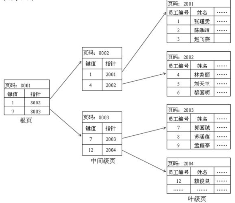

InnoDB 的聚簇索引实际上在同一个结构中保存了 **B+树索引**和**数据行**。

当表有聚簇索引时， 它的**数据行实际上存放在索引的叶子页中**。 聚簇表示数据行和相邻的键值紧紧地存储在一起。 因为无法同时把数据行存储在两个不同的地方， 所以**一个表只能有一个聚簇索引**。

InnoDB 通过主键聚簇数据。

**每张表都会有一个聚簇索引。 聚簇索引是一级索引。**

聚簇索引一般是主键； 没有主键， 就是第一个唯一键； 没有唯一键， 就是隐藏 ID。

聚簇索引以外的所有索引都称为二级索引。 在 InnoDB 中， 二级索引中的每条记录都包含该行的主键列， 以及为二级索引指定的列。 InnoDB 使用这个主键值来搜索聚簇索引中的行。

聚簇索引的优点：

1. 可以将相关数据保存在一起， 只需一次 IO 就可以取出相邻的数据
2. 数据访问更快， 因为索引和数据保存在同一个 B+树中
3. 使用覆盖索引扫描的查询可以直接使用叶节点中的主键值

缺点：

1. 插入速度严重依赖于插入顺序。 按照主键的顺序插入是加载数据到 InnoDB 表中速度最快的方式。 但如果不是按照主键顺序加载数据， 那么在加载完成后最好使用 OPTIMIZE TABLE命令重新组织一下表
2. 更新聚簇索引列的代价很高， 因为会强制 InnoDB 将每个被更新的行移动到新的位置
3. 插入新行或者更新主键导致需要移动行的时候， 可能面临页分裂的问题。 当行的主键值要求必须将这一行插入到某个已满的页中时， 存储引擎会将该页分裂成两个页面来容纳该行，这就是一次页分裂操作。 页分裂会导致表占用更多的磁盘空间。
4.  可能导致全表扫描变慢， 尤其是行比较稀疏， 或者由于页分裂导致数据存储不连续的时候
5. 二级索引（非聚簇索引） 可能会更大， 因为在二级索引的**叶子节点包含了引用行的主键值。 这样的策略减少了当出现行移动或者页分裂时二级索引的维护工作。**
6. 二级索引访问需要两次 B 树索引查找， 而不是一次。 因为**二级索引中叶子节点保存的是行的主键值， 要找到数据行， 还需要拿主键值到聚簇索引中进行一次查找。**  

#### 非聚簇索引  

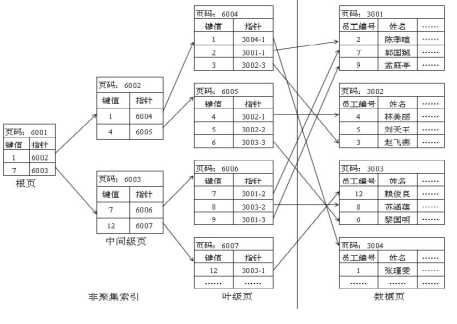

### 索引分类——从逻辑角度  

主键索引：索引列的值必须唯一， 并且不允许有空值

唯一索引：与普通索引类似， 不同的就是： 索引列的值必须唯一， 但允许有空值（注意和主键不同） 。如果是组合索引， 则列值的组合必须唯一

普通索引：最基本的索引， 它没有任何限制

复合索引

全文索引：在相同的列上同时创建全文索引和基于值的 B 树索引不会有冲突， 全文索引适用于 MATCHAGAINST 操作， 而不是普通的 WHERE 条件操作。

FULLTEXT 索引仅可用于 MyISAM 表； 他们可以从 CHAR、 VARCHAR 或 TEXT 列中作为CREATE TABLE 语句的一部分被创建， 或是随后使用 ALTER TABLE 或 CREATE INDEX 被添加

空间索引（R-Tree）： 空间索引是对空间数据类型的字段建立的索引， MYSQL 中的空间数据类型有 4种， 分别是 GEOMETRY、 POINT、 LINESTRING、 POLYGON 。MyISAM 表支持空间索引， 可以用作地理数据存储。 和 B 树索引不同， 这类索引无须前缀查询。 空间索引会从所有维度来索引数据。 查询时， 可以有效地使用任意维度来组合查询。MySQL 中的 GIS 支持并不完善， 做的比较好的关系数据库是 PostgreSQ  

### 索引的特殊应用
#### InnoDB AUTO_INCREMENT

如果正在使用 InnoDB 表并且没有什么数据需要聚集， 那么可以定义一个代理键作为主键，这种主键的数据应该与应用无关， 最简单的方法是使用 AUTO_INCREMENT 自增列。 这样可以保证数据行是按顺序写入的， 对于根据主键做关联操作的性能也会更好。  
最好避免随机的聚簇索引， 特别是对于 IO 密集型应用， 比如 UUID， 它使得聚簇索引的插入变得完全随机， 这是最坏的情况， 使得数据没有任何聚集特性。  
如果主键的值是顺序的， 那么 InnoDB 会把每一条记录都存储在上一条记录的后面。 当达到页的最大填充因子时， 下一条记录就会写入新的页中。 一旦数据按照这种顺序的方式加载，主键页就会近似于被顺序的记录填满， 这也正是所期望的结果。

使用 UUID 作为主键的缺点：  

1.  写入的目标页可能已经刷到磁盘上并从缓存中移除， 或者还没有被加载到缓存中， InnoDB在插入之前不得不先找到并从磁盘读取目标页到内存中， 这将导致大量的随机 iO
2. 因为写入是乱序的， InnoDB 不得不频繁地做页分裂操作， 以便为新的行分配空间。 页分裂会导致移动大量数据， 一次插入最少修改三个页而不是一个页。
3. 由于频繁的页分裂， 页会变得稀疏并被不规则填充， 所以最终数据会有碎片。

在把这些随机值载入到聚簇索引后， 也许需要做一次 OPTIMIZE TABLE 来重建表并优化页的填充。   
使用 InnoDB 时应该尽可能地按主键顺序插入数据， 并且尽可能地使用单调增加的聚簇值来插入新行。  

顺序主键的缺点是什么？

1. 对于高并发工作负载， 在 InnoDB 中按主键顺序插入可能会造成明显的争用。 主键的上界会成为热点。 因为所有的插入都在这里， 所以并发插入可能导致锁竞争。 另一个热点可能是AUTO_INCREMENT 锁机制， 可能需要重新设计表或应用。
2. AUTO-INC 锁是当向使用含有 AUTO_INCREMENT 列的表中插入数据时需要获取的一种特殊的表级锁。在最简单的情况下， 如果一个事务正在向表中插入值， 则任何其他事务必须等待对该表执行自己的插入操作， 以便第一个事务插入的行的值是连续的。
3. innodb_autoinc_lock_mode 配置选项控制用于自动增量锁定的算法。 它允许您选择如何在可预测的自动递增值序列和插入操作的最大并发性之间进行权衡。innodb 会在内存里保存一个计数器用来记录 auto_increment 的值， 当插入一个新行数据时，就会用一个表锁来锁住这个计数器， 直到插入结束。 如果一行一行的插入数据则没有什么问题， 但是如果大量的并发插入就废了， 表锁会引起 SQL 堵塞， 不但影响效率， 而且可能会瞬间达到 max_connections 而崩溃。
4. InnoDB 提供了一个可配置的锁定机制， 可以显著提高使用 AUTO_INCREMENT 列向表中添加行的 SQL 语句的可伸缩性和性能。 要对 InnoDB 表使用 AUTO_INCREMENT 机制， 必须将 AUTO_INCREMENT 列定义为索引的一部分， 以便可以对表执行相当于索引的 SELECT MAX（ai_col） 查找以获取最大列值。 通常， 这是通过使列成为某些表索引的第一列来实现的。    

##### 插入类型
1） simple inserts
simple inserts 指的是那种能够事先确定插入行数的语句， 比如 INSERT/REPLACE INTO 等插入单行或者多行的语句， 语句中不包括嵌套子查询。 此外，·` INSERT INTO … ON DUPLICATE KEY UPDATE `这类语句也要除外。

2） bulk inserts
bulk inserts 指的是事先无法确定插入行数的语句， 比如 INSERT/REPLACE INTO … SELECT,LOAD DATA 等。

3） mixed-mode inserts
指的是 simple inserts 类型中有些行指定了 auto_increment 列的值， 有些行没有指定， 比如：`INSERT INTO t1 (c1,c2) VALUES (1,’a’), (NULL,’b’), (5,’c’), (NULL,’d’);`
另外一种 mixed-mode inserts 是` INSERT … ON DUPLICATE KEY UPDATE `这种语句， 可能导致分配的 auto_increment 值没有被使用。  

##### innodb_autoinc_lock_mode 配置
`innodb_autoinc_lock_mode=0（traditional lock mode）`

传统的 auto_increment 机制。 这种模式下所有针对 auto_increment 列的插入操作都会加AUTO-INC 锁， 分配的值也是一个个分配， 是连续的， 正常情况下也不会有间隙（当然如果事务 rollback 了这个 auto_increment 值就会浪费掉， 从而造成间隙） 。
`innodb_autoinc_lock_mode=1（consecutive lock mode)`

这种情况下， 针对 bulk inserts 才会采用 AUTO-INC 锁这种方式， 而针对 simple inserts，则直接通过分析语句， 获得要插入的数量， 然后一次性分配足够的 auto_increment id， 只会将整个分配的过程锁住。当然， 如果其他事务已经持有了 AUTO-INC锁， 则 simple inserts需要等待。针对 Mixed-mode inserts： 直接分析语句， 获得最坏情况下需要插入的数量， 然后一次性分配足够的 auto_increment id， 只会将整个分配的过程锁住。
保证同一条 insert 语句中新插入的 auto_increment id 都是连续的， 语句之间是可能出现auto_increment 值的空隙的。 比如 mixed-mode inserts 以及 bulk inserts 中都有可能导致一些分配的 auto_increment 值被浪费掉从而导致间隙。    

`innodb_autoinc_lock_mode=2（interleaved lock mode）`

这种模式下任何类型的 inserts 都不会采用 AUTO-INC 锁， 性能最好。 这种模式是来一个分配一个， 而不会锁表， 只会锁住分配 id 的过程， 和 innodb_autoinc_lock_mode = 1 的区别在于， 不会预分配多个。 但是在 replication 中当 binlog_format 为 statement-based 时（简称 SBR statement-based replication） 存在问题， 因为是来一个分配一个， 这样当并发执行时， “Bulk inserts”在分配时会同时向其他的 INSERT 分配， 会出现主从不一致（从库执行结果和主库执行结果不一样） ， 因为 binlog 只会记录开始的 insert id。

可能会在同一条语句内部产生 auto_increment 值间隙。

##### 不同模式下间隙情况  

simple inserts

针对 innodb_autoinc_lock_mode=0,1,2， 只有在一个有 auto_increment 列操作的事务出现回滚时， 分配的 auto_increment 的值会丢弃不再使用， 从而造成间隙。

bulk inserts

innodb_autoinc_lock_mode=0,由于一直会持有 AUTO-INC 锁直到语句结束， 生成的值都是连续的， 不会产生间隙。
innodb_autoinc_lock_mode=1， 这时候一条语句内不会产生间隙， 但是语句之间可能会产生间隙。
innodb_autoinc_lock_mode=2， 如果有并发的 insert 操作， 那么同一条语句内都可能产生间隙。

mixed-mode inserts

这 种 模 式 下 针 对 innodb_autoinc_lock_mode 的 值 配 置 不 同 ， 结 果 也 会 不 同 ， 当 然innodb_autoinc_lock_mode=0 时时不会产生间隙的， 而 innodb_autoinc_lock_mode=1 以及innodb_autoinc_lock_mode=2 是会产生间隙的。

另外注意的一点是， 在 master-slave 这种架构中， 复制如果采用 statement-based replication这种方式， 则 innodb_autoinc_lock_mode=0 或 1 才是安全的。 而如果是采用 row-based replication 或者 mixed-based replication， 则 innodb_autoinc_lock_mode=0,1,2 都是安全的。  

#### 覆盖索引

如果一个索引包含了所有需要查询字段的值， 就称为覆盖索引。

覆盖索引的优点：

1. 索引条目远少于数据行大小， 如果只需要读取索引， 则 MySQL 就会极大地减少数据访问了， 这对缓存的负载非常重要， 因为这种情况下响应时间大部分花费在数据拷贝上。 覆盖索引对 IO 密集型应用也有帮助， 因为索引比数据更小， 更容易全部放入内存中。
2. 因为索引是按照列值顺序存储的， 对于 IO 密集型的范围查询会比随机从磁盘读取每一行数据的 IO 次数会少得多。
3. InnoDB 的二级索引在叶节点中保存了行的主键值， 如果二级索引是覆盖索引， 则可以避免对主键聚簇索引的二次查询。
4. 不是所有类型的索引都可以成为覆盖索引。 覆盖索引必须要存储索引列的值， 而哈希索引、空间索引和全文索引都不存储索引列的值， 所以 MySQL 只能使用 B 树索引做覆盖索引。
5. 当发起一个索引覆盖查询时， 在 EXPLAIN 的 Extra 列可以看到 Using index 的信息。InnoDB 的二级索引的叶子节点都包含了主键的值， 这意味着 InnoDB 的二级索引可以有效利用这些额外的主键列来覆盖查询。

#### 使用索引进行排序  

MySQL 有两种可以生成有序的结果： 通过排序操作； 按索引顺序扫描。 如果 EXPLAIN 出来的 type 列的值为 index， 则说明 MySQL 使用了索引顺序扫描来做排序。

扫描索引本身是很快的， 但如果索引不能覆盖查询所需的全部列， 那就不得不每扫描一条索引记录就都回表查询一次对应的行。 这基本上都是随机 IO， 因此按索引顺序读取数据的速度通常要比顺序地全表扫描要慢， 尤其是在 IO 密集型的工作负载时。

只有当索引的列顺序和 ORDER BY 子句的顺序完全一致， 并且所有列的排序方向（降序或升序， 索引默认是升序） 都一样时， MySQL 才可以使用索引来对结果做排序。 如果查询需要关联多张表， 则只有当 ORDER BY 子句引用的字段全部为第一张表时， 才能使用索引做排序。ORDER BY 子句和查找型索引的限制是一样的， 都需要满足索引的最左前缀的要求。

有一种情况下 ORDER BY 子句可以不满足索引的最左前缀的要求， 就是前导列为常量的时候  

#### 前缀压缩索引
MyISAM 通过前缀压缩来减少索引的大小， 从而让更多的索引可以放入内存中。 默认只压缩字符串， 但通过参数调整也能对整数进行压缩。
MyISAM 压缩每个索引块的方法时， 先完全保存索引块的第一个值， 然后将其他值和第一个值进行比较得到相同前缀的字节数和剩余的不同后缀部分， 把这部分存储起来即可。

压缩块使用更少的情况， 代价是某些操作可能更慢。 因为每个值的压缩前缀都依赖前面的值，所以 MyISAM 查找时无法在索引块使用二分查找而只能从头开始扫描。

#### 冗余和重复索引

冗余索引： MySQL 允许在相同列上创建多个索引。 MySQL 需要单独维护重复的索引， 并且优化器在优化查询时也需要逐个地进行考虑， 这会影响性能。

重复索引：是指在相同的列上按照相同的顺序创建的相同类型的索引， 应该避免这样创建重复索引， 发现以后也应该立即移除。

冗余索引和重复索引有一些不同。 如果创建了索引(A,B)， 又创建了索引(A)就是冗余索引，索引(A,B)也可以当做索引(A)来使用。 但是如果再创建索引(B,A)， 就不是冗余索引。 另外，其他不同类型的索引也不会是 B 树索引的冗余索引。

冗余索引通常发生在为表添加新索引的时候。 例如， 有人可能会增加一个新的索引(A,B)而不是扩展已有的索引(A)， 还有一种情况是将一个索引扩展为(A,PK)， 对于 InnoDB 而言 PK 已经包含在二级索引中了， 所以这也是冗余的。

大多数情况下都不需要冗余索引， 应该尽量扩展已有的索引而不是创建新索引。 但也有时候出于性能方面的考虑需要冗余索引， 因为扩展已有的索引会导致其变得太大， 从而影响其他使用该索引的查询的性能。

#### 索引重用

现有索引(A,B,C)， 如果要使用索引， 那么 where 中必须写为 `A=a and B = b and C = c`。 如果没有对 B 的筛选， 还想使用索引， 怎么绕过最左前缀匹配呢？

假设 B 是一个选择性很低的列， 只有 b1 和 b2 两种取值， 那么查询可以写为 ·`A = a and B in(b1,b2) and C = c`。  

#### 避免多个范围条件
对于范围条件查询， MySQL 无法再使用范围列后面的其他索引列了， 但是对于多个等值条件查询`（in ...） `则没有这个限制。

假设有索引(A,B)， 查询条件为 `A > a and B < b`， 那么此时无法同时使用 A 和 B 的复合索引，只能用到 A 的索引。 一定要用的话可以考虑将 A 转为 `in(a1,a2...)`。

#### 优化 limit

延迟关联， 使用覆盖索引  

### 索引失效

```sql 
CREATE TABLE staffs (
id INT PRIMARY KEY AUTO_INCREMENT,
NAME VARCHAR (24) NOT NULL DEFAULT '' COMMENT '姓名',
age INT NOT NULL DEFAULT 0 COMMENT '年龄',
pos VARCHAR (20) NOT NULL DEFAULT '' COMMENT '职位',
add_time TIMESTAMP NOT NULL DEFAULT CURRENT_TIMESTAMP COMMENT '入职时间'
) CHARSET utf8 COMMENT '员工记录表' ;
ALTER TABLE staffs ADD INDEX idx_staffs_nameAgePos(name, age, pos);
```

#### 全值匹配
`EXPLAIN SELECT * FROM staffs WHERE NAME = 'July';`
`EXPLAIN SELECT * FROM staffs WHERE NAME = 'July' AND age = 25;`
`EXPLAIN SELECT * FROM staffs WHERE NAME = 'July' AND age = 25 AND pos = 'dev'; `

#### 最佳左前缀法则
如果索引了多列， 要遵守最佳左前缀法则， 指的是从索引的最左边的列开始并且不跳过索引中的列。查询时就按照建索引的顺序进行筛选

`EXPLAIN SELECT * FROM staffs WHERE age = 25 AND pos = 'dev';`没有使用索引
`EXPLAIN SELECT * FROM staffs WHERE pos = 'dev';  `没有使用索引

#### 在索引上使用表达式
索引列上使用了表达式， 如`where substr(a, 1, 3) = 'hhh'`， `where a = a + 1`， 表达式是一大忌讳， 再简单 MySQL 也不认。

有时数据量不是大到严重影响速度时， 一般可以先查出来， 比如先查所有有订单记录的数据，再在程序中去筛选

哪怕是该字段没有建立索引， 但不能保证以后不在这个字段上建立索引， 所以可以这么说：不要在任何字段上进行操作。  

#### range 类型查询字段后面的索引无效  

`EXPLAIN SELECT * FROM staffs WHERE NAME = 'July' AND age>25 AND pos = 'dev'; `只会使用前两个索引，同：`EXPLAIN SELECT * FROM staffs WHERE NAME = 'July' AND age = 25;`

#### 尽量使用覆盖索引  

#### 使用不等于时索引失效  

`EXPLAIN SELECT * FROM staffs WHERE NAME != 'July' `

#### is (not) null 时索引失效  

`EXPLAIN SELECT * FROM staffs WHERE NAME is null `如果没有值， 可以使其等于一个默认值， 这样就可以利用到索引了。  

#### like 以通配符开头会导致全表扫描  

#### varchar 类型不加单引号索引失效
不加单引号会出现类型转换， 此时索引失效  

#### 使用 or 时索引失效
`EXPLAIN SELECT * FROM staffs WHERE NAME = 'July' or NAME = 'Lili' `

假设 index(a,b,c)：Where 语句 索引是否被使用

- where a = 3 ：Y,使用到 a
- where a = 3 and b =5：Y,使用到 a， b
- where a = 3 and b =5 and c = 4：Y,使用到 a,b,c
- where b = 3 | where b = 3 and c =4 | where c =4：N
- where a = 3 and c =5：使用到 a， 但是 C 不可以， 中间断了
- where a = 3 and b >4 and c = 7：使用到 a 和 b， c 在范围之后， 断了
- where a = 3 and b like 'kk%' and c = 4：使用到 a 和 b， c 在范围之后， 断了

### 索引总结

适合建索引的情况

1. 主键
2. 连接中频繁使用的列
3. 在某一范围内频繁搜索的列和按排列顺序频繁搜索的列  

不适合建索引的情况

1. 很少或从来不在查询中引用的列
2. 只有两个或很少几个值的列
3. 以 bit text image 数据类型定义的列
4. 数据行数很少的小表  

索引优点

1. 大大减少了服务器需要扫描的数据量
2. 帮助服务器减少排序和临时表（group by 和 order by 都可以使用索引， 因为索引有序）
3. 可以将随机 IO 变为顺序 IO（覆盖索引）  

索引缺点

1. 创建索引要花费时间， 占用存储空间
2. 减慢数据修改速度  

## MySQL 查询分析工具
### 慢查询日志

MySQL 的慢查询日志是 MySQL 提供的一种日志记录， 它用来记录在 MySQL 中响应时间超过阈值的语句， 具体指运行时间超过 long_query_time 值的 SQL， 则会被记录到慢查询日志中。 long_query_time 的默认值为 10， 意思是运行 10S 以上的语句。 默认情况下， Mysql 数据库并不启动慢查询日志， 需要我们手动来设置这个参数， 当然， 如果不是调优需要的话，
一般不建议启动该参数， 因为开启慢查询日志会或多或少带来一定的性能影响。 慢查询日志支持将日志记录写入文件， 也支持将日志记录写入数据库表。

- slow_query_log ： 是否开启慢查询日志， 1 表示开启， 0 表示关闭。
- slow-query-log-file： 新版（5.6 及以上版本） MySQL 数据库慢查询日志存储路径。 可以不设置该参数， 系统则会默认给一个缺省的文件 host_name-slow.log
- long_query_time ： 慢查询阈值， 当查询时间多于设定的阈值时， 记录日志。
- log_queries_not_using_indexes： 未使用索引的查询也被记录到慢查询日志中（可选项） 。
- log_output： 日志存储方式。 log_output='FILE'表示将日志存入文件， 默认值是'FILE'。
- log_output='TABLE'表示将日志存入数据库， 这样日志信息就会被写入到 mysql.slow_log 表中。 MySQL 数据库支持同时两种日志存储方式， 配置的时候以逗号隔开即可， 如：log_output='FILE,TABLE'。 日志记录到系统的专用日志表中， 要比记录到文件耗费更多的系统资源， 因此对于需要启用慢查询日志， 又需要能够获得更高的系统性能， 那么建议优先记
  录到文件。

在实际生产环境中， 如果要手工分析日志， 查找、 分析 SQL， 显然是个体力活， MySQL 提供了日志分析工具mysqldumpslow。
s, 是表示按照何种方式排序
c: 访问计数
l: 锁定时间
r: 返回记录
t: 查询时间
al:平均锁定时间
ar:平均返回记录数
at:平均查询时间
-t, 是 top n 的意思， 即为返回前面多少条的数据；
-g, 后边可以写一个正则匹配模式， 大小写不敏感的；  

比如:

得到返回记录集最多的 10 个 SQL。`mysqldumpslow -s r -t 10 /database/mysql/mysql06_slow.log`

得到访问次数最多的 10 个 SQL`mysqldumpslow -s c -t 10 /database/mysql/mysql06_slow.log`

得到按照时间排序的前 10 条里面含有左连接的查询语句。`mysqldumpslow -s t -t 10 -g “left join” /database/mysql/mysql06_slow.log`

另外建议在使用这些命令时结合 `| `和` more `使用 ， 否则有可能出现刷屏的情况。`mysqldumpslow -s r -t 20 /mysqldata/mysql/mysql06-slow.log | more  `

### explain

explain SQL 分析 每个列代表什么含义（关于优化级别 ref 和 all， 什么时候应该用到 index却没用到， 关于 extra 列出现了 usetempory 和 filesort 分别的原因和如何着手优化等）  

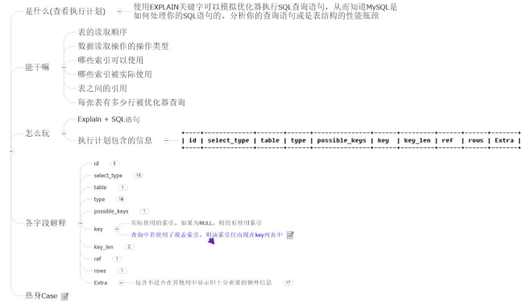

#### id  

select查询的序列号，包含一组数字，表示查询中执行select子句或操作表的顺序。

1. id 相同， 表示执行顺序从上到下  
   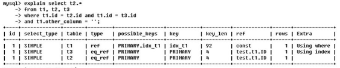
2. id 不同， 如果是子查询， id 的序号会递增， id 越大优先级越高， 越先被执行  
   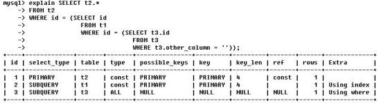  
   primary 是主查询；subquery 是子查询  
3. id 有相同的， 也有不同的， 同时存在：id 相同的可以被认为是一组， 从上往下顺序执行；在所有组中， id 值越大， 优先级越高， 越先执行。  
   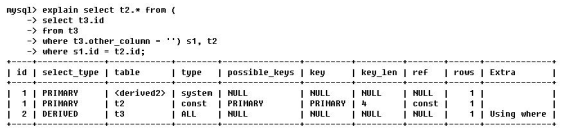
   Derived： 衍生的  

#### select_type  

- SIMPLE ：简单的select 查询，查询中不包含子查询或者UNION
- PRIMARY：查询中若包含任何复杂的子部分，最外层查询则被标记为
- SUBQUERY： 在SELECT或WHERE列表中包含了子查询
- DERIVED： 在FROM列表中包含的子查询被标记为DERIVED（衍生）；MySQL会递归执行这些子查询，把结果放在临时表里。
- UNTON ：着第二个SELECT出现在UNION之后，则被标记为UNION；若UNION包含在FROM子句的子查询中，外层SELECT将被标记为：DERIVED
- UNION RESULT ：从UNION表获取结果的SELECT

#### table
显示这一行的数据是来自哪一张表

#### type（重要）  

type 显示的是访问类型， 是较为重要的一个指标， 结果值从最好到最坏依次是：   `system > const > eq_ref > ref > fulltext > ref_or_null > index_merge > unique_subquery >index_subquery > range > index > ALL `，
一般来说， 得保证查询至少达到 range 级别， 最好能达到 ref  

- system：表只有一行记录（等于系统表），这是const类型的特列，平时不会出现，这个也可以忽略不计

- const：表示通过索引一次就找到了，const用于比较primary key或者unique索引。因为只匹配一行数据，所以很快如将主键置手where列表中，MySQL就能将该查询转换为一个常量

- eq_ref：唯一性索引扫描，对于每个索引键，表中只有一条记录与之匹配。常见于主键或唯一索引扫描

- ref：非唯一性索引扫描，返回匹配某个单独值的所有行；本质上也是一种索引访问，它返回所有匹配某个单独值的行，然而，它可能会找到多个符合条件的行，所以他应该属于查找和扫描的混合体

- range ：只检索给定范围的行，使用一个索引来选择行。key列显示使用了哪个索引；一般就是在你的where语句中出现了between、<、>、in等的查询这种范围扫描索引扫描比全表扫描要好，因为它只需要开始于索引的某一点，而结束语另一点，不用扫描全部索引。

- lndex ：Full Index can.index与ALL区别为index类型只遍历索引树。这通常比AL快，因为索引文件通常比数据文件小。（也就是说虽然all和Index都是读全表，但index是从索引中读取的，而all是从硬盘中读的）

- all：Full Table Scan,将遍历全表以找到匹配的行

- > 一般来说，得保证查询至少达到range级别，最好能达到ref。

#### possible_keys
显示可能应用在这张表中的索引， 一个或多个。

查询涉及到的字段上若存在索引， 则该索引将被列出， 但不一定被查询实际使用

理论上可以被用上的

#### key

实际使用到的索引  

实际使用的索引。如果为NULL，则没有使用索引

查询中若使用了覆盖索引，则该索引仅出现在key列表中

#### key_len 

表示索引中使用的字节数，其显示的的值为索引字段的最大可能长度，并不是实际长度

#### ref 

显示索引的 哪一列被使用了，如果可能的话，是一个常数 。哪些列或常量被用于查找索引列上的值。

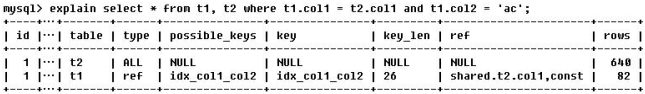

由 key_len 可知 t1 表的 idx_col1_col2 被充分使用， col1 匹配t2 表的 col1， col2 匹配了一个常量， 即 'ac'  

用到了多少个字段上的索引， ref 就会有几个（大部分情况）；或者可以根据 key_len 的倍数来判断使用了几个字段上的索引  

#### rows  

根据表统计信息和索引使用情况，大致估算找到所需的记录所需要读取的行数。

rows 越少越好  

#### extra  

包含不适合在其他列显示的重要信息

1. Using fileSort  
   建立索引的作用 1） 查询 2） 排序；如果排序字段没有索引， 那么可能会产生 filesort 文件排序， 降低效率。  
2. Using temporary  临时表
   使用临时表保存中间结果，常见于排序order by 和分组查询 group by
   如果数据量很大， 使用临时表效率会很低。  
3. Using Index 
    表示相应的select操作中使用了覆盖索引（Covering Index)，避免访问了表的数据行，效率不错！
   如果同时出现using where，表明索引被用来执行索引键值的查找；
   如果没有同时出现using where，表明索引用来读取数据而非执行查找动作。
4. Impossible where  
   where子句的值总是false，不能来获取任何元组

### show profile  


开启：

`mysq1>Show variables like 'profiling';`  `mysq1>set profiling=on;`

## MySQL 查询优化
从效果上第一条影响最大， 后面越来越小。
① SQL 语句及索引的优化
② 数据库表结构的优化
③ 系统配置的优化
④ 硬件的优化

### 慢查询基础： 优化数据访问

查询性能低下最基本的原因是访问的数据太多。 某些查询可能不可避免地需要筛选大量数据，但这并不常见。 大部分性能低下的查询都可以通过减少访问的数据量的方式进行优化。 对于低效的查询， 我们发现提供下面两个步骤来分析总是很有效。

1. 确认应用程序是否在检索大量超过需要的数据， 通常是访问了太多的行， 但有时候也可能是访问了太多的列。
2. 确认 MySQL 服务器层是否在分析大量超过需要的数据行。

是否向数据库请求了不需要的数据:

1. 查询不需要的记录： 尽量使用 LIMIT 来获取所需的数据， 而非取出全部数据然后在Application 中获取某些行。
2. 多表关联时返回全部列
3. 总是取出全部列
4. 重复查询相同的数据： 使用缓存

MySQL 是否在扫描额外的记录:
对于 MySQL， 最简单的衡量查询开销的三个指标如下：

1. 响应时间
2. 扫描的行数
3. 返回的行数

- 响应时间
  响应时间是两个部分的和： 服务时间和排队时间。 服务时间是指数据库处理这个查询真正花了多少时间。 排队时间是指服务器因为等待某些资源而没有真正执行查询的时间——等待IO 或等待锁。
  在不同类型的应用压力下， 响应时间并没有什么一致的规律或者公式。 响应时间既可能是一个问题的结果也可能是一个问题的原因。  
  当你看到一个查询的响应时间的时候， 首先需要问问自己， 这个响应时间是否是一个合理的值。 可以采用快速上限估计法来估算查询的响应时间： 了解这个查询需要哪些索引以及它的执行计划是什么， 然后计算大概需要多少个顺序和随机 IO， 再用其乘以在具体硬件条件下一次 IO 的消耗时间， 最后把这些消耗都加起来， 就可以获得一个大概参考值来判断当前响应时间是不是一个合理的值  
- 扫描的行数和返回的行数
  分析查询时， 查看该查询扫描的行数是非常有帮助的。 这在一定程度上能够说明该查询找到需要的数据的效率高不高。
  对于找出那些糟糕的查询， 这个指标可能还不够完美， 因为并不是所有的行的访问代价都是相同的。 较短的行的访问速度更快， 内存中的行也比磁盘中的行的访问速度要快得多。
  理想情况下扫描的行数和返回的行数应该是相同的。 一般扫描的行数对返回的行数的比率很小， 一般在 1:1 和 1:10 之间。  
- 扫描的行数和访问类型
  在评估查询开销的时候， 需要考虑一下从表中找到某一行数据的成本。 MySQL 有好几种访问方式可以查找并返回一行结果。 有些访问方式可能需要扫描很多行才能返回一行结果， 也有些访问方式可能无需扫描就能返回结果。
  在 EXPLAIN 语句中的 type 列反映了访问类型。 访问类型有全表扫描、 索引扫描、 范围扫描、唯一索引、 常数引用等， 速度由慢到快。
  如果查询没有办法找到合适的访问类型， 那么解决的最好方法通常就是增加一个合适的索引。
  一般 MySQL 能够使用如下三种方式应用 WHERE 条件， 从好到坏依次为：
  1） 在索引中使用 WHERE 条件来过滤不匹配的记录， 这是在存储引擎层完成的
  2） 使用覆盖索引（Extra 中 Using index） 来返回记录， 直接从索引中过滤不需要的记录并返回命中的结果， 这是在 MySQL 服务器层完成的， 但无需再回表查询记录
  3） 从数据表中返回数据， 然后过滤不满足条件的记录（Extra 中 Using Where） ， 这是在 MySQL服务器层完成的， MySQL 需要先从数据表读出记然后过滤。
  MySQL 不会告诉我们生成结果实际上需要扫描多少行数据（例如关联查询结果返回的一条记录通过是由多条记录组成） ， 而只会告诉我们生成结果时一共扫描了多少行数据。 扫描的行数中大部分都很可能是被 WHERE 条件过滤掉的， 对最终的结果集没有贡献。如果发现查询需要扫描大量的数据但只返回少数的行， 那么通过可以尝试下面的技巧去优化它：
  1） 使用覆盖索引
  2） 改变表结构， 例如使用单独的汇总表
  3） 重写这个复杂的查询， 让 MySQL 优化器能够以更优化的方式执行这个查询  

### 重构查询的方式
**一个复杂查询还是多个简单查询**

传统实现中总是强调数据库层完成尽可能多的工作， 因为以前认为网络通信、 查询解析和优化是一件代价很高的事情。 但是这样的想法对 MySQL 并不适用， MySQL 从设计上让连接和断开连接都很轻量级， 在返回一个小的查询结果方面很高效。
MySQL 内部每秒能够扫描内存中上百万行数据， 相比之下， MySQL 响应数据给客户端就慢得多了。 在其他条件都相同时， 使用尽可能少的查询当然是很好的。 但是有时候， 将一个大查询分解为多个小查询是很有必要的。

**切分查询**

有时候对于一个大查询我们需要分而治之， 将大查询切分成小查询， 每个查询功能完全一样，只完成一小部分， 每次只返回一部分查询结果。比如删除旧的数据， 分批删除效率会高很多。

**分解关联查询**

很多高性能的应用都会对关联查询进行分解。 可以对每一张表进行一次单表查询， 然后将结果在应用程序中进行关联。这样做的好处有：
1） 让缓存的效率更高。 许多应用程序可以方便地缓存单表查询对应的结果对象。 对 MySQL的查询缓存来说， 如果关联中的某张表发生了变化， 那么就无法使用查询缓存了， 而拆分后，如果某张表很少改变， 那么基于该表的查询就可以重复利用缓存了。
2） 将查询分解后， 执行单个查询可以减少锁的竞争
3） 在应用层做关联， 可以更容易对数据库进行拆分
4） 查询本身效率也可能会有所提升。 比如使用 IN 来代替 JOIN， 可以让 MySQL 按照 ID 顺序进行查询。
5） 可以减少冗余记录的查询。 在数据库中做关联查询可能需要重复地访问一部分数据。
6） 相当于在应用中实现了哈希关联， 而不是使用 MySQL 的嵌套循环关联  

### 优化特定类型的查询
#### JOIN 优化

1） 确保 ON 或者 Using 子句上的列有索引， 在创建索引的时候就要考虑到关联的顺序。 当表 A 和表 B 用列 c 关联时， 如果优化器的关联顺序是 B、 A， 那么就不需要在 B 表的对应列上建索引。 一般情况下只需要在关联顺序的第二个表的相应列上创建索引。
2） 确保任何的 GROUP BY 和 ORDER BY 中的表达式只涉及到一个表中的列， 这样 MySQL才有可能使用索引来优化这个过程    

#### 小表驱动大表
两张表连接， 类似于二重循环。外层的表应该是小表， 内层的应该是大表。
虽然总的遍历次数是一样的， 但是频繁切换数据表是影响效率的（IO 次数） ， 应该尽可能减少切换表的次数。  

优化原则：小表驱动大表，即小的数据集驱动大的数据集。

当B表的数据集小于A表的数据集时，用in优于exists。

` select * from A where id in (select id from B)`
等价于：` for select id from B`、` for select*from A where A.id=B.id`

当A表的数据集小于B表的数据集时，用exists优于in。

`select * from A where exists(select id from B where B.id=A.id)`
等价于:` for select * from A`、`for select * from B where B.id=A.id`

注意：A表与B表的IC字段应建立索引。

```java
A in B：
for b in B:
	for a in A:
		if a == b:
			putIntoResultSet()
A exists B：
for a in A:
	for b in B:
		if a == b:
			putIntoResultSet()
```

#### order by 优化
尽量使用 index 方式排序， 遵照索引的最佳左前缀  

MySQL 支持二种方式的排序， FileSort 和 Index， Index 效率高.
它指 MySQL 扫描索引本身完成排序。 FileSort 方式效率较低。  


ORDER BY满足两情况，会使用Index方式排序：

- ORDER BY语句使用索引最左前列:`order a,b`
- 使用Where子句与OrderBY子句条件列组合满足索引最左前列`where a=xxx order by b`


##### 非索引列的 filesort 算法  

##### 总结  

为排序使用索引.
MySql两种排序方式：文件排序或扫描有序索引排序
MySql能为排序与查询使用相同的索引.

`KEY a.b.c(a,b.c)`

order by 能使用索引最左前缀

- ORDER BYa
- ORDER BY a,b
- ORDER BY a,b.c
- ORDER BY a DESC,b DESC,c DESC

如果WHERE使用素引的最左前缀定义为常量，则order by能使用素引

- WHEREa=const ORDER BY b.c
- WHERE a=const AND b=const ORDER BYc
- WHEREa=const ORDER BY b,c
- WHEREa=const AND b>const ORDER BY b.c

不能使用索引进行排序

- ORDER BY a ASC,b DESC,cDESC /*排序不一致*/
- WHERE g=const ORDER BY b.c /*丢失a素引*
- WHERE a=const ORDER BY c/*丢失b索引*
- WHERE a=const ORDER BY a.d /*d不是素引的一部分*/
- WHERE a in (...) ORDER BY b,c/*对于排序来说，多个相等条件也是范围查询*/

#### group by优化

- group by实质是**先排序后进行分组**，遵照索引建的最佳左前缀

- 当无法使用索引列，增大max_length_for_sort_data参数的设置+增大sort_buffer_size参数的设置
- where高于having，能写在where限定的条件就不要去having限定了。

当无法使用索引时，GROUP BY使用两种策略来完成：使用临时表或者文件排序来做分组。

当不遵照最佳左前缀，order by 会出现filesort，而group by 会出现临时表和filesort

#### limit 优化
当偏移量非常大的时候， 比如 limit 1000,20 这样的查询， 这时 MySQL 需要查询 10020 条记录然后只返回最后 20 条， 这样的代价非常高。 要优化这种查询， 要么在页面中限制分页数量， 要么优化大偏移的性能。

一个简单的办法是使用**覆盖索引（延迟关联）**  

`mysq1> SELECT film_id,description FROM sakila.film ORDER BY title LIMIT 50,5;`
如果这个表非常大，那么这个查询最好改写成下面的样子：

```mysql
mysq1>SELECT film.film_id,film.description
->FROM sakila.film
->INNER J0IN(
SELECT film_id FRON sakila.film
ORDER BY title LIMIT 50,5)AS 1im USING(film_id);
```

这里的“延迟关联”将大大提升查询效率，它让MySQL扫描尽可能少的页面，获取需要访问的记录后再根据关联列回原表查询需要的所有列。这个技术也可以用于优化关联查询中的LIMIT子句。

如果使用书签记录上次取数据的位置，那么下次就可以直接从该书签记录的位置开始扫描。
假设主键递增：

`mysq1>SELECT * FROM sakila.rental ORDER BY rental_id DESC LIMIT 20;`
假设上面的查询返回的是主键为16049到16030的租借记录，那么下一页查询就可以从16030这个点开始：
`mysq1>SELECT *FRON sakila.rental
->WHERE rental id<16030.
->ORDER BY rental_id DESC LIMIT 20；`

该技术的好处是无论翻页到多么后面，其性能都会很好。

通过判断id的范围来分页
`select id,my sn from big_ data where id>5000000 limit 10;`
也得到了分页的数据，但是我们发现如果id不是顺序的，也就是如果有数据删除过的话，那么这样分页数据就会不正确，这个是有缺陷的。

#### UNION 优化
MySQL 总是通过创建并填充临时表的方式来执行 UNION 查询。因此很多优化策略在 UNION
查询中都没法很好使用。 经常需要手工将 WHERE、 LIMIT、 ORDER BY 等子句下推到 UNION
的各个子查询中， 以便优化器可以充分利用这些条件进行优化。  

### 分区分库分表  

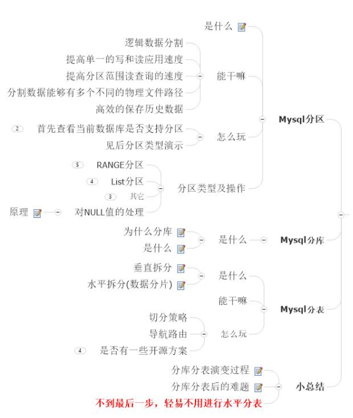

#### 分区（针对表）

数据表的物理存储拆分为多个文件

分区表是一个独立的逻辑表， 其底层由多个物理子表组成。 实现分区的代码实际上是对一组底层表的句柄对象（Handler Object） 的封装。 对分区表的请求， 都会通过句柄对象转化成对存储引擎的接口调用。 所以分区对于 SQL 层来说是一个完全封装底层实现的黑盒子， 对应用是透明的。

MySQL 实现分区表的方式——对底层表的封装——意味着索引也是按照分区的子表定义的，而没有全局索引。

MySQL 在创建表时使用 PARTITION BY 子句定义每个分区存放的数据。 在执行查询的时候，优化器会根据分区定义过滤那些没有我们需要数据的分区， 这样查询就无须扫描所有分区——只需要查找包含需要数据的分区即可。

分区的一个目的是将数据按照一个较粗的粒度分在不同的表中。 这样做可以将相关的数据存放在一起， 另外， 如果想一次批量删除整个分区的数据也会变得很方便。

分区非常适合在以下场景：
1） 表非常大以至于无法全部放在内存中， 或者只在表的最后部分有热点数据， 其他均为历史数据
2） 分区表的数据更容易维护。（批量删除数据->清除整个分区）
3） 分区表的数据可以分布在不同的物理设备上， 从而高效地利用多个硬件设备
4） 可以使用分区表来避免某些特殊的瓶颈。、 比如 InnoDB 的单个索引的互斥访问， ext3 文件系统的 inode 锁竞争。
5） 还可以备份和恢复独立的分区
分区表也有一些限制：
1） 一个表最多只能有 1024 个分区
2） 如果分区字段有主键或者唯一索引， 那么所有主键列和唯一索引列都必须包含进来
3） 分区表中无法使用外键索引  

##### 原理

存储引擎管理分区的各个底层表和管理普通表一样， 所有的底层表都必须使用相同的存储引擎， 分区表的索引只是在各个底层表上各自加一个完全相同的索引。 从存储引擎的角度， 底层表和一个普通表没有任何不同。  

select:分区层先打开并锁住所有的底层表， 优化器先判断是否可以过滤部分分区， 然后再调用对应的存储引擎接口访问各个分区的数据。  

insert:当写入一条记录时， 分区层先打开并锁住所有的底层表， 然后确定哪个分区接收这条记录，再将记录写入对应底层表。
delete:当删除一条记录时， 分区层先打开并锁住所有的底层表， 然后确定数据对应的分区， 最后对相应底层表进行删除操作。
update:当更新一条记录时， 分区层先打开并锁住所有的底层表， MySQL 先确定需要更新的记录在哪个分区， 然后取出数据并更新， 再判断更新后的数据应该放在哪个分区， 最后对底层表进行写入操作， 并对原数据所在的底层表进行删除操作。
虽然每个操作都会先打开并锁住所有的底层表， 但这并不是分区表在处理过程中是锁住全表的， 如果存储引擎能够自己实现行级锁， 则会在分区层释放对应表锁， 比如 InnoDB， 这个加锁和解锁的过程与普通 InnoDB 上的查询类似  

##### 分区类型  

首先查看当前数据库是否支持分区

`SHow VARABLES LIKE %paion%；
show plugins；`

**Range 分区**

MySQL 将会根据指定的拆分策略， 把数据放在不同的表文件上。 相当于在文件上被拆成了小块.但是,对外给客户的感觉还是一张表， 是透明的。  

```mysql
CREATE TABLE tbl_new(
id INT NOT NULL PRIMARY KEY,
title VARCHAR(20) NOT NULL DEFAULT ''
)ENGINE MYISAM CHARSET utf8
PARTITION BY RANGE(id)(
PARTITION t0 VALUES LESS THAN(10),
PARTITION t1 VALUES LESS THAN(20),
PARTITION t2 VALUES LESS THAN(MAXVALUE)
);
##0~10 放在 t0
##10~20 放在 t1
##>20 放在 t2
##如果要查询 id 在 20 以上的， 那么会直接去 t2 分区查找
##如果插入的记录的 id 在 20 以上， 那么会插入到 t2 分区
```

>普通的 InnoDB 引擎的表是一个 frm 和一个 ibd 文件
>分区之后的 MyIasm 引擎的表有一个 frm 和 par 文件， 此外每个分区还有一个 myi 和 myd文件。
>frm： 表的结构信息
>par： 表的分区信息
>myi： 表的索引信息
>myd： 表的数据信息  

**List 分区**

MySQL 中的 LIST 分区在很多方面类似于 RANGE 分区。 和按照 RANGE 分区一样， 每个分区必须明确定义。 它们的主要区别在于，**LIST 分区中每个分区的定义和选择是基于某列的值从属于一个值列表集中的一个值，而 RANGE 分区是从属于一个连续区间值的集合。**  

```mysql
create table area(
id INT NOT NULL PRIMARY KEY,
region varchar(20)
)engine myisam charset utf8;
insert into area values(1,'bj');
insert into area values(2,'sh');
insert into area values(3,'gz');
insert into area values(4,'sz');
##这个 area 的值是确定的
create table user (
uid int not null,
userName varchar(20),
area_id int
)engine myisam charset utf8
partition by list(area_id) (
partition bj values in (1),
partition sh values in (2),
partition gz values in (3),
partition sz values in (4)
);
```

##### 分区表如何应用于大数据量
数据量超大时， 肯定不能去全表扫描， 并且 B 树索引也无法起作用， 除非是覆盖索引。 这正是分区要做的事情。 理解分区时可以将其当做索引的最初形态， 以代价非常小的方式定位到需要的数据在哪一片区域。 在这篇区域中， 可以做顺序扫描， 可以建索引， 还可以将数据都缓存到内存。
为了保证大数据量的可扩展性， 一般有下面两个策略：

1） 全量扫描数据， 不要加任何索引

可以使用简单的分区方式存放表， 不要任何索引， 根据分区的规则大致定位需要的数据位置。只要能够使用 WHERE 条件， 将需要的数据限制在少数分区中， 则效率是很高的。

2） 索引数据， 并分离热点

如果数据有明显的热点， 而且除了这部分数据， 其他数据很少被访问到， 那么可以将这部分热点数据单独放在一个分区中， 让这个分区的数据能够有机会都缓存在内存中。 这样查询就可以只访问一个很小的分区表， 能够使用索引， 也能够有效地使用缓存  

##### 分区表的陷阱
NULL 值会使分区过滤无效
分区的表达式的值可以是 NULL； 第一个分区是一个特殊分区， 如果表达式的值为 NULL 或
非法制， 记录都会被存放到第一个分区。 WHERE 查询时即使看起来可以过滤到只有一个分
区， 但实际会检查两个分区， 即第一个分区。 最好是设置分区的列为 NOT NULL。
分区列和索引列不匹配
如果定义的索引列和分区列不匹配， 会导致索引无法进行分区过滤。
假设在列 a 上定义了索引， 而在列 b 上进行分区。 因为每个分区都有其独立的索引， 所以
扫描 b 上的索引就需要扫描每一个分区内对应的索引。
选择分区的成本可能很高
尤其是范围分区， 对于回答“这一行属于哪个分区”、“这些符合查询条件的行在哪些分区”这样
的问题的成本可能会非常高。 其他的分区类型， 比如键分区和哈希分区， 就没有这样的问题。
在批量插入时问题尤其严重。
其他限制
1） 每个分区都必须使用同样的存储引擎
2） 分区函数中可以使用的函数和表达式也有一些限制
3） 某些存储引擎不支持分区
4） 对应 MyISAM 表， 使用分区表时需要打开更多的文件描述符。 有可能出现茶瓯 go 文件
描述符限制的问题。
查询优化
对于访问分区表来说， 很重要的一点是要在 WHERE 条件中加入分区列， 有时候即使看似多
余的也要带上， 这样就可以让优化器能够过滤无须访问的分区。
使用 EXPLAIN PARTITION 可以观察优化器是否执行而来分区过滤。  

#### 分库（针对库）

一个库里表太多了， 导致了海量数据， 系统性能下降， 把原本存储于一个库的表拆分存储到多个库上， 通常是将表按照功能模块、 关系密切程度划分出来， 部署到不同库上。

将一个数据库里的表拆分到多个数据库（主机） 中， 形成数据库集群

比如分为一个静态信息库（基本没有写入） 和一个业务相关的库（频繁写入）

为什么要分库

- 数据库集群环境后都是多台 slave,基本满足了读取操作;
- 但是写入或者说大数据、 频繁的写入操作对 master 性能影响就比较大，这个时候， 单库并不能解决大规模并发写入的问题。

优点

- 减少增量数据写入时的锁对查询的影响。
- 由于单表数量下降， 常见的查询操作由于减少了需要扫描的记录， 使得单表单次查询所需的检索行数变少， 减少了磁盘 IO， 时延变短。
- 但是它无法解决单表数据量太大的问题。  

#### 分表（针对表）

- 水平拆分（行）
  类似于 Range 分区
  一张表有很多数据时， 将数据分到多张表中
  MySQL 单表的容量不超过 500W（300W 就需要拆分） ， 否则建议水平拆分
- 垂直拆分（列）
  比如有些表会有大量的属性
  将一些相关的属性拆分到一张单独的表
  垂直分表：通常是按照业务功能的使用频次， 把主要的、 热门的字段放在一起做为主要表；然后把不常用的， 按照各自的业务属性进行聚集， 拆分到不同的次要表中； 
  主要表和次要表的关系一般都是一对一的。
  冷数据放到主要表中， 热数据放到次要表中  

### 总结

分库分表演变过程：单库多表--->读写分离主从复制--->垂直分库， 每个库又可以带着 slave--->继续垂直分库，
极端情况单库单表--->分区(变相的水平拆分表， 只不过是单库的)--->水平分表后再放入多个数据库里， 进行分布式部署

- 单库多表
- 读写分离主从复制
- 垂直分库（每个库又可以带 salve）
- 继续垂直分库， 理论上可以到极端情况， 单库单表
- 分区（partition 是变相的水平拆分， 只不过是单库内进行）
- 终于到**水平分表， 后续放入多个数据库里， 进行分布式部署， 终极 method**。
- 但是理论上 OK， 实际上中间的各种通信、 调度、 维护和编码要求， 更加高。

分库分表后的难题

- 分布式事务的问题， 数据的完整性和一致性问题。
- 数据操作维度问题： 用户、 交易、 订单各个不同的维度， 用户查询维度、 产品数据分析维度的不同对比分析角度。
- 跨库联合查询的问题， 可能需要两次查询
- 跨节点的 count、 order by、 group by 以及聚合函数问题， 可能需要分别在各个节点上得到结果后在应用程序端进行合并
- 额外的数据管理负担， 如： 访问数据表的导航定位
- 额外的数据运算压力， 如： 需要在多个节点执行， 然后再合并计算
- 程序编码开发难度提升， 没有太好的框架解决， 更多依赖业务看如何分， 如何合， 是个难题。

## 主从复制

复制解决的基本问题是让一台服务器的数据与其他服务器保持同步。 一台主库的数据可以同步到多台备库上， 备库本身也可以被配置成另外一台服务器的主库。

MySQL 支持两种复制方式： **基于行的复制和基于语句的复制**。 这两种方式都是通过在主库上记录 `binlog`， 在备库`重放日志`的方式来实现异步的数据复制。 这意味着， 在同一时间点备库上的数据可能与主库存在不一致， 并且保证主备之间的延迟。

复制通常不会增加主库的开销， 主要是启用 binlog 带来的开销， 但出于备份或及时从崩溃中恢复的目的， 这点开销也是必要的。 除此之外， 每个备库也会对主库增加一些负载（网络IO） ， 尤其当备库请求从主库读取旧的 binlog 时， 可能会造成更高的 IO 开销。通过复制可以将读操作指向备库来获得更好的读扩展， 但对于写操作， 除非设计得当， 否则并不适合通过复制来扩展写操作。  

### 复制解决的问题

**数据分布**
可以在不同地址位置来分布数据备份， 例如不同的数据中心， 即使在不稳定的网络环境下，远程复制也可以工作。

**负载均衡**
可以将读操作分布到多个服务器上， 实现对读密集型应用的优化， 并且实现方便。

**备份**
对于备份来说， 复制是一项很有意义的技术补充， 但复制既不是备份， 也不能取代备份。

**高可用和故障切换**
复制能够帮助应用程序避免 MySQL 单点失败， 一个包含复制的设计良好的故障切换系统能够显著地缩短宕机实现。

#### 复制如何工作

1. 在主库上把数据更改记录在 binlog 中（这些记录称为二进制日志事件） 
2. 备库将主库上的日志复制到自己的中继日志中
3. 备库读取中继日志中的事件， 将其重放到备库数据之上   

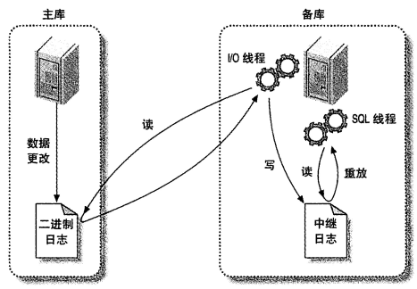

### 复制原理
基于语句的复制：主库会记录那些造成数据更改的查询， 当备库读取并重放这些事件时， 实际上只是把主库上执行过的 SQL 再执行一遍。

优点： 

- 实现简单
- binlog 中的事件更加紧凑

问题：

- 同一条 SQL 在主库和备库上执行的时间可能稍微或很不相同， 因此在传输的 binlog 中，除了 SQL， 还有一些元数据， 比如时间戳
- 一些无法被正确复制的 SQL， 存储过程、 触发器
- 更新必须是串行的， 这需要更多的锁

基于行的复制：会将实际数据记录在 binlog 中。

好处： 

- 可以正确地复制每一行， 一些语句可以被更加有效地复制
- 复制更加高效（但也视情况而定）  

### 复制拓扑
可以在任意个主库和备库之间建立复制， 只有一个限制： 每一个备库只能有一个主库。每 个 备库 必 须 有一 个 唯 一的 服 务 器 ID ； 一 个主 库 可 以有 多 个 备库 ； 如 果打 开 了log_slave_updates 选项， 一个备库可以把其主库上的数据变化传播到其他备库。

- 一主库多备库  
  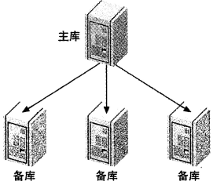

- 主动-主动模式下的主主复制 / 双主复制  
  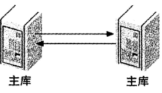

  每一个都被配置成对方的主库和备库。
  这种配置最大的问题是如何解决冲突， 比如两台服务器同时修改一行记录， 或同时往两台服务器上向一个包含 AUTO_INCREMENT 列的表里插入数据。使用起来非常麻烦  

- 主动-被动模式下的主主复制  
  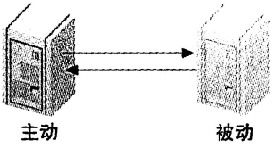
  主要区别在于其中的一台服务器是**只读**的被动服务器。
  这种方式使得反复切换主动和被动服务器非常方便， 因为服务器的配置是对称的， 这使得故障转移和故障恢复很容易。
  设置主动-被动的主主复制在某种意义上类似于创建一个热备份， 但是可以使用这个备份来提高性能。 比如用它来执行读操作、 备份、 离线维护以及升级。 真正的热备份是做不了这些事情的， 然而， 你不会获得比单台服务器更好的写性能。  

- 拥有备库的主主结构  
  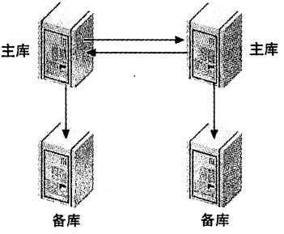
  为每个主库都增加一个备库， 增加了冗余， 可以将读查询分配到备库上。  

- 环形复制： 环形结构可以有三个或更多的主库， 每个服务器都是它之前的服务器的备库，是在它之后的服务器的主库。  
  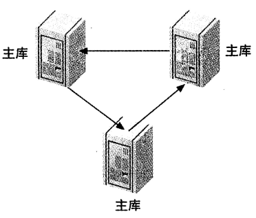
  环形结构没有双主结构的一些优点， 比如对称配置和简单的故障转移， 并完全依赖于环上的每一个可用结点， 这大大增加了整个系统失效的几率。可以为每个节点增加备库的方式来减少环形复制的风险  

### 复制的问题和解决方案
#### 数据损坏或丢失

意外关闭服务器时可能会遇到的情况：
1） 主库意外关闭： 在崩溃前没有将最后几个 binlog 事件刷新到磁盘中， 备库 IO 线程因此一直处于读不到尚未写入磁盘的事件的状态中。 当主库重新启动时， 备库将重连到主库再次尝试去读该事件， 但主库会告诉备库没有这个 binlog 偏移量。
解决方法是指定备库从下一个 binlog 的开头读日志， 但一些日志事件将永久地丢失。 可以通过在主库开启 sync_binlog 来避免事件丢失。

2） 备库意外关闭：如果使用的都是 InnoDB 表， 可以在重启后观察 MySQL 错误日志。 InnoDB在恢复过程中会打印出它的恢复点的 binlog 坐标。 可以使用这个值来决定备库指向胡库的偏移量。  

#### 使用非事务型表
基于语句的复制通过能够很好地处理非事务表。 但是当对非事务型表的更新发生错误时， 就可能导致主库和备库的数据不一致。 如果使用的是 MyIASM 表， 在关闭 MySQL 之前需要确保已经运行了 STOP SLAVE， 否则服务器在关闭时会 kill 所有正在运行的查询。 事务型存储引擎则没有这个问题， 如果使用的是事务型表， 失败的更新会在主库上回滚并且不会记录到binlog 中。

#### 混合事务型和非事务型表

如果使用的是事务型存储引擎， 只有在事务提交时才会查询记录到 binlog 中。 因此如果事务回滚， MySQL 就不会记录这条查询， 也就不会在备库重放。但是如果混合使用事务型和非事务型表， 并且发生了一次回滚， MySQL 能够回滚事务型表的更新， 但非事务型表就会被永久地更新了。

防止该问题的唯一办法是避免混合使用事务型和非事务型表。 如果遇到这个问题， 唯一的解
决办法是忽略错误， 并重新同步相关的表。

基于行的复制不会受这个问题影响。

#### 不确定语句

当使用基于语句的复制模式时， 如果通过不确定的方式更改数据可能会导致主备不一致。
基于行的复制则没有上述限制。

#### 主库和备库使用不同的存储引擎
当使用基于语句的复制方式时， 如果备库使用了不同的存储引擎， 则可能造成一条查询在主库和备库上的执行结果不同。

#### 备库发生数据改变

基于语句的复制方式前提是确保备库上有和主库相同的数据， 因此不应该允许对备库数据的任何更改。
唯一的解决办法是重新从主库同步数据。  

## SQL

#### 执行顺序  

for human：  

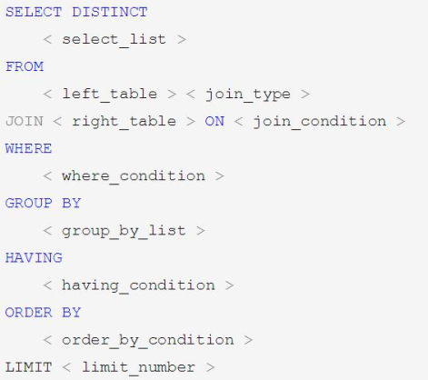

for machine： SQL 解析器执行顺序  

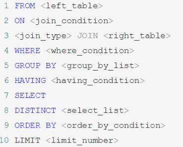

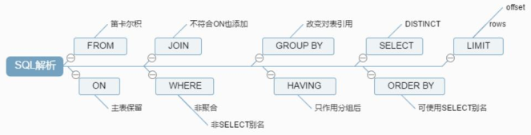

> **from on join where group by having select distinct order by limit**  

### 连接  

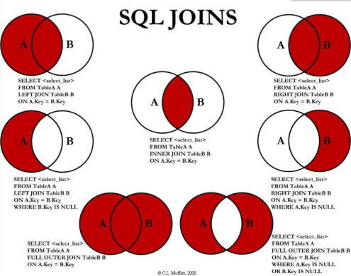

####  例子

emp表：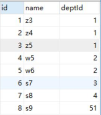

dept表：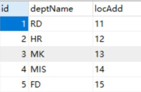

#### 笛卡尔积/交叉连接  

`select * from emp,dept;`，40

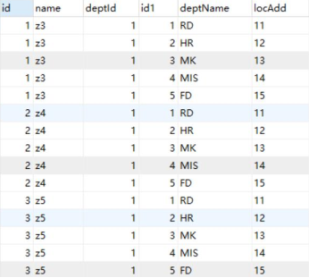

#### 内连接  

```mysql
select * from emp
	inner join dept
		on emp.deptId = dept.id;
```

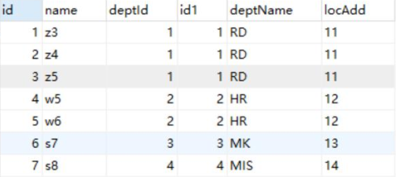

#### 左外连接  
```mysql
select * from emp
	left join dept
		on emp.deptId = dept.id;
```

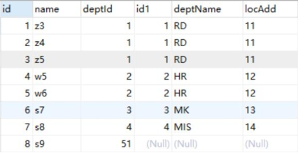

#### 右外连接  
```mysql
select * from emp
	right join dept
		on emp.deptId = dept.id;
```

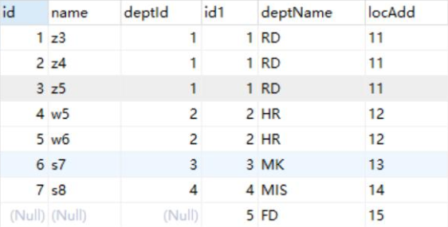

#### 全外连接  
```mysql
select * from emp
	full join dept
		on emp.deptId = dept.id;
#MySQL 不支持， 一种替代做法是：
select from emp
	left join dept
		on emp.deptId=dept.id
UNION
select * from emp
	right join dept
		on emp.deptId=dept.id
```

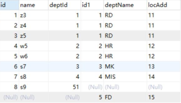

#### 左外连接 – 内连接  

```mysql
select *from emp
	left join dept
		on emp.deptId=dept.id
where dept.id is null;
```

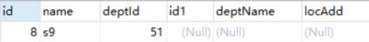

#### 右外连接 – 内连接  

```mysql
select *from emp
	right join dept
		on emp.deptId=dept.id
where emp.id is null;
```


#### 全外连接 – 内连接  
```mysql
select *from emp
	left join dept
		on emp.deptId=dept.id
	where dept.id is nul1
UNION
select*from emp
	right join dept
		on emp.deptId=dept.id
	where emp.id is nul1
```

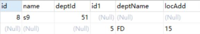