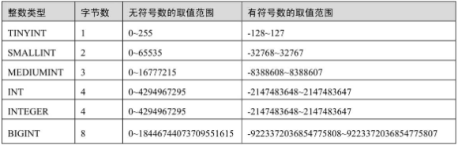
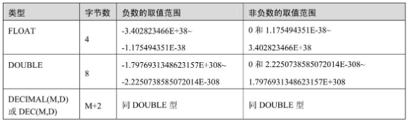
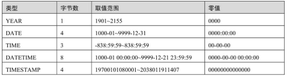
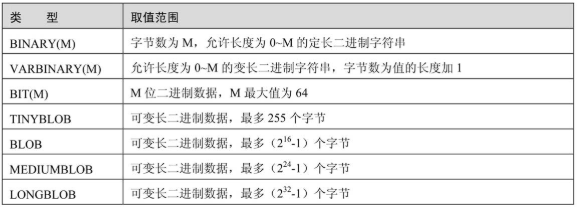
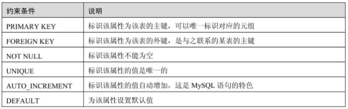

`《MySQL必知必会》-Ben Forta

- 《精通MySQL8》-

# MySQL数据库基础

数据库（Database），就是按照数据结构来组织、存储和管理数据，建立在计算机存储设备上的仓库。

数据表是包含数据库中所有数据的数据库对象。在关系型数据库中，数据在表中的组织方式与在电子表格中相似，都是按行和列的格式组织的。其中每一行代表一条唯一的记录，每一列代表记录中的一个字段，。表中的数据库对象包含列、索引和触发器

- （1）列，也称为栏位（Column）：属性列，创建表时，必须指定列的名字和数据类型。
- （2）索引（Index）：根据指定的数据库表列建立起来的顺序，提供了快速访问数据的途径且可监督表的数据，使其索引指向的列中的数据不重复。
- （3）触发器（Trigger）：用户定义的事务命令的集合，当对一个表中的数据进行插入、更新或删除时，这组命令就会自动执行，可以用来确保数据的完整性和安全性。

---

**标准化和规范化**

关于数据表的设计，有三个范式要遵循。

1. 第一范式（1NF），确保**每列保持原子性**。数据库的每一列都是不可分割的原子数据项，而不能是集合、数组、记录等非原子数据项。
2. 第二范式（2NF），确保**每列都和主键相关**。满足第一范式（2NF）必须先满足第一范式（1NF），第二范式（2NF）要求实体的属性完全依赖主关键字。如果存在不完全依赖，那么这个属性和主关键字的这一部分应该分离出来形成一个新的实体，新实体与元实体之间是一对多的关系。
3. 第三范式（3NF）确保**每列都和主键列直接相关，而不是间接相关**。满足第三范式（3NF）必须先满足第二范式（2NF），要求一个关系中不包含已在其他关系已包含的非主关键字信息。

数据的标准化有助于消除数据库中的数据冗余，第三范式（3NF）通常被认为在性能、扩展性和数据完整性方面达到了最好的平衡，遵守3NF的数据表只包括其本身基本的属性，当不是它们本身所具有的属性时，就需要进行分解，表和表之间的关系通过**外键**相连接，**有一组表专门存放通过键连接起来的关联数据**。

-----

**表和表的关系**

数据库里表和表的关系有三种：一对一、一对多、多对多。

- 一对一，主表和相关联的表之间是一一对应的，比如说，我们新建一个学生基本信息表t_student，然后新建一个成绩表，里面有个外键stuID，学生基本信息表里的字段stuID和成绩表里的stuID就是一一对应的。
- 一对多，比如说，我们新建一个班级表，而每个班级都有多个学生，每个学生则对应一个班级，班级对学生就是一对多的关系。
- 多对多，比如我们新建一个选课表，可能有许多科目，每个科目有很多学生选，而每个学生又可以选择多个科目，这就是多对多的关系。

## 数据库的数据类型

**整数类型**



----

**浮点数类型和定点数类型**

数据表中用浮点数类型和定点数类型来表示小数。

浮点数类型包括单精度浮点数（FLOAT型）和双精度浮点数（DOUBLE型）。

定点数类型就是DECIMAL型。



> DECIMAL型的取值范围与DOUBLE相同，但是DECIMAL的有效值范围由M和D决定；而且DECIMAL型的字节数是M+2，也就是说，定点数的存储空间是根据其精度决定的。
>
> FLOAT、DOUBLE数据类型存储数据时存储的是近似值，DECIMAL存储的是字符串，因此提供了更高的精度。在金融系统中，表示货币金额的时候，会优先考虑DECIMAL数据类型；在一般的价格体系中，比如购物平台中货品的标价，一般选择FLOAT类型就可以。

----

**日期与时间类型**

日期与时间类型是为了方便在数据库中存储日期和时间而设计的，数据库有多种表示日期和时间的数据类型。其中，YEAR类型表示年，DATE类型表示日期，TIME类型表示时间，DATETIME和TIMESTAMP表示日期和时间。



--------

**字符串类型**

字符串类型是在数据库中存储字符串的数据类型。字符串类型包括CHAR、VARCHAR、BLOB、TEXT、ENUM和SET。

1. CHAR类型和VARCHAR类型：CHAR类型和VARCHAR类型都在创建表时指定了最大长度
   1. CHAR类型的**长度是固定的**，在创建表时就指定了。其长度可以是0~255的任意值。
   2. VARCHAR类型的**长度是可变的**，在创建表时指定了最大长度。定义时，其最大值可以取0~65535之间的任意值。

2. TEXT类型：TEXT类型是一种特殊的字符串类型，包括TINYTEXT、TEXT、MEDIUMTEXT和LONGTEXT
3. ENUM类型：又称为枚举类型。在创建表时，ENUM类型的取值范围以列表的形式指定
4.  SET类型：在创建表时，SET类型的取值范围就以列表的形式指定了

---

**二进制类型**

二进制类型是存储二进制数据的数据类型，包括BINARY、VARBINARY、BIT、TINYBLOB、BLOB、MEDIUMBLOB和LONGBLOB。



---

**JSON类型**

JSON是一种轻量级的数据交换格式。相比格式化JSON以字符串形式存储在数据库中，使用JSON类型有如下好处：（1）对存储在JSON列的JSON文档进行原子化验证；（2）优化存储格式。


# 数据库操作

**结束SQL语句**: 多条SQL语句必须以分号（;）分隔。

**SQL语句和大小写:** 请注意，SQL语句不区分大小写，因此SELECT与select是相同的。

> 一定要认识到虽然SQL是不区分大小写的，但有些标识符（如数据库名、表名、列名）可能不同：在MySQL 4.1及之前的版本中，这些标识符默认是区分大小写的；在MySQL 4.1.1版本中，这些标识符默认是不区分大小写的。最佳方式是按照大小写的惯例，且使用时保持一致。

**使用空格**: 在处理SQL语句时，其中所有空格都被忽略。SQL语句可以在一行上给出，也可以分成许多行。

## 选择数据库并查看信息

`USE dataSource;`使用dataSource数据库

`SHOW DATABASES；`返回可用数据库的一个列表。包含在这个列表中的可能是MySQL内部使用的数据库

`DROP DATABASE dataSource;`删除dataSource数据库

`SHOW TABLES;`返回当前选择的数据库内可用表的列表

`show columns from city;`显示city表中的表列；它对每个字段返回一行，行中包含字段名、数据类型、是否允许NULL、键信息、默认值以及其他信息

- `DESCRIBE`语句：MySQL支持用DESCRIBE作为·`SHOW COLUMNS FROM`的一种快捷方式。换句话说，`DESCRIBE customers；`是`SHOW COLUMNS FROM customers；`的一种快捷方式。

所支持的其他SHOW语句还有：

- `SHOW STATUS`，用于显示广泛的服务器状态信息；
- `SHOW CREATE DATABASE`和`SHOW CREATE TABLE`，分别用来显示创建特定数据库或表的MySQL语句；
- `SHOW GRANTS`，用来显示授予用户（所有用户或特定用户）的安全权限；
- `SHOW ERRORS`和`SHOW WARNINGS`，用来显示服务器错误或警告消息。

----

**什么是存储引擎**

简单说存储引擎就是指表的类型，即如何存储和索引数据、是否支持事务等，同时存储引擎也决定了表在计算机中的存储方式。

`SHOW ENGINES;`查看支持的存储引擎

`SHOW VARIABLES like 'default_storage_engine';`查询默认存储引擎

如果想修改MySQL的默认存储引擎，可以通过修改MySQL数据库管理系统的my.cnf或者my.ini文件的配置来实现，或者`SET DEFAULT_STORAGE_ENGINE=MyISM`

# 数据查询

```mysql
SELECT fieldl, field2,…,fieldn
FROM tablename
[WHERE CONDITION1]
[GROUP BY fieldm [HAVING CONDITION2]]
[ORDER BY fieldn [ASC|DESC]]
```

## 检索数据select

`select name from city;`检索单个列

`select city.name from city;`使用完全限定的表名检索列

`select name, district, population  from city;`检索多个列

`select * from city;`检索所有列

> **当心逗号**: 在选择多个列时，一定要在列名之间加上逗号，但最后一个列名后不加。
>
> **使用通配符:** 一般，除非你确实需要表中的每个列，否则最好别使用*通配符。虽然使用通配符可能会使你自己省事，不用明确列出所需列，但检索不需要的列通常会降低检索和应用程序的性能。

`select distinct pro_id from city;`检索不同的行;`DISTINCT`关键字返回不同的值

> **不能部分使用DISTINCT** :DISTINCT关键字应用于所有列而不仅是前置它的列。如果给出SELECT DISTINCT vend_id, prod_price，除非指定的两个列都不同，否则所有行都将被检索出来。

`select * from city limit 10;`限制输出结果数量；`limit 10`表示返回不多于10行

`select * from city limit 10, 10;`第一个表示开始的位置，第二个表示显示的行数

> **行0** :MySQL从0开始计数，因此检索出来的第一行为行0而不是行1。因此，`LIMIT 1, 1`将检索出第二行而不是第一行。
>
> **在行数不够时:** LIMIT中指定要检索的行数为检索的最大行数。如果没有足够的行（例如，给出LIMIT 10, 5，但只有13行）, MySQL将只返回它能返回的那么多行。

## 排序检索order by

> **子句（clause）:** SQL语句由子句构成，有些子句是必需的，而有的是可选的。一个子句通常由一个关键字和所提供的数据组成。

`select name from city order by name;`按单列排序显示（默认升序从A到Z）；根据name列进行排序显示

> **通过非选择列进行排序:** 通常，ORDER BY子句中使用的列将是为显示所选择的列。但是，实际上并不一定要这样，用非检索的列排序数据是完全合法的。

`select * from city order by name, countrycode;`按多个列排序;首先按名字，名字相同继续按照城市代码排序

`select name from city order by name DESC;`结果降序排序（从Z到A）

`select price, name from products order by price desc, name;`用多个列排序；price降序排序，name仍然升序排序

> DESC关键字只应用到直接位于其前面的列名；如果想在多个列上进行降序排序，必须对每个列指定DESC关键字。

`select price, name from products order by price desc limit 1;`使用ORDER BY和LIMIT的组合，能够找出一个列中最高或最低的值

> **ORDER BY子句的位置:** 在给出ORDER BY子句时，应该保证它位于FROM子句之后。如果使用LIMIT，它必须位于ORDER BY之后。

## 过滤数据where

`SELECT prod_name,prod_price FROM products WHERE prod_price=2.50；`

> **WHERE子句的位置:** 在同时使用ORDER BY和WHERE子句时，应该让ORDER BY位于WHERE之后，否则将会产生错误

`SELECT prod_ name,prod_price FROM products WHERE prod_name='fuses';`查询时不区分大小写，fuses和Fuses都会查出来

`SELECT prod_ name,prod_price FROM products WHERE prod_price is null;`

> **NULL 无值（no value）**，它与字段包含0、空字符串或仅仅包含空格不同。
>
> **NULL与不匹配** 在通过过滤选择出不具有特定值的行时，你可能希望返回具有NULL值的行。但是，不行。因为未知具有特殊的含义，数据库不知道它们是否匹配，所以在匹配过滤或不匹配过滤时不返回它们。

### 组合子句过滤数据

> **操作符（operator）** 用来联结或改变WHERE子句中的子句的关键字。也称为逻辑操作符（logical operator）。

- **and/or操作符**

`SELECT prod_id,prod_price,prod_ name FROM products WHERE vend_id=1003 AND prod_price<=10;`AND操作符

`SELECT prod_name,prod_price FROM products WHERE vend_id=1002 OR vend_id=1003;`OR操作符

> 注意：WHERE可包含任意数目的AND和OR操作符。允许两者结合以进行复杂和高级的过滤。但是SQL（像多数语言一样）在处理OR操作符前，**优先处理AND操作符**。

`SELECT prod name,prod price FROM products WHERE vendid=1002 OR vend_id=1003 AND prod price >=10;`的结果不同于`SELECT prod name,prod price FROM products WHERE (vendid=1002 OR vend_id=1003) AND prod price >=10;`

> **在WHERE子句中使用圆括号** 任何时候使用具有AND和OR操作符的WHERE子句，都应该使用圆括号明确地分组操作符。不要过分依赖默认计算次序，即使它确实是你想要的东西也是如此。使用圆括号没有什么坏处，它能消除歧义。

- **in操作符**

> IN操作符用来指定条件范围，范围中的每个条件都可以进行匹配。IN取合法值的由逗号分隔的清单，全都括在圆括号中

`SELECT prod_ name,prod_price FROM products WHERE vend_id IN(1002,1003) ORDER BY prod_name;`

等同于`SELECT prod_ name,prod_price FROM products WHERE vend_id =1002 or vend_id = 1003 ORDER BY prod_name;`

> IN操作符一般比OR操作符清单执行更快

- **not操作符**

> WHERE子句中的NOT操作符有且只有一个功能，那就是否定它之后所跟的任何条件。

`SELECT prod_ name,prod_price FROM products WHERE vend_id NOT IN (1002,1003) ORDER BY prod_name;`

> 在具体使用关键字IN时，查询的集合中如果存在NULL，则不会影响查询；
>
> 使用关键字NOT IN，查询的集合中如果存在NULL，则不会有任何的查询结果。

### 使用通配符过滤LIKE

> **通配符（wildcard）** 用来匹配值的一部分的特殊字符。
>
> **搜索模式（search pattern）**由字面值、通配符或两者组合构成的搜索条件
>
> 在搜索子句中使用通配符，必须使用`LIKE操作符`。LIKE指示MySQL，后跟的搜索模式利用通配符匹配而不是直接相等匹配进行比较。
>
> like是全值匹配

- `%`通配符--任意字符串

> 在搜索串中，%表示**任何字符出现任意次数**；除了一个或多个字符外，%还能匹配0个字符。%代表搜索模式中给定位置的**0个、1个或多个字符**。

`SELECT prod_id,prod_name FROM products WHERE prod_name LIKE 'jet%';`%告诉MySQL接受jet之后的任意字符，不管它有多少字符。

> **区分大小写** 根据MySQL的配置方式，搜索可以是区分大小写的。如果配置中确定区分大小写，'jet%’与JetPack将不匹配。
>
> 通配符可在搜索模式中任意位置使用，并且可以使用多个通配符

`SELECT prod_id,prod_name FROM products WHERE prod_name LIKE '%jet%';`

> **注意NULL** 虽然似乎%通配符可以匹配任何东西，但有一个例外，即NULL。即使是WHERE prod_name LIKE '%’也不能匹配用值NULL作为产品名的行。

- 下划线`_`通配符--单个字符

> 下划线的用途与%一样，但下划线**只匹配单个字符**，不能多也不能少

`SELECT prod_id,prod_name FROM products WHERE prod_name LIKE'_ ton anvil';`匹配如“1 ton anvil”

通配符搜索的处理一般要比前面讨论的其他搜索所花时间更长。

-  不要过度使用通配符。如果其他操作符能达到相同的目的，应该使用其他操作符。
- 在确实需要使用通配符时，除非绝对有必要，否则不要把它们用在搜索模式的开始处。把通配符置于搜索模式的开始处，搜索起来是最慢的。
- 仔细注意通配符的位置。如果放错地方，可能不会返回想要的数据

## 正则表达式搜索

> 正则表达式的作用是匹配文本，将一个模式（正则表达式）与一个文本串进行比较。

`SELECT prod_name FROM products WHERE prod_name REGEXP '1000' ORDER BY prod_name;`REGEXP后所跟的东西作为正则表达式处理。

> LIKE与REGEXP 在LIKE和REGEXP之间有一个重要的差别:
>
> `SELECT prod_name FROM products WHERE prod_name LIKE '1000' ORDER BY prod_name;`  
>
> `SELECT prod_name FROM products WHERE prod_name REGEXP '1000' ORDER BY prod_name;`
>
> 如果执行上述两条语句，会发现第一条语句不返回数据，而第二条语句返回一行。
>
> - **因为LIKE匹配整个列**。如果被匹配的文本在列值中出现，LIKE将不会找到它，相应的行也不被返回（除非使用通配符）。
> - **REGEXP在列值内进行匹配**，如果被匹配的文本在列值中出现，REGEXP将会找到它，相应的行将被返回。
>
> 这是一个非常重要的差别。那么，REGEXP能不能用来匹配整个列值（从而起与LIKE相同的作用）？答案是肯定的，使用^和$定位符（anchor）即可
>
> `．`是正则表达式语言中一个特殊的字符。它表示匹配任意一个字符

- or匹配

> 为搜索两个串之一（或者为这个串，或者为另一个串），使用`|`

`SELECT prod_name FROM products WHERE prod_name REGEXP '1000|2000|300' ORDER BY prod_name;`

- 匹配几个字符**之一**

> 如果你只想匹配特定的字符，怎么办？可通过指定一组用[和]括起来的字符来完成

`SELECT prod_name FROM products WHERE prod_name REGEXP '[123] Ton' ORDER BY prod_name;`[123]定义一组字符，它的意思是匹配1或2或3,因此，1 ton/2 ton/3 ton都匹配且返回

> 为否定一个字符集，在集合的开始处放置一个^即可。因此，尽管`[123]`匹配字符1、2或3，但`[^123]`却匹配除这些字符外的任何东西。
>
> **匹配范围**: 例如，下面的集合将匹配数字0到9：`[0123456789]`为简化这种类型的集合，可使用`-`来定义一个范围。下面的式子功能上等同于上述数字列表：`[0-9]`

- 匹配特殊字符

> 为了匹配特殊字符，必须用`\\`为前导。`\\-`表示查找`-`,` \\．`表示查找`．`。这种处理就是所谓的转义（escaping）

`SELECT vend_name FROM vendors WHERE vend_name REGEXP '\\.' ORDER BY vend_name;`

> 匹配`\ `为了匹配反斜杠（\）字符本身，需要使用`\\\`。
>
> **`\`或`\\？`** 多数正则表达式实现使用单个反斜杠转义特殊字符，以便能使用这些字符本身。但MySQL要求两个反斜杠（MySQL自己解释一个，正则表达式库解释另一个）

- 匹配字符类


- 匹配多个实例


`SELECT prod_name FROM products WHERE prod_ name REGEXP '\\([O-9] sticks?\\)' ORDER BY prod_name;`正则表达式`\\([0-9] sticks? \\)`需要解说一下。`\\(`匹配`)`, `[0-9]`匹配任意数字（这个例子中为1和5）, `sticks？`匹配`stick`和`sticks`（s后的？使s可选，因为？匹配它前面的任何字符的0次或1次出现）, \\)匹配)。

`SELECT prod_ name FROM products WHERE prod_ name RECEXP'[[:digit:]]{4}' ORDER BY prod_name;`匹配连在一起的4位数字

- 定位符

> 为了匹配特定位置的文本需要使用定位符


`SELECT prod_name FROM products WHERE prod_name REGEXP '^[O-9\\.]' ORDER BY prod_name;`找出以一个数（包括以小数点开始的数）开始的所有产品

> **^的双重用途** ^有两种用法。在集合中（用[和]定义），用它来否定该集合，否则，用来指串的开始处。
>
> **使REGEXP起类似LIKE的作用** LIKE和REGEXP的不同在于，**LIKE匹配整个串而REGEXP匹配子串**。利用定位符，通过用^开始每个表达式，用$结束每个表达式，可以使REGEXP的作用与LIKE一样。
>
> **简单的正则表达式测试** 可以在不使用数据库表的情况下用SELECT来测试正则表达式。REGEXP检查总是返回0（没有匹配）或1（匹配）。可以用带文字串的REGEXP来测试表达式，并试验它们。

## 创建计算字段

> 存储在数据库表中的数据一般不是应用程序所需要的格式，需要进一步计算、转换或格式化才能得到想要的形式则需要用到计算字段。
>
> 我们需要直接从数据库中检索出转换、计算或格式化过的数据；而不是检索出数据，然后再在客户机应用程序或报告程序中重新格式化。

> 字段（field）** 基本上与列（column）的意思相同，经常互换使用，不过数据库列一般称为列，而术语字段通常用在计算字段的连接上。

> 只有数据库知道SELECT语句中哪些列是实际的表列，哪些列是计算字段。从客户机（如应用程序）的角度来看，计算字段的数据是以与其他列的数据相同的方式返回的。
>
> **客户机与服务器的格式** 可在SQL语句内完成的许多转换和格式化工作都可以直接在客户机应用程序内完成。但一般来说，在数据库服务器上完成这些操作比在客户机中完成要快得多，因为DBMS是设计来快速有效地完成这种处理的。

### 拼接字段

> **拼接（concatenate）** 将值联结到一起构成单个值。
>
> **MySQL的不同之处** 多数DBMS使用+或||来实现拼接，MySQL则使用Concat()函数来实现。当把SQL语句转换成MySQL语句时一定要把这个区别铭记在心。

`SELECT Concat(vend_name,' (',vend_country,')') FROM vendors ORDER BY vend_name；`供应商的名字中按照name(location)这样的格式列出供应商的位置

> Concat()拼接串，即把多个串连接起来形成一个较长的串。Concat()需要一个或多个指定的串，各个串之间用逗号分隔

`SELECT Concat(RTRIM(vend_name),' (',RTRIM(vend_country),')') FROM vendors ORDER BY vend_name；`RTrim()函数去掉值右边的所有空格。通过使用RTrim()，各个列都进行了整理。

> Trim函数 MySQL除了支持RTrim()（正如刚才所见，它去掉串右边的空格），还支持LTrim()（去掉串左边的空格）以及Trim()（去掉串左右两边的空格）。

`SELECT Concat(RTRIM(vend_name),' (',RTRIM(vend_country),')') AS vend_title FROM vendors ORDER BY vend_name；`

> **别名（alias）**是一个字段或值的替换名。别名用AS关键字赋予。

> **别名的其他用途** 别名还有其他用途。常见的用途包括在实际的表列名包含不符合规定的字符（如空格）时重新命名它，在原来的名字含混或容易误解时扩充它，等等。
>
> **导出列** 别名有时也称为导出列（derived column），不管称为什么，它们所代表的都是相同的东西。

### 执行算术计算

`SELECT prod_id, quantity, item_price, quantity*item_price AS expanded_price
FROM orderitems
WHERE order_num=20005；`

> 如何测试计算 SELECT提供了测试和试验函数与计算的一个很好的办法。虽然SELECT通常用来从表中检索数据，但可以省略FROM子句以便简单地访问和处理表达式。例如，SELECT 3*2；将返回6, SELECT Trim('abc')；将返回abc，而SELECT Now()利用Now()函数返回当前日期和时间。通过这些例子，可以明白如何根据需要使用SELECT进行试验。

## 数据处理函数

### 文本处理函数

- `Trim()`去除空格
- `RTrim()`去掉串右边的空格
- `LTrim()`去掉串左边的空格
- `Upper()`将文本转换为大写
- `Lower()`将串转换为小写
- `Left()`返回串左边的字符
- `Right()`返回串右边的字符
- `Length()`返回串的长度
- `Locate()`找出串的一个子串
- `Substring()`返回子串的字符
- `Soundex()`返回串的SOUNDEX值

> SOUNDEX是一个将任何文本串转换为描述其语音表示的字母数字模式的算法。SOUNDEX考虑了类似的发音字符和音节，使得能对串进行发音比较而不是字母比较。

### 日期时间处理函数

- AddDate()增加一个日期(天、周等）
- AddTime()增加一个时间（时、分等）
- curDate()返回当前日期
- curTime()返回当前时间
- Date()返回日期时间的日期部分
- DateDiff()计算两个日期之差
- Date_Add()高度灵活的日期运算函数
- Date_Format()返回一个格式化的日期或时间串
- Day()返回一个日期的天数部分
- Dayofweek()对于一个日期，返回对应的星期几
- Hour()返回一个时间的小时部分
- Minute()返回一个时间的分钟部分
- Month()返回一个日期的月份部分
- Now()返回当前日期和时间
- second()返回一个时间的秒部分
- Time()返回一个日期时间的时间部分
- Year()返回一个日期的年份部分

> **MySQL使用的日期格式**：无论你什么时候指定一个日期，不管是插入或更新表值还是用WHERE子句进行过滤，日期必须为格式`yyyy-mm-dd`。

`SELECT cust_id,order_num FROM orders WHERE order_date='2005-09-01'；`存储的order_date值为2005-09-01 11:30:05，则WHERE order_date = '2005-09-01’失败

正确：`SELECT cust_id,order_num FROM orders WHERE DATE(order_date)='2005-09-01'；`Date(order_date)指示MySQL仅提取列的日期部分

> MySQL的日期及时间值数据类型为`datetime`。

`SELECT cust_id,order_num FROM orders WHERE DATE(order_date) between '2005-09-01' and '2005-09-30'；`检索出2005年9月下的所有订单

或者：`SELECT cust_id,order_num FROM orders WHERE YEAR(order_date)=2005 and Month(order_date)=9 `

### 数值处理函数

- Abs()返回一个数的绝对值
- Cos()返回一个角度的余弦
- Exp()返回一个数的指数值
- Mod()返回除操作的余数
- Pi()返回圆周率
- Rand()返回一个随机数
- Sin()返回一个角度的正弦
- Sqrt()返回一个数的平方根
- Tan()返回一个角度的正切

## 汇总数据-聚集函数

> 聚集函数（aggregate function） 运行在行组上，计算和返回单个值的函数。聚集函数使得计算直接在数据库进行，计算结束才返回给客户机

- `AVG()`返回某列的平均值
- `COUNT()`返回某列的行数
- `MAX()`返回某列的最大值
- `MIN()`返回某列的最小值
- `SUM()`返回某列值之和

`SELECT AVG(prod_price)AS avg_price FROM products WHERE vend_id=1003；`计算特定行列的平均值

> **只用于单个列** AVG()只能用来确定特定数值列的平均值，而且列名必须作为函数参数给出。为了获得多个列的平均值，必须使用多个AVG()函数。

> COUNT()函数进行计数。可利用COUNT()确定表中行的数目或符合特定条件的行的数目。
>
> **NULL值** 如果指定列名，则指定列的值为空的行被COUNT()函数忽略，但如果COUNT()函数中用的是星号（*），则不忽略。
>
> - 使用COUNT(*)对表中**所有行**的数目进行计数，不管表列中包含的是空值（NULL）还是非空值。
> - 使用COUNT(column)对特定列中具有值的行进行计数，**忽略NULL值**。

> **NULL值** `MAX()`和`MIN()`和`SUM()`和`AVG()`函数忽略列值为NULL的行。

以上5个聚集函数都可以如下使用：

- 对所有的行执行计算，指定ALL参数或不给参数（因为ALL是默认行为）；
- 只包含不同的值，指定DISTINCT参数。

`SELECT AVG(DISTINCT prod_price)AS avg_price FROM products;`使用了DISTINCT参数，因此平均值只考虑各个不同的价格

> **注意** 如果指定列名，则DISTINCT只能用于COUNT()。DISTINCT不能用于COUNT(*)，因此不允许使用COUNT（DISTINCT），否则会产生错误。类似地，DISTINCT必须使用列名，不能用于计算或表达式。
>
> **将DISTINCT用于MIN()和MAX()** 虽然DISTINCT从技术上可用于MIN()和MAX()，但这样做实际上没有价值。一个列中的最小值和最大值不管是否包含不同值都是相同的。

> SELECT语句可根据需要包含多个聚集函数。

## 分组查询

`SELECT vend_id, COUNT(*) AS num_prods FROM products GROUP BY vend_id;`GROUP BY子句指示MySQL按vend_id排序并分组数据。这导致对每个vend_id而不是整个表计算num_prods一次。

> GROUP BY子句指示MySQL分组数据，然后对每个组而不是整个结果集进行聚集。

- GROUP BY子句可以包含任意数目的列。这使得能对分组进行嵌套，为数据分组提供更细致的控制。
- 如果在GROUP BY子句中嵌套了分组，数据将在最后规定的分组上进行汇总。换句话说，在建立分组时，指定的所有列都一起计算（所以不能从个别的列取回数据）。
- GROUP BY子句中**列出的每个列都必须是检索列或有效的表达式（但不能是聚集函数）**。
- **如果在SELECT中使用表达式，则必须在GROUP BY子句中指定相同的表达式，不能使用别名**。
- **凡是在group by后面出现的字段，必须同时在select后面出现；凡是在select后面出现的、同时未在聚合函数中出现的字段，必须同时出现在group by后面**。
- 如果分组列中具有NULL值，则**NULL将作为一个分组返回**。如果列中有多行NULL值，它们将分为一组。
- GROUP BY子句必须出现在**WHERE子句之后，ORDER BY子句之前**。

> 使用ROLLUP使用`WITH ROLLUP`关键字，可以得到每个分组以及每个分组汇总级别（针对每个分组）的值，如下所示：
> `SELECT vend_id,COUNT(*)AS num_prods FROM products
> GROUP BY vend_id WITH ROLLUP;`

> HAVING非常类似于WHERE。事实上，目前为止所学过的所有类型的WHERE子句都可以用HAVING来替代。唯一的差别是**WHERE过滤行，而HAVING过滤分组。**
>
> 这里有另一种理解方法，**WHERE在数据分组前进行过滤，HAVING在数据分组后进行过滤**。这是一个重要的区别，WHERE排除的行不包括在分组中。这可能会改变计算值，从而影响HAVING子句中基于这些值过滤掉的分组。

> **不要忘记ORDER BY** 一般在使用GROUP BY子句时，应该也给出ORDER BY子句。这是保证数据正确排序的唯一方法。千万不要仅依赖GROUP BY排序数据。

- select子句顺序：
- SELECT要返回的列或表达式
- FROM从中检索数据的表
- WHERE 行级过滤
- GROUP BY分组说明
- HAVING组级过滤
- ORDER BY输出排序顺序
- LIMIT要检索的行数

## 使用子查询

- **利用子查询进行过滤**

> 在SELECT语句中，子查询总是从内向外处理。

```sql
SELECT cust_name, cust_contact FROM customers
WHERE cust_id IN (SELECT cust_id FROM orders 
									WHERE order_num IN (SELECT order_num FROM orderitems 
																			WHERE prod_1d='TNT2'));
```

> **格式化SQL** 包含子查询的SELECT语句难以阅读和调试，特别是它们较为复杂时更是如此。如上所示把子查询分解为多行并且适当地进行缩进，能极大地简化子查询的使用。
>
> **列必须匹配** 在WHERE子句中使用子查询，应该保证SELECT语句具有与WHERE子句中相同数目的列。通常，子查询将返回单个列并且与单个列匹配，但如果需要也可以使用多个列。

- **作为计算字段使用子查询**

> 使用子查询的另一方法是创建计算字段。

假如需要显示customers表中每个客户的订单总数。订单与相应的客户ID存储在orders表中。为了执行这个操作，遵循下面的步骤。(1) 从customers表中检索客户列表。(2) 对于检索出的每个客户，统计其在orders表中的订单数目。

查询单个人的订单数量：`SELECT COUNT(*) AS orders FROM orders WHERE cust_ id = 10001;`  

```mysql
SELECT cust_name,cust_state,(SELECT COUNT(*)FROM orders WHERE orders.cust_id=customers.cust_id) AS orders
FROM customers
ORDER BY cust_name;
```

> **逐渐增加子查询来建立查询** 用子查询测试和调试查询很有技巧性，特别是在这些语句的复杂性不断增加的情况下更是如此。用子查询建立（和测试）查询的最可靠的方法是逐渐进行，这与MySQL处理它们的方法非常相同。
>
> - 首先，建立和测试最内层的查询。
> - 然后，用硬编码数据建立和测试外层查询，并且仅在确认它正常后才嵌入子查询。
> - 这时，再次测试它。
> - 对于要增加的每个查询，重复这些步骤。这样做仅给构造查询增加了一点点时间，但节省了以后（找出查询为什么不正常）的大量时间，并且极大地提高了查询一开始就正常工作的可能性。

----

**带关键字EXISTS的子查询**

关键字EXISTS表示存在，后面的参数是一个任意的子查询，系统对子查询进行运算以判断它是否返回行；如果至少返回一行，那么EXISTS的结果为true，此时外层语句将进行查询；如果子查询没有返回任何行，那么EXISTS返回的结果是false，此时外层语句将不进行查询。

----

**带关键字ANY的子查询**

关键字ANY表示满足其中任一条件。使用关键ANY时，只要满足内层查询语句返回的结果中的任何一个就可以通过该条件来执行外层查询语句。

关键字ANY通常和比较运算符一起使用。例如，“>ANY”表示大于任何一个值，“=ANY”表示等于任何一个值。

【示例】查询数据库school的表tstudent中哪些学生可以获得奖学金。学生的成绩达到其中任何一项奖学金规定的分数即可，SQL语句示例如下

```sql
SELECT st.stuid,st.name, sc.Chinese+sc.English+sc.Math+sc.Chemistry+sc.Physics total
FROM t_student st, s_score sC WHERE st.stuid=sc.stuid
AND st.stuid in (SELECT stuid FROM s_score
WHERE Chinese+English+Math+Chemistry+Physics >=ANY(SELECT score FROM t_scholarship));
```

-----

**带关键字ALL的子查询**

关键字ALL表示满足所有条件。使用关键字ALL时，只有满足内层查询语句返回的所有结果才可以执行外层查询语句。

关键字ALL也经常与比较运算符一起使用。例如，“>ALL”表示大于所有值，“<ALL”表示小于所有值。

【示例】查询数据库school的表tstudent中哪些学生可以获得一等奖学金，即学生的总成绩要达到一等奖学金规定的分数，而一等奖学金是最高奖学金。SQL语句示例如下：

```sql
SELECT st.stuid,st.name, sc.Chinese+sc.English+sc.Math+sc.Chemistry+sc.Physics total
FROM t_student st,s_score sc
WHERE st.stuid=sc.stuid
AND st.stuid in (SELECT stuid FROMs score
WHERE Chinese+English+Math+Chemistry+Physics>=ALL
(SELECT score FROM t_scholarship));
```

> 关键字ANY和关键字ALL的使用方式是一样的，但是这两者有很大的区别。使用关键字ANY时，只要满足内层查询语句返回的结果中的任何一个就可以通过该条件来执行外层查询语句；关键字ALL则刚好相反，只有满足内层查询语句的所有结果，才可以执行外层查询语句。

## 联合查询

联结是一种机制，用来在一条SELECT语句中关联表

```mysql
SELECT vend_name,prod_name,prod_price
FROM vendors,products
WHERE vendors.vend_id=products.vend_id
ORDER BY vend_name,prod_name;
```

> **外键（foreign key）** 外键为某个表中的一列，它包含另一个表的主键值，定义了两个表之间的关系。
>
> **完全限定列名** 在引用的列可能出现二义性时，必须使用完全限定列名（用一个点分隔的表名和列名）

- **笛卡儿积（cartesian product）** 由没有联结条件的表关系返回的结果为笛卡儿积。检索出的行的数目将是第一个表中的行数乘以第二个表中的行数

> **不要忘了WHERE子句** 应该保证所有联结都有WHERE子句，否则MySQL将返回比想要的数据多得多的数据(笛卡尔积)。同理，应该保证WHERE子句的正确性。不正确的过滤条件将导致MySQL返回不正确的数据。

### 内连接查询

- 自连接
- 等值连接
- 不等连接

----

**自连接**，就是指表与其自身进行连接。

查询学生“Alicia Florric”所在班级的其他学生，SQL语句如下：

```sql
SELECT ts1.stuid,ts1.name,ts1.classno 
FROM t_student AS ts1,t_student AS ts2
WHERE ts1.classno=ts2.classno AND ts2.name='Alicia Florric';

#或者使用Inner Join
SELECT ts1.stuid,ts1.name,ts1.classno
FROM t_student ts1 INNER JOIN t_student ts2
ON ts1.classno=ts2.classno AND ts2.name='Alicia Florric';
```

```mysql
#查询生产有产品ID是'DTNTR'的产品的供应商生产的所有商品
#使用子查询
SELECT prod_id,prod name FROM products
WHERE vend_id=(SELECT vend_id FROM products	WHERE prod_id='DTNTR');
#使用自联结：两个表实际上是相同的表
SELECT p1.prod_id,pl.prod_name
FROM products AS pl,products AS p2
WHERE p1.vend_id=p2.vend_id
AND p2.prod_id=‘DTNTR’;
```

> **用自联结而不用子查询** 自联结通常作为外部语句用来替代从相同表中检索数据时使用的子查询语句。虽然最终的结果是相同的，但有时候处理联结远比处理子查询快得多。

-----

 **等值连接**，就是在关键字ON后的匹配条件中通过等于关系运算符（=）来实现等值条件。

```sql
SELECT s.stuid,s.name,s.gender,s.age,s.classno,c.cname,c.loc, c.advisor
FROM t_student s,t_class c WHERE s.classno=c.classno;

#或者使用Inner Join
SELECT s.stuid,s.name,s.gender,s.age,s.classno,c.cname,c.loc, c.advisor
FROM t_student s INNER JOIN t_class c
ON s.classno=c.classno;
```

----

**不等连接，**就是在关键字ON后的匹配条件中通过除了等于关系运算符来实现不等条件外，还可以使用关系运算符，包含“>”“>=”“<”“<=”和“!=”等运算符号

-----

### 外连接查询

```
SELECT field1,field2,……,fieldn
FROM tablename1 LEFT|RIGHT|FULL [OUTER] JOIN tablename2
ON CONDITION
```

左连接的结果包括LEFT OUTER字句中指定的左表的所有行，而不仅仅是连接列所匹配的行，如果左表的某行在右表中没有匹配行，则在相关联的结果行中，右表的所有选择列表均为空值。

全外连接实际上是左外连接与右外连接去重后的合集。

> **外部联结的类型** 存在两种基本的外部联结形式：左外部联结和右外部联结。它们之间的唯一差别是所关联的表的顺序不同。换句话说，左外部联结可通过颠倒FROM或WHERE子句中表的顺序转换为右外部联结。因此，两种类型的外部联结可互换使用，而究竟使用哪一种纯粹是根据方便而定。

- 使用带聚集函数的联结

```mysql
SELECT cuStomers.cust_name, customers.cust_id, COUNT(orders.order_num)AS num_ord
FROM customers INNER JOIN orders ON customers.cust_id=orders.cust_id
GROUP BY customers.cust_id;
```

## 组合查询UNION

> 多数SQL查询都只包含从一个或多个表中返回数据的单条SELECT语句。MySQL也允许执行多个查询（多条SELECT语句），并将结果作为单个查询结果集返回。这些组合查询通常称为并（union）或复合查询（compound query）。

有两种基本情况，其中需要使用组合查询：

- 在单个查询中从不同的表返回类似结构的数据；
- 对单个表执行多个查询，按单个查询返回数据。

```mysql
SELECT vend_id,prod_id,prod_price
FROM products
WHERE prod_price<=5
UNION
SELECT vend_id,prod_id,prod_price
FROM products
WHERE vend id IN(1001.1002):
#相当于将两个子句的结果在一个表中显示
```

UNION规则：

- UNION必须由两条或两条以上的SELECT语句组成，语句之间用关键字UNION分隔（因此，如果组合4条SELECT语句，将要使用3个UNION关键字）
- UNION中的每个查询必须包含相同的列、表达式或聚集函数（不过各个列不需要以相同的次序列出）。
- 列数据类型必须兼容：类型不必完全相同，但必须是DBMS可以隐含地转换的类型（例如，不同的数值类型或不同的日期类型）

> UNION会从查询结果集中自动去除重复的行（换句话说，它的行为与单条SELECT语句中使用多个WHERE子句条件一样）
>
> 如果想返回所有匹配行，可使用UNION ALL而不是UNION。

> **UNION与WHERE** : UNION几乎总是完成与多个WHERE条件相同的工作。UNION ALL为UNION的一种形式，它完成WHERE子句完成不了的工作。如果确实需要每个条件的匹配行全部出现（包括重复行），则必须使用UNION ALL而不是WHERE。

> 在用UNION组合查询时，只能使用一条ORDER BY子句，它必须出现在最后一条SELECT语句之后。对于结果集，不存在用一种方式排序一部分，而又用另一种方式排序另一部分的情况，因此不允许使用多条ORDER BY子句。

# 数据操作DML

## 插入INSERT

插入可以用几种方式使用：

- 插入完整的行；
- 插入行的一部分；
- 插入多行；
- 插入某些查询的结果。

### 插入完整的行

```mysql
INSERT INTO customers VALUES(NULL,‘Pep E.LaPew',‘100 Main Street',‘Los Angeles',‘CA'，‘90046'，‘USA',NULL，NULL);
#或者
INSERT INTO customers (cust_name,cust_address,cust_city,cust_state,cust_zip,cust_country,cust_contact,cust_email)
VALUES('Pep E.LaPew',‘100 Main Street',‘Los Angeles',CA',‘90046’,‘USA',NULL,NULL);

```

> 因为提供了列名，VALUES必须以其指定的次序匹配指定的列名，不一定按各个列出现在实际表中的次序。其优点是，即使表的结构改变，此INSERT语句仍然能正确工作。
>
> 使用这种语法，还可以省略列。这表示可以只给某些列提供值，给其他列不提供值。省略的列必须满足以下某个条件。
>
> - 自动增加约束字段
> - 该列定义为允许NULL值（无值或空值）
> - 在表定义中给出默认值。这表示如果不给出值，将使用默认值。
>
> 不管使用哪种INSERT语法，都必须给出VALUES的正确数目。如果不提供列名，则必须给每个表列提供一个值。如果提供列名，则必须对每个列出的列给出一个值

> **提高整体性能** : 数据库经常被多个客户访问，对处理什么请求以及用什么次序处理进行管理是MySQL的任务。INSERT操作可能很耗时（特别是有很多索引需要更新时），而且它可能降低等待处理的SELECT语句的性能。如果数据检索是最重要的（通常是这样），则你可以通过在INSERT和INTO之间添加关键字LOW_PRIORITY，指示MySQL降低INSERT语句的优先级，如下所示：`insert low_priority into`顺便说一下，这也适用于UPDATE和DELETE语句。

### 插入多个行

```mysql
INSERT INTO customers(cust_name,cust_address,cust_city,cust_state,cust_zip,cust_country)
		VALUES('Pep E.LaPew', '1100 Main Street','Los Angeles', 'CA','90046','USA'), 
			('M.Martian', '42 Galaxy way','New York','NY','11213', 'USA');
```

> 其中单条INSERT语句有多组值，每组值用一对圆括号括起来，用逗号分隔。

### 插入检索出的数据

INSERT一般用来给表插入一个指定列值的行。但是，INSERT还存在另一种形式，可以利用它将一条SELECT语句的结果插入表中。这就是所谓的INSERT SELECT，顾名思义，它是由一条INSERT语句和一条SELECT语句组成的。

```mysql
INSERT INTO customers ( cust_id,cust_contact,cust_email,cust_name,cust_address,cust_city,cust_state,cust_zip,cust_country )
SELECT 
cust_id,cust_contact,cust_email,cust_name,cust_address,cust_city,cust_state,cust_zip,cust_country
FROM custnew;
```

> SELECT语句从custnew检索出要插入的值，而不是列出它们。SELECT中列出的每个列对应于customers表名后所跟的列表中的每个列。这条语句将插入多少行有赖于custnew表中有多少行。
>
> **INSERT SELECT中的列名**：为简单起见，这个例子在INSERT和SELECT语句中使用了相同的列名。但是，不一定要求列名匹配。事实上，MySQL甚至不关心SELECT返回的列名。它使用的是列的位置，因此SELECT中的第一列（不管其列名）将用来填充表列中指定的第一个列，第二列将用来填充表列中指定的第二个列，如此等等。

## 更新数据UPDATE

基本的UPDATE语句由3部分组成，分别是：

- 要更新的表；
- 列名和它们的新值；
- 确定要更新行的过滤条件。

```mysql
#更新单个列
UPDATE customers
SET cust_email='elmer@fudd.com'
WHERE cust_id=10005;
#更新多个列
UPDATE customers
SET cust_name='The Fudds', cust_email='elmer@fudd.com'
WHERE cust_id=10005:
```

```mysql
#为了删除某个列的值，可设置它为NULL（假如表定义允许NULL值）
UPDATE customers
SET cust_email=NULL
WHERE cust_id=10005;
```

## 删除数据DELETE

为了从一个表中删除（去掉）数据，使用DELETE语句。可以两种方式使用DELETE：

- 从表中删除特定的行
- 从表中删除所有行

```mysql
DELETE FROM cuStomers
WHERE cust_id=10006；
```

> DELETE不需要列名或通配符。DELETE删除整行而不是删除列。为了删除指定的列，请使用UPDATE语句。
>
> **删除表的内容而不是表** ：DELETE语句从表中删除行，甚至是删除表中所有行。但是，DELETE不删除表本身。
>
> **更快的删除：** 如果想从表中删除所有行，不要使用DELETE。可使用TRUNCATE TABLE语句，它完成相同的工作，但速度更快（TRUNCATE实际是删除原来的表并重新创建一个表，而不是逐行删除表中的数据）。

使用UPDATE或DELETE时所遵循的习惯。

- 除非确实打算更新和删除每一行，否则绝对不要使用不带WHERE子句的UPDATE或DELETE语句。
- 保证每个表都有主键，尽可能像WHERE子句那样使用它（可以指定各主键、多个值或值的范围）。
- 在对UPDATE或DELETE语句使用WHERE子句前，应该先用SELECT进行测试，保证它过滤的是正确的记录，以防编写的WHERE子句不正确。
- 使用强制实施引用完整性的数据库，这样MySQL将不允许删除具有与其他表相关联的数据的行。

# 表操作

## 创建表CREATE TABLE

为利用CREATE TABLE创建表，必须给出下列信息：

- 新表的名字，在关键字CREATE TABLE之后给出；
- 表列的名字和定义，用逗号分隔。

```mysql
CREATE TABLE cuStomers
cust_id int NOT NULL AUTO_INCREMENT,
cust name char(50) NOT NULL,
cust_address char(50)NULL,
cust_city char(50)NULL,
cust state char(5)NULL,
cust_zip char(10)NULL,
cust_country char(50)NULL DEFAULT china,
cust_contact char(50)NULL,
cust_email char(255)NULL,
PRIMARY KEY(cust_id)
)ENGINE=InnoDB;

```

----

**完整性约束条件**




- NULL 值

> NULL值就是没有值或缺值。允许NULL值的列也允许在插入行时不给出该列的值。不允许NULL值的列不接受该列没有值的行，换句话说，在插入或更新行时，该列必须有值。每个表列或者是NULL列，或者是NOT NULL列，这种状态在创建时由表的定义规定。
>
> **理解NULL:** 不要把NULL值与空串相混淆。NULL值是没有值，它不是空串。如果指定''（两个单引号，其间没有字符），这在NOT NULL列中是允许的。空串是一个有效的值，它不是无值。NULL值用关键字NULL而不是空串指定。

- 主键

> 主键是表的一个特殊字段，能唯一标识该表中的每条信息(身份证)。
>
> - 主键值必须唯一。即，表中的每个行必须具有唯一的主键值。如果主键使用单个列，则它的值必须唯一。如果使用多个列，则这些列的组合值必须唯一。
> - 主键中只能使用不允许NULL值的列。允许NULL值的列不能作为唯一标识。
>
> 其中主键用以下的类似的语句定义：`PRIMARY KEY(cust_id)`
>
> 创建由多个列组成的主键以逗号分隔的列表给出各列名:`【CONSTRAINT cust_id_name】PRIMARY KEY(cust_id,cust_name)`
>
> 如果想给id列添加主键约束并命名，可以添加：`CONSTRAINT stu_id PRIMARY KEY(id);`

- 自增属性

> 每个表**只允许一个**`AUTO_INCREMENT`列，而且它必须被索引（如，通过使它成为主键）
>
> 如果一个列被指定为AUTO_INCRE-MENT，则它需要使用特殊的值吗？你可以简单地在INSERT语句中指定一个值，只要它是唯一的（至今尚未使用过）即可，该值将被用来替代自动生成的值。后续的增量将开始使用该手工插入的值。
>
> **覆盖AUTO_INCREMENT：** 如果一个列被指定为AUTO_INCREMENT，则它需要使用特殊的值吗？你可以简单地在INSERT语句中指定一个值，只要它是唯一的（至今尚未使用过）即可，该值将被用来替代自动生成的值。后续的增量将开始使用该手工插入的值。
>
> **确定AUTO_INCREMENT值：** 让MySQL生成（通过自动增量）主键的一个缺点是你不知道这些值都是谁。考虑这个场景：你正在增加一个新订单。这要求在orders表中创建一行，然后在orderitems表中对订购的每项物品创建一行。order_num在orderitems表中与订单细节一起存储。这就是为什么orders表和orderitems表为相互关联的表的原因。这显然要求你在插入orders行之后，插入orderitems行之前知道生成的order_num。那么，如何在使用AUTO_INCREMENT列时获得这个值呢？可使用`last_insert_id()`函数获得这个值，如下所示：`SELECT last_insert_id()`此语句返回最后一个AUTO_INCREMENT值，然后可以将它用于后续的MySQL语句。

- 指定默认值

> 如果在插入行时没有给出值，MySQL允许指定此时使用的默认值。默认值用CREATE TABLE语句的列定义中的`DEFAULT`关键字指定。
>
> **不允许函数:** 与大多数DBMS不一样，MySQL不允许使用函数作为默认值，它只支持常量。

- 唯一约束UNIQUE

> 当数据库表中某个字段上的内容不允许重复时，可以使用UK约束进行设置。UK约束在创建数据库时为某些字段加上“UNIQUE”约束条件，保证所有记录中该字段上的值不重复。

- 外键

> 外键是表的一个特殊字段，外键约束是为了保证多个表（通常为两个表）之间的参照完整性，即构建两个表的字段之间的参照关系。
>
> 设置外键约束的两个表之间具有父子关系，即子表中某个字段的取值范围由父表决定。
>
> > 例如，表示一个班级和学生关系，即每个班级有多个学生。首先应该有两个表：班级表和学生表，然后学生表有一个表示班级编号的字段classno，其依赖于班级表的主键，这样字段classno就是学生表的外键，通过该字段班级表和学生表建立了关系。
>
> 在具体设置FK约束时，设置FK约束的字段必须依赖于数据库中已经存在的父表的主键，同时外键可以为空（NULL）。
>
> 可以在子表中添加：`CONSTRANT fk FORENGN KEY(son_col) REFERENCES fa_table(fa_col) `
>
> 其中，son_table参数是要设置外键的表名，son_col参数是要设置外键的字段，fa_table是父表的名称，fa_col是父表中设置主键约束的字段名。

- 引擎类型

> 以下是几个需要知道的引擎：
>
> - InnoDB是一个可靠的事务处理引擎，它不支持全文本搜索；
> - MEMORY在功能等同于MyISAM，但由于数据存储在内存（不是磁盘）中，速度很快（特别适合于临时表）；
> - MyISAM是一个性能极高的引擎，它支持全文本搜索，但不支持事务处理。
>
> **外键不能跨引擎:** 混用引擎类型有一个大缺陷。外键（用于强制实施引用完整性）不能跨引擎，即使用一个引擎的表不能引用具有使用不同引擎的表的外键

## 更新表ALTER TABLE

> 理想状态下，当表中存储数据以后，该表就不应该再被更新

为了使用ALTER TABLE更改表结构，必须给出下面的信息：

- 在ALTER TABLE之后给出要更改的表名（该表必须存在，否则将出错）；
- 所做更改的列表。

> 重命名:
>
> `ALTER TABLE oldTablename RENAME [TO] newTablename;`

> 添加一个列:
>
> `ALTER TABLE tablename ADD propName proplype;`
>
> `ALTER TABLE tablename ADD propName propType FIRST;`
>
> `ALTER TABLE tablename ADD pNamelNew propType AFTER pNameOld；`
>
> `ALTER TABLE vendors ADD vend_phone CHAR(20)；`

> 删除一个列
>
> `ALTER TABLE vendors DROP COLUMN vend_phone;`

> 定义外键
>
> `ALTER TABLE orderitems
> ADD CONSTRAINT fk_orderitems_orders
> FOREIGN KEY (order_num) REFERENCES orders (order_num);`

> 修改字段:
>
> 字段是由字段名和数据类型来进行定义的。如果要实现修改字段，除了可以修改字段名外，还可以实现修改字段所能存储的数据类型。由于一个表中拥有许多字段，因此还可以实现修改字段的顺序。
>
> ```
> ALTER TABLE tablename MODIFY propName propType;
> ALTER TABLE tablename CHANGE pNameOld pNameNew pTypeOld;
> ALTER TABLE tablename CHANGE pNameOld pNameNew pTypeNew;
> ALTER TABLE tablename MODIFY pNamel propType FIRST|AFTER pName2；
> ```
>
> 第一条语句用于修改**字段类型**。其中，tablename参数表示所要修改表的名字，propName参数为所修改字段的名称，propType为字段propName修改后的类型。
>
> 第二条语句用于修改**字段的名称**。其中pNameOld参数为所修改字段的名称，pNameNew为修改后的字段名，pTypeOld为字段pNameOld的数据类型。
>
> 第三条语句用于同时修改**字段名称和类型**。其中，pTypeNew为字段pNameNew的数据类型。
>
> 第四条语句用于修改字段的顺序。其中，tablename参数表示所要修改表的名字，pName1参数为所要调整顺序的字段名称，FIRST参数表示将字段调整到表的第一个位置，“AFTER pName2”参数表示将字段调整到pName2字段位置之后。

## 删除表DROP TABLE

`DROP TABLE vendors;`

## 重命名表RENAME TABLE

`RENAME TABLE vendors2 TO vendors;`


# 索引

索引是一种特殊的数据库结构，可以用来快速查询数据库表中的特定记录，是提高数据库性能的重要方式。MySQL中，所有的数据类型都可以被索引

索引由数据库表中的一列或多列组合而成，其作用是提高对表中数据的查询速度。

通过索引，查询数据时可以不必读完记录的所有信息，而只是查询索引列，否则数据库系统将读取每条记录的所有信息进行匹配。

索引有两种存储类型，包括**B型树（BTREE）**索引和**哈希（HASH）索引**。InnoDB和MyISAM存储引擎支持BTREE索引，MEMORY存储引擎支持HASH索引和BTREE索引，默认为前者。

（1）索引的优点是可以提高检索数据的速度，这是创建索引的主要原因；对于有依赖关系的子表和父表联合查询时，可以提高查询速度；使用分组和排序子句进行数据查询时，同样可以显著节省查询中分组和排序的时间。

（2）索引的缺点是创建和维护索引需要耗费时间，耗费时间的数量随着数据量的增加而增加；索引需要占用物理空间，每一个索引要占一定的物理空间；增加、删除和修改数据时，要动态地维护索引，造成数据的维护速度降低了。

## 索引的分类

MySQL的索引包括普通索引、唯一性索引、全文索引、单列索引、多列索引和空间索引等。

---

1. 普通索引

在创建普通索引时，不附加任何限制条件。这类索引可以创建在任何数据类型中，其值是否**唯一和非空**，要由字段本身的完整性约束条件决定。建立索引以后，可以通过索引进行查询。

---

2. 唯一性索

引使用UNIQUE参数可以设置索引为唯一性索引，在创建唯一性索引时，限制该索引的值必须是唯一的。

通过唯一性索引，可以更快速地确定某条记录。主键就是一种特殊唯一性索引。

-----

3. 全文索引

全文索引使用参数FULLTEXT可以设置索引为全文索引。全文索引只能创建在CHAR、VARCHAR或TEXT类型的字段上，查询数据量较大的字符串类型的字段时，使用全文索引可以提高查询速度。

MySQL数据库从3.23.23版开始支持全文索引，但只有MyISAM存储引擎支持全文检索。在默认情况下，全文索引的搜索执行方式不区别大小写；但索引的列使用二进制排序后，可以执行区分大小写的全文索引。

----

4. 单列索引

在表中的单个字段上创建索引。单列索引只根据该字段进行索引。单列索引可以是普通索引，也可以是唯一性索引，还可以是全文索引。只要保证该索引只对应一个字段即可。

----

5. 多列索引

多列索引时在表的多个字段上创建一个索引。该索引指向创建时对应的多个字段，可以通过这几个字段进行查询，但是只有查询条件中使用了这些字段中的第一个字段时才会被使用。

---

6. 空间索引

使用参数SPATIAL可以设置索引为空间索引。空间索引只能建立在空间数据类型上，这样可以提高系统获取空间数据的效率。

-----

## 索引的设计原则

1. **选择唯一性索引**：唯一性索引的值是唯一的，可以更快速地通过该索引来确定某条记录。例如，学生表中学号是具有唯一性的字段，为该字段建立唯一性索引可以很快确定某个学生的信息，如果使用姓名的话，可能存在同名现象，从而降低查询速度。
2.  **为经常需要排序、分组和联合操作的字段建立索引**：经常需要使用ORDER BY、GROUP BY、DISTINCT和UNINON等操作的字段，排序操作会浪费很多时间，如果为其建立索引，可以有效地避免排序操作。
3. **为经常作为查询条件的字段建立索引**：如果某个字段经常用来做查询条件，那么该字段的查询速度会影响整个表的查询速度，为这样的字段建立索引可以提高整个表的查询速度。
4. **限制索引的数目：**索引的数目不是越多越好。每个索引都需要占用磁盘空间，索引越多，需要的磁盘空间就越大，修改表时，对索引的重构和更新很麻烦。
5. **尽量使用数据量少的索引：**如果索引的值很长，那么查询的速度会受到影响。例如，对一个CHAR(100)类型的字段进行全文检索需要的时间肯定要比对CHAR(10)类型的字段需要的时间多。
6. **尽量使用前缀来索引：**如果索引的值很长，最好使用值的前缀来索引。例如，TEXT和BLOG类型的字段，进行全文检索会很浪费时间，如果只检索字段前面的若干字符，这样可以提高检索速度。
7. **删除不再使用或者很少使用的索引：**表中的数据被大量更新，或者数据的使用方式被改变后，原有的一些索引可能不再需要。数据库管理员应当定期找出这些索引，将它们删除，从而减少索引对更新操作的影响。

## 创建和删除索引

创建索引有3种方式，分别是创建表的时候创建索引、在已经存在的表上创建索引和使用ALTER TABLE语句来创建索引。

### 创建索引

所谓普通索引，就是在创建索引时，不附加任何限制条件（唯一、非空等限制）。该类型的索引可以创建在任何数据类型的字段上。

----

**创建表时直接创建**

引通过SQL语句INDEX来实现，其基本形式如下：

```sql
CREATE TABLE tablename(
propname1 typel[CONSTRAINT1],
propname2 type2[CONSTRAINT2],
propnamen typen
[UNIQUE|IFULLTEXTI|SPATIAL] INDEX|KEY
[indexname](propname1[(length)][ASC|DESC]));
```

> 参数UNIQUE是可选参数，表示索引为唯一性索引；
>
> 参数FULLTEXT是可选参数，表示索引是全文索引；
>
> 参数SPATIAL也是可选参数，表示索引为空间索引；
>
> 参数INDEX和KEY是用来指定字段为索引的，两者选择其中之一就可以了，作用是一样的；参数indexname是索引名字；
>
> 参数propname1是索引对应的字段的名称，该字段必须为前面定义好的字段，括号；
>
> 参数length是可选参数，其指索引的长度，必须是字符串类型才可以使用；参数ASC和DESC都是可选参数，ASC表示升序排列，DESC表示降序排列。

查看是否应用索引：`EXPLAIN select * from tablename where condition; `

-----

**在已经存在的表上创建**

````sql
CREATE [UNIQUE|FULLTEXT|SPATIAL]INDEX indexname ON tablename (propname[(length)][ASC|DESC]);
````

----

**通过ALTER TABLE语句创建**

```sql
ALTER TABLE tablename ADD [UNIQUE|FULLTEXT|SPATIAL]INDEX|KEY indexname (propname [(length)][ASCIDESC]);
```

---

### 创建多列索引

------

```sql
CREATE TABLE tablename(
propname1 typel[CONSTRAINT1],
propname2 type2[CONSTRAINT2],
propnamen typen
INDEX|KEY [indexname](propname1[(length)][ASC|DESC]),propname2[(length)][ASC|DESC]),...);
```

### 删除索引

`DROP INDEX indexname ON tablename`


# 视图

> 视图是虚拟的表。与包含数据的表不一样，**视图只包含使用时动态检索数据的查询(SQL语句)。**

视图的一些常见应用

- 重用SQL语句
- 简化复杂的SQL操作。在编写查询后，可以方便地重用它而不必知道它的基本查询细节
- 使用表的组成部分而不是整个表
- 保护数据。可以给用户授予表的特定部分的访问权限而不是整个表的访问权限
- 更改数据格式和表示。视图可返回与底层表的表示和格式不同的数据。

> 视图仅仅是用来查看存储在别处的数据的一种设施。视图本身不包含数据，因此它们返回的数据是从其他表中检索出来的。在添加或更改这些表中的数据时，视图将返回改变过的数据。

> **性能问题:** 因为视图不包含数据，所以每次使用视图时，都必须处理查询执行时所需的任一个检索。如果你用多个联结和过滤创建了复杂的视图或者嵌套了视图，可能会发现性能下降得很厉害。因此，在部署使用了大量视图的应用前，应该进行测试。

视图创建和使用的一些最常见的规则和限制

- 与表一样，视图必须唯一命名（不能给视图取与别的视图或表相同的名字）
- 对于可以创建的视图数目没有限制
- 为了创建视图，必须具有足够的访问权限。这些限制通常由数据库管理人员授予
- 视图可以嵌套，即可以利用从其他视图中检索数据的查询来构造一个视图
- ORDER BY可以用在视图中，但如果从该视图检索数据的SELECT语句中也含有ORDERBY，那么该视图中的ORDER BY将被覆盖
- 视图不能索引，也不能有关联的触发器或默认值
- 视图可以和表一起使用。例如，编写一条联结表和视图的SELECT语句。

### 使用视图

视图的创建

- 视图用`CREATE VIEW ...AS`语句来创建
- 使用`SHOW CREATE VIEW viewname；`来查看创建视图的语句
- 用DROP删除视图，其语法为`DROP VIEW viewname;`
- 更新视图时，可以先用DROP再用CREATE，也可以直接用`CREATE OR REPLACE VIEW`。如果要更新的视图不存在，则第2条更新语句会创建一个视图；如果要更新的视图存在，则第2条更新语句会替换原有视图。

```mysql
#创建一个名为productcustomers的视图，它联结三个表，以返回已订购了任意产品的所有客户的列表
CREATE VIEW productcustomers AS
SELECT cust_name,cust_contact,prod_id
FROM customers,orders,orderitems
WHERE customers.cust_id=orders.cust_id
AND orderitems.order_num=orders.order_num;
#检索订购了产品TNT2的客户
SELECT cust_name,cust_contact
FROM productcustomers
WHERE prod_id='TNT2'；
```

```mysql
#用视图重新格式化检索出的数据
CREATE VIEW vendorlocations AS
SELECT Concat(RTrim(vend name),'(',RTria(vend_country),')')
AS vend_title
FROM vendors
ORDER BY vend_nane:

```

```mysql
#用视图过滤不想要的数据
CREATE VIEW customeremaillist AS
SELECT cust_id,cust_name,cust_email
FROM customers
WHERE cust_email IS NOT NULL;

```

```mysql
#使用视图与计算字段
CREATE VIEW orderitemsexpanded AS
SELECT order_num,prod_id,quantity,item_price,quantity*item_price AS expanded_price
FROM orderitems;

```

## 存储过程

> 存储过程简单来说，就是为以后的使用而**保存的一条或多条MySQL语句的集合**。可将其视为批文件，虽然它们的作用不仅限于批处理。

- 通过把处理封装在容易使用的单元中，简化复杂的操作（正如前面例子所述）
- 由于不要求反复建立一系列处理步骤，这保证了数据的完整性。如果所有开发人员和应用程序都使用同一（试验和测试）存储过程，则所使用的代码都是相同的。这一点的延伸就是防止错误。需要执行的步骤越多，出错的可能性就越大。防止错误保证了数据的一致性。
- 简化对变动的管理。如果表名、列名或业务逻辑（或别的内容）有变化，只需要更改存储过程的代码。使用它的人员甚至不需要知道这些变化。这一点的延伸就是安全性
- 通过存储过程限制对基础数据的访问减少了数据讹误（无意识的或别的原因所导致的数据讹误）的机会。
- 提高性能。因为使用存储过程比使用单独的SQL语句要快。
- 存在一些只能用在单个请求中的MySQL元素和特性，存储过程可以使用它们来编写功能更强更灵活的代码

### 使用存储过程

```mysql
#创建
CREATE PROCEDURE productpricing()
BEGIN
SELECT Avg(prod_price)AS priceaverage
FROM products;
END;
#使用
CALL productpricing();
#删除:注意没有使用后面的()，只给出存储过程名。
DROP PROCEDURE productpricing;
```

> 此存储过程名为productpricing，用`CREATE PROCEDURE productpricing()`语句定义。如果存储过程接受参数，它们将在()中列举出来。此存储过程没有参数，但后跟的()仍然需要。BEGIN和END语句用来限定存储过程体，过程体本身仅是一个简单的SELECT语句

> **mysql命令行客户机的分隔符** : 默认的MySQL语句分隔符为`;`。mysql命令行实用程序也使用`;`作为语句分隔符。如果命令行实用程序要解释存储过程自身内的`;`字符，则它们最终不会成为存储过程的成分，这会使存储过程中的SQL出现句法错误。解决办法是临时更改命令行实用程序的语句分隔符，如下所示：
>
> ```mysql
> DELIMITER //
> CREATE PROCEDURE productpricing()
> BEGIN
> SELECT Avg(prod_price) AS priceaverage
> FROM products;
> END//
> DELIMITER;
> ```
>
> 其中，DELIMITER //告诉命令行实用程序使用//作为新的语句结束分隔符，可以看到标志存储过程结束的END定义为END//而不是END;。这样，存储过程体内的；仍然保持不动，并且正确地传递给数据库引擎。最后，为恢复为原来的语句分隔符，可使用DELIMITER ;。

MySQL称存储过程的执行为调用，因此MySQL执行存储过程的语句为CALL。CALL接受存储过程的名字以及需要传递给它的任意参数：`CALL productpricing(@pricelow,@pricehigh,@priceaverage);`

> 因为存储过程实际上是一种函数，所以存储过程名后需要有()符号（即使不传递参数也需要）

> 一般，存储过程并不显示结果，而是把结果返回给你指定的变量。

```mysql
CREATE PROCEDURE productpricing(
OUT pl DECIMAL(8,2),
OUT ph DECIMAL(8,2)，
OUT pa DECIMAL(8,2)
BEGIN
SELECT Min(prod_price) INTO p1 FROM products;
SELECT Max(prod_price) INTO ph FROM products;
SELECT Avg(prod_price) INTO pa FROM products;
END;   
```

> 每个参数必须具有指定的类型
>
> 关键字OUT指出相应的参数用来从存储过程传出一个值（返回给调用者）
>
> MySQL支持IN（传递给存储过程）、OUT（从存储过程传出，如这里所用）和INOUT（对存储过程传入和传出）类型的参数。存储过程的代码位于BEGIN和END语句内
>
> **注意**，记录集不是允许的类型，因此，不能通过一个参数返回多个行和列。

```mysql
#调用：所有MySQL变量都必须以@开始
CALL productpricing(@pricelow,@pricehigh,@priceaverage);     
```

> 在调用时，这条语句并不显示任何数据。它返回以后可以显示（或在其他处理中使用）的变量。  
> 为了显示检索出的产品最低价格和平均价格，可如下进行：`select @pricelow,@priceaverage`

```mysql
#例:使用IN和OUT
CREATE PROCEDURE ordertotal(
	IN onumber INT,
	OUT ototal DECIMAL(8,2)
BEGIN
	SELECT Sum(item_price*quantity)
	FROM orderitems
	WHERE order_num = onumber
	INTO ototal;
END;
#调用
SELECT ordertotal(2500,@total);
SELECT @total;
```

> 为显示用来创建一个存储过程的CREATE语句，使用SHOW CREATE PROCEDURE语句
>
> `SHOW CREATE PROCEDURE ordertotal`

## 游标

> MySQL检索操作返回一组称为结果集的行。这组返回的行都是与SQL语句相匹配的行（零行或多行）。有时，需要在检索出来的行中前进或后退一行或多行。这就是使用游标的原因。

**游标（cursor）**是一个存储在MySQL服务器上的数据库查询，它不是一条SELECT语句，而是被该语句检索出来的**结果集**。在存储了游标之后，应用程序可以根据需要滚动或浏览其中的数据。

> MySQL游标只能用于存储过程（和函数）

使用游标涉及几个明确的步骤

- 在能够使用游标前，必须声明（定义）它。这个过程实际上没有检索数据，它只是定义要使用的SELECT语句
- 一旦声明后，必须打开游标以供使用。这个过程用前面定义的SELECT语句把数据实际检索出来
- 对于填有数据的游标，根据需要取出（检索）各行
-  在结束游标使用时，必须关闭游标。

> 游标用DECLARE语句创建，DECLARE命名游标，并定义相应的SELECT语句，根据需要带WHERE和其他子句;

```mysql
#定义名为ordernumbers的游标
CREATE PROCEDURE processorders()
BEGIN
	DECLARE ordernumbers CURSOR
	FOR
	SELECT order_num FROM orders;
END;
# 存储过程处理完成后，游标就消失（因为它局限于存储过程）
```

> 游标用OPEN CURSOR语句来打开:`OPEN ordernumbers;`
>
> 在处理OPEN语句时执行查询，存储检索出的数据以供浏览和滚动。
>
> 游标处理完成后，应当使用如下语句关闭游标：`CLOSE ordernumbers;`
>
> CLOSE释放游标使用的所有内部内存和资源，因此在每个游标不再需要时都应该关闭。

> 在一个游标被打开后，可以使用`FETCH`语句分别访问它的每一行。FETCH指定检索什么数据（所需的列），检索出来的数据存储在什么地方。它还向前移动游标中的内部行指针，使下一条FETCH语句检索下一行（不重复读取同一行）。

```mysql
#循环检索数据，从第一行到最后一行
CREATE PROCEDURE processorders()
BEGIN
	--Declare local variables
	DECLARE o INT；
	--Declare the cursor
	DECLARE ordernumbers CURSOR
	FOR
	SELECT order_num FROM orders;
	--Open the cursor
	OPEN ordernumbers;
	
	--Loop through all rows
	REPEAT
	--Get order number:FETCH检索当前order_num到声明的名为o的变量中
	FETCH ordernumbers INTO o;
	--End of 1oop
	UNTIL done END REPEAT;

	--Close the cursor
	CLOSE ordernumbers;
END;

```

> FETCH是在REPEAT内，因此它反复执行直到done为真（由UNTIL done END REPEAT；规定）。为使它起作用，用一个DEFAULT 0（假，不结束）定义变量done。那么，done怎样才能在结束时被设置为真呢？答案是用以下语句：`DECLARE CONTINUE HANDLER FOR SQLSTATE ‘02000'SET done=1;`
>
> 这条语句定义了一个CONTINUE HANDLER，它是在条件出现时被执行的代码。这里，它指出当SQLSTATE '02000’出现时，SET done=1。SQLSTATE '02000’是一个未找到条件，当REPEAT由于没有更多的行供循环而不能继续时，出现这个条件。

> **DECLARE语句的次序:** DECLARE语句的发布存在特定的次序。用DECLARE语句定义的局部变量必须在定义任意游标或句柄之前定义，而句柄必须在游标之后定义

```mysql
CREATE PROCEDURE processorders()
BEGIN
    --Declare local variables
    DECLARE done BOOLEAN DEFAULT 0;
    DECLARE o INT;
    DECLARE t DECIMAL(8,2);
    --Declare the cursor
    DECLARE ordernumbers CURSOR
    FOR
    SELECT order_num FROM orders;
    --Declare continue handler
    DECLARE CONTINUE HANDLER FOR SQLSTATE '02000' SET done=1;
    -- Create a table to store the results 
    CREATE TABLE IF NOT EXISTS ordertotals (order_num INT,total DECIMAL(8,2));

    --Open the cursor
    OPEN ordernumbers;
    --Loop through all rows
    REPEAT
    --Get order number
    FETCH ordernumbers INTO o;
    --Cet the total for this order
    CALL ordertotal(o,1,t);
    --Insert order and total into ordertotals
    INSERT INTO ordertotals(order_num,total)
    VALUES(o,t);
    --End of 1oop
    UNTIL done END REPEAT;
    --Close the cursor
    CLOSE ordernumbers;
END;

```

> 这个例子中，我们增加了另一个名为t的变量（存储每个订单的合计）。此存储过程还在运行中创建了一个新表（如果它不存在的话），名为ordertotals。这个表将保存存储过程生成的结果。FETCH像以前一样取每个order_num，然后用CALL执行另一个存储过程（我们在前一章中创建）来计算每个订单的带税的合计（结果存储到t）。最后，用INSERT保存每个订单的订单号和合计。此存储过程不返回数据，但它能够创建和填充另一个表，可以用一条简单的SELECT语句查看该表：`SELECT* FROM ordertotals;`

## 触发器

触发器是MySQL响应以下任意语句而自动执行的一条MySQL语句（或位于BEGIN和END语句之间的一组语句）：❑ DELETE；❑ INSERT；❑ UPDATE。其他MySQL语句不支持触发器。

在创建触发器时，需要给出4条信息：

- 唯一的触发器名；
- 触发器关联的表；
- 触发器应该响应的活动（DELETE、INSERT或UPDATE）；
- 触发器何时执行（处理之前或之后）

> **保持每个数据库的触发器名唯一** 在MySQL 5中，触发器名必须在每个表中唯一，但不是在每个数据库中唯一。这表示同一数据库中的两个表可具有相同名字的触发器。这在其他每个数据库触发器名必须唯一的DBMS中是不允许的，而且以后的MySQL版本很可能会使命名规则更为严格。因此，现在最好是在数据库范围内使用唯一的触发器名。

触发器用CREATE TRIGGER语句创建:

## 事务

