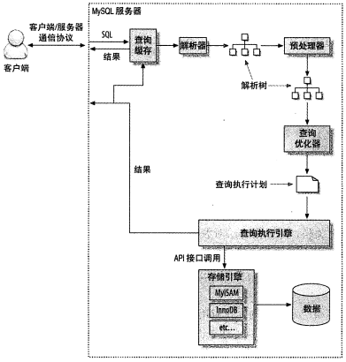
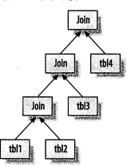

# MySQL 底层实现
## 查询处理与查询优化过程
MySQL 的查询流程大致是：

MySQL 客户端通过协议与 MySQL 服务器建立连接， 发送查询语句， 先检查查询缓存， 如果命中， 直接返回结果， 否则进行语句解析有一系列预处理， 比如检查语句是否写正确了， 然后是查询优化（比如是否使用索引扫描，如果是一个不可能的条件， 则提前终止） ， 生成查询计划， 然后查询引擎启动， 开始执行查询， 从底层存储引擎调用 API 获取数据， 最后返回给客户端。 怎么存数据、 怎么取数据， 都与存储引擎有关。

> MySQL 客户端-->MySQL 服务器-->缓存-->查询检查-->查询优化-->执行查询  

### 查询执行的基础
1. 客户端发送一条查询给服务器
2. 服务器先检查查询缓存， 如果命中了缓存， 则立刻返回存储在缓存中的结果。 否则进入下一阶段
3. 服务器进行 SQL 解析、 预处理， 再由优化器生成对应的执行计划
4. MySQL 根据优化器生成的执行计划， 调用存储引擎的 API 来执行查询
5. 将结果返回给客户端  

#### MySQL C/S 通信协议
MySQL 客户端和服务器之间的通信协议是半双工的， 这意味着， 在任何一个时刻， 要么是由服务器向客户端发送数据， 要么是由客户端向服务器发送数据， 这两个动作不能同时发生。所以， 我们无法也无需将一个消息切成小块独立来发送。

这种协议让 MySQL 通信简单快速， 但是也从很多地方限制了 MySQL， 一个明显的限制是，这意味着没法进行流量控制。一旦一端开始发送消息， 另一端要接收完整个消息才能响应它。

客户端用一个单独的数据包将查询传给服务器， 这也是为什么当查询的语句很长的时候， 参数` max_allowed_packet` 就特别重要的。 一旦客户端发送了请求， 它能做的事情就只是等待结果了。相反的， 一般服务器响应给用户的数据通常很多， 由多个数据包组成。 当服务器开始响应客户端请求时， 客户端必须完整地接收整个返回结果， 而不能简单地只取前面几条结果， 然后让服务器停止发送数据。 这种情况下， 客户端若接受完整的记过， 然后取前面几条需要的结果， 或者接收完几条结果后就粗暴地断开连接， 都不是好主意， 这也是在必要的时候一定要在查询中加上 ·`LIMIT 限制`的原因。

多数连接 MySQL 的库函数都可以获得全部结果集并缓存到内存里， 还可以逐行获取需要的数据。 默认一般是获得全部结果集并缓存到内存中。 MySQL 通常需要等所有的数据都已经发送给客户端才能释放这条查询所占用的资源， 所以接收全部结果并缓存通过可以减少服务器的压力， 让查询能够早点结束， 早点释放相应的资源。  

#### 查询缓存
在解析一个查询语句之前， 如果查询缓存是打开的， 那么 MySQL 会优先检查这个查询是否命中查询缓存中的数据。 这个检查是通过一个对大小写敏感的哈希查找实现的。 查询和缓存中的查询即使只有一个字节不同， 那也不会匹配查询结果， 这种情况下查询就会进入下一阶段的处理。

如果当前的查询恰好命中了查询缓存， 那么在返回查询结果之前 MySQL 会检查一次用户权限。 这仍然是无须解析查询 SQL 语句的， 因为在查询缓存中已经存放了当前查询需要访问的表信息。 如果权限没有问题， MySQL 会跳过所有其他阶段， 直接从缓存中拿到结果并返回给客户端。 这种情况下， 查询不会被解析， 不用生成执行计划， 不会被执行。  

#### 查询优化处理
##### 1. 语法解析器和预处理

首先， MySQL 通过对关键字将 SQL 语句进行解析， 并生成一棵对应的解析树。 MySQL 解析器将使用 MySQL 语法规则验证和解析查询。
预处理器则根据一些 MySQL 规则进一步检查解析树是否合法， 下一步预处理器会验证权限。  

##### 2. 查询优化器
现在语法数被认为是合法的了， 将由优化器将其转化为执行计划。 一条查询可以有很多种执行方式， 最后都返回相同的结果。 优化器的作用就是找到这其中最好的执行计划。

MySQL 使用基于成本的优化器， 它将尝试预测一个查询使用某种执行计划时的成本， 并选择其中成本最小的一个。

成本的最小单位是随机读取一个 4K 数据页的成本。可以通过查询当前会话的 Last_query_cost 的值来得知 MySQL 计算的当前查询的成本。

成本是根据一系列的统计信息计算得来的： 每个表或者索引的页面个数、 索引的基数（索引中不同值的数量） 、 索引和数据行的长度、 索引分布情况。 优化器在评估成本的时候并不考虑任何层面的缓存， 它假设读取任何数据都需要一次磁盘 IO。

与很多种原因会导致 MySQL 优化器选择错误的执行计划：

1. 统计信息不准确
2. 执行计划中的成本估算不等于实际执行的成本
3. MySQL 并不按照执行时间最短来选择的， 而是基于成本
4. 不考虑其他并发执行的查询
5. 并不是任何时候都是基于成本的优化， 有时也会基于一些固定的规则
6. 不会考虑不受其控制的操作的成本（存储过程、 用户自定义函数的成本）

MySQL 的查询优化器是使用了很多优化策略来生成一个最优的执行计划。 优化策略可以简- 单地分为两种， 一种是静态优化， 一种是动态优化。

- 静态优化可以直接对解析树进行分析， 并完成优化。 静态优化在第一次完成后就一直有效，即使使用不同的参数重复执行查询也不会发送变化， 可以认为这是一种编译时优化。
- 动态优化则和查询的上下文有关， 需要在每此查询的时候都重新评估， 可以认为这是运行时优化。

MySQL 能够处理的优化类型：

1. 重新定义关联表的顺序
2. 将外连接转为内连接
3. 使用等价变换规则
4. 优化 count、 min、 max
5. 预估并转化为常数表达式
6. 覆盖索引扫描
7. 子查询优化
8. 提前终止查询（比如 limit）
9. 等值传播
10. 列表 IN()的比较： MySQL 会将 IN()列表中的数据先进行排序， 然后通过二分查找的方式来确定列表中的值是否满足条件， 这是一个 O(logn)复杂度的操作， 等价地转为 OR 查询的复杂度为 O(n)。  

##### 3. 数据和索引的统计信息
在服务器层有查询优化器， 却没有保存数据和索引的统计信息。 统计信息由存储引擎实现，不同的存储引擎可能会存储不同的统计信息。
因为服务器层没有任何统计信息， 所以 MySQL 查询优化器在生成查询的执行计划时， 需要向存储引擎获取相应的统计信息。

##### 4. MySQL 如何执行关联查询

MySQL 认为任何一个查询都是一次关联， 并不仅仅是一个查询需要用到两个表匹配才叫关联。

当前 MySQL 关联执行的策略很简单， MySQL 对任何关联都执行嵌套循环关联操作。

不过不是所有的查询都可以转换成上面的形式， 比如全外连接， 这大概也是 MySQL 并不支持全外连接的原因。

##### 5. 执行计划
和很多其他关系数据库不同， MySQL 并不会生成查询字节码来执行查询。 MySQL 生成查询的一棵指令树， 然后通过存储引擎执行完成这颗指令树并返回结果。

MySQL 总是对一张表开始嵌套循环、 回溯完成所有表关联。
比如四表关联：  

##### 6. 关联查询优化器
MySQL 优化器最重要的一部分就是关联查询优化， 它决定了多个表关联时的顺序。 通过多表关联的时候， 可以有多种不同的关联顺序来获得相同的执行结果。 关联查询优化器通过评估不同顺序时的成本来选择一个代价最小的关联顺序。

比如嵌套循环关联时将小表（或者说读取的数据页较小的表） 放在最外层。

##### 7. 排序优化

当不能通过索引生成排序结果的时候， MySQL 需要自己进行排序， 如果数据量小则在内存中进行， 如果数据量大则需要使用磁盘， MySQL 将这个过程统一称为 filesort 文件排序。

如果需要排序的数据量小于排序缓冲区， MySQL 使用内存进行快速排序操作。 如果内存不够排序， 那么 MySQL 会先将数据分块， 对每个独立的块使用快速排序， 并将各个块的排序结果存放在磁盘上， 然后将各个排好序的块进行合并， 最后返回排序结果。

MySQL 有两种排序算法：

1. 两次传输排序： 读取行指针和需要排序的字段， 对其进行排序， 然后再根据排序结果读取锁需要的数据行。 缺点是会产生大量随机 IO， 数据传输成本高。
2. 单次传输排序： 先读取查询所需要的所有列， 然后再根据给定列进行排序， 最后直接返回排序结果。 缺点是会占用大量的空间。

当查询需要所有列的总长度不超过 max_length_for_sort_data 时， MySQL 使用单次传输排序。

在关联查询时如果需要排序， MySQL 会分两种情况来处理这样的文件排序。 如果 ORDER BY子句中的所有列都来自关联的第一个表， 那么 MySQL 在关联处理第一个表的时候就会进行文件排序。 如果是这样， 那么 EXPLAIN 时会显示 Extra 字段有“Using filesort”。 除此之外的其他情况， MySQL 都会先将关联的结果存放到一个临时表中， 然后在所有的关联都结束后，再进行文件排序。 此时 EXPLAIN 会显示 Extra 字段有“Using temporary； Using filesort”。 如果有 LIMIT 的话， LIMIT 也会在排序之后应用， 所以即使需要返回较少的数据， 临时表和需要排序的数据量仍然会非常大。  

#### 查询执行引擎
MySQL 的查询执行引擎会根据执行计划来完成整个查询， 执行计划是一个数据结构。

相对于查询优化阶段， 查询执行阶段不是那么复杂： MySQL 只是简单地根据执行计划给出的指令逐步执行。 在根据执行计划逐步执行的过程中， 有大量的操作需要通过调用存储引擎实现的接口来完成， 这些接口就是我们成为“handler API”的接口， 实际上， MySQL 在优化阶段就为每个表都创建了一个 handler 实例， 优化器根据这些实例的接口可以获取表的相关信息。

存储引擎接口有着非常丰富的功能， 但底层接口却只有几十个， 这些接口像搭积木一样能够完成查询的大部分操作。

#### 返回结果给客户端

查询执行的最后一个阶段是将结果返回给客户端， 即使查询不需要返回结果集给客户端，MySQL 仍然会返回这个查询的一些信息， 如该查询影响到的行数，如果查询可以被缓存， 那么 MySQL 在这个阶段也会将结果存放在查询缓存中。

MySQL 将结果集返回客户端是一个增量、 逐步返回的过程。 这样处理有两个好处： 服务器无需存储太多的结果， 也不会因为要返回太多结果而消耗太多内存。 另外这样的处理也让MySQL 客户端第一时间获得返回的结果。

结果集中的每一行都会以一个满足 MySQL C/S 通信协议的封包发送， 再通过 TCP 协议进行传输， 在传输过程中， 可能对 MySQL 的封包进行缓存然后批量传输。  

### MySQL 查询优化器的局限性
#### 关联子查询

MySQL 的子查询实现的非常糟糕， 最糟糕的一类查询是 WHERE 中包含 IN()的子查询。  

## 存储实现
每个数据库对应一个子目录， 每张表对应子目录下的一个与表同名的`.frm `文件， 它保存了表的定义。

如果是 MyIASM 引擎， 那么表数据存放在`.myd `文件， 表索引存放在`.myi `文件。

如果是 InnoDB 引擎， 那么表数据和索引文件都放在`.ibd `文件。

## InnoDB 简介

从 MySQL5.5.8 开始， InnoDB 存储引擎是默认的存储引擎。 InnoDB 存储引擎将数据放在一个逻辑的表空间中， 这个表空间就像黑盒一样由 InnoDB 存储引擎自身进行管理。

InnoDB 通过 MVCC 来获得高并发性， 并且实现了 SQL 标准的四种隔离级别， 默认为`可重复读`。 同时， 使用一种被称为 `next-key lock `的策略来避免幻读。 除此之外， InnoDB 存储引擎还提供了插入缓冲、 两次写、 自适应哈希索引、 预读等高性能和高可用的概念。

对于表中数据的存储， InnoDB 存储引擎采用了聚集的方式， 因此每张表的存储都是按主键的顺序进行存放。 如果没有显式地在表定义时指定主键， InnoDB 存储引擎会为每一行生成一个 6 字节的` ROWID`， 并以此作为主键。  