# 一、什么是Redis？
Redis 是一个使用 C 语言写成的，开源的 **key-value** 数据库。和Memcached类似，它支持存储的value类型相对更多，包括**string(字符串)、list(链表)、set(集合)、zset(sorted set –有序集合)和hash（哈希类型）**。这些数据类型都支持**push/pop、add/remove及取交集并集和差集及更丰富的操作**，而且这些操作都是**原子性**的。在此基础上，redis支持各种不同方式的排序。与memcached一样，为了保证效率，数据都是缓存在内存中。区别的是redis会周期性的把更新的数据**写入磁盘或者把修改操作写入追加的记录文件**，并且在此基础上实现了**master-slave(主从)同步**。目前，Vmware在资助着redis项目的开发和维护。

# 二、[Redis应用场景](http://blog.720ui.com/2017/redis_core_use/)
1，会话缓存（最常用）
2，消息队列，比如支付，活动排行榜或计数
4，发布，订阅消息（消息通知）
5，商品列表，评论列表等
- String：验证码、PV、缓存
- List：最新列表、关注列表、消息队列
- Set：点赞点踩、抽奖、消息已读、共同好友
- SortedSet：排行榜、优先队列
- Hash：不定长属性数的对象

# 三、Redis优缺点
1. 使用redis有哪些好处？
(1) **速度快**，因为数据存在内存中，类似于HashMap，HashMap的优势就是查找和操作的时间复杂度都是O(1)
(2)支持**丰富数据类型**，支持string，list，set，sorted set，hash
(3) 支持**事务**，操作都是原子性，所谓的原子性就是对数据的更改要么全部执行，要么全部不执行
(4) **丰富的特性**：可用于缓存，消息，按key设置过期时间，过期后将会自动删除
(5)**持久化存储**：RDB、AOF
2. 经常遇到的问题？
(1)缓存和数据库双写一致性问题
(2)缓存雪崩问题
(3)缓存击穿问题
(4)缓存的并发竞争问题

# [四、Redis安装](https://juejin.im/post/5ad54d76f265da23970759d3)
## 4.1 单节点安装
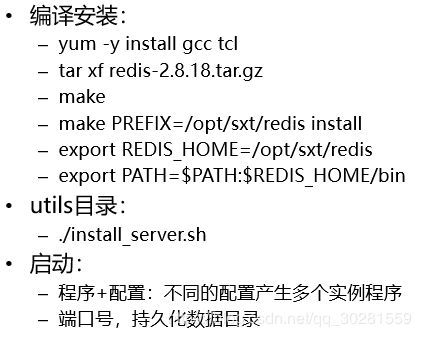
**一个服务器可以运行多个Redis实例，通过端口号区别；默认：6379**
**一个Redis实例可以有16个数据库（0-15）**：`redis-cli -n -2`  表示使用2号数据库

## 4.2 使用客户端进行操作
`redis-cli`进入客户端
`help @set`set类型的帮助
`help set`set命令用法
`GETBIT k1 7 1`位操作
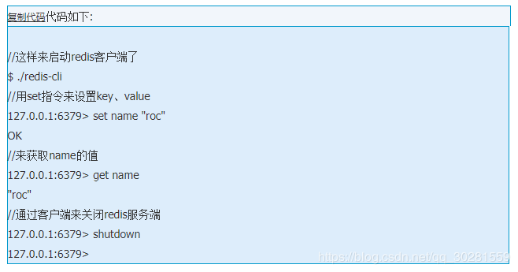

# 五、数据类型
Redis一共支持五种数据类：**string（字符串），hash（哈希），list（列表），set（集合）和zset（sorted set有序集合）**。

而关于key，有几个点要：
1. key不要太长，尽量不要超过1024字节，这不仅消耗内存，而且会降低查找的效率；
2. key也不要太短，太短的话，key的可读性会降低；
3. 在一个项目中，key最好使用统一的命名模式，例如user:10000:passwd。
## 5.1 String
它是redis的最基本的数据类型，一个键对应一个值，需要注意是一个键值最大存储512MB。
常用命令: `set, get, decr, incr, mget` 等。
String数据结构是简单的key-value类型，value其实不仅可以是String，也可以是数字。 
- 常规key-value缓存应用； 
- 常规计数：微博数，粉丝数等。
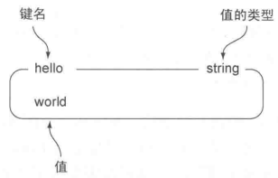
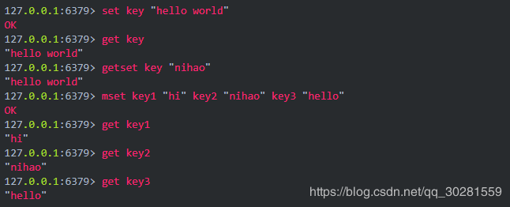
在遇到数值操作时，redis会将字符串类型转换成数值。
由于**INCR等指令本身就具有原子操作的特性**，所以我们完全可以利用redis的INCR、INCRBY、DECR、DECRBY等指令来实现原子计数的效果，假如，在某种场景下有3个客户端同时读取了mynum的值（值为2），然后对其同时进行了加1的操作，那么，最后mynum的值一定是5。不少网站都利用redis的这个特性来实现业务上的统计计数需求。
## 5.2 hash（哈希）
常用命令： `hget,hset,hgetall` 等。
Hash是一个string类型的field和value的映射表，hash特别适合用于存储对象。
- 我们可以Hash数据结构来存储用户信息，商品信息等等。
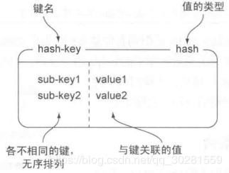
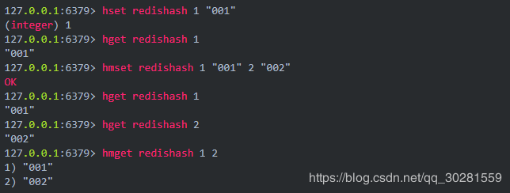
## 5.3 list列表
常用命令: `lpush,rpush,lpop,rpop,lrange`等
list就是**链表**，Redis list的应用场景非常多，也是Redis最重要的数据结构之一
- 微博的关注列表，粉丝列表，最新消息排行等功能都可以用Redis的list结构来实现。
- 可以利用lists来实现一个消息队列，而且可以确保先后顺序，不必像MySQL那样还需要通过ORDER BY来进行排序。
- 利用LRANGE还可以很方便的实现分页的功能。
- 在博客系统中，每片博文的评论也可以存入一个单独的list中。
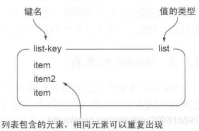
Redis list的实现为一个**双向链表**，即可以支持反向查找和遍历，更方便操作，不过带来了部分额外的内存开销。
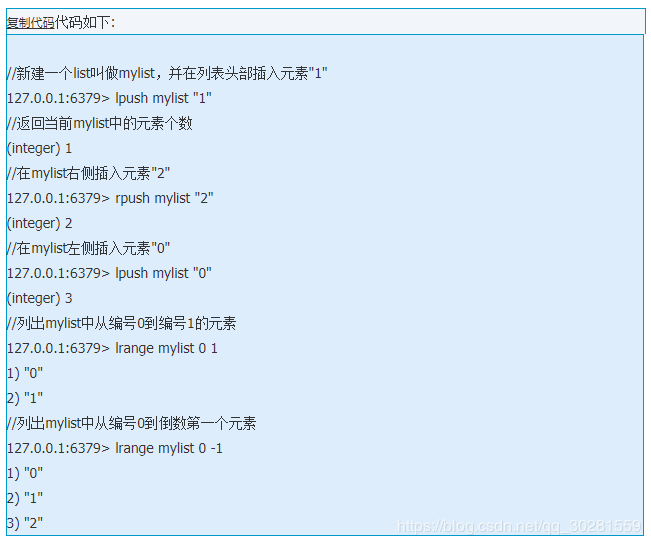
## 4.4 Set
常用命令： `sadd,spop,smembers,sunion` 等
set对外提供的功能与list类似是一个列表的功能，特殊之处在于set是可以**自动排重**的。 
Redis 中集合是通过**哈希表实现的**，所以添加，删除，查找的复杂度都是 **O(1)**。
集合中最大的成员数为 232 - 1 (4294967295, 每个集合可存储40多亿个成员)。
当你需要存储一个列表数据，又不希望出现重复数据时，set是一个很好的选择，并且set提供了判断某个成员是否在一个set集合内的重要接口，这个也是list所不能提供的。
- 在微博应用中，可以将一个用户所有的关注人存在一个集合中，将其所有粉丝存在一个集合。
- Redis可以非常方便的实现如共同关注、共同喜好、二度好友等功能。
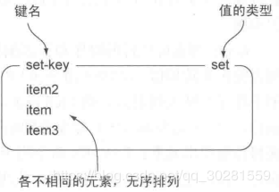
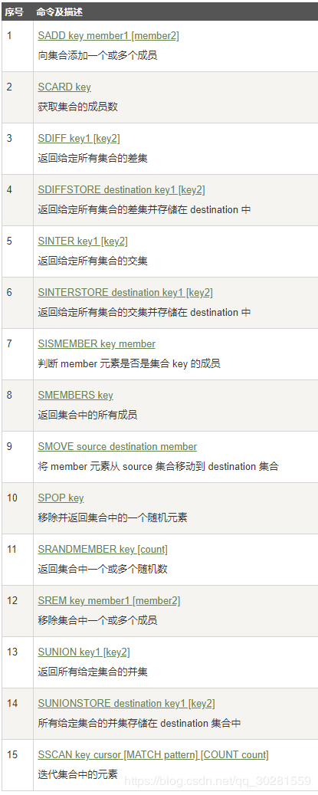
## 5.5 有序集合(sorted set)
常用命令： `zadd,zrange,zrem,zcard`等
Redis 有序集合和集合一样也是**string类型元素的集合**,且不允许重复的成员。
不同的是每个元素都会关联一个**double类型的分数**。redis正是通过分数来为集合中的成员进行从小到大的排序。
有序集合的成员是唯一的,但**分数(score)却可以重复**。
集合是通过**哈希表实现**的，所以添加，删除，查找的复杂度都是O(1)。 集合中最大的成员数为 232 - 1 (4294967295, 每个集合可存储40多亿个成员)。
- 实时排行信息包含直播间在线用户列表，各种礼物排行榜，弹幕消息（可以理解为按消息维度的消息排行榜）等信息
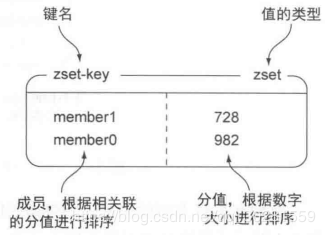
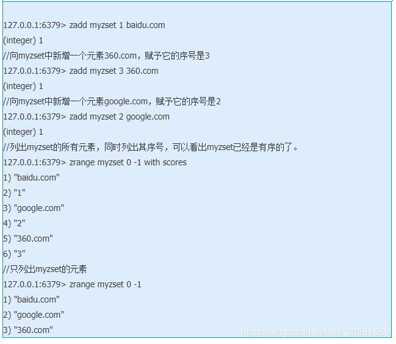
# 六、redis的发布与订阅
redis的发布与订阅（发布/订阅）是它的一种消息通信模式，一方发送信息，一方接收信息。
Redis 客户端可以订阅任意数量的频道。
下图是三个客户端同时订阅同一个频道
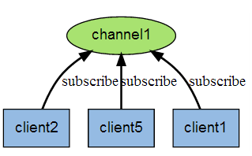
下图是有新信息发送给频道1时，就会将消息发送给订阅它的三个客户端
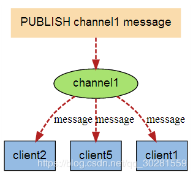
# 七、持久化
redis提供了两种持久化的方式，分别是**RDB（Redis DataBase）和AOF（Append Only File）**。
- 【全量】RDB 持久化，是指在指定的时间间隔内将内存中的`数据集`快照写入磁盘。实际操作过程是，fork 一个子进程，先将数据集写入临时文件，写入成功后，再替换之前的文件，用二进制压缩存储。
- 【增量】AOF持久化，以日志的形式记录服务器所处理的每一个写、删除操作`指令`，查询操作不会记录，以文本的方式记录，可以打开文件看到详细的操作记录。在下次redis重新启动时，只要把这些写指令从前到后再重复执行一遍，就可以实现数据恢复了。

其实RDB和AOF两种方式也可以同时使用，在这种情况下，如果redis重启的话，则会优先采用AOF方式来进行数据恢复，这是因为AOF方式的数据恢复完整度更高。
如果你没有数据持久化的需求，也完全可以关闭RDB和AOF方式，这样的话，redis将变成一个纯内存数据库，就像memcache一样。
## 7.1 RDB方式
RDB方式，是将redis某一时刻的数据持久化到磁盘中，是一种快照式的持久化方法。两个命令`SAVE、BGSAVE`。
 - save：阻塞 
 - bgsave：子进程并发进行
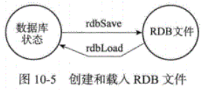
另外值得一提的是，因为AOF文件的更新频率通常比RDB文件的更新频率高，所以： 
 - 如果服务器开启了AOF持久化功能，那么服务器会优先使用AOF文件来还原数据 库状态。
 - 只有在AOF持久化功能处于关闭状态时，服务器才会使用RDB文件来还原数据库状态。
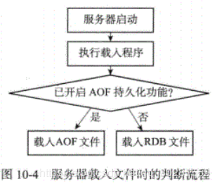
redis在进行数据持久化的过程中，会先将数据写入到一个临时文件中，待持久化过程都结束了，才会用这个临时文件替换上次持久化好的文件。正是这种特性，让我们可以随时来进行备份，因为快照文件总是完整可用的。

对于bgsave方式，**redis会单独创建（fork）一个子进程来进行持久化，而主进程是不会进行任何IO操作的**，这样就确保了redis极高的性能。**（copy on write  父子进程，只保存引用）**

如果需要进行大规模数据的恢复，且对于数据恢复的完整性不是非常敏感，那RDB方式要比AOF方式更加的高效。

虽然RDB有不少优点，但它的缺点也是不容忽视的。如果你对数据的完整性非常敏感，那么RDB方式就不太适合你，因为即使你每5分钟都持久化一次，当redis故障时，仍然会有近5分钟的数据丢失
默认的快照保存配置：
  -  save 900 1 #900 秒内如果超过 1 个 key 被修改，则发起快照保存
  -  save 300 10 #300 秒内容如超过 10 个 key 被修改，则发起快照保存
  -  save 60 10000

**详细的快照保存过程：**
1. redis 调用 **fork**,现在有了子进程和父进程。
2. 父进程继续处理 client 请求，子进程负责将内存内容写入到临时文件。由于 os 的实时复制机制**（ copy on write)**父子进程会共享相同的物理页面，当父进程处理写请求时 os 会为父进程要修改的页面创建副本，而不是写共享的页面。所以子进程地址空间内的数据是 fork时刻整个数据库的一个快照。
3. 当子进程将快照写入临时文件完毕后，用临时文件替换原来的快照文件，然后子进程退出。client 也可以使用 save 或者 bgsave 命令通知 redis **做一次快照持久化**。 save 操作是在主线程中保存快照的，由于 redis 是用一个主线程来处理所有 client 的请求，这种方式会阻塞所有client 请求。所以不推荐使用。另一点需要注意的是，**每次快照持久化都是将内存数据完整写入到磁盘一次，并不是增量的只同步变更数据。**如果数据量大的话，而且写操作比较多，必然会引起大量的磁盘 io 操作，可能会严重影响性能。

### **RDB 优缺点**
① 优点
- 灵活设置备份频率和周期。你可能打算每个小时归档一次最近 24 小时的数据，同时还要每天归档一次最近 30 天的数据。通过这样的备份策略，一旦系统出现灾难性故障，我们可以非常容易的进行恢复。
- 非常适合冷备份，对于灾难恢复而言，RDB 是非常不错的选择。因为我们可以非常轻松的将一个单独的文件压缩后再转移到其它存储介质上。推荐，可以将这种完整的数据文件发送到一些远程的安全存储上去，比如说 Amazon 的 S3 云服务上去，在国内可以是阿里云的 OSS 分布式存储上。
- 性能最大化。对于 Redis 的服务进程而言，在开始持久化时，它唯一需要做的只是 fork 出子进程，之后再由子进程完成这些持久化的工作，这样就可以极大的避免服务进程执行 IO 操作了。也就是说，RDB 对 Redis 对外提供的读写服务，影响非常小，可以让 Redis 保持高性能。
- 恢复更快。相比于 AOF 机制，RDB 的恢复速度更更快，更适合恢复数据，特别是在数据集非常大的情况。

② 缺点
- 如果你想保证数据的高可用性，即最大限度的避免数据丢失，那么 RDB 将不是一个很好的选择。因为系统一旦在定时持久化之前出现宕机现象，此前没有来得及写入磁盘的数据都将丢失。
所以，RDB 实际场景下，需要和 AOF 一起使用。
- 由于 RDB 是通过 fork 子进程来协助完成数据持久化工作的，因此，如果当数据集较大时，可能会导致整个服务器停止服务几百毫秒，甚至是 1 秒钟。
所以，RDB 建议在业务低估，例如在半夜执行。
## 7.2 AOF 方式
**append only file** 采用追加方式记录所有的**写操作命令**

 由于快照方式是在一定间隔时间做一次的，所以如果 redis 意外 down 掉的话，就会丢失最后一次快照后的所有修改。如果应用要求不能丢失任何修改的话，可以采用 aof 持久化方式。 Append-only file:aof 比快照方式有更好的持久化性，是由于在使用 aof 持久化方式时,redis 会**将每一个收到的写命令都通过 write 函数追加到文件中(默认是 appendonly.aof)**。当 redis 重启时会通过**重新执行文件中保存的写命令**来在内存中重建整个数据库的内容。当然由于 os 会在内核中缓存 write 做的修改，所以可能不是立即写到磁盘上。这样 aof 方式的持久化也还是有可能会丢失部分修改。不过我们可以通过配置文件告诉 redis 我们想要通过 fsync 函数强制 os 写入到磁盘的时机。有三种方式如下（默认是：每秒 fsync 一次）

    appendonly yes //启用 aof 持久化方式
    appendfsync always //收到写命令就立即写入磁盘，最慢，但是保证完全的持久化
    appendfsync everysec //每秒钟写入磁盘一次，在性能和持久化方面做了很好的折中
    appendfsync no //完全依赖 os，性能最好,持久化没保证

aof 的方式也同时带来了另一个问题。持久化文件会变的越来越大。例如我们调用 incr test命令 100 次，文件中必须保存全部的 100 条命令，其实有 99 条都是多余的。因为要恢复数据库的状态其实文件中保存一条 set test 100 就够了。为了压缩 aof 的持久化文件。 redis 提供了 `bgrewriteaof` 命令。收到此命令 redis 将使用与快照类似的方式将内存中的数据以命令的方式保存到临时文件中，最后替换原来的文件。
### 7.2.1写入机制
执行<font color=red>系统调用write函数</font>系统调用write函数，将一些内容写入到某个文件里面时，为了提高效率，系统通常不会直接将内容写入硬盘里面，而是先将内容放入一个**AOF内存缓冲区（buffer）**里面，等到缓冲区被填满，或者用户执行`fsync调用和fdatasync调用`时才将储存在缓冲区里的内容真正的写入到硬盘里，未写入磁盘之前，数据可能会丢失
### 7.2.2AOF重写机制
AOF文件过大
合并重复的操作，创建一个新的AOF文件来替代现有的AOF文件，新旧两个 AOF文件所保存的数据库状态相同，但新AOF文件不会包含任何浪费空间的冗余命令

AOF重写实现原理：首先从数据库中读取键现在的值，然后用一条命令去记录键值对， 代替之前记录这个键值对的多条命令，这就是AOF重写功能的实现原理。

#### 重写过程
- fork一个子进程负责重写AOF文件
- 子进程会创建一个临时文件写入AOF信息
- 父进程会开辟一个内存缓冲区接收新的写命令
- 子进程重写完成后，父进程会获得一个信号，将父进程接收到的新的写操作由子进程写入到临时文件中
- 新文件替代旧文件

**在子进程中执行重写目的：**
- 子进程进行AOF重写期间，服务器进程（父进程）可以继续处理命令请求。
- 子进程带有服务器进程的数据副本，使用子进程而不是线程，可以在避免使用锁的 情况下，保证数据的安全性。
- 不过，使用子进程也有一个问题需要解决，因为子进程在进行AOF 重写期间，服务器 进程还需要继续处理命令请求，而新的命令可能会对现有的数据库状态进行修改，从而使得 服务器当前的数据库状态和重写后的AOF文件所保存的数据库状态不一致。
因此引入重写缓冲区
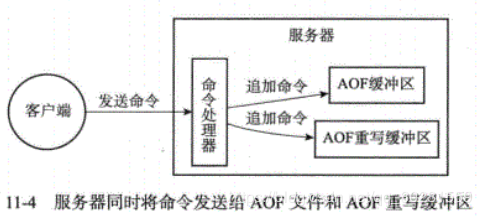
1. AOF缓冲区的内容会定期被写入和同步到AOF文件，对现有AOF文件的处理工作 会如常进行
2. 从创建子进程开始，服务器执行的所有写命令都会被记录到AOF重写缓冲区里面。

当子进程完成AOF重写工作之后，它会向父进程发送一个信号，父进程在接到该信号 之后，会调用一个信号处理函数，并执行以下工作： 
    1）将AOF重写缓冲区中的所有内容写入到新AOF文件中，这时新AOF文件所保存的 数据库状态将和服务器当前的数据库状态一致。
    2）对新的AOF文件进行改名，原子地（atomic)覆盖现有的AOF文件，完成新旧两 个AOF 文件的替换。
    这个信号处理函数执行完毕之后，父进程就可以继续像往常一样接受命令请求了。

>在整个AOF后台重写过程中，只有信号处理函数执行时会对服务器进程（父进程）造 成阻塞，在其他时候，AOF后台重写都不会阻塞父进程，这将AOF重写对服务器性能造成 的影响降到了最低。


注：如果写入操作的时候出现故障导致命令写半截，可以使用redis-check-aof工具修复
- 优点
写入机制，默认fysnc每秒执行，性能很好不阻塞服务，最多丢失一秒的数据
重写机制，优化AOF文件
如果误操作了（FLUSHALL等），只要AOF未被重写，停止服务移除AOF文件尾部FLUSHALL命令，重启Redis，可以将数据集恢复到 FLUSHALL 执行之前的状态
- 缺点
相同数据集，AOF文件体积较RDB大了很多
恢复数据库速度比RDB慢（文本，命令重演）

AOF方式的另一个好处，我们通过一个“场景再现”来说明。某同学在操作redis时，不小心执行了FLUSHALL，导致redis内存中的数据全部被清空了，这是很悲剧的事情。不过这也不是世界末日，只要redis配置了AOF持久化方式，且AOF文件还没有被重写（rewrite），我们就可以用最快的速度暂停redis并编辑AOF文件，将最后一行的FLUSHALL命令删除，然后重启redis，就可以恢复redis的所有数据到FLUSHALL之前的状态了。是不是很神奇，这就是AOF持久化方式的好处之一。但是如果AOF文件已经被重写了，那就无法通过这种方法来恢复数据了。

### 7.2.3 Redis读取AOF文件并还原数据库状态
详细步骤如下：
 1）创建一个不带网络连接的伪客户端（fake client)：因为Redis的命令只能在客户端 上下文中执行，而载入AOF文件时所使用的命令直接来源于AOF文件而不是网络连接，所 以服务器使用了一个没有网络连接的伪客户 端来执行AOF文件保存的写命令，伪客户端服务器启动载入程序 执行命令的效果和带网络连接的客户端执行命令的效果完全一样
2）从AOF文件中分析并读取出一条写 命令。
3）使用伪客户端执行被读出的写命令。
4）一直执行步骤2和步骤3，直到AOF 文件中的所有写命令都被处理完毕为止。
当完成以上步骤之后，AOF文件所保 存的数据库状态就会被完整地还原出来
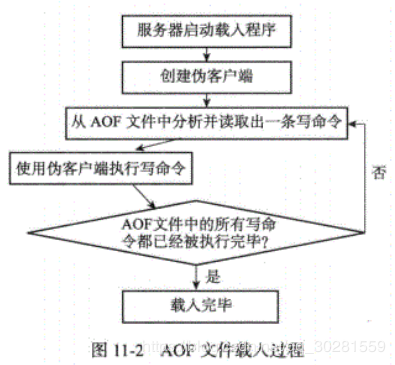

### **AOF 优缺点**
① 优点
- 该机制可以带来更高的数据安全性，即数据持久性。Redis 中提供了 3 种同步策略，即`每秒同步`、`每修改(执行一个命令)同步`和`不同步`。
	- 事实上，每秒同步也是异步完成的，其效率也是非常高的，所差的是一旦系统出现宕机现象，那么这一秒钟之内修改的数据将会丢失。
	- 而每修改同步，我们可以将其视为同步持久化，即每次发生的数据变化都会被立即记录到磁盘中。可以预见，这种方式在效率上是最低的。
- 由于该机制对日志文件的写入操作采用的是 append 模式，因此在写入过程中即使出现宕机现象，也不会破坏日志文件中已经存在的内容。
	- 因为以 append-only 模式写入，所以没有任何磁盘寻址的开销，写入性能非常高。
	- 另外，如果我们本次操作只是写入了一半数据就出现了系统崩溃问题，不用担心，在 Redis 下一次启动之前，我们可以通过 redis-check-aof 工具来帮助我们解决数据一致性的问题。
- 如果日志过大，Redis可以自动启用 rewrite 机制。即使出现后台重写操作，也不会影响客户端的读写。因为在 rewrite log 的时候，会对其中的指令进行压缩，创建出一份需要恢复数据的最小日志出来。再创建新日志文件的时候，老的日志文件还是照常写入。当新的 merge 后的日志文件 ready 的时候，再交换新老日志文件即可。
- AOF 包含一个格式清晰、易于理解的日志文件用于记录所有的修改操作。事实上，我们也可以通过该文件完成数据的重建。

② 缺点
- 对于相同数量的数据集而言，AOF 文件通常要大于 RDB 文件。RDB 在恢复大数据集时的速度比 AOF 的恢复速度要快。
根据同步策略的不同，AOF 在运行效率上往往会慢于 RDB 。总之，每秒同步策略的效率是比较高的，同步禁用策略的效率和 RDB 一样高效。
- 以前 AOF 发生过 bug ，就是通过 AOF 记录的日志，进行数据恢复的时候，没有恢复一模一样的数据出来。所以说，类似 AOF 这种较为复杂的基于命令日志/merge/回放的方式，比基于 RDB 每次持久化一份完整的数据快照文件的方式，更加脆弱一些，容易有 bug 。不过 AOF 就是为了避免 rewrite 过程导致的 bug ，因此每次 rewrite 并不是基于旧的指令日志进行 merge 的，而是基于当时内存中的数据进行指令的重新构建，这样健壮性会好很多。

##  如何选择RDB与AOF 
不要仅仅使用 RDB，因为那样会导致你丢失很多数据
也不要仅仅使用 AOF，因为那样有两个问题，第一，你通过 AOF 做冷备，没有 RDB 做冷备，来的恢复速度更快; 第二，RDB 每次简单粗暴生成数据快照，更加健壮，可以避免 AOF 这种复杂的备份和恢复机制的 bug 。
Redis 支持同时开启开启两种持久化方式，我们可以综合使用 AOF 和 RDB 两种持久化机制，用 AOF 来保证数据不丢失，作为数据恢复的第一选择; 用 RDB 来做不同程度的冷备，在 AOF 文件都丢失或损坏不可用的时候，还可以使用 RDB 来进行快速的数据恢复。
如果同时使用 RDB 和 AOF 两种持久化机制，那么在 Redis 重启的时候，会使用 AOF 来重新构建数据，因为 AOF 中的数据更加完整。
> 一般来说， 如果想达到足以媲美 PostgreSQL 的数据安全性， 你应该同时使用两种持久化功能。如果你非常关心你的数据，但仍然可以承受数分钟以内的数据丢失，那么你可以只使用 RDB 持久化。
>
> 有很多用户都只使用 AOF 持久化，但并不推荐这种方式：因为定时生成 RDB 快照（snapshot）非常便于进行数据库备份， 并且 RDB恢复数据集的速度也要比AOF恢复的速度要快，除此之外，使用 RDB 还可以避免之前提到的 AOF 程序的 bug。

## 面试
- bgsave 做镜像全量持久化，AOF 做增量持久化。因为 bgsave 会耗费较长时间，`不够实时`，在停机的时候会导致大量丢失数据，所以需要 AOF 来配合使用。在 Redis 实例重启时，会使用 bgsave 持久化文件重新构建内存，再使用 AOF 重放近期的操作指令来实现完整恢复重启之前的状态。
- 如果突然机器掉电会怎样？取决于 AOF 日志 sync 属性的配置，如果不要求性能，在每条写指令时都 sync 一下磁盘，就不会丢失数据。但是在高性能的要求下每次都 sync 是不现实的，一般都使用定时 sync ，比如 1 秒 1 次，这个时候最多就会丢失 1 秒的数据。
- bgsave 的原理是什么？你给出两个词汇就可以了，`fork 和 cow` 。fork 是指 Redis 通过创建子进程来进行 bgsave 操作。cow 指的是 copy on write ，子进程创建后，父子进程共享数据段，父进程继续提供读写服务，写脏的页面数据会逐渐和子进程分离开来。

# 八、Redis集群
## 什么是 [Redis 主从同步](https://github.com/doocs/advanced-java/blob/master/docs/high-concurrency/redis-master-slave.md)？
Redis 的主从同步(replication)机制，允许 Slave 从 Master 那里，通过网络传输拷贝到完整的数据备份，从而达到主从机制。

    127.0.0.1:12345>SLAVEOF 127.0.0.1 6379  那么服务器127.0.0.1：12345将成为127.0.0.1：6379的从服务器 

主数据库可以进行读写操作，当发生写操作的时候自动将数据同步到从数据库，而从数据库一般是只读的，并接收主数据库同步过来的数据。
一个主数据库可以有多个从数据库，而一个从数据库只能有一个主数据库。
通过 Redis 的复制功，能可以很好的实现数据库的读写分离，提高服务器的负载能力。主数据库主要进行写操作，而从数据库负责读操作。

Redis 主从同步，是很多 Redis 集群方案的基础，例如 Redis Sentinel、Redis Cluster 等等。
### 旧版本复制实现
#### 同步
从服务器对主服务器的同步操作需要通过向主服务器发送SYNC命令来完成，以下是 SYNC命令的执行步骤： 
1）从服务器向主服务器发送SYNC命令。
2）收到SYNC命令的主服务器执行BGSAVE命令，在后台生成一个**RDB文件**，并使 用一个**缓冲区记录**从现在开始执行的所有写命令。
3）当主服务器的BGSAVE命令执行完毕时，主服务器会将BGSAVE命令生成的RDB 文件发送给从服务器，从服务器接收并载入这个RDB文件，将自己的数据库状态更新至主 服务器执行BGSAVE命令时的数据库状态。
4）主服务器将记录在缓冲区里面的所有写命令发送给从服务器，从服务器执行这些写 命令，将自己的数据库状态更新至主服务器数据库当前所处的状态。
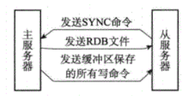
#### 命令传播
在同步操作执行完毕之后，主从服务器两者的数据库将达到一致状态，但这种一致并不 是一成不变的，每当主服务器执行客户端发送的写命令时，主服务器的数据库就有可能会被 修改，并导致主从服务器状态不再一致。因此需要使用命令传播将后续写命令传递给从服务器。
### 新版本复制实现
旧版本断线重新复制时候需要开启bgsave进行全量复制，比较浪费
新版本使用PSYNC命令代替SYNC命令来执行复制时的同步操作。
 PSYNC命令具有完整重同步（full resynchronization)和部分重同步（partial resynchronization) 两种模式： 
 - 其中完整重同步用于处理初次复制情况：完整重同步的执行步骤和SYNC命令的执 行步骤基本一样，它们都是通过让主服务器创建并发送RDB文件，以及向从服务器 发送保存在缓冲区里面的写命令来进行同步。
- 而部分重同步则用于处理断线后重复制情况：当从服务器在断线后重新连接主服务 器时，如果条件允许，主服务器可以将主从服务器连接断开期间执行的写命令发送 给丛服务器，从服务器点要接收并执行这些写命令，就可以将数据库更新至主服务 器当前所处的状态。
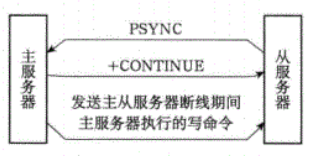
部分重同步功能由以下三个部分构成：
1. 主服务器的复制偏移量（replication offset）和从服务器的复制偏移量。
2. 主服务器的复制积压缓冲区（replication backlog)。
3. 服务器的运行ID（run ID）。

**复制偏移量**
通过对比主从服务器的复制偏移量，程序可以很容易地知道主从服务器是否处于一致状态：
- 如果主从服务器处于一致状态，那么主从服务器两者的偏移量总是相同的。
- 相反，如果主从服务器两者的偏移量并不相同，那么说明主从服务器并未处于一致 状态。

**复制积压缓冲区** 
复制积压缓冲区是由主服务器维护的一个固定长度（fixed-size)先进先出（FIFO）队 列，默认大小为1MB。
当主服务器进行命令传播时，它不仅会将写命令发送给所有从服务器，还会将写命令入 复制积压缓冲区。因此，主服务器的复制积压缓冲区里面会保存着一部分最近传播的写命令，并且复制积 压缓冲区会为队列中的每个字节记录相应的复制偏移量

当从服务器重新连上主服务器时，从服务器会通过PSYVC命令将自己的复制偏移 offset发送给主服务器，主服务器会根据这个复制偏移量来决定对从服务器执行何种同步 操作：
- 如果offset偏移量之后的数据（也即是偏移量offset+1开始的数据）仍然存在 于复制积压缓冲区里面，那么主服务器将对从服务器执行部分重同步操作。
- 相反，如果offset偏移量之后的数据已经不存在于复制积压缓冲区，那么主服务 器将对从服务器执行完整重同步操作。

 **服务器的运行ID**
 每个Redis服务器，不论主服务器还是从服务，都会有自己的运行ID。
当从服务器断线并重新连上一个主服务器时，从服务器将问当前连接的主服务器发送之 前保存的运行ID： 
- 如果从服务器保存的运行ID和当前连接的主服务器的运行ID相同，那么说明从服 务器断线之前复制的就是当前连接的这个主服务器主服务器可以继结坐试热行部 分重同步操作。
- 相反地，如果从服务器保存的运行ID和当前连接的主服务器的运行ID并不相同， 那么说明从服务器断线之前复制的主服务器并不是当前连接的这个主服务器，主服 务器将对从服务器执行完整重同步操作。
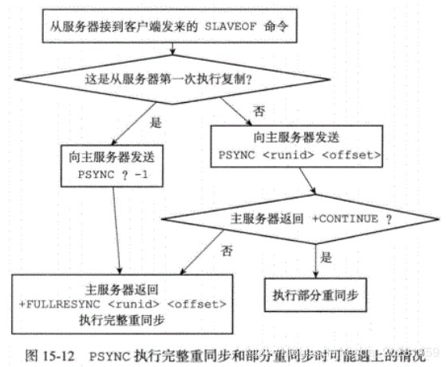
## 分类1：主从复制 Replication
**镜像：增删改在主节点（主<退化到单节点>）；查询负载到从节点**
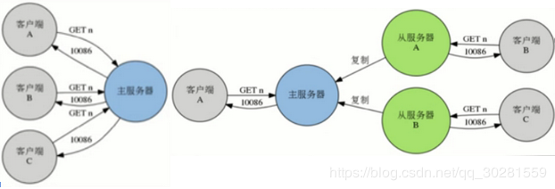
- Master的高可用：**Sentinel（哨兵）：如果发现master宕机，立马将一个从节点变成master**
- 一个Redis服务可以有多个该服务的复制品，这个Redis服务称为**Master**，其他复制品称为**Slaves**
- 只要网络连接正常，Master会一直将自己的数据更新同步给Slaves，保持主从同步
- 只有Master可以执行写命令，Slaves只能执行读命令
### 8.1.2主从复制创建
- `redis-server --slaveof <master-ip> <master-port>`，配置当前服务称为某Redis服务的Slave
	- `redis-server --port 6380` 以主身份启动
	- `redis-server --port 6380 --slaveof 127.0.0.1 6379`	以从身份启动
- `SLAVEOF host port`命令，将当前服务器状态从Master修改为别的服务器的Slave
	- `redis > SLAVEOF 192.168.1.1 6379`，将服务器转换为Slave
	- `redis > SLAVEOF NO ONE` ，将服务器重新恢复到Master，不会丢弃已同步数据
- 配置方式：启动时，服务器读取配置文件，并自动成为指定服务器的从服务器
	- `slaveof <masterip> <masterport>`
	- `slaveof 127.0.0.1 6379`
### 8.1.2哨兵
**高可用 Sentinel**
- 官方提供的高可用方案，可以用它管理多个Redis服务实例
- 编译后产生redis-sentinel程序文件
- Redis Sentinel是一个分布式系统，可以在一个架构中运行多个Sentinel进程

**监控 Monitoring**
- Sentinel会不断检查Master和Slaves是否正常
- 每一个Sentinel可以监控**任意多个Master和该Master下的Slaves**

**Sentinel网络**
- 监控同一个Master的Sentinel会自动连接，组成一个分布式的Sentinel网络，互相通信并交换彼此关于被监视服务器的信息，将主服务器判断为下线失效至少需要2个Sentinel同意，如果多数Sentinel同意才会执行故障转移


**Sentinel 配置文件**
- 至少包含一个监控配置选项，用于指定被监控Master的相关信息
- `Sentinel monitor<name><ip><port><quorum>`，例如`sentinel monitor mymaster 127.0.0.1 6379 2`
监视mymaster的主服务器，服务器ip，端口，将这个主服务器判断为下线失效至少需要2个Sentinel同意，如果多数Sentinel同意才会执行故障转移
- Sentinel会根据Master的配置自动发现Master的Slaves
- Sentinel默认端口号为26379

**Sentinel 总结**
- 主从复制，解决了读请求的分担，从节点下线，会使得读请求能力有所下降
- Master只有一个，写请求单点问题
- Sentinel会在Master下线后自动执行Failover操作，提升一台Slave为Master，并让其他Slaves重新成为新Master的Slaves
- 主从复制+哨兵Sentinel只解决了读性能和高可用问题，但是没有解决写性能问题
### [Redis 哨兵集群实现高可用](https://github.com/doocs/advanced-java/blob/master/docs/high-concurrency/redis-sentinel.md)

## [分类2：分布式Redis集群](http://redis.cn/topics/cluster-tutorial.html)         
[redis 集群模式的工作原理](https://github.com/doocs/advanced-java/blob/master/docs/high-concurrency/redis-cluster.md)
**twemproxy：切片	集群 Cluster**
自动将数据进行分片，每个 master 上放一部分数据
提供内置的高可用支持，部分 master 不可用时，还是可以继续工作的
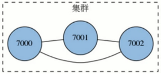
- 由多个Redis服务器组成的分布式网络服务集群
- 每一个Redis服务器称为节点Node，节点之间会互相通信。两两相连
- Redis集群无中心节点
- 每个节点既是主节点，又是哨兵

### 8.2.1 Redis集群分片
- 集群将整个数据库分为16384个**槽位slot**，所有key数据储存在这些slot中的一个，key的槽位计算公式为slot_number=crc16(key)%16384，其中crc16为16位的循环冗余校验和函数
- 集群中的每个主节点都可以处理0个至16383个槽，当16384个槽**都有某个节点在负责处理时，集群进入上线状态**，并开始处理客户端发送的数据命令请求
### 8.2.2 Redis集群节点复制
- Redis集群的**每个节点**都有两种角色可选：**主节点master node、从节点slave node**。其中主节点用于存储数据，而从节点则是某个主节点的复制品
- 当用户需要处理更多读请求的时候，**添加从节点可以扩展系统的读性能**，因为Redis集群重用了单机Redis复制特性的代码，所以集群的复制行为和我们之前介绍的单机复制特性的行为是完全一样的

### 8.2.3 Redis集群故障转移
- Redis集群的主节点内置了类似Redis Sentinel的节点故障检测和自动故障转移功能，当集群中的某个主节点下线时，集群中的其他在线主节点会注意到这一点，并对已下线的主节点进行故障转移
- 集群进行故障转移的方法和Redis Sentinel进行故障转移的方法基本一样，不同的是，在集群里面，**故障转移是由集群中其他在线的主节点负责**进行的，所以集群不必另外使用Redis Sentinel
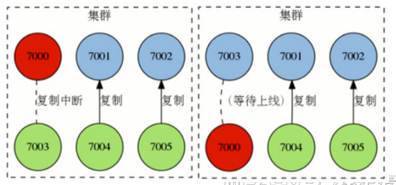
**举例**
三个主节点7000、7001、7002平均分片16384个slot槽位
- 节点7000指派的槽位为0到5060
- 节点7001指派的槽位为5461到10022
- 节点7002指派的槽位为10923到16383
- 节点7003指派的槽位为5061到5460,10023-10922
### 8.2.4 Redis集群Redirect转向
- 由于**Redis集群无中心节点，请求会发给任意主节点**
- 主节点**只会处理自己负责槽位的命令请求**，其它槽位的命令请求，该主节点会返回客户端一个转向错误
- 客户端根据错误中包含的地址和端口**重新向正确的负责的主节点发起命令请求**
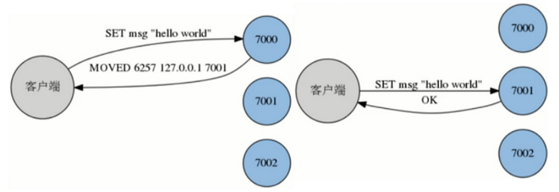
## 8.3 Redis集群搭建
- 创建多个主节点
- 为每一个节点指派slot槽位，将多个节点连接起来，组成一个集群
- 槽位分片完成后，集群进入上线状态
- 6个节点：3个主节点，每一个主节点有一个从节点（由rubby手动指定谁是主谁是从）
## 8.4 Redis集群总结
1. Redis集群是一个由多个节点组成的分布式服务集群，它具有复制、高可用和分片特性
2. Redis的集群没有中心节点，并且带有复制和故障转移特性，这可用避免单个节点成为性能瓶颈，或者因为某个节点下线而导致整个集群下线
3. 集群中的主节点负责处理槽（储存数据），而从节点则是主节点的复制品
4. Redis集群将整个数据库分为16384个槽，数据库中的每个键都属于16384个槽中的其中一个
5. 集群中的每个主节点都可以负责0个至16384个槽，当16384个槽都有节点在负责时，集群进入上线状态，可以执行客户端发送的数据命令
6. 主节点只会执行和自己负责的槽有关的命令，当节点接收到不属于自己处理的槽的命令时，它将会处理指定槽的节点的地址返回给客户端，而客户端会向正确的节点重新发送
7. 如果需要完整地分片、复制和高可用特性，并且要避免使用代理带来的性能瓶颈和资源消耗，那么可以选择使用Redis集群；如果只需要一部分特性（比如只需要分片，但不需要复制和高可用等），那么单独选用twemproxy、Redis的复制和Redis Sentinel中的一个或多个
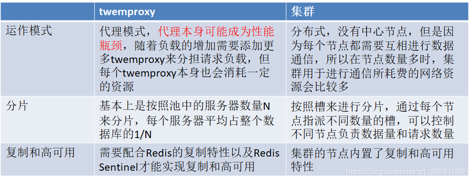
# 独立功能实现
## 事务
`MUTI、EXEC、WATCH`三个命令
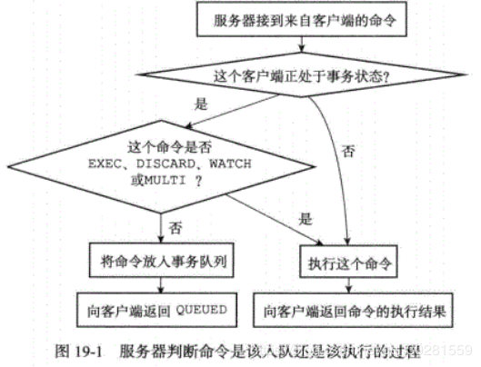
WATCH命令是一个乐观锁（optimistic locking)，它可以在EXEC命令执行之前，监视 任意数量的数据库键，并在EXEC命令执行时，检查被监视的键是否至少有一个已经被修改 过了，如果是的话，服务器将拒绝执行事务，并向客户端返回代表事务执行失败的空回复。
# 九、常见问题
## **1. Redis的并发竞争问题如何解决?**
Redis为**单进程单线程**模式，采用队列模式将并发访问变为串行访问。Redis本身没有锁的概念，Redis对于多个客户端连接并不存在竞争，但是在Jedis客户端对Redis进行并发访问时会发生连接超时、数据转换错误、阻塞、客户端关闭连接等问题，这些问题均是由于客户端连接混乱造成。对此有2种解决方法：
	1. 客户端角度，为保证每个客户端间正常有序与Redis进行通信，对连接进行池化，同时对客户端读写Redis操作采用内部锁synchronized。 
	2. 服务器角度，利用setnx实现锁。

注：对于第一种，需要应用程序自己处理资源的同步，可以使用的方法比较通俗，可以使用synchronized也可以使用lock；第二种需要用到Redis的setnx命令，但是需要注意一些问题。

## **2.  redis的过期策略以及内存淘汰机制**
Redis 提供了 3 种数据过期策略：
**被动删除**：当读/写一个已经过期的 key 时，会触发惰性删除策略，直接删除掉这个过期 key 。
**主动删除**：由于惰性删除策略无法保证冷数据被及时删掉，所以 Redis 会定期主动淘汰一批已过期的 key 。
**主动删除**：当前已用内存超过 maxmemory 限定时，触发主动清理策略，即 「数据“淘汰”策略」 。

 分析:比如你redis只能存5G数据，可是你写了10G，那会删5G的数据。怎么删的？还有，你的数据已经设置了过期时间，但是时间到了，内存占用率还是比较高，有思考过原因么?
回答:
redis采用的是**定期删除+惰性删除策略**。
- 为什么不用定时删除策略?
定时删除,用一个定时器来负责监视key,过期则自动删除。虽然内存及时释放，但是十分消耗CPU资源。在大并发请求下，CPU要将时间应用在处理请求，而不是删除key,因此没有采用这一策略.
- **定期删除+惰性删除是如何工作的呢?**
定期删除，redis默认每个100ms检查，是否有过期的key,有过期key则删除。需要说明的是，redis不是每个100ms将所有的key检查一次，而是**随机抽取**进行检查(如果每隔100ms,全部key进行检查，redis岂不是卡死)。因此，如果只采用定期删除策略，会导致很多key到时间没有删除。
于是，惰性删除派上用场。也就是说**在你获取某个key的时候，redis会检查一下，这个key如果设置了过期时间那么是否过期了？如果过期了此时就会删除。**
- 采用定期删除+惰性删除就没其他问题了么?
不是的，如果定期删除没删除key。然后你也没即时去请求key，也就是说惰性删除也没生效。这样，redis的内存会越来越高。那么就应该采用内存淘汰机制。
- **redis 提供 6种数据淘汰策略：** 
1. volatile-lru：从已设置过期时间的数据集（server.db[i].expires）中挑选最近最少使用的数据淘汰 
2. volatile-ttl：从已设置过期时间的数据集（server.db[i].expires）中挑选将要过期的数据淘汰 
3. volatile-random：从已设置过期时间的数据集（server.db[i].expires）中任意选择数据淘汰 
4. allkeys-lru：从数据集（server.db[i].dict）中挑选最近最少使用的数据淘汰 
5. allkeys-random：从数据集（server.db[i].dict）中任意选择数据淘汰 
6. no-enviction（驱逐）：禁止驱逐数据
### 2.1如何保证热点数据不要被淘汰。
“Redis 内存数据集大小上升到一定大小的时候，就会进行数据淘汰策略。” 。
那么，如果我们此时要保证热点数据不被淘汰，那么需要选择 `volatile-lru` 或 `allkeys-lru` 这两个基于 LRU 算法的淘汰策略。
相比较来说，最终会选择 allkeys-lru 淘汰策略。原因是，如果我们的应用对缓存的访问符合幂律分布，也就是存在相对热点数据，或者我们不太清楚我们应用的缓存访问分布状况，我们可以选择 allkeys-lru 策略。
## **3. redis和数据库双写一致性问题**
分析:一致性问题是分布式常见问题，还可以再分为**最终一致性和强一致性**。
数据库和缓存双写，就必然会存在不一致的问题。答这个问题，先明白一个前提。就是**如果对数据有强一致性要求，不能放缓存**。我们所做的一切，`只能保证最终一致性`。另外，我们所做的方案其实从根本上来说，只能说降低不一致发生的概率，无法完全避免。因此，有强一致性要求的数据，不能放缓存。
- 首先，采取正确更新策略，`先更新数据库，再删缓存` 。
- 其次，因为可能存在删除缓存失败的问题，提供一个补偿措施即可，例如`利用消息队列`。
- binlog

## 4. [如何应对  缓存穿透  、  缓存雪崩  、缓存击穿 问题](https://github.com/doocs/advanced-java/blob/master/docs/high-concurrency/redis-caching-avalanche-and-caching-penetration.md)
分析:这两个问题，说句实在话，一般中小型传统软件企业，很难碰到这个问题。如果有大并发的项目，流量有几百万左右。这两个问题一定要深刻考虑。
回答:
### 缓存穿透
即黑客故意去请求缓存中不存在的数据，导致所有的请求都怼到数据库上，从而数据库连接异常。
解决方案:
(一)利用**互斥锁**，缓存失效的时候，先去获得锁，得到锁了，再去请求数据库。没得到锁，则休眠一段时间重试
(二)采用**异步更新策略**，无论key是否取到值，都直接返回。value值中维护一个缓存失效时间，缓存如果过期，异步起一个线程去读数据库，更新缓存。需要做缓存预热(项目启动前，先加载缓存)操作。
(三)提供一个能迅速判断请求是否有效的拦截机制，比如，利用**布隆过滤器**，内部维护一系列合法有效的key。迅速判断出，请求所携带的Key是否合法有效。如果不合法，则直接返回。
(四)每次系统 A 从数据库中只要没查到，就写一个空值到缓存里去，比如 set -999 UNKNOWN。然后设置一个过期时间，这样的话，下次有相同的 key 来访问的时候，在缓存失效之前，都可以直接从缓存中取数据。

### 缓存雪崩
即缓存同一时间大面积的失效，这个时候又来了一波请求，结果请求都怼到数据库上，从而导致数据库连接异常。
**预防:**
(一)给缓存的失效时间，加上一个`随机值`，避免集体失效。
(二)使用`互斥锁`，但是该方案吞吐量明显下降了。
(三)`双缓存`。我们有两个缓存，缓存A和缓存B。缓存A的失效时间为20分钟，缓存B不设失效时间。自己做缓存预热操作。然后细分以下几个小点
- 从缓存A读数据库，有则直接返回
- A没有数据，直接从B读数据，直接返回，并且异步启动一个更新线程。
- 更新线程同时更新缓存A和缓存B。
#### 缓存雪崩的事前事中事后的解决方案
事前：redis 高可用，主从+哨兵，redis cluster，避免全盘崩溃。
事中：本地 ehcache 缓存 + hystrix 限流&降级，避免 MySQL 被打死。
事后：redis 持久化，一旦重启，自动从磁盘上加载数据，快速恢复缓存数据。
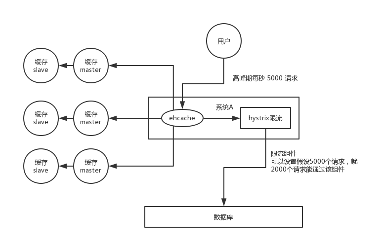
用户发送一个请求，系统 A 收到请求后，先查本地 ehcache 缓存，如果没查到再查 redis。如果 ehcache 和 redis 都没有，再查数据库，将数据库中的结果，写入 ehcache 和 redis 中。

限流组件，可以设置每秒的请求，有多少能通过组件，剩余的未通过的请求，怎么办？走降级！可以返回一些默认的值，或者友情提示，或者空白的值。
### 缓存击穿
缓存击穿，就是说某个 key 非常热点，访问非常频繁，处于集中式高并发访问的情况，当这个 key 在失效的瞬间，大量的请求就击穿了缓存，直接请求数据库，就像是在一道屏障上凿开了一个洞。

解决方式也很简单，可以将热点数据设置为永远不过期；或者基于 redis or zookeeper 实现互斥锁，等待第一个请求构建完缓存之后，再释放锁，进而其它请求才能通过该 key 访问数据。
## 5.如何解决redis的并发竞争key问题
分析:这个问题大致就是，同时有多个子系统去set一个key。这个时候要注意什么呢？大家思考过么。不推荐使用redis的事务机制。因为我们的生产环境，基本都是redis集群环境，做了数据分片操作。一个事务中有涉及到多个key操作的时候，这多个key不一定都存储在同一个redis-server上。因此，redis的事务机制，十分鸡肋。
回答:
(1)如果对这个key操作，不要求顺序
这种情况下，**准备一个分布式锁**，大家去抢锁，抢到锁就做set操作即可，比较简单。
(2)如果对这个key操作，要求顺序
假设有一个key1,系统A需要将key1设置为valueA,系统B需要将key1设置为valueB,系统C需要将key1设置为valueC.
期望按照key1的value值按照 valueA–>valueB–>valueC的顺序变化。这种时候我们`在数据写入数据库的时候，需要保存一个时间戳`。假设时间戳如下

    系统A key 1 {valueA  3:00}
    系统B key 1 {valueB  3:05}
    系统C key 1 {valueC  3:10}

 那么，假设这会系统B先抢到锁，将key1设置为{valueB 3:05}。接下来系统A抢到锁，发现自己的valueA的时间戳早于缓存中的时间戳，那就不做set操作了。以此类推。
其他方法，比如利用队列，将set方法变成串行访问也可以。总之，灵活变通。
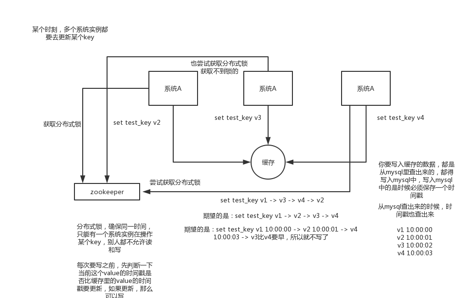

## 6.Redis实现分布式锁
### 6.1方案一：set 指令
先拿 setnx 来争抢锁，抢到之后，再用 expire 给锁加一个过期时间防止锁忘记了释放。
如果在 setnx 之后执行 expire 之前进程意外 crash 或者要重启维护了，那这个锁就永远得不到释放了。可以同时把 setnx 和 expire 合成一条指令来用的！
所以，我们可以使用 set 指令，实现分布式锁。指令如下：`SET key value [EX seconds] [PX milliseconds] [NX|XX]`
具体的实现，可以参考 [《Redis 分布式锁的正确实现方式（Java版）》](https://wudashan.cn/2017/10/23/Redis-Distributed-Lock-Implement/) 文章。

问题：
在Redis的master节点上拿到了锁；
但是这个加锁的key还没有同步到slave节点；
master故障，发生故障转移，slave节点升级为master节点；
导致锁丢失。
### 6.2方案二：redlock
set 指令的方案，适合用于在单机 Redis 节点的场景下，在多 Redis 节点的场景下，会存在分布式锁丢失的问题。所以，Redis 作者 Antirez 基于分布式环境下提出了一种更高级的分布式锁的实现方式：Redlock 。
[《Redlock：Redis分布式锁最牛逼的实现》](https://mp.weixin.qq.com/s/JLEzNqQsx-Lec03eAsXFOQ)
[《Redisson 实现 Redis 分布式锁的 N 种姿势》](https://www.jianshu.com/p/f302aa345ca8)
为了取到锁，客户端应该执行以下操作:
- 获取当前Unix时间，以毫秒为单位。
- 依次尝试从所有Redis实例，假设5个，使用**相同的key和具有唯一性的value（例如UUID）获取锁**。当向Redis请求获取锁时，客户端应该设置一个网络连接和响应超时时间，这个超时时间应该小于锁的失效时间。例如你的锁自动失效时间为10秒，则超时时间应该在5-50毫秒之间。这样可以避免服务器端Redis已经挂掉的情况下，客户端还在死死地等待响应结果。如果服务器端没有在规定时间内响应，客户端应该尽快尝试去另外一个Redis实例请求获取锁。
- 客户端使用当前时间减去开始获取锁时间（步骤1记录的时间）就得到获取锁使用的时间。**当且仅当从大多数（N/2+1，这里是3个节点）的Redis节点都取到锁，并且使用的时间小于锁失效时间时，锁才算获取成功。**
- 如果取到了锁，key的真正有效时间等于有效时间减去获取锁所使用的时间（步骤3计算的结果）。
- 如果因为某些原因，获取锁失败（没有在至少N/2+1个Redis实例取到锁或者取锁时间已经超过了有效时间），客户端**应该在所有的Redis实例上进行解锁（即便某些Redis实例根本就没有加锁成功**，防止某些节点获取到锁但是客户端没有得到响应而导致接下来的一段时间不能被重新获取锁）。
### 6.3对比 Zookeeper 分布式锁
从可靠性上来说，Zookeeper 分布式锁好于 Redis 分布式锁。
从性能上来说，Redis 分布式锁好于 Zookeeper 分布式锁。
##  7.Redis 的线程模型？
redis 内部使用文件事件处理器 `file event handler`，这个文件事件处理器是单线程的，所以 redis 才叫做单线程的模型。它采用 `IO 多路复用机制`同时监听多个 socket，根据 socket 上的事件来选择对应的事件处理器进行处理。
文件事件处理器的结构包含 4 个部分：
- 多个 socket
- IO 多路复用程序
- 文件事件分派器
- 事件处理器（连接应答处理器、命令请求处理器、命令回复处理器）

多个 socket 可能会并发产生不同的操作，每个操作对应不同的文件事件，但是 IO 多路复用程序会监听多个 socket，会将 socket 产生的事件放入队列中排队，事件分派器每次从队列中取出一个事件，把该事件交给对应的事件处理器进行处理。

来看客户端与 redis 的一次通信过程：
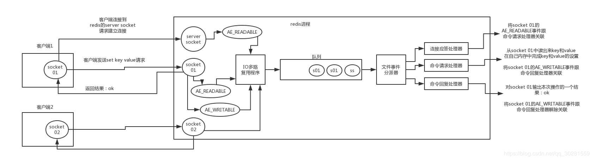
- 客户端 socket01 向 redis 的 server socket `请求建立连接`，此时 server socket 会产生一个 AE_READABLE 事件，`IO 多路复用程序`监听到 server socket 产生的事件后，将该事件`压入队列`中。`文件事件分派器`从队列中获取该事件，交给`连接应答处理器`。连接应答处理器会创建一个能与客户端通信的 socket01，并将该 socket01 的 AE_READABLE 事件与`命令请求处理器`关联。
- 假设此时客户端发送了一个 `set key value` 请求，此时 redis 中的 socket01 会产生 AE_READABLE 事件，IO 多路复用程序将事件压入队列，此时事件分派器从队列中获取到该事件，由于前面 socket01 的 AE_READABLE 事件已经与命令请求处理器关联，因此事件分派器将事件交给命令请求处理器来处理。命令请求处理器读取 socket01 的 key value 并在自己内存中完成 key value 的设置。操作完成后，它会将 socket01 的 AE_WRITABLE 事件与`命令回复处理器`关联。
- 如果此时客户端准备好`接收返回结果`了，那么 redis 中的 socket01 会产生一个 AE_WRITABLE 事件，同样压入队列中，事件分派器找到相关联的命令回复处理器，由命令回复处理器对 socket01 输入本次操作的一个结果，比如 ok，之后解除 socket01 的 AE_WRITABLE 事件与命令回复处理器的关联。

## 8.为什么 Redis 单线程模型也能效率这么高？
**1、纯内存操作。**

> Redis 为了达到最快的读写速度，将数据都读到内存中，并通过异步的方式将数据写入磁盘。所以 Redis 具有快速和数据持久化的特征。
> 如果不将数据放在内存中，磁盘 I/O 速度为严重影响 Redis 的性能。

**2、核心是基于非阻塞的 IO 多路复用机制。**

**3、单线程反而避免了多线程的频繁上下文切换问题。**
> Redis 利用队列技术，将并发访问变为串行访问，消除了传统数据库串行控制的开销

**4、Redis 全程使用 hash 结构，读取速度快，还有一些特殊的数据结构，对数据存储进行了优化，如压缩表，对短数据进行压缩存储，再如，跳表，使用有序的数据结构加快读取的速度。**

## 9.如何使用 Redis 实现消息队列？
一般使用 list 结构作为队列，`rpush` 生产消息，`lpop` 消费消息。当 lpop 没有消息的时候，要适当 sleep 一会再重试。

如果对方追问可不可以不用 sleep 呢？list 还有个指令叫 `blpop` ，在没有消息的时候，它会阻塞住直到消息到来。
如果对方追问能不能生产一次消费多次呢？使用 `pub / sub` 主题订阅者模式，可以实现 1:N 的消息队列。
如果对方追问 pub / sub 有什么缺点？在消费者下线的情况下，生产的消息会丢失，得使用专业的消息队列如 rabbitmq 等。
如果对方追问 redis 如何实现延时队列？使用 sortedset ，拿时间戳作为 score ，消息内容作为 key 调用 zadd 来生产消息，消费者用 zrangebyscore 指令获取 N 秒之前的数据轮询进行处理。

当然，实际上 Redis 真的真的真的不推荐作为消息队列使用，它最多只是消息队列的存储层，上层的逻辑，还需要做大量的封装和支持。
## 10.什么是 Redis 事务？
和众多其它数据库一样，Redis 作为 NoSQL 数据库也同样提供了事务机制。在Redis中，`MULTI / EXEC / DISCARD / WATCH` 这四个命令是我们实现事务的基石。相信对有关系型数据库开发经验的开发者而言这一概念并不陌生，即便如此，我们还是会简要的列出 Redis 中事务的实现特征：

1、在事务中的所有命令都将会被`串行化`的顺序执行，事务执行期间，Redis 不会再为其它客户端的请求提供任何服务，从而保证了事物中的所有命令被原子的执行。
2、和关系型数据库中的事务相比，在 Redis 事务中如果有某一条命令执行失败，其后的命令仍然会被继续执行。
3、我们可以通过 `MULTI` 命令开启一个事务，有关系型数据库开发经验的人可以将其理解为 "`BEGIN TRANSACTION`" 语句。在该语句之后执行的命令都，将被视为事务之内的操作，最后我们可以通过执行 `EXEC / DISCARD` 命令来提交 / 回滚该事务内的所有操作。这两个 Redis 命令，可被视为等同于关系型数据库中的 `COMMIT / ROLLBACK` 语句。
4、在事务开启之前，如果客户端与服务器之间出现通讯故障并导致网络断开，其后所有待执行的语句都将不会被服务器执行。然而如果网络中断事件是发生在客户端执行 EXEC 命令之后，那么该事务中的所有命令都会被服务器执行。
5、当使用 Append-Only 模式时，Redis 会通过调用系统函数 write 将该事务内的所有写操作在本次调用中全部写入磁盘。然而如果在写入的过程中出现系统崩溃，如电源故障导致的宕机，那么此时也许只有部分数据被写入到磁盘，而另外一部分数据却已经丢失。

Redis 服务器会在重新启动时执行一系列必要的一致性检测，一旦发现类似问题，就会立即退出并给出相应的错误提示。此时，我们就要充分利用 Redis 工具包中提供的 `redis-check-aof` 工具，该工具可以帮助我们定位到数据不一致的错误，并将已经写入的部分数据进行回滚。修复之后我们就可以再次重新启动Redis服务器了。

## 11.如何实现 Redis CAS 操作？

在 Redis 的事务中，`WATCH` 命令可用于提供CAS(check-and-set)功能。

假设我们通过 WATCH 命令在事务执行之前监控了多个 keys ，倘若在 WATCH 之后有任何 Key 的值发生了变化，EXEC 命令执行的事务都将被放弃，同时返回 nil 应答以通知调用者事务执行失败。
 [《Redis 事务锁 CAS 实现以及深入误区》](https://www.jianshu.com/p/0244a875aa26) 。
## [在集群模式下，redis 的 key 是如何寻址的？分布式寻址都有哪些算法？了解一致性 hash 算法吗？](https://github.com/doocs/advanced-java/blob/master/docs/high-concurrency/redis-cluster.md)
### 节点间的内部通信机制
**基本通信原理**
集群元数据的维护有两种方式：集中式、Gossip 协议。redis cluster 节点间采用 gossip 协议进行通信。

#### 集中式
是将集群元数据（节点信息、故障等等）几种存储在某个节点上。集中式元数据集中存储的一个典型代表，就是大数据领域的 storm。它是分布式的大数据实时计算引擎，是集中式的元数据存储的结构，底层基于 zookeeper（分布式协调的中间件）对所有元数据进行存储维护。
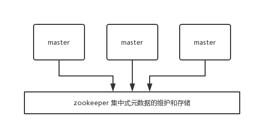
redis 维护集群元数据采用另一个方式， gossip 协议，所有节点都持有一份元数据，不同的节点如果出现了元数据的变更，就不断将元数据发送给其它的节点，让其它节点也进行元数据的变更。
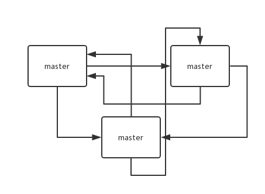
**集中式**的**好处**在于，元数据的读取和更新，时效性非常好，一旦元数据出现了变更，就立即更新到集中式的存储中，其它节点读取的时候就可以感知到；**不好**在于，所有的元数据的更新压力全部集中在一个地方，可能会导致元数据的存储有压力。

gossip 好处在于，元数据的更新比较分散，不是集中在一个地方，更新请求会陆陆续续打到所有节点上去更新，降低了压力；不好在于，元数据的更新有延时，可能导致集群中的一些操作会有一些滞后。

- 10000 端口：每个节点都有一个专门用于节点间通信的端口，就是自己提供服务的端口号+10000，比如 7001，那么用于节点间通信的就是 17001 端口。每个节点每隔一段时间都会往另外几个节点发送 `ping` 消息，同时其它几个节点接收到 `ping` 之后返回 `pong`。

- 交换的信息：信息包括故障信息，节点的增加和删除，hash slot 信息等等。

#### gossip 协议
gossip 协议包含多种消息，包含 `ping`,`pong`,`meet`,`fail` 等等。

- meet：某个节点发送 meet 给新加入的节点，让新节点加入集群中，然后新节点就会开始与其它节点进行通信。

```bash
redis-trib.rb add-node
```

其实内部就是发送了一个 gossip meet 消息给新加入的节点，通知那个节点去加入我们的集群。

- ping：每个节点都会频繁给其它节点发送 ping，其中包含自己的状态还有自己维护的集群元数据，互相通过 ping 交换元数据。
- pong：返回 ping 和 meeet，包含自己的状态和其它信息，也用于信息广播和更新。
- fail：某个节点判断另一个节点 fail 之后，就发送 fail 给其它节点，通知其它节点说，某个节点宕机啦。

#### ping 消息深入
ping 时要携带一些元数据，如果很频繁，可能会加重网络负担。

每个节点每秒会执行 10 次 ping，每次会选择 5 个最久没有通信的其它节点。当然如果发现某个节点通信延时达到了 `cluster_node_timeout / 2`，那么立即发送 ping，避免数据交换延时过长，落后的时间太长了。比如说，两个节点之间都 10 分钟没有交换数据了，那么整个集群处于严重的元数据不一致的情况，就会有问题。所以 `cluster_node_timeout` 可以调节，如果调得比较大，那么会降低 ping 的频率。

每次 ping，会带上自己节点的信息，还有就是带上 1/10 其它节点的信息，发送出去，进行交换。至少包含 `3` 个其它节点的信息，最多包含 `总节点数减 2` 个其它节点的信息。

### 分布式寻址算法
#### hash 算法（大量缓存重建）
一致性 hash 算法（自动缓存迁移）+ 虚拟节点（自动负载均衡）
redis cluster 的 hash slot 算法
hash 算法
来了一个 key，首先计算 hash 值，然后对节点数取模。然后打在不同的 master 节点上。一旦某一个 master 节点宕机，所有请求过来，都会基于最新的剩余 master 节点数去取模，尝试去取数据。这会导致大部分的请求过来，全部无法拿到有效的缓存，导致大量的流量涌入数据库。

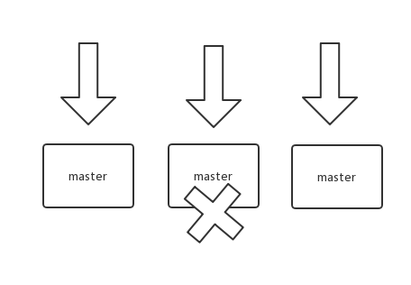
#### 一致性 hash 算法
一致性 hash 算法将整个 hash 值空间组织成一个虚拟的圆环，整个空间按顺时针方向组织，下一步将各个 master 节点（使用服务器的 ip 或主机名）进行 hash。这样就能确定每个节点在其哈希环上的位置。

来了一个 key，首先计算 hash 值，并确定此数据在环上的位置，从此位置沿环顺时针“行走”，遇到的第一个 master 节点就是 key 所在位置。

在一致性哈希算法中，如果一个节点挂了，受影响的数据仅仅是此节点到环空间前一个节点（沿着逆时针方向行走遇到的第一个节点）之间的数据，其它不受影响。增加一个节点也同理。

燃鹅，一致性哈希算法在节点太少时，容易因为节点分布不均匀而造成缓存热点的问题。为了解决这种热点问题，一致性 hash 算法引入了虚拟节点机制，即对每一个节点计算多个 hash，每个计算结果位置都放置一个虚拟节点。这样就实现了数据的均匀分布，负载均衡。

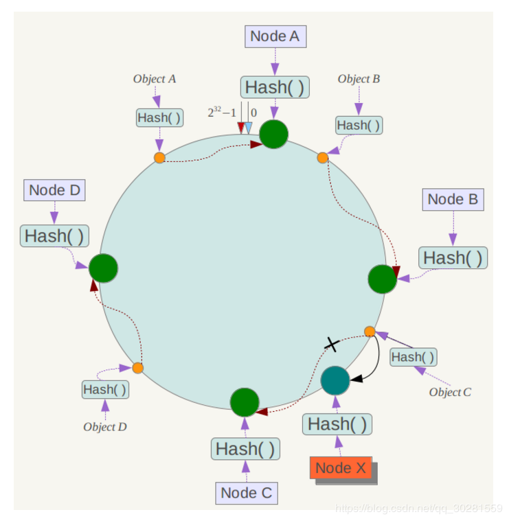

#### redis cluster 的 hash slot 算法
redis cluster 有固定的 16384 个 hash slot，对每个 key 计算 CRC16 值，然后对 16384 取模，可以获取 key 对应的 hash slot。

redis cluster 中每个 master 都会持有部分 slot，比如有 3 个 master，那么可能每个 master 持有 5000 多个 hash slot。hash slot 让 node 的增加和移除很简单，增加一个 master，就将其他 master 的 hash slot 移动部分过去，减少一个 master，就将它的 hash slot 移动到其他 master 上去。移动 hash slot 的成本是非常低的。客户端的 api，可以对指定的数据，让他们走同一个 hash slot，通过 hash tag 来实现。

任何一台机器宕机，另外两个节点，不影响的。因为 key 找的是 hash slot，不是机器。
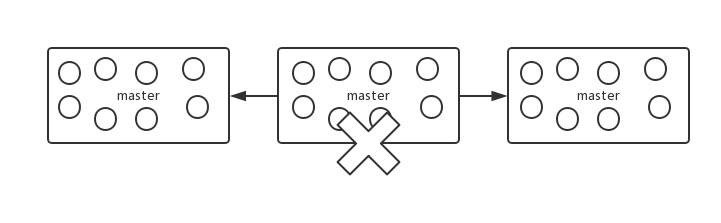

### redis cluster 的高可用与主备切换原理
redis cluster 的高可用的原理，几乎跟哨兵是类似的。

**判断节点宕机**
如果一个节点认为另外一个节点宕机，那么就是 pfail，主观宕机。如果多个节点都认为另外一个节点宕机了，那么就是 fail，客观宕机，跟哨兵的原理几乎一样，sdown，odown。

在 cluster-node-timeout 内，某个节点一直没有返回 pong，那么就被认为 pfail。

如果一个节点认为某个节点 pfail 了，那么会在 gossip ping 消息中，ping 给其他节点，如果超过半数的节点都认为 pfail 了，那么就会变成 fail。

**从节点过滤**
对宕机的 master node，从其所有的 slave node 中，选择一个切换成 master node。

检查每个 slave node 与 master node 断开连接的时间，如果超过了 cluster-node-timeout * cluster-slave-validity-factor，那么就没有资格切换成 master。

**从节点选举**
每个从节点，都根据自己对 master 复制数据的 offset，来设置一个选举时间，offset 越大（复制数据越多）的从节点，选举时间越靠前，优先进行选举。

所有的 master node 开始 slave 选举投票，给要进行选举的 slave 进行投票，如果大部分 master node（N/2 + 1）都投票给了某个从节点，那么选举通过，那个从节点可以切换成 master。

**从节点执行主备切换，从节点切换为主节点。**


**Mark：**
https://zhuanlan.zhihu.com/p/28073983
https://blog.csdn.net/liqingtx/article/details/60330555
https://blog.csdn.net/hjm4702192/article/details/80518856