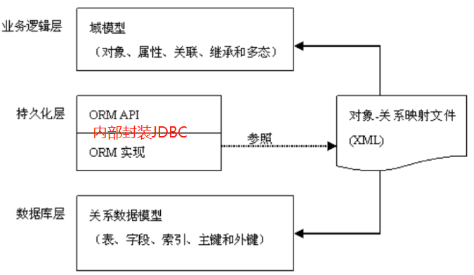
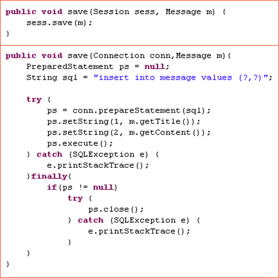
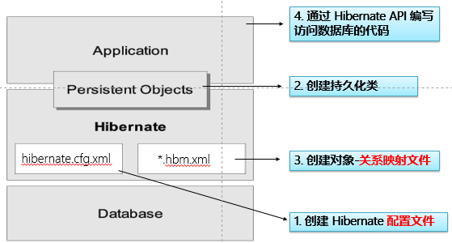
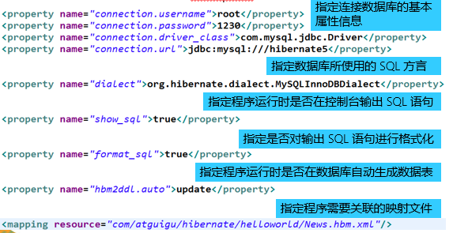
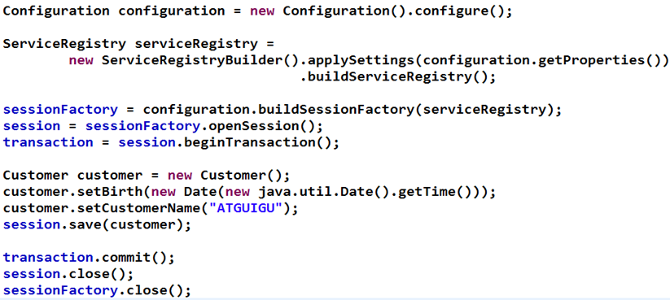
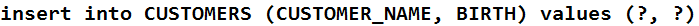
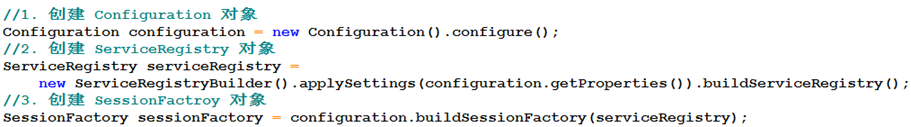
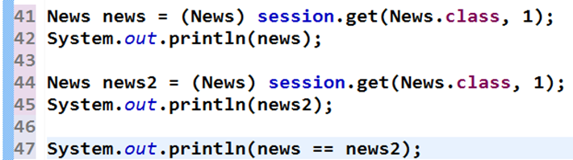
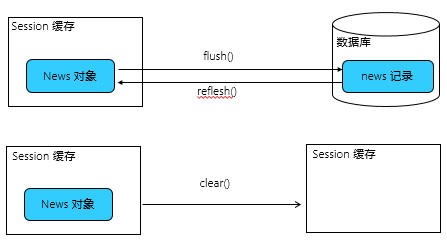
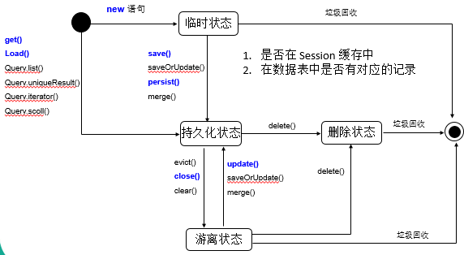

# 什么是 Hibernate ?

- 一个框架
- 一个 Java 领域的**持久化**框架
- 一个 **ORM框架**

### 对象的持久化

狭义的理解，“持久化”仅仅指把对象永久保存到数据库中

广义的理解，“持久化”包括和数据库相关的各种操作：

- 保存：把对象永久保存到数据库中。
- 更新：更新数据库中对象(记录)的状态。
- 删除：从数据库中删除一个对象。
- 查询：根据特定的查询条件，把符合查询条件的一个或多个对象从数据库加载到内存中。
- 加载：根据特定的**OID**，把一个对象从数据库加载到内存中。

> **为了在系统中能够找到所需对象，需要为每一个对象分配一个唯一的标识号。在关系数据库中称之为主键，而在对象术语中，则叫做对象标识(Object identifier-OID).** 

### ORM

ORM(Object/Relation **Mapping**): **对象/关系映射**

- ORM 主要解决对象-关系的映射

- ORM的思想：将关系数据库中表中的记录映射成为对象，以对象的形式展现，**程序员可以把对数据库的操作转化为对对象的操作**。

- ORM 采用**元数据**来描述对象-关系映射细节, 元数据通常采用 XML 格式, 并且存放在专门的**对象-关系映射文件**中.

### 流行的ORM框架

**Hibernate:**

- 非常优秀、成熟的 ORM 框架。

- 完成对象的持久化操作

- Hibernate 允许开发者**采用面向对象的方式**来操作关系数据库。

- 消除那些针对特定数据库厂商的 SQL 代码

myBatis：

- 相比 Hibernate 灵活高，运行速度快

- 开发速度慢，不支持纯粹的面向对象操作，需熟悉sql语 句，并且熟练使用sql语句优化功能

TopLink

OJB

>  Hibernate 与 Jdbc 代码对比:
>
> 

## Hibernate开发步骤

### 1. 创建持久化 Java 类

**提供一个无参的构造器**:使Hibernate可以使用`Constructor.newInstance() `来实例化持久化类

**提供一个标识属性(identifier property)**: 通常映射为数据库表的主键字段. 如果没有该属性，一些功能将不起作用，如：`Session.saveOrUpdate()`

**为类的持久化类字段声明访问方法**(`get/set`): Hibernate对JavaBeans 风格的属性实行持久化。

**使用非final** **类**: 在**运行时生成代理**是 Hibernate 的一个重要的功能. 如果持久化类没有实现任何接口, Hibnernate 使用 CGLIB 生成代理. 如果使用的是 final 类, 则无法生成 CGLIB 代理.

**重写 eqauls和hashCode方法**: 如果需要把持久化类的实例放到 Set 中(当需要进行关联映射时), 则应该重写这两个方法

Hibernate 不要求持久化类继承任何父类或实现接口，这可以保证代码不被污染。这就是Hibernate被称为低侵入式设计的原因

### 2. 创建对象-关系映射文件

Hibernate 采用 XML 格式的文件来指定**对象和关系数据**之间的映射. 在运行时 Hibernate 将**根据这个映射文件来生成各种 SQL 语句**

映射文件的扩展名为` .hbm.xml`

- 指定类和表的映射
- 指定持久化类的OID 和表的主键的映射
- 映射类的属性和表的字段
- 指定对象标识符生成器, 负责为 OID 生成唯一标识符

### 3. 创建 Hibernate 配置文件

Hibernate 从其配置文件中读取和数据库连接的有关信息, 这个文件应该位于应用的 classpath 下.

### 4. 通过 Hibernate API 编写访问数据库的代码

测试代码：

控制台输出的 SQL 语句：

---

使用 Hibernate 进行数据持久化操作，通常有如下步骤：

- 编写持久化类： POJO + 映射文件
- 获取 Configuration 对象
- 获取 SessionFactory 对象
- 获取 Session，打开事务
- 用面向对象的方式操作数据库
- 关闭事务，关闭 Session

#### Configuration 类

Configuration 类负责管理 Hibernate 的配置信息。包括如下内容：

- Hibernate 运行的底层信息：数据库的URL、用户名、密码、JDBC驱动类，数据库Dialect,数据库连接池等（对应 ·`hibernate.cfg.xml` 文件）。
- 持久化类与数据表的映射关系（`.hbm.xml` 文件）

创建 Configuration 的两种方式

- 属性文件（`hibernate.properties`）:`Configuration cfg = new Configuration();`

- Xml文件（`hibernate.cfg.xml`）:`Configuration cfg = new Configuration().configure();`

- Configuration 的 configure 方法还支持带参数的访问：
  - `File file = new File(“simpleit.xml”);`
  - `Configuration cfg = new Configuration().configure(file);`

#### SessionFactory 接口

•针对单个数据库映射关系经过编译后的内存镜像，是线程安全的。

•SessionFactory 对象一旦构造完毕，即被赋予特定的配置信息

•SessionFactory是生成Session的工厂

•构造 SessionFactory 很消耗资源，一般情况下一个应用中只初始化一个 SessionFactory 对象。

•Hibernate4 新增了一个 ServiceRegistry 接口，所有基于 Hibernate 的配置或者服务都必须统一向这个 ServiceRegistry 注册后才能生效

•Hibernate4 中创建 SessionFactory 的步骤

#### Session 接口

Session 是应用程序与数据库之间交互操作的一个**单线程对象**，是 Hibernate 运作的中心，所有持久化对象必须在 session 的管理下才可以进行持久化操作。此对象的生命周期很短。Session 对象有一个一级缓存，显式执行 flush 之前，所有的持久层操作的数据都缓存在 session 对象处。**相当于** **JDBC** **中的** **Connection**。

**持久化类与 Session 关联起来后就具有了持久化的能力**。

Session 类的方法：

- 取得持久化对象的方法：` get()`,` load()`

- 持久化对象都得保存，更新和删除：`save()`,`update()`,`saveOrUpdate()`,`delete()`

- 开启事务: `beginTransaction()`.

- 管理 Session 的方法：`isOpen()`,`flush()`,` clear()`,` evict()`,` close()`等

#### Hibernate 配置文件的两个配置项

•`hbm2ddl.auto`：该属性可帮助程序员实现**正向工程**, 即**由 java 代码生成数据库脚本, 进而生成具体的表结构**. 。取值 `create | update | create-drop | validate`

- create : 会根据 .hbm.xml 文件来生成数据表, 但是每次运行都会删除上一次的表 ,重新生成表, 哪怕二次没有任何改变

- create-drop : 会根据 .hbm.xml 文件生成表,但是SessionFactory一关闭, 表就自动删除

- update : **最常用的属性值**，也会根据 .hbm.xml 文件生成表, 但若 .hbm.xml 文件和数据库中对应的数据表的表结构不同, Hiberante 将更新数据表结构，但不会删除已有的行和列

- validate : 会和数据库中的表进行比较, 若 .hbm.xml 文件中的列在数据表中不存在，则抛出异常

•`format_sql`：是否将 SQL 转化为格式良好的 SQL . 取值` true | false`

## Session 概述

Session 接口是 Hibernate 向应用程序提供的操纵数据库的最主要的接口, 它**提供了基本的保存, 更新, 删除和加载 Java 对象的方法**.

**Session 具有一个缓存,位于缓存中的对象称为持久化对象, 它和数据库中的相关记录对应**. Session 能够在某些时间点, 按照缓存中对象的变化来执行相关的 SQL 语句, 来同步更新数据库, 这一过程被称为**刷新缓存(flush)**

**站在持久化的角度**, Hibernate**把对象分为4种状态**: 持久化状态, 临时状态, 游离状态, 删除状态. Session 的特定方法能使对象从一个状态转换到另一个状态.

### Session 缓存

在 Session 接口的实现中包含**一系列的 Java 集合**, 这些 Java 集合构成了 Session 缓存. 只要 Session 实例没有结束生命周期, 且没有清理缓存，则存放在它缓存中的对象也不会结束生命周期

Session 缓存可减少 Hibernate 应用程序访问数据库的频率。

#### 操作 Session 缓存

> flush：Session 按照缓存中对象的属性变化来同步更新数据库

默认情况下 Session 在以下时间点刷新缓存：

–显式调用 **Session** **的** **flush()** 方法

–当应用程序调用 **Transaction** **的** **commit（）**方法的时, 该方法先 flush ，然后在向数据库提交事务

–当应用程序执行一些查询(HQL, Criteria)操作时，如果缓存中持久化对象的属性已经发生了变化，会先 flush 缓存，以保证查询结果能够反映持久化对象的最新状态

flush 缓存的例外情况: 如果对象使用 native 生成器生成 OID, 那么当调用 Session 的 save() 方法保存对象时, 会立即执行向数据库插入该实体的 insert 语句.

commit() 和 flush() 方法的区别：flush 执行一系列 sql 语句，但不提交事务；commit 方法先调用flush() 方法，然后提交事务. 意味着提交事务意味着对数据库操作永久保存下来。

#### 持久化对象的状态

**站在持久化的角度, Hibernate把对象分为 4 种状态: 持久化状态, 临时状态, 游离状态, 删除状态. Session 的特定方法能使对象从一个状态转换到另一个状态**

- 临时对象（Transient）:
  - 在使用代理主键的情况下, **OID通常为 null**
  - 不处于Session的缓存中
  - 在数据库中没有对应的记录**

- 持久化对象(也叫”托管”)（Persist）：
  - **OID** **不为** **null**
  - 位于Session缓存中
  - 若在数据库中已经有和其对应的记录, 持久化对象和数据库中的相关记录对应
  - Session在flush缓存时，会根据持久化对象的属性变化，来同步更新数据库
  - 在同一个 **Session** 实例的缓存中, 数据库表中的每条记录只对应唯一的持久化对象

- 删除对象(Removed)
  - 在数据库中没有和其 OID 对应的记录
  - 不再处于 Session 缓存中
  - 一般情况下, 应用程序不该再使用被删除的对象
- 游离对象(也叫”脱管”) （Detached）：
  - **OID** **不为** **null**
  - 不再处于** **Session** **缓存中**
  - 一般情况需下, 游离对象是由持久化对象转变过来的, 因此在数据库中可能还存在与它对应的记录

