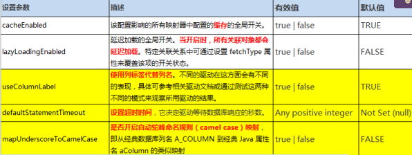
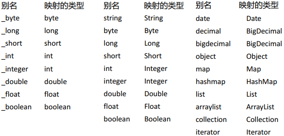
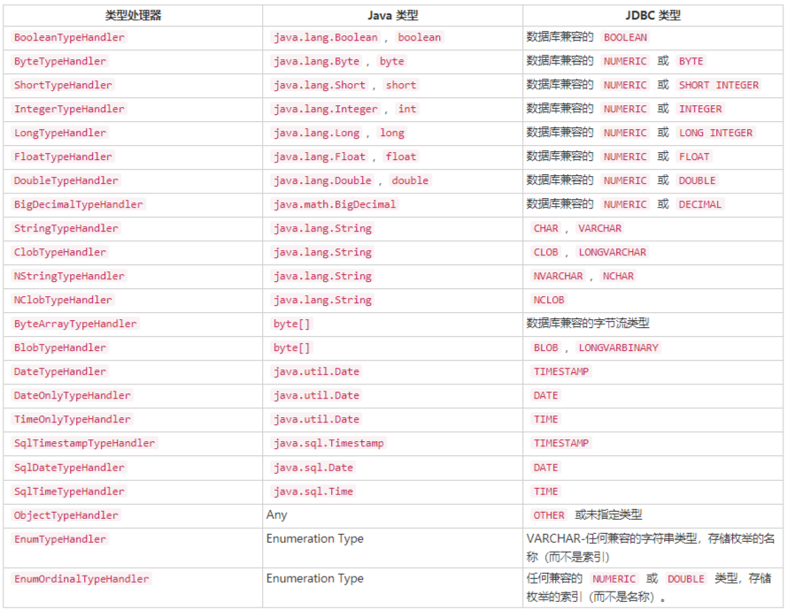
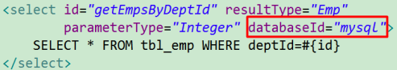

## Mybatis全局配置文件

MyBatis 的配置文件包含了影响 MyBatis 行为甚深的设置（ settings）和属性（ properties）信息。文档的顶层结构如下：

- configuration 配置
  - properties 属性
  - settings 设置
  - typeAliases 类型命名
  - typeHandlers 类型处理器
  - objectFactory 对象工厂
  - plugins 插件
  - environments 环境
    -  environment 环境变量
    -  transactionManager 事务管理器
    -  dataSource 数据源
  - databaseIdProvider 数据库厂商标识
  - mappers 映射器  

### properties 属性

这些属性都是可外部配置且可动态替换的，既可以在典型的 Java 属性文件中配置，亦可通过 properties 元素的子元素来传递。

```xml
<properties resource="org/mybatis/example/config.properties">//可以引入外部的文件，类路径或者包路径
  <--!也可以使用子元素标签-->
  <property name="username" value="dev_user"/>
  <property name="password" value="F2Fa3!33TYyg"/>
</properties>
```

```properties
driver=com.mysql.cj.jdbc.Driver
url=jdbc:mysql://localhost:3306/test?serverTimezone=Asia/Shanghai
```

其中的属性就可以在整个配置文件中使用来替换需要动态配置的属性值。

```xml
<dataSource type="POOLED">
  <property name="driver" value="${driver}"/>
  <property name="url" value="${url}"/>
  <property name="username" value="${username}"/>
  <property name="password" value="${password}"/>
</dataSource>
```

> 如果属性在不只一个地方进行了配置，那么 MyBatis 将按照下面的顺序来加载：
>
> - 在 properties 元素体内指定的属性首先被读取。
> - 然后根据 properties 元素中的 resource 属性读取类路径下属性文件或根据 url 属性指定的路径读取属性文件，并覆盖已读取的同名属性。
> - 最后读取作为方法参数传递的属性，并覆盖已读取的同名属性。  
>
> 因此，通过方法参数传递的属性具有最高优先级，resource/url 属性中指定的配置文件次之，最低优先级的是 properties 属性中指定的属性。

### settings设置  

这是 MyBatis 中极为重要的调整设置，它们会改变 MyBatis 的运行时行为。



```xml
<settings>
  <setting name="cacheEnabled" value="true"/>
  <setting name="localCacheScope" value="SESSION"/>
</settings>
```

### typeAliases别名处理器  

类型别名是为 Java 类型设置一个短的名字。它只和 XML 配置有关，存在的意义仅在于用来减少类完全限定名的冗余。

```xml
<typeAliases>
  <typeAlias alias="Blog" type="domain.blog.Blog"/>
</typeAliases>
```

当这样配置时，`Blog`可以用在任何使用`domain.blog.Blog`的地方。

**批量起别名**：也可以指定一个包名，MyBatis 会在包名下面搜索需要的 Java Bean，比如:

```xml
<typeAliases>
  <package name="domain.blog"/>
</typeAliases>
```

每一个在包 `domain.blog` 中的 Java Bean，在没有注解的情况下，会使用 **Bean 的首字母小写的非限定类名来作为它的别名**。 比如 `domain.blog.Author` 的别名为 `author`（**不区分大小写**）；若有注解，则别名为其注解值。看下面的例子：

```
    @Alias("author")
    public class Author {
        ...
    }
```

已经为许多常见的 Java 类型内建了相应的类型别名。它们都是大小写不敏感的，需要注意的是由基本类型名称重复导致的特殊处理。



### typeHandlers

无论是 MyBatis 在预处理语句（PreparedStatement）中设置一个参数时，还是从结果集中取出一个值时，==都会用类型处理器**将获取的值以合适的方式转换成 Java 类型**==。



> 时间类型处理器：MyBatis3.4以前的版本需要我们手动注册这些处理器，以后的版本都是自动注册的  

#### 自定义类型处理器  

步骤：

1. 实现`org.apache.ibatis.type.TypeHandler`接口或者继承`org.apache.ibatis.type.BaseTypeHandler`
2. 指定其映射某个JDBC类型（可选操作）
3. 在mybatis全局配置文件中注册  

```
  // ExampleTypeHandler.java
    @MappedJdbcTypes(JdbcType.VARCHAR)
    public class ExampleTypeHandler extends BaseTypeHandler {

      @Override
      public void setNonNullParameter(PreparedStatement ps, int i, String parameter, JdbcType jdbcType) throws SQLException {
        ps.setString(i, parameter);
      }

      @Override
      public String getNullableResult(ResultSet rs, String columnName) throws SQLException {
        return rs.getString(columnName);
      }

      @Override
      public String getNullableResult(ResultSet rs, int columnIndex) throws SQLException {
        return rs.getString(columnIndex);
      }

      @Override
      public String getNullableResult(CallableStatement cs, int columnIndex) throws SQLException {
        return cs.getString(columnIndex);
      }
    }
```

```xml
<!-- mybatis-config.xml -->
<typeHandlers>
  <typeHandler handler="org.mybatis.example.ExampleTypeHandler"/>
</typeHandlers>
```

使用这个的类型处理器将会覆盖已经存在的处理 Java 的 String 类型属性和 VARCHAR 参数及结果的类型处理器。 要注意 MyBatis 不会窥探数据库元信息来决定使用哪种类型，所以你**必须在参数和结果映射中指明那是 VARCHAR 类型的字段， 以使其能够绑定到正确的类型处理器上**。 这是因为：MyBatis 直到语句被执行才清楚数据类型。

通过类型处理器的泛型，MyBatis 可以得知该类型处理器处理的 Java 类型，不过这种行为可以通过两种方法改变：

- 在类型处理器的配置元素（typeHandler element）上增加一个 `javaType` 属性（比如：`javaType="String"`）；
- 在类型处理器的类上（TypeHandler class）增加一个 `@MappedTypes` 注解来指定与其关联的 Java 类型列表。 如果在 `javaType` 属性中也同时指定，则注解方式将被忽略。

可以通过两种方式来指定被关联的 JDBC 类型：

- 在类型处理器的配置元素上增加一个 `javaType` 属性（比如：`javaType="VARCHAR"`）；
- 在类型处理器的类上（TypeHandler class）增加一个 `@MappedJdbcTypes` 注解来指定与其关联的 JDBC 类型列表。 如果在 `javaType` 属性中也同时指定，则注解方式将被忽略。

### plugins插件

MyBatis 允许你在已映射语句执行过程中的某一点进行拦截调用。默认情况下，MyBatis 允许使用插件来拦截的方法调用包括：

- Executor (update, query, flushStatements, commit, rollback, getTransaction, close, isClosed)
- ParameterHandler (getParameterObject, setParameters)
- ResultSetHandler (handleResultSets, handleOutputParameters)
- StatementHandler (prepare, parameterize, batch, update, query)

### environments配置环境

> 与Spring整合的时候，这一部分都是由Spring控制的，不需要在Mybatis中配置

MyBatis 可以配置成适应多种环境，这种机制有助于将 SQL 映射应用于多种数据库之中， 现实情况下有多种理由需要这么做。例如，开发、测试和生产环境需要有不同的配置；或者共享相同 Schema 的多个生产数据库， 想使用相同的 SQL 映射。许多类似的用例。

**不过要记住：尽管可以配置多个环境，每个 SqlSessionFactory 实例只能选择其一。**

所以，如果你想连接两个数据库，就需要创建两个 SqlSessionFactory 实例，每个数据库对应一个。而如果是三个数据库，就需要三个实例，依此类推，记起来很简单：

- **每个数据库对应一个 SqlSessionFactory 实例**

为了指定创建哪种环境，只要将它作为可选的参数传递给 SqlSessionFactoryBuilder 即可。可以接受环境配置的两个方法签名是：

```java
    SqlSessionFactory factory = sqlSessionFactoryBuilder.build(reader, environment);
    SqlSessionFactory factory = sqlSessionFactoryBuilder.build(reader, environment,properties);
```

如果忽略了环境参数，那么默认环境将会被加载，如下所示：

```java
    SqlSessionFactory factory = sqlSessionFactoryBuilder.build(reader);
    SqlSessionFactory factory = sqlSessionFactoryBuilder.build(reader,properties);
```

环境元素定义了如何配置环境。

```xml
<environments default="development">
  <environment id="development">
    <transactionManager type="JDBC">
      <property name="..." value="..."/>
    </transactionManager>
    <dataSource type="POOLED">
      <property name="driver" value="${driver}"/>
      <property name="url" value="${url}"/>
      <property name="username" value="${username}"/>
      <property name="password" value="${password}"/>
    </dataSource>
  </environment>
</environments>
```

注意这里的关键点:

- 默认的环境 ID（比如:default="development"）。
- 每个 environment 元素定义的环境 ID（比如:id="development"）。
- 事务管理器的配置（比如:type="JDBC"）。
- 数据源的配置（比如:type="POOLED"）。

默认的环境和环境 ID 是一目了然的。随你怎么命名，只要保证默认环境要匹配其中一个环境ID。

#### transactionManager事务管理器

在 MyBatis 中有两种类型的事务管理器（也就是` type="[JDBC|MANAGED]"`）：

- JDBC – 这个配置就是直接使用了 JDBC 的提交和回滚设置，它依赖于从数据源得到的连接来管理事务范围。
- MANAGED – 这个配置几乎没做什么。它从来不提交或回滚一个连接，而是让容器来管理事务的整个生命周期（比如 JEE 应用服务器的上下文）。 默认情况下它会关闭连接，然而一些容器并不希望这样，因此需要将 closeConnection 属性设置为 false 来阻止它默认的关闭行为。例如:

```
<transactionManager type="MANAGED">
  <property name="closeConnection" value="false"/>
</transactionManager>
```

> NOTE:如果你正在使用 Spring + MyBatis，则没有必要配置事务管理器， 因为 Spring 模块会使用自带的管理器来覆盖前面的配置。

- 自定义：实现TransactionFactory接口， type=全类名/别名  

前两种事务管理器类型都不需要任何属性。它们不过是类型别名，换句话说，你可以使用 TransactionFactory 接口的实现类的完全限定名或类型别名代替它们。

```
    public interface TransactionFactory {
      void setProperties(Properties props);
      Transaction newTransaction(Connection conn);
      Transaction newTransaction(DataSource dataSource, TransactionIsolationLevel level, boolean autoCommit);
    }
```

任何在 XML 中配置的属性在实例化之后将会被传递给 setProperties() 方法。你也需要创建一个 Transaction 接口的实现类，这个接口也很简单：

```
    public interface Transaction {
      Connection getConnection() throws SQLException;
      void commit() throws SQLException;
      void rollback() throws SQLException;
      void close() throws SQLException;
    }
```

使用这两个接口，你可以完全自定义 MyBatis 对事务的处理。

#### dataSource数据源

dataSource 元素使用标准的 JDBC 数据源接口来配置 JDBC 连接对象的资源。

- 许多 MyBatis 的应用程序将会按示例中的例子来配置数据源。然而它并不是必须的。要知道为了方便使用延迟加载，数据源才是必须的。

有三种内建的数据源类型（也就是 `type="[UNPOOLED|POOLED|JNDI]"`）：

**UNPOOLED**： 不使用连接池

**POOLED**：使用连接池， PooledDataSourceFactory  

**POOLED**– 这种数据源的实现**利用"池"的概念将 JDBC 连接对象组织起来，避免了创建新的连接实例时所必需的初始化和认证时间**。 这是一种使得并发 Web 应用快速响应请求的流行处理方式。

除了上述提到 UNPOOLED 下的属性外，会有更多属性用来配置 POOLED 的数据源：

- `poolMaximumActiveConnections` – 在任意时间可以存在的活动（也就是正在使用）连接数量，默认值：10

- `poolMaximumIdleConnections` – 任意时间可能存在的空闲连接数。

- `poolMaximumCheckoutTime` – 在被强制返回之前，池中连接被检出（checked out）时间，默认值：20000 毫秒（即 20 秒）

- `poolTimeToWait` – 这是一个底层设置，如果获取连接花费的相当长的时间，它会给连接池打印状态日志并重新尝试获取一个连接（避免在误配置的情况下一直安静的失败），默认值：20000 毫秒（即 20 秒）。

  

**JNDI**– 这个数据源的实现是为了能在如 EJB 或应用服务器这类容器中使用，容器可以集中或在外部配置数据源，然后放置一个 JNDI 上下文的引用。

> ##### 实际开发中我们使用Spring管理数据源，并进行事务控制的配置来覆盖上述配置  

通过需要实现接口 `org.apache.ibatis.datasource.DataSourceFactory` ， 也可使用任何第三方数据源，：

```
    public interface DataSourceFactory {
      void setProperties(Properties props);
      DataSource getDataSource();
    }
```

`org.apache.ibatis.datasource.unpooled.UnpooledDataSourceFactory` 可被用作父类来构建新的数据源适配器，比如下面这段插入 C3P0 数据源所必需的代码：

```
    import org.apache.ibatis.datasource.unpooled.UnpooledDataSourceFactory;
    import com.mchange.v2.c3p0.ComboPooledDataSource;

    public class C3P0DataSourceFactory extends UnpooledDataSourceFactory {

      public C3P0DataSourceFactory() {
        this.dataSource = new ComboPooledDataSource();
      }
    }
```

为了令其工作，为每个需要 MyBatis 调用的 setter 方法中增加一个属性。下面是一个可以连接至 PostgreSQL 数据库的例子：

```
<dataSource type="org.myproject.C3P0DataSourceFactory">
  <property name="driver" value="org.postgresql.Driver"/>
  <property name="url" value="jdbc:postgresql:mydb"/>
  <property name="username" value="postgres"/>
  <property name="password" value="root"/>
</dataSource>
```

### databaseIdProvider环境  

MyBatis 可以根据不同的数据库厂商执行不同的语句  

```xml
<databaseIdProvider type="DB_VENDOR">
  <property name="MySQL Server" value="mysqk"/>
  <property name="DB2" value="db2"/>        
  <property name="Oracle" value="oracle" />
</databaseIdProvider>
```

Type： DB_VENDOR使用MyBatis提供的VendorDatabaseIdProvider解析数据库厂商标识。也可以实现DatabaseIdProvider接口来自定义。

Property-name：数据库厂商标识

Property-value：为标识起一个别名，方便SQL语句使用databaseId属性引用  



MyBatis匹配规则如下：

1. 如果没有配置databaseIdProvider标签，那么databaseId=null
2. 如果配置了databaseIdProvider标签，使用标签配置的name去匹配数据库信息，匹配上设置databaseId=配置指定的值，否则依旧为null
3. 如果databaseId不为null，他只会找到配置databaseId的sql语句
4. MyBatis 会加载不带 databaseId 属性和带有匹配当前数据库databaseId 属性的所有语句。如果同时找到带有 databaseId 和不带databaseId 的相同语句， 则后者会被舍弃。  

### mapper映射  

既然 MyBatis 的行为已经由上述元素配置完了，我们现在就要定义 SQL 映射语句了。但是首先我们需要告诉 MyBatis 到哪里去找到这些语句。你可以使用相对于类路径的资源引用， 或完全限定资源定位符（包括 `file:///` 的 URL），或类名和包名等。

```xml
<!-- Using classpath relative resources -->
<mappers>
  <mapper resource="org/mybatis/builder/AuthorMapper.xml"/>
</mappers>
<!-- Using url fully qualified paths -->
<mappers>
  <mapper url="file:///var/mappers/AuthorMapper.xml"/>
</mappers>
<!-- Using mapper interface classes 这里必须把接口和映射文件放在同一个报下，需要同名-->
<mappers>
  <mapper class="org.mybatis.builder.AuthorMapper"/>
</mappers>
<!-- Register all interfaces in a package as mappers -->
<mappers>
  <package name="org.mybatis.builder"/>
</mappers>
```


