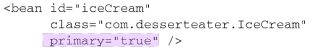
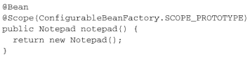
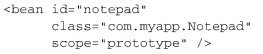
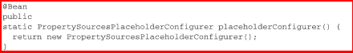

# 3高级装配

> 如何在开发、测试和QA阶段配置不同的数据库环境

## 3.1 环境与Profile

### 配置profile bean  

> Spring是在运行时再来确定环境相关的bean哪些需要创建哪些不需要创建
>
> Spring引入了`bean profile`的功能。 要使用profile， 你**首先要将所有不同的bean定义整理到一个或多个profile之中， 在将应用部署到每个环境时， 要确保对应的profile处于激活（active） 的状态**。  

- **Java配置中**

可以使用`@Profile`注解指定某个bean属于哪一个profile：

> 只有当规定的profile激活时， 相应的bean才会被创建， 但是可能会有其他的bean并没有声明在一个给定的profile范围内。 没有指定profile的bean始终都会被创建， 与激活哪个profile没有关系。  
>
> `@Profile("dev")`注解如果应用在了**类级别上**。 它会告诉Spring这个**配置类中的bean只有在`dev profile`激活时才会创建**。 如果dev profile没有激活的话， 那么带有@Bean注解的方法都会被忽略掉。  

- **在XML中配置profile  **

可以通过`<beans>`元素的·`profile属性`， 在XML中配置profile bean

还可以在根`<beans>`元素中嵌套定义`<beans>`元素， 而不是为每个环境都创建一个profile XML文件。 这能够将所有的profile bean定义放到同一个XML文件中  

### 激活profile

> Spring在确定哪个profile处于激活状态时， 需要依赖两个独立的属性： `spring.profiles.active`和`spring.profiles.default`。   有多种方式来设置这两个属性：
>
> - 作为DispatcherServlet的初始化参数；
> - 作为Web应用的上下文参数；
> - 作为JNDI条目；
> - 作为环境变量；
> - 作为JVM的系统属性；
> - 在集成测试类上， 使用@ActiveProfiles注解设置。  

## 3.2 自动装配的歧义性

> 仅有一个bean匹配所需的结果时， 自动装配才是有效的。 如果不仅有一个bean能够匹配结果的话， 这种歧义性会阻碍Spring自动装配属性、 构造器参数或方法参数  
>
> 当确实发生歧义性的时候，可以将可选bean中的某一个设为**首选（`primary`） 的bean**， 或者使用限定符（`qualifier`） 来帮助Spring将可选的bean的范围缩小到只有一个bean。  ·

- **标示首选bean**

`@Primary`能够与@Component组合**用在组件扫描的bean上**， 也可以与@Bean组合**用在Java配置的bean声明中**  

XML配置bean  :

- **限定自动装配的bean**  

`@Qualifier`注解是使用限定符的主要方式。 它可以与@Autowired和@Inject协同使用， 在注入的时候指定想要注入进去的是哪个bean。  

> 为@Qualifier注解所设置的参数就是想要注入的bean的ID。   (这是基于限定符是bean ID的方式)
>
> 可以为bean设置**自己的限定符**， 而不是依赖于将bean ID作为限定符。 在这里所需要做的就是在**bean声明上添加**`@Qualifier`注解。  
>
> 
>
> 装配：在注入的地方或者在配置类中
>
> 

## 3.3 bean的作用域

Spring定义了多种作用域， 可以基于这些作用域创建bean， 包括：

- 单例（Singleton） ： 在整个应用中， 只创建bean的一个实例。
- 原型（Prototype） ： 每次注入或者通过Spring应用上下文获取的时候， 都会创建一个新的bean实例。
- 会话（Session） ： 在Web应用中， 为每个会话创建一个bean实例。
- 请求（Rquest） ： 在Web应用中， 为每个请求创建一个bean实例  

> 在默认情况下， Spring应用上下文中所有bean都是作为以单例（singleton） 的形式创建的  
>
> 如果选择其他的作用域， 要使用@Scope注解， 它可以与@Component或@Bean一起使用。 

- **组件扫描方式：**

 也可以使用`@Scope("prototype")  `

- **Java配置方式：**

- **XML来配置bean  ：**

## 3.4 运行时注入

### 注入外部的值  

在配置文件里配置 Bean 时, 有时需要在 Bean 的配置里混入系统部署的细节信息(例如: 文件路径, 数据源配置信息等). 而这些部署细节实际上需要和 Bean 配置相分离

在Spring中， 处理外部值的最简单方式就是声明属性源并通过Spring的`Environment`来检索属性。   

`@PropertySource	`引用了类路径中一个名为app.properties的文件:   

#### Spring的Environment  

> 直接从Environment中检索属性是非常方便的， 尤其是在Java配置中装配bean的时候。 但是， Spring也提供了通过占位符装配属性的方法， 这些占位符的值会来源于一个属性源。  

#### 属性占位符

Spring一直支持将属性定义到外部的属性的文件中， 并使用占位符值将其插入到Spring bean中。 在Spring装配中， 占位符的形式为使用“`${... }`”包装的属性名称  

XML方式：

组件扫描和自动装配方式：@Value注解  

Spring 提供了一个` PropertyPlaceholderConfigurer `的 **BeanFactory 后置处理器**, 这个处理器允许用户将 Bean 配置的部分内容外移到**属性文件**中. 可以在 Bean 配置文件里使用形式为` ${var} `的变量, PropertyPlaceholderConfigurer 从属性文件里加载属性, 并使用这些属性来替换变量.

Java配置：

XML配置：

Spring 2.5 之后: 可通过` <context:property-placeholder> `元素简化:

即：

> 解析外部属性能够**将值的处理推迟到运行时**， 但是它的关注点在于根据名称解析来自于Spring Environment和属性源的属性。   

### Spring表达式：SpEL

Spring 表达式语言（简称SpEL）：是一个支持运行时查询和操作对象图的强大的表达式语言。

语法类似于 EL：SpEL 使用` #{…} `作为定界符，所有在大框号中的字符都将被认为是 SpEL

SpEL 为 bean 的属性进行动态赋值提供了便利

通过 SpEL 可以实现：

- 通过 bean 的 id 对 bean 进行引用

- 调用方法以及引用对象中的属性

- 计算表达式的值

- 正则表达式的匹配

> SpEL表达式要放到“`#{ ... }`”之中，属性占位符需要放到“`${ ... }`”之中  

#### SpEL：字面量

字面量的表示：

整数：`<property name="count" value="#{5}"/>`

小数：`<property name="frequency" value="#{89.7}"/>`

科学计数法：`<property name="capacity" value="#{1e4}"/>`

String可以使用单引号或者双引号作为字符串的定界符号：`<property name="name" value="#{'Chuck'}"/>` 或 `<property name='name' value='#{"Chuck"}'/>`

Boolean：`<property name="enabled" value="#{false}"/>`

#### SpEL：引用 Bean、属性和方法

引用其他对象：

引用其他对象的属性

调用其他方法，还可以链式操作

调用**静态方法或静态属性**：通过` T() `调用一个类的静态方法，它将返回一个 Class Object，然后再调用相应的方法或属性：

#### SpEL支持的运算符号

算数运算符：`+, -, *, /, %, ^`

加号还可以用作字符串连接：

比较运算符：` <, >, ==, <=, >=, lt, gt, eq, le, ge`

逻辑运算符号： and, or, not, |

if-else 运算符：?: (ternary), ?: (Elvis)

if-else 的变体

正则表达式：matches

