# `05 构建Spring Web应用程序

Spring MVC基于模型-视图-控制器（Model-View-Controller， MVC） 模式实现  

## 1Spring MVC

用户在Web浏览器中点击链接或提交表单的时候， 请求就开始工作了  ，请求使用Spring MVC所经历的所有站点 ：

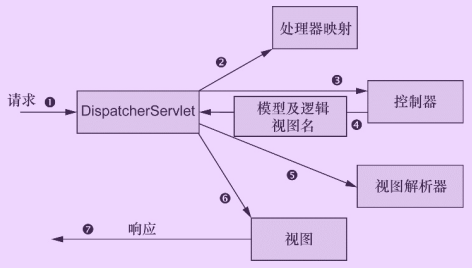

- Spring MVC所有的请求都会通过一个前端控制器 Servlet（DispatcherServlet）将请求发送给Spring MVC控制器（controller）进行实际的逻辑处理 。   
- 应用程序中可能会有多个控制器， DispatcherServlet需要知道应该将请求发送给哪个控制器。 所以DispatcherServlet以会查询一个或多个处理器映射（handler mapping） 来确定请求的下一站在哪里。 处理器映射会根据请求所携带的URL信息来进行决策。 
- 一旦选择了合适的控制器， DispatcherServlet会将请求发送给选中的控制器 。 到了控制器， 请求会卸下其负载（用户提交的信息） 并耐心等待控制器处理这些信息   
- 控制器在完成逻辑处理后， 通常会产生一些信息， 这些信息需要返回给用户并在浏览器上显示。 这些信息被称为模型（model） 。   
- 控制器所做的最后一件事就是将模型数据打包， 并且标示出用于渲染输出的视图名。 它接下来会将请求连同模型和视图名发送回DispatcherServlet 。  
- 最后一站是视图的实现（可能是JSP） ， 在这里它交付模型数据。 请求的任务就完成了。 视图将使用模型数据渲染输出， 这个输出会通过响应对象传递给客户端  

## 2JavaConf搭建Spring MVC

要了解Spring MVC框架的工作机理，必须回答以下3个问题。

1. DispatcherServlet 框架如何截获特定的HTTP 请求并交由Spring MVC框架处理？
2. 位于Web层的Spring容器（`WebApplicationContext`)如何与位于业务层的Spring容器（`ApplicationContext`)建立关联，以使Web层的Bean可以调用业务层的Bean?
3. 如何初始化SpringMVC的各个组件，并将它们装配到DispatcherServlet中?

> ##### HelloWorld程序步骤：
>
> - 加入 jar 包
> - 在` web.xml `中配置 DispatcherServlet
> - 加入 `Spring MVC `的配置文件
> - 编写处理请求的`处理器`，并标识为处理器
> - 编写`视图`  

### 2.1 配置DispatcherServlet  

按照传统的方式， 像DispatcherServlet这样的Servlet会配置在`web.xml`文件中， 这个文件会放到应用的WAR包里面

也可以使用Java将DispatcherServlet配置在Servlet容器中；通过`AbstractAnnotationConfigDispatcherServletInitializer`来配置DispatcherServlet是传统web.xml方式的替代方案。   

  

> - 在Servlet 3.0环境中， 容器会在类路径中查找实现`javax.servlet.ServletContainerInitializer`接口的类，如果能发现的话， 就会用它来配置Servlet容器。在Spring中扩展`AbstractAnnotationConfigDispatcherServletInitializer`的任意类在容器启动时候都会被自动发现，并**配置DispatcherServlet上下文和Spring应用上下文**。  
> - `getServletMappings()`， 它会将一个或多个路径映射到DispatcherServlet上。 在本例中， 它映射的是“/”， 这表示它会是应用的默认Servlet。 它会处理进入应用的所有请求  
> - `getServletConfigClasses()`方法中， 我们要求DispatcherServlet加载应用上下文时， 使用定义在WebConfig配置类（使用Java配置） 中的bean。  
> - 本例中， 根配置定义在RootConfig中， DispatcherServlet的配置声明在WebConfig中  

-----

**DispatcherServlet和一个Servlet监听器（也就是ContextLoaderListener） 的关系**  

当DispatcherServlet启动的时候， 它会**创建`webApplicationContext`应用上下文**，并加载配置文件或配置类中所声明的bean。 

在Spring Web应用中， 通常还会有另外一个**应用上下文`applicationContext`**，这个应用上下文是**由ContextLoaderListener创建的**。   

我们希望**DispatcherServlet加载包含Web组件的bean， 如控制器、 视图解析器以及处理器映射， ContextLoaderListener要加载应用中的其他bean。 这些bean通常是驱动应用后端的中间层和数据层组件**。  

实际上，` AbstractAnnotationConfigDispatcherServletInitializer`会同时创建`DispatcherServlet`和`ContextLoaderListener ` 

- `GetServletConfigClasses()`方法返回的带有@Configuration注解的类将会用来定义**DispatcherServlet应用上下文中的**
  **bean。**
-  `getRootConfigClasses()`方法返回的带有@Configuration注解的类将会用来配置**ContextLoaderListener创建的应用上下文中的bean。**  

---

### 2.2 启用Spring MVC

Spring使用XML进行配置可以使用`<mvc:annotation-driven>`启用注解驱动的Spring MVC  

也可以基于Java进行配置 ：使用`@EnableWebMvc`注解


还需要：

- **配置视图解析器**。 如果没有配置， Spring默认会使用BeanNameView-Resolver， 这个视图解析器会查找ID与视
  图名称匹配的bean， 并且查找的bean要实现View接口， 它以这样的方式来解析视图。
- **启用组件扫描**。 不启用的结果就是， Spring只能找到显式声明在配置类中的控制器。
- **启用静态资源处理**，不配置的话， DispatcherServlet会映射为应用的默认Servlet， 所以它会处理所有的请求， 包括对静态资源的请求， 如图片和样式表（在大多数情况下， 这可能并不是你想要的效果）  

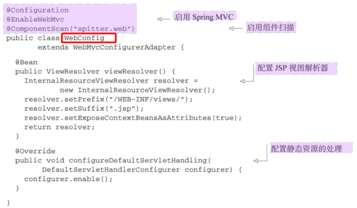

> 添加了@Component-Scan注解， 因此将会扫描spitter.web包来查找组件  
>
> 添加了一个ViewResolver bean,在查找的时候， 它会在视图名称上加一个特定的前缀和后缀  
>
> 重写了其configureDefaultServletHandling()方法 ，要求DispatcherServlet将对静态资源的请求转发到Servlet容器中默认的Servlet上， 而不是使用DispatcherServlet本身来处理此类请求。  

Web相关的配置通过DispatcherServlet创建的应用上下文都已经配置好了， 因此现在的`RootConfig`相对很简单：  

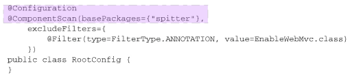

## 2编写控制器

控制器只是方法上添加了`@RequestMapping`注解的类， 这个注解声明了它们所要处理的请求。  


### mock测试控制器  

Spring现在包含了一种`mock Spring MVC`并针对控制器执行HTTP请求的机制  


### 定义类级别的请求处理  

可以拆分@RequestMapping， 并将其路径映射部分放到类级别上。  

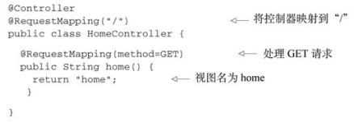

> @RequestMapping的value属性能够接受一个String类型的数组  

### 传递模型数据到视图中  

需要定义一个数据访问的Repository。 为了实现解耦以及避免陷入数据库访问的细节之中， 我们将**Repository定义为一个接口**， 并在稍后实现它  


编写controller类


> Model实际上就是一个Map（也就是key-value对的集合） ， 它会传递给视图， 这样数据就能渲染到客户端了。 当调用addAttribute()方法并且不指定key的时候， 那么key会根据值的对象类型推断确定。  

当视图是JSP的时候， 模型数据会作为请求属性放到请求（request）之中。 因此， 在spittles.jsp文件中可以使用JSTL（JavaServer PagesStandard Tag Library） 的·`<c:forEach>`标签渲染spittle列表  

## 3接受请求的输入  

Spring MVC允许以多种方式将客户端中的数据传送到控制器的处理器方法中， 包括：

- 查询参数（Query Parameter） 。
- 表单参数（Form Parameter） 。
- 路径变量（Path Variable） 。  

### 查询参数@RequestParam

形如：`/spittles/max=23000&count=50`，使用`@RequestParam`注解  


如果同时处理有参数的和无参数的：

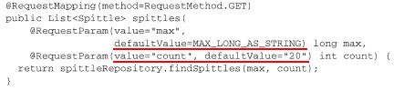

> 因为**查询参数都是String类型**的， 因此defaultValue属性需要String类型的值。 因此， 使用Long.MAX_VALUE是不行的。 我们可以将Long.MAX_VALUE转换为名为MAX_LONG_-AS_STRING的String类型常量：  
>
> 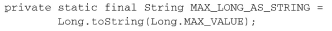
>
> 尽管defaultValue属性给定的是String类型的值， 但是当绑定到方法的max参数时， 它会转换为Long类型。  

### 路径参数@PathVariable

形如：`/spittles/12345  `

> 对`/spittles/12345`发起GET请求要优于对`/spittles/show?spittle_id=12345`发起请求。 前者能够识别出要查询的资源， 而后者描述的是带有参数的一个操作——本质上是通过HTTP发起的RPC。  

Spring MVC允许我们在`@RequestMapping`路径中添加**占位符**。 占位符的名称要用大括号（“{”和“}”） 括起来。路径中的其他部分要与所处理的请求完全匹配， 但是占位符部分可以是任意的值。  

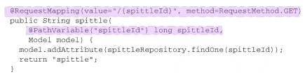

> `@PathVariable("spittleId")`注解表明在请求路径中， 不管占位符部分的值是什么都会传递到处理器方法的spittleId参数  
>
> 如果@PathVariable中没有value属性的话， 它会假设占位符的名称与方法的参数名相同。  

### 表单对象绑定

> 使用表单分为两个方面： 展现表单；处理用户通过表单提交的数据。  

- 控制器编写


> 当处理注册表单的POST请求时， 控制器需要接受表单数据并将表单数据保存为Spitter对象。 
>
> Spitter对象作为参数有firstName、 lastName、 userName和password属性， 这些属性将会使用**请求中同名的参数进行填充，并且支持级联属性**  ，`/register.jsp?firstName=tom&lastName=xxx&userName=xxx&password=xxx`
>
> 最后， **为了防止重复提交**（用户点击浏览器的刷新按钮有可能会发生这种情况） ， 应该将浏览器**重定向**到新创建用户的基本信息页面。在本例中， 它将会重定向到用户基本信息的页面。  
>
> 视图格式中以“forward:”作为前缀时， 请求将会前往（forward） 指定的URL路径， 而不再是重定向。  
>

> 在使用POJO类型数据绑定时，前端请求的参数名（本例中指form表单内各元素的name属性值）必须与要绑定的POJO类中的属性名一样，这样才会自动将请求数据绑定到POJO对象中，否则后台接收的参数值为null。

- 注册表单：


> 这里的`<form>`标签中并没有设置action属性。 在这种情况下， 当表单提交时， 它会提交到与展现时相同的URL路径上。 也就是说， 它会提交到`/spitter/register`上，即需要处理post请求。  

### @RequestHeader 

请求头包含了若干个属性，服务器可据此获知客户端的信息，通过 @RequestHeader 即可将请求头中的属性值绑定到处理方法的入参中  

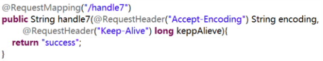

### @CookieValue 

@CookieValue 可让处理方法入参绑定某个 Cookie 值  

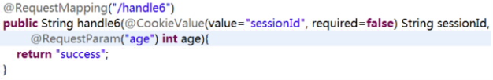

### 使用 Servlet API 作为入参  

- HttpServletRequest
-  HttpServletResponse
-  HttpSession
- java.security.Principal
- Locale
- InputStream
- OutputStream
- Reader
- Writer  

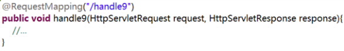


### 校验表单 

使用Spring对Java校验API（`Java Validation API`， 又称JSR-303） 的支持 ，只要保证在类路径下包含这个Java API的实现即可， 比如Hibernate Validator。

Java校验API所提供的校验注解：

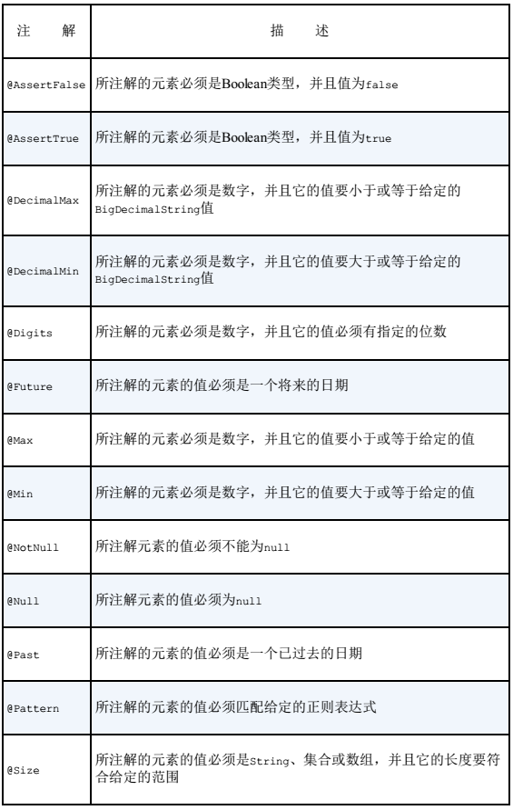

- eg：在Spitter域对象上添加约束

  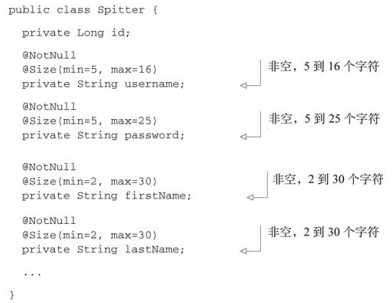

- 控制器编写

  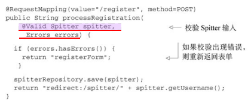

> Spitter参数添加了`@Valid`注解， 这会告知Spring， 需要确保这个对象满足校验限制。  
>
> 如果有校验出现错误的话， 那么这些错误可以通过`Errors对象`进行访问， 现在这个对象已作为processRegistration() 方法的参数。 （很重要一点需要注意， **Errors参数要紧跟在带有@Valid注解的参数后面**， @Valid注解所标注的就是要检验的参数。 ）  

- 视图层展现错误信息

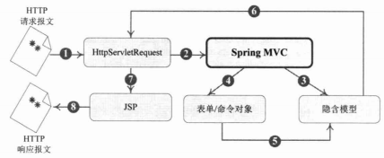

可以通过`<form:errors path="*">`展示页面所有错误信息；`<form:errors path="属性名">`标签展示一个属性验证错误信息

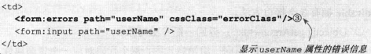

## 4处理模型数据

Spring MVC 提供了以下几种途径输出模型数据：

- **ModelAndView**: 处理方法返回值类型为 ModelAndView时, 方法体即可**通过该对象添加模型数据**
- **Map 及 Model**: 入参为org.springframework.ui.Model、org.springframework.ui。ModelMap 或 java.uti.Map 时，处理方法返回时，Map中的数据会**自动添加到模型中**。
-  @SessionAttributes: 将模型中的某个属性暂存到HttpSession 中，以便**多个请求之间可以共享这个属性**
- @ModelAttribute: 方法入参标注该注解后, **入参的对象就会放到数据模型中**  

### ModelAndView  

控制器处理方法的返回值如果为 ModelAndView, 则其既包含视图信息，也包含模型数据信息。
添加模型数据:

- `MoelAndView addObject(String attributeName, Object attributeValue)`
- `ModelAndView addAllObject(Map<String, ?> modelMap)`

设置视图:

- `void setView(View view)`
- `void setViewName(String viewName) ` 


### Map 及 Model  

Spring MVC 在内部使用了一个org.springframework.ui.Model 接口存储模型数据  

具体步骤

- Spring MVC 在调用方法前会创建一个隐含的模型对象作为模型数据的存储容器。
- 如果方法的入参为 Map 或 Model 类型，Spring MVC 会将隐含模型的引用传递给这些入参。在方法体内，开发者可以通过这个入参对象访问到模型中的所有数据，也可以向模型中添加新的属性数据  


### @SessionAttributes  

若希望在多个请求之间共用某个模型属性数据，则可以在控制器类上标注一个 @SessionAttributes, Spring MVC将在模型中对应的属性暂存到 HttpSession 中。

- @SessionAttributes 除了可以**通过属性名**指定需要放到会话中的属性外，还可以**通过模型属性的对象类型**指定哪些模型属性需要放到会话中
- @SessionAttributes(types=User.class) 会将隐含模型中所有类型为 User.class 的属性添加到会话中。
- @SessionAttributes(value={“user1”, “user2”})
- @SessionAttributes(types={User.class, Dept.class})
- @SessionAttributes(value={“user1”, “user2”}, types={Dept.class})  


### @ModelAttribute

在方法定义上使用 @ModelAttribute 注解：Spring MVC在调用目标处理方法前，会先逐个调用在方法级上标注了@ModelAttribute 的方法。

在方法的入参前使用 @ModelAttribute 注解：

- 可以从隐含对象中获取隐含的模型数据中获取对象，再将请求参数绑定到对象中，再传入入参
- 将方法入参对象添加到模型中  

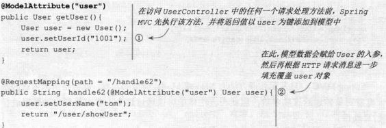

## 5Spring MVC配置的替代方案  

#### 自定义DispatcherServlet配置  


### 4.1 web.xml中声明DispatcherServlet  

**web.xml：**

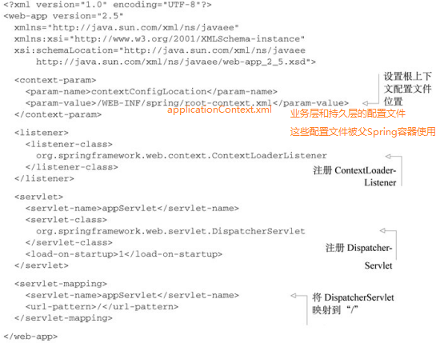

> **ContextLoaderListener和DispatcherServlet各自都会加载一个Spring应用上下文（Bean容器）**。ContextLoaderListener和DispatcherServlet都会在Web容器启动的时候加载一下bean配置. 区别在于:
>
> - **ContextLoaderListener一般会加载整个Spring容器相关的bean配置管理**(如: Log, Service, Dao, PropertiesLoader, etc.),使用·`ApplicationContext`作为上下文
> - **DispatcherServlet一般会加载MVC相关的bean配置管理**(如: ViewResolver, Controller, MultipartResolver, ExceptionHandler, etc.)。默认使用`WebApplicationContext`作为上下文.
>
> 上下文参数contextConfigLocation是一个ServletContextListener，它通过contextConfigLocation 参数所指定的Spring配置文件启动“业务层”的Spring容器。 如程序所示， 根上下文会从“`/WEB-INF/spring/root-context.xml`”中加载bean定义。  
>
> DispatcherServlet会根据Servlet的名字找到一个文件， 并**基于该文件加载应用上下文**。 在程序清单中， Servlet的名字是appServlet， 因此DispatcherServlet会从“`/WEBINF/appServlet-context.xml（<servlerName>-context.xml）`”文件中加载其应用上下文 ；
>
> **Spring MVC的上下文中配置的是：视图解析器、控制器（自动扫描组件）、静态资源处理器等**
>
> > 值得注意的是, DispatcherServlet的上下文仅仅是Spring MVC的上下文, 而ContextLoaderListener的上下文则对整个Spring都有效. 一般Spring web项目中同时会使用这两种上下文. 
> >
> > 也可以将所有配置如数据源、业务层、整合框架配置等都放在SpringMVC配置文件中（使用import），就不需要Spring配置文件了

> > - Spring的ContextLoaderListener所创建出来的ApplicationContext和Spring MVC DispatcherServlet所创建出来的WebApplicationContext是父子关系，FrameworkServlet在实例化对应的webapplicationContext后通过setParent将从ServletContext中获取到的**ContextLoaderListener创建的applicaitonContext设置成父上下文**，然后加载在对应的xml配置文件对其初始化。
> >
> > - 在这里里，“Web层”Spring容器将作为“业务层”Spring容器的子容器，即“Web层”容器可以引用“业务层”容器的Bean，而“业务层”容器却访问不到“Web层”容器的Bean（service类不可以引用controller类）。
> >
> > - 所以在使用Spring MVC时启用自动检测功能，应在**applicationContext.xml里只component-scan非Controller的类，而在Spring MVC里只component-scan Controller类**
> >
> > - ```xml
> >   <--applicationContext.xml-->
> >   <context:component-scan base-package="com.test">
> >      <context:exclude-filter  expression="org.springframework.stereotype.Controller" type="annotation" />
> >      <context:exclude-filter type="annotation" expression="org.springframework.web.bind.annotation.ControllerAdvice" />
> >   </context:component-scan>
> >   
> >   <--dispatcher-servlet.xml-->
> >   <context:component-scan base-package="com.test.web" use-default-filters="false">
> >       <context:include-filter expression="org.springframework.stereotype.Controller"
> >           type="annotation" />
> >       <context:include-filter type="annotation" expression="org.springframework.web.bind.annotation.ControllerAdvice" />
> >   </context:component-scan>
> >   ```


### 4.2 基于Java配置的DispatcherServlet

要在Spring MVC中使用基于Java的配置， 我们需要告诉DispatcherServlet和ContextLoaderListener使用AnnotationConfigWebApplicationContext， 这是一个WebApplicationContext的实现类， 它会加载Java配置类， 而不是使用XML。 要实现这种配置， 我们可以设置contextClass上下文参数以及DispatcherServlet的初始化参数。  

设置**web.xml**使用基于Java的配置 ：


## 处理方法的数据绑定

在数据绑定过程中，Spring MVC框架会通过数据绑定组件（DataBinder）将请求参数串的内容进行类型转换，然后将转换后的值赋给控制器类中方法的形参，这样后台方法就可以正确绑定并获取客户端请求携带的参数了。

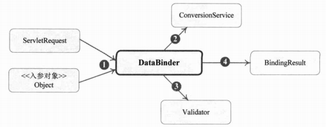

1. Spring MVC将ServletRequest对象传递给DataBinder。
2. 将处理方法的入参对象传递给DataBinder。
3. DataBinder调用ConversionService组件进行**数据类型转换、数据格式化**等工作，并将ServletRequest对象中的消息填充到参数对象中。
4. 调用Validator组件对已经绑定了请求消息数据的参数对象进行数据合法性校验。
5. 校验完成后会生成数据绑定结果BindingResult对象，Spring MVC会将BindingResult对象中的内容赋给处理方法的相应参数。

###  简单数据绑定

---

绑定默认数据类型

当前端请求的参数比较简单时，可以在后台方法的形参中直接使用SpringMVC提供的默认参数类型进行数据绑定。常用的默认参数类型如下。

- HttpServletRequest：通过request对象获取请求信息。· 
- HttpServletResponse：通过response处理响应信息。· 
- HttpSession：通过session对象得到session中存储的对象。· 
- Model/ModelMap:Model是一个接口，ModelMap是一个接口实现，作用是将model数据填充到request域。

> 有时候前端请求中参数名和后台控制器类方法中的形参名不一样，这就会导致后台无法正确绑定并接收到前端请求的参数。为此，Spring MVC提供了@RequestParam注解来进行间接数据绑定。

.......


## REST

REST：即 Representational State Transfer。**（资源）表现层状态转化**。是目前最流行的一种互联网软件架构。它结构清晰、符合标准、易于理解、扩展方便，所以正得到越来越多网站的采用

**资源（Resources）：网络上的一个实体，或者说是网络上的一个具体信息。**它可以是一段文本、一张图片、一首歌曲、一种服务，总之就是一个具体的存在。可以用一个URI（统一资源定位符）指向它，每种资源对应一个特定的 URI 。要获取这个资源，访问它的URI就可以，因此 URI 即为每一个资源的独一无二的识别符。

**表现层（Representation）：把资源具体呈现出来的形式，叫做它的表现层（Representation）**。比如，文本可以用 txt 格式表现，也可以用 HTML 格式、XML 格式、JSON 格式表现，甚至可以采用二进制格式。

**状态转化（State Transfer）**：每发出一个请求，就代表了客户端和服务器的一次交互过程。HTTP协议，是一个无状态协议，即所有的状态都保存在服务器端。因此，**如果客户端想要操作服务器，必须通过某种手段，让服务器端发生“状态转化”（State Transfer）**。而这种转化是建立在表现层之上的，所以就是 “表现层状态转化”。具体说，就是**HTTP 协议里面，四个表示操作方式的动词：GET、POST、PUT、DELETE。它们分别对应四种基本操作：GET 用来获取资源，POST 用来新建资源，PUT 用来更新资源，DELETE 用来删除资源。**  

示例：

- `/order/1` HTTP GET ：得到 id = 1 的 order  
- `/order/1` HTTP DELETE：删除 id = 1的 order   
- `/order/1 `HTTP PUT：更新id = 1的 order   
- `/order` HTTP POST：新增 order

 **HiddenHttpMethodFilter**：浏览器 form 表单只支持 GET与 POST 请求，而DELETE、PUT 等 method 并不支
持，Spring3.0 添加了一个**过滤器**，可以将这些请求转换为标准的 http 方法，使得支持 GET、POST、PUT 与DELETE 请求。  


### 处理JSON

1. 加入 jar 包：  

2. 编写目标方法，使其返回 JSON 对应的对象或集合

3. 在方法上添加 @ResponseBody 注解  

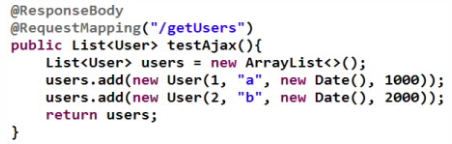

`HttpMessageConverter<T>` 是 Spring3.0 新添加的一个接口，负责将请求信息转换为一个对象（类型为 T），将对象（类型为 T）输出为响应信息  

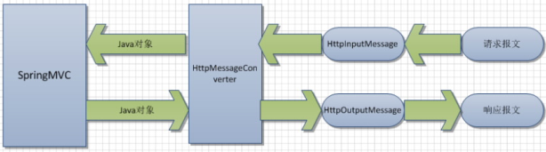

使用 HttpMessageConverter<T> 将请求信息转化并绑定到处理方法的入参中或将响应结果转为对应类型的响应信息，Spring 提供了两种途径：

- 使用 @RequestBody / @ResponseBody 对处理方法进行标注
- 使用 HttpEntity<T> / ResponseEntity<T> 作为处理方法的入参或返回值

当控制器处理方法使用到 @RequestBody/@ResponseBody 或HttpEntity<T>/ResponseEntity<T> 时, Spring 首先根据请求头或响应头的Accept 属性选择匹配的 HttpMessageConverter, 进而根据参数类型或泛型类型的过滤得到匹配的 HttpMessageConverter, 若找不到可用的HttpMessageConverter 将报错

@RequestBody 和 @ResponseBody 不需要成对出现  


### 文件上传

Spring MVC 为文件上传提供了直接的支持，这种支持是通过即插即用的 MultipartResolver 实现的。Spring 用
Jakarta Commons FileUpload 技术实现了一个MultipartResolver 实现类：CommonsMultipartResovler

Spring MVC 上下文中默认没有装配 MultipartResovler，因此默认情况下不能处理文件的上传工作，如果想使用 Spring的文件上传功能，需现在上下文中配置 MultipartResolver  

上下文：

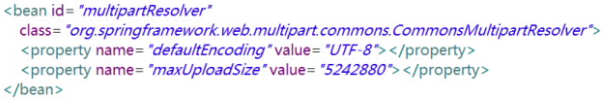

JSP：

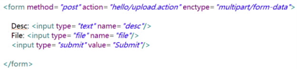

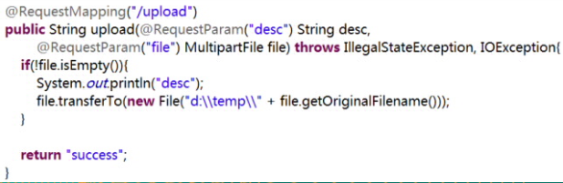


## 拦截器

Spring MVC也可以使用拦截器对请求进行拦截处理，用户可以自定义拦截器来实现特定的功能，自定义的拦截器必须实现`HandlerInterceptor`接口

- `preHandle()`：这个方法在业务处理器处理请求之前被调用，在该方法中对用户请求 request 进行处理。如果程序员决定该拦截器对请求进行拦截处理后还要调用其他的拦截器，或者是业务处理器去进行处理，则返回true；如果程序员决定不需要再调用其他的组件去处理请求，则返回false。
- `postHandle()`：这个方法在业务处理器处理完请求后，但是DispatcherServlet 向客户端返回响应前被调用，在该方法中对用户请求request进行处理。
- `afterCompletion()`：这个方法在 DispatcherServlet 完全处理完请求后被调用，可以在该方法中进行一些资源清理的操作。  

配置自定义拦截器  ：

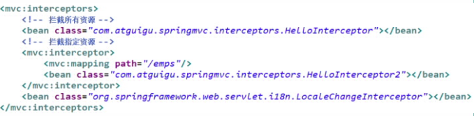


> （1）过滤器(Filter)：它依赖于servlet容器，通过`web.xml`配置。在实现上，基于函数回调，它可以对几乎所有请求进行过滤，但是缺点是**一个过滤器实例只能在容器初始化时调用一次**。使用过滤器的目的，是用来做一些过滤操作，获取我们想要获取的数据，比如：在Javaweb中，对传入的request、response提前过滤掉一些信息，或者提前设置一些参数，然后再传入servlet或者Controller进行业务逻辑操作。通常用的场景是：**在过滤器中修改字符编码（CharacterEncodingFilter）、在过滤器中修改HttpServletRequest的一些参数（XSSFilter(自定义过滤器)），如：过滤低俗文字、危险字符等**
>
> 2）拦截器（Interceptor）：通过`springMVC-servlet.xml`配置它依赖于web框架，在SpringMVC中就是依赖于SpringMVC框架。在实现上,基于Java的反射机制，**属于面向切面编程（AOP）的一种运用**，就是**在service或者一个方法前，调用一个方法，或者在方法后，调用一个方法**，比如动态代理就是拦截器的简单实现，在调用方法前打印出字符串（或者做其它业务逻辑的操作），也可以在调用方法后打印出字符串，甚至在抛出异常的时候做业务逻辑的操作。由于拦截器是基于web框架的调用，因此可以使用Spring的依赖注入（DI）进行一些业务操作，同时**一个拦截器实例在一个controller生命周期之内可以多次调用**。但是缺点是**只能对controller请求进行拦截，对其他的一些比如直接访问静态资源的请求则没办法进行拦截处理**。
>
> Filter的执行顺序在Interceptor之前，具体的流程见下图:
>
> 
>
> 1. 过滤器和拦截器触发时机不一样:
>    1. 过滤器是在**请求进入容器后，但请求进入servlet之前进行预处理的**。请求结束返回也是，是在**servlet处理完后，返回给前端之前**。
>
> 