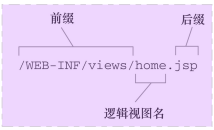
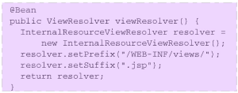
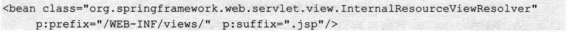
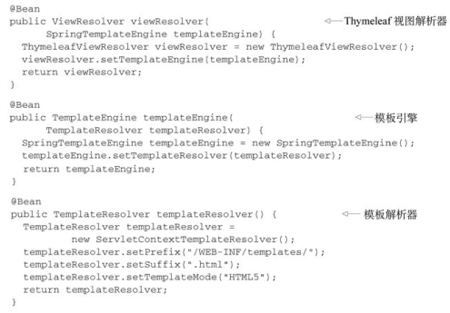
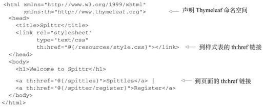

# 06渲染web视图

**视图的作用是渲染模型数据，将模型里的数据以某种形式呈现给客户**。视图对象可以是常见的JSP，还可以是Excel或PDF等形式不一的媒体形式。

为了实现视图模型和具体实现技术的解耦，Spring在org.springframework.web.servlet包中定义了一个高度抽象的View接口，该接口中定义了两个方法。

- String getContentType）：视图对应的MIME类型，如text/html、image/jpeg等。
- void render(Map model,HttpServletRequest request,HttpServletResponse response):将模型数据以某种MIME类型渲染出来。

请求处理方法执行完成后，最终返回一个 ModelAndView对象。对于那些返回 String，View 或 ModeMap 等类型的处理方法，Spring MVC 也会在内部将它们装配成一个ModelAndView 对象，它包含了逻辑名和模型对象的视图  

**视图对象是一个Bean，通常情况下，视图对象由视图解析器负责实例化**。由于视图Bean是无状态的，所以它们不会有线程安全的问题。

## 1理解视图解析

Spring该如何确定使用哪一个视图实现来渲染模型呢？ 这就是Spring视图解析器的任务了。  

Spring MVC定义了一个名为ViewResolver的接口  ：传入一个视图名和Locale对象，返回一个View实例  


View接口的任务就是接受模型以及Servlet的`request`和`response`对象，并将输出结果渲染到`response`中：  


Spring提供了多个内置的ViewResolver和View的实现。 

## 2创建JSP视图  

InternalResourceViewResolver会将视图名解析为JSP文件。  

### 配置适用于JSP的视图解析器  

`InternalResourceViewResolver`所采取的方式遵循一种约定， 会在视图名上添加前缀和后缀， 进而确定一个Web应用中视图资源的物理路径。  



- @Bean注解  



- 基于XML的Spring配置  




## 3使用Thymeleaf  

Thymeleaf模板是原生的， 不依赖于标签库。 它能在接受原始HTML的地方进行编辑和渲染。 因为它没有与Servlet规范耦合， 因此Thymeleaf模板能够进入JSP所无法涉足的领域。  

### 配置Thymeleaf视图解析器  

为了要在Spring中使用Thymeleaf， 我们需要配置三个启用Thymeleaf与Spring集成的bean：

- `ThymeleafViewResolver`： 将逻辑视图名称解析为Thymeleaf模板视图；
- `SpringTemplateEngine`： 处理模板并渲染结果；
- `TemplateResolver`： 加载Thymeleaf模板。  

Java配置：



XML 配置：

```xml
<!--    模板解析器-->
    <bean id="templateResolver"
          class="org.thymeleaf.spring4.templateresolver.SpringResourceTemplateResolver">
        <property name="prefix" value="/WEB-INF/pages/" />
        <property name="suffix" value=".html" />
        <property name="templateMode" value="HTML" />
        <property name="cacheable" value="true" />
    </bean>
<!--    模板引擎-->
    <bean id="templateEngine"
          class="org.thymeleaf.spring4.SpringTemplateEngine">
        <property name="templateResolver" ref="templateResolver" />
        <property name="enableSpringELCompiler" value="true" />
    </bean>
<!--    視圖解析器-->
    <bean class="org.thymeleaf.spring4.view.ThymeleafViewResolver">
        <property name="templateEngine" ref="templateEngine" />
        <property name="order" value="1" />
        <property name="viewNames" value="*.html,*.xhtml" />
    </bean>
```


> TemplateResolver会最终定位和查找模板。 与之前配置InternalResource-ViewResolver类似， 它使用了prefix和suffix属性。 前缀和后缀将会与逻辑视图名组合使用， 进而定位Thymeleaf引擎。   

### [定义Thymeleaf模板](../../前端技术/Thymeleaf.md) 



#### 借助Thymeleaf实现表单绑定  

表单绑定是Spring MVC的一项重要特性。 它能够将表单提交的数据填充到命令对象中， 并将其传递给控制器， 而在展现表单的时候， 表单中也会填充命令对象中的值。  

---


> `th:class`属性会渲染为一个class属性， 它的值是根据给定的表达式计算得到的  
>
> `<input>`标签使用了th:field属性， 用来引用后端对象的firstName域。  
>
> 貌似使用`th:value`属性来设置`<input>`标签的value属性才是合理的。其实不然， 因为我们是在将这个输入域绑定到后端对象的firstName属性上， 因此使用`th:field`属性引用firstName域。通过使用`th:field`， 我们将value属性设置为firstName的值，同时还会将name属性设置为firstName。  