# 07Spring Security

## 1 简介

Spring Security是为基于Spring的应用程序提供声明式安全保护的安全性框架。  因为基于Spring框架， 所以Spring Security充分利用了依赖注入（dependency injection，DI） 和面向切面的技术。  

不管你想使用Spring Security保护哪种类型的应用程序， 第一件需要做的事就是将Spring Security模块添加到应用程序的类路径下。  应用程序的类路径下至少要包含Core和Configuration这两个模块。  

### 过滤Web请求  

Spring Security借助一系列Servlet Filter来提供各种安全性功能。  

`DelegatingFilterProxy`是一个特殊的Servlet Filter， 它本身所做的工作并不多。 只是将工作委托给一个javax.servlet.Filter实现类， 这个实现类作为一个`<bean>`注册在Spring应用的上下文中  

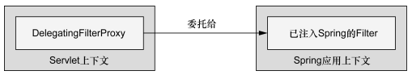

> DelegatingFilterProxy把Filter的处理逻辑委托给Spring应用上下文中所定义的一个代理Filter bean  

如果你喜欢在传统的web.xml中配置Servlet和Filter的话， 可以使用`<filter>`元素， 如下所示：  

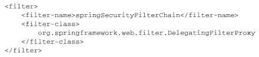

如果你希望借助WebApplicationInitializer以Java的方式来配置Delegating-FilterProxy的话， 那么我们所需要做的就是创建一个扩展的新配置类：  

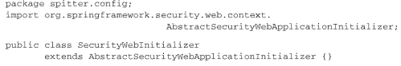

> 尽管我们可以重载它的appendFilters()或insertFilters()方法来注册自己选择的Filter， 但是要注册DelegatingFilterProxy的话， 我们并不需要重载任何方法。  

不管我们通过web.xml还是通过AbstractSecurityWebApplicationInitializer的子类来配置DelegatingFilterProxy， 它**都会拦截发往应用中的请求， 并将请求委托给ID为springSecurityFilterChain bean。**

springSecurityFilterChain本身是另一个特殊的Filter， 它也被称为`FilterChainProxy`。 它可以链接任意一个或多个其他的Filter。 Spring Security依赖一系列Servlet Filter来提供不同的安全特性。 但是， 你几乎不需要知道这些细节， 因为你不需要显式声明springSecurityFilterChain以及它所链接在一起的其他Filter。 当**我们启用Web安全性的时候， 会自动创建这些Filter。**  

### 编写简单的安全性配置  

新建配置类：启用Web安全性

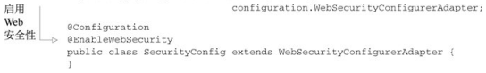

`@EnableWebSecurity`注解将会启用Web安全功能。 但它本身并没有什么用处， Spring Security必须配置在一个实现了WebSecurityConfigurer的bean中， 或者（简单起见） 扩展WebSecurityConfigurerAdapter。  

如果你的应用碰巧是使用Spring MVC开发的， 那么就应该考虑使用`@EnableWebMvcSecurity`替代  `@EnableWebSecurity`

我们可以通过重载WebSecurityConfigurerAdapter的**三个configure()方法**来配置Web安全性， 这个过程中会使用传递进来的参数设置行为。  

-----

为了让Spring Security满足我们应用的需求， 还需要再添加一点配置。具体来讲， 我们需要：

- 配置用户存储；
- 指定哪些请求需要认证， 哪些请求不需要认证， 以及所需要的权限；  
- 提供一个自定义的登录页面， 替代原来简单的默认登录页。  

## 2 选择查询用户详细信息的服务  

### 使用==基于内存==的用户存储  

因为我们的安全配置类扩展了WebSecurityConfigurerAdapter， 因此配置用户存储的最简单方式就是重载configure()方法， 并以  AuthenticationManagerBuilder有多个方法可以用来配置Spring Security对认证的支持。 通过inMemoryAuthentication()方法， 我们可以启用、 配置并任意填充基于内存的用户存储。  

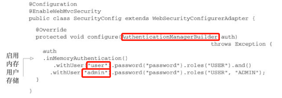

> 调用withUser()方法为内存用户存储添加新的用户 ；添加了两个用户， “user”和“admin”， 密码均为“password”。 “user”用户具有USER角色， 而“admin”用户具有ADMIN和USER两个角色。 我们可以看到， and()方法能够将多个用户的配置连接起来；roles()方法所给定的值都会添加一个“ROLE_”前缀， 并将其作为权限授予给用户。  
>
> roles()方法是authorities()方法的简写形式。 roles()方法所给定的值都会添加一个“ROLE_”前缀(完整的是ROLE_USER)， 并将其作为权限授予给用户。       

*对于调试和开发人员测试来讲， 基于内存的用户存储是很有用的， 但是对于生产级别的应用来讲， 这就不是最理想的可选方案了。 为了用于生产环境， 通常最好将用户数据保存在某种类型的数据库之中。*  

### 基于==数据库表==进行认证  

用户数据通常会存储在关系型数据库中， 并通过JDBC进行访问。 为了配置Spring Security使用以JDBC为支撑的用户存储， 我们可以使用jdbcAuthentication()方法， 所需的最少配置如下所示：   

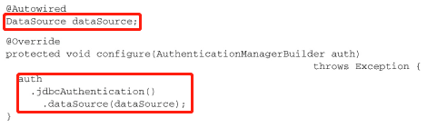

> 默认的最少配置能够让一切运转起来， 但是它对我们的数据库模式有一些要求。 它**预期存在某些存储用户数据的表**。源码内部通过SQL语句来查询用户信息、权限等   

也有可能你的数据库与上面所述并不一致， 那么你就会希望在查询上有更多的控制权。 如果是这样的话， 我们可以按照如下的方式配置自己的查询：  

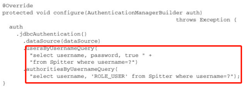

> 这里只重写了认证和基本权限的查询语句  
>
> 将默认的SQL查询替换为自定义的设计时， 很重要的一点就是要遵循查询的基本协议。 
>
> - 所有查询都将用户名作为唯一的参数。 
> - 认证查询会选取用户名、 密码以及启用状态信息。 
> - 权限查询会选取零行或多行包含该用户名及其权限信息的数据。
> - 群组权限查询会选取零行或多行数据， 每行数据中都会包含群组ID、 群组名称以及权限。  

-----

**使用转码后的密码**  

密码明文存储的话， 会很容易受到黑客的窃取。  

需要借助passwordEncoder()方法指定一个密码转码器（encoder） ：  

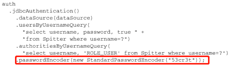

> passwordEncoder()方法可以接受Spring Security中PasswordEncoder接口的任意实现。 Spring Security的加密模块包括
> 了三个这样的实现： BCryptPasswordEncoder、 NoOpPasswordEncoder和StandardPasswordEncoder。  
>
> 数据库中的密码是永远不会解码的。 所采取的策略与之相反， 用户在登录时输入的密码会按照相同的算法进行转码， 然后再与数据库中已经转码过的密码进行对比。 这个对比是在PasswordEncoder的matches()方法中进行的。  

### 基于LDAP进行认证  

### 配置自定义的用户服务  

## 3 拦截请求

Spring Security默认的配置中， 会要求所有请求都要经过认证。   但是，并不是所有的请求都需要同等程度地保护。 有些请求需要认证， 而另一些可能并不需要。   

对每个请求进行细粒度安全性控制的关键在于重载·`configure(HttpSecurity)`方法。   

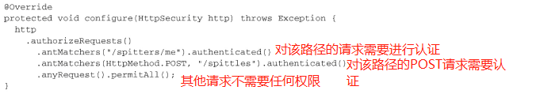

> authenticated()要求在执行该请求时， 必须已经登录了应用。 如果用户没有认证的话， Spring Security的Filter将会捕获该请求， 并将用户重定向到应用的登录页面。  
>
> 

### 使用Spring表达式进行安全保护  

借助access()方法， 我们也可以将SpEL作为声明访问限制的一种方式。  

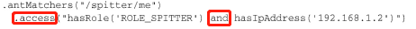

> 在掌握了Spring Security的SpEL表达式后， 我们就能够不再局限于基于用户的权限进行访问限制了。   

### 强制通道的安全性  

使用HTTP提交数据是一件具有风险的事情，数据没有经过加密，会泄漏。需要使用HTTPS。但是HTTPS通道也不是什么时候都需要用的

传递到configure()方法中的HttpSecurity对象， 除了具有authorizeRequests()方法以外， 还有一个requiresChannel()方法， 借助这个方法能够为各种URL模式声明所要求的通道。  

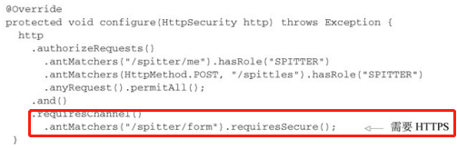

与之相反， 有些页面并不需要通过HTTPS传送 ，如首页：

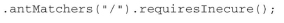

### 防止跨站请求伪造  

简单来讲， 如果一个站点欺骗用户提交请求到其他服务器的话，就会发生CSRF攻击  

Spring Security通过一个同步token的方式来实现CSRF防护的功能。 它将会拦截状态变化的请求（例如， 非GET、 HEAD、 OPTIONS和TRACE的请求） 并检查CSRF token。 如果请求中不包含CSRF token的话， 或者token不能与服务器端的token相匹配， 请求将会失败， 并抛出CsrfException异常  

这意味着在你的应用中， 所有的表单必须在一个“_csrf”域中提交token， 而且这个token必须要与服务器端计算并存储的token一致， 这样的话当表单提交的时候， 才能进行匹配  

## 4 认证用户  

重写configure(HttpSecurity)之前， 我们都能使用一个简单却功能完备的登录页。 但是， 一旦重写了configure(HttpSecurity)方法， 就失去了这个简单的登录页面  

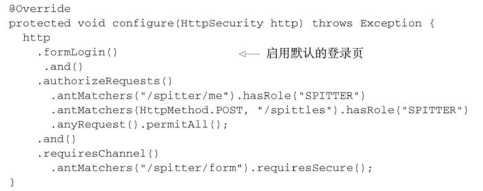

> formLogin()方法启用了基本的登录页功能，但是不美观  

### 添加自定义的登录页  

可以查看默认的登录页面提交信息：需要注意的一个关键点是·`<form>`提交到了什么地方。 同时还需要注意username和password输入域， 在你的登录页中， 需要同样的输入域。 最后， 假设没有禁用CSRF的话， 还需要保证包含了值为CSRFtoken的“_csrf”输入域。  

然后可以使用比如Themleaf等创建提交信息相同的自定义登录页面

### 启用HTTP Basic认证  

HTTP Basic认证（HTTP Basic Authentication） 会直接通过HTTP请求本身， 对要访问应用程序的用户进行认证。   

如果要启用HTTP Basic认证的话， 只需在configure()方法所传入的HttpSecurity对象上调用httpBasic()即可。 另外， 还可以通过调用realmName()方法指定域。  

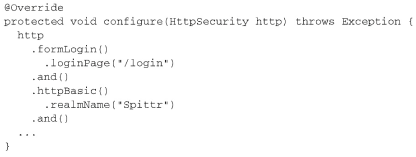

### 启用Remember-me功能  

Spring Security使得为应用添加Remember-me功能变得非常容易。 为了启用这项功能， 只需在configure()方法所传入的HttpSecurity对象上调用rememberMe()即可。  

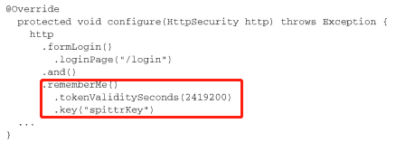

> 默认情况下， 这个功能是通过在cookie中存储一个token完成的， 这个token最多两周内有效。 但是， 在这里， 我们指定这个token最多四周内有效（2,419,200秒） 。  
>
> 存储在cookie中的token包含用户名、 密码、 过期时间和一个私钥——在写入cookie前都进行了MD5哈希。 默认情况下， 私钥的名为SpringSecured， 但在这里我们将其设置为spitterKey， 使它专门用于Spittr应用。  

我们需要有一种方式来让用户表明他们希望应用程序能够记住他们。 为了实现这一点， 登录请求必须包含一个名为remember-me的参数。 在登录表单中， 增加一个简单复选框就可以完成这件事情  

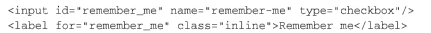

### 退出  

退出功能是通过Servlet容器中的Filter实现的（默认情况下） ， 这个Filter会拦截针对“/logout”的请求。 因此， 为应用添加退出功能只需添加如下的链接即可（如下以Thymeleaf代码片段的形式进行了展现） ：  

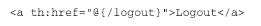

当用户点击这个链接的时候， 会发起对“/logout”的请求， 这个请求会被Spring Security的LogoutFilter所处理。 用户会退出应用， 所有的Remember-me token都会被清除掉。 在退出完成后， 用户浏览器将会重定向到“/login?logout”， 从而允许用户进行再次登录。  

如果你希望用户被重定向到其他的页面， 如应用的首页  :

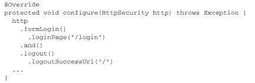

> logoutSuccessUrl()表明在退出成功之后， 浏览器需要重定向到“/”。  

除了logoutSuccessUrl()方法以外， 你可能还希望重写默认的LogoutFilter拦截路径。 我们可以通过调用logoutUrl()方法实现这一功能：  

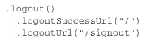

## 5 保护视图