# 07Spring与JDBC

 [JDBC](../../01.Java基础/21.JDBC.md) （Java DataBase Connectivity,java数据库连接）是一种用于执行SQL语句的Java API，可以**为多种关系数据库提供统一访问**，它由一组用Java语言编写的类和接口组成。

JPA是Java **Persistence** API的简称，中文名**Java持久层API**，是JDK 5.0注解或XML描述**对象－关系表的映射关系**，并将运行期的实体**对象持久化到数据库中**。

JPA包括以下3方面的技术：

- **ORM映射元数据**：JPA支持XML和JDK5.0注解两种元数据的形式，元数据描述对象和表之间的映射关系，框架据此将实体对象持久化到数据库表中；

- API：用来操作实体对象，执行CRUD操作，**框架在后台替代我们完成所有的事情**，开发者从繁琐的JDBC和SQL代码中解脱出来。

- 查询语言：这是持久化操作中很重要的一个方面，**通过面向对象而非面向数据库的查询语言查询数据**，避免程序的SQL语句紧密耦合
  

Java 持久层框架访问数据库的方式大致分为两种。

- 一种**以 SQL 核心**，封装一定程度的 JDBC 操作，比如： MyBatis。
- 另一种是以 **Java 实体类为核心**，将实体类的和数据库表之间建立映射关系，也就是我们说的ORM框架，如：Hibernate、Spring Data JPA。

## Spring数据访问

Spring的目标之一就是允许我们在开发应用程序时， 能够遵循面向对象（OO） 原则中的“针对接口编程”。  

将数据访问的功能放到一个或多个专注于此项任务的组件中。 这样的组件通常称为**数据访问对象（data access object， DAO） 或Repository。**  

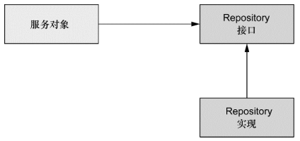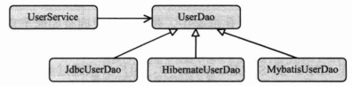

### 数据访问模板化  

Spring将数据访问过程中固定的和可变的部分明确划分为两个不同的类： **模板（template） 和回调（callback）** 。 模板管理过程中固定的部分， 而回调处理自定义的数据访问代码。   

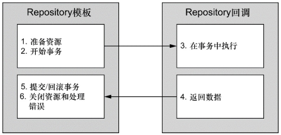

## 配置数据源  

无论选择Spring的哪种数据访问方式， 你都需要配置一个数据源的引用。   

- 通过JDBC驱动程序定义的数据源；
- 通过JNDI查找的数据源；
- 连接池的数据源。  

----

### 使用JNDI数据源  

> 这种配置的好处在于数据源完全可以在应用程序之外进行管理， 这样应用程序只需在访问数据库的时候查找数据源就可以了。   

位于jee命名空间下的`<jee:jndilookup>`元素可以用于检索JNDI中的任何对象（包括数据源） 并将其作为Spring的bean。   

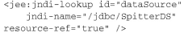

jndi-name属性用于指定JNDI中资源的名称。 如果只设置了jndi-name属性， 那么就会根据指定的名称查找数据源。 但是， 如果应用程序运行在Java应用服务器中， 你需要将resource-ref属性设置为true， 这样给定的jndi-name将会自动添加“java:comp/env/”前缀。  

Java配置：

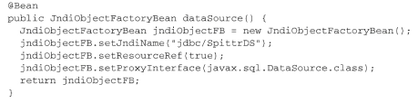


----

### 使用数据源连接池  

XML配置：

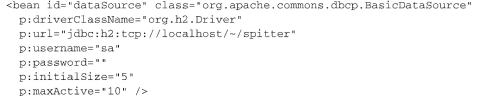

Java配置：

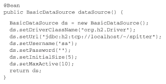

前四个属性是配置BasicDataSource所必需的  ：

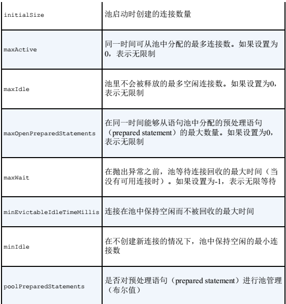


> 使用属性文件
>
> 通过`<context:property-placeholder>`引入属性文件，以`${xxx}`的方式引用属性。示例代码如下：
>
> 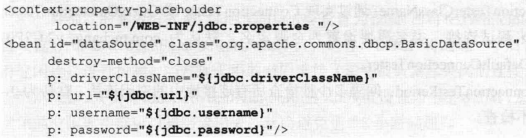
>
> 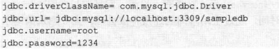

### 使用嵌入式的数据源  

对于开发和测试来讲， 嵌入式数据库都是很好的可选方案。 这是因为每次重启应用或运行测试的时候， 都能够重新填充测试数据  

Spring的jdbc命名空间能够简化嵌入式数据库的配置。  

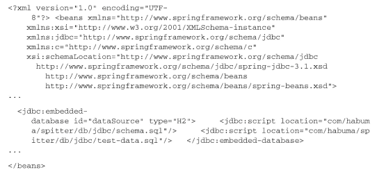

`<jdbc:script>`元素： 第一个引用了schema.sql， 它包含了在数据库中创建表的SQL； 第二个引用了test-data.sql， 用来将测试数据填充到数据库中  

Java 配置：

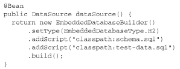

### 使用profile选择数据源  

例如， 对于开发期来说， `<jdbc:embedded-database>`元素是很合适的， 而在QA环境中， 你可能希望使用DBCP的BasicDataSource， 在生产部署环境下， 可能需要使用`<jee:jndi-lookup>`。  

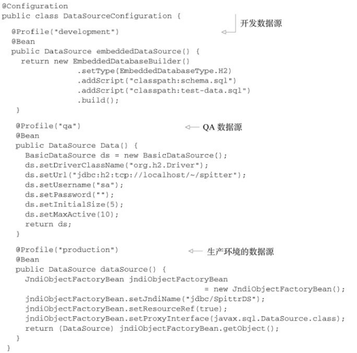

-----

Spring XML代替Java配置  ：

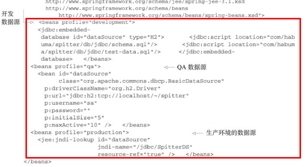

## 在Spring中使用JDBC  

可以直接使用JDBC所提供的直接操作数据库的API  :

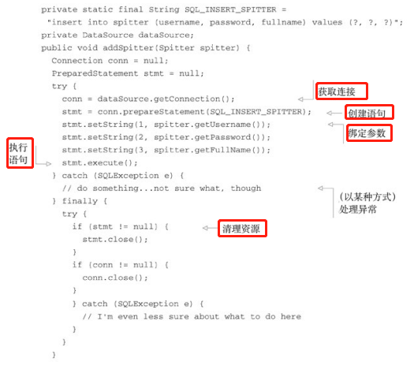

### 使用JDBC模板  

Spring为JDBC提供了三个模板类供选择：

- JdbcTemplate： 最基本的Spring JDBC模板， 这个模板支持简单的JDBC数据库访问功能以及基于索引参数的查询；

**JdbcTemplate** **类被设计成为线程安全的**, 所以可以再 IOC 容器中声明它的单个实例, 并将这个实例注入到所有的 DAO 实例中.

JdbcTemplate 也利用了 Java 1.5 的特定(自动装箱, 泛型, 可变长度等)来简化开发


---

- **使用JdbcTemplate来插入数据**

为了让JdbcTemplate正常工作， 只需要为其`设置DataSource`就可以了  

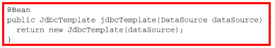

现在， 我们可以将jdbcTemplate装配到Repository中并使用它来访问数据库。   

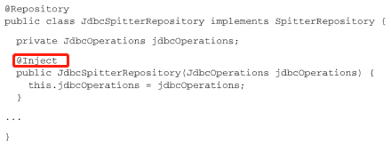

> 使用了@Inject注解， 因此在创建的时候， 会自动获得一个JdbcOperations对象。 JdbcOperations是一个接口， 定义了JdbcTemplate所实现的操作。 通过注入JdbcOperations， 而不是具体的JdbcTemplate， 能够保证JdbcSpitterRepository通过JdbcOperations接口达到与JdbcTemplate保持松耦合。  

基于JdbcTemplate的addSpitter()方法  :

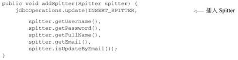

----

- **使用JdbcTemplate来读取数据**  

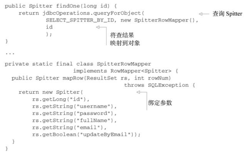

> queryForObject()方法有三个参数：
>
> - String对象， 包含了要从数据库中查找数据的SQL；
> - RowMapper对象， 用来从ResultSet中提取数据并构建域对象（本例中为Spitter） ；  
> - 可变参数列表， 列出了要绑定到查询上的索引参数值。  
>
> 对于查询返回的每一行数据， JdbcTemplate将会调用RowMapper的mapRow()方法， 并传入一个ResultSet和包含行号的整数。 在SpitterRowMapper的mapRow()方法中， 我们创建了Spitter对象并将ResultSet中的值填充进去。  

----

- **在JdbcTemplate中使用Java 8的Lambda表达式  **

因为RowMapper接口只声明了addRow()这一个方法， 因此它完全符合函数式接口（functional interface） 的标准。  

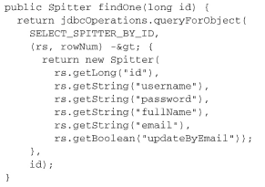

----

在配置文件applicationContext.xml中配置JDBC

```xml
<? xml version="1.0" encoding="UTF-8"? >
<beans xmlns="http://www.springframework.org/schema/beans"
    xmlns:xsi="http://www.w3.org/2001/XMLSchema-instance"
    xsi:schemaLocation="http://www.springframework.org/schema/beans
    http://www.springframework.org/schema/beans/spring-beans-4.3.xsd">
    <! --1配置数据源 -->
    <bean id="dataSource" class=
      "org.springframework.jdbc.datasource.DriverManagerDataSource">
      <! --数据库驱动 -->
      <property name="driverClassName" value="com.mysql.jdbc.Driver"/>
      <! --连接数据库的url -->
      <property name="url" value="jdbc:mysql://localhost:3306/spring"/>
      <! --连接数据库的用户名 -->
      <property name="username" value="root"/>
      <! --连接数据库的密码 -->
      <property name="password" value="root"/>
    </bean>

    <! --2配置JDBC模板 -->
    <bean id="jdbcTemplate"
          class="org.springframework.jdbc.core.JdbcTemplate">
      <! -- 默认必须使用数据源 -->
      <property name="dataSource" ref="dataSource"/>
    </bean>
    <! --3配置注入类 -->
    <bean id="xxx" class="Xxx">
        <property name="jdbcTemplate" ref="jdbcTemplate"/>
    </bean>
    ...
</beans>
```


