# 10-1 Spring的事务管理

《精通Spring4.x》

## 数据库事务基础

### 数据库事务

数据库事务有严格的定义，它必须同时满足4个特性：**原子性（Atomic)、一致性（Consistency)、隔离性（Isolation)和持久性（Durabiliy）**，简称为ACID。

- 原子性：表示组成一个事务的多个数据库操作是一个不可分割的原子单元，只有所有的操作执行成功，整个事务才提交。事务中的任何一个数据库操作失败，已经执行的任何操作都必须撤销，让数据库返回到初始状态。
- 一致性：事务操作成功后，数据库所处的状态和它的业务规则是一致的，即数据不会被破坏。如从A账户转账100元到B账户，不管操作成功与否，A账户和B账户的存款总额是不变的。
- 隔离性：在并发数据操作时，不同的事务拥有各自的数据空间，它们的操作不会对对方产生干扰。准确地说，并非要求做到完全无干扰。数据库规定了多种事务隔离级别，不同的隔离级别对应不同的干扰程度，隔离级别越高，数据一致性越好，但并发性越弱。
- 持久性：一旦事务提交成功后，事务中所有的数据操作都必须被持久化到数据库中。即使在提交事务后，数据库马上崩溃，在数据库重启时，也必须保证能够通过某种机制恢复数据。

在这些事务特性中，数据“一致性”是最终目标，其他特性都是为达到这个目标而采取的手段措施

数据库管理系统一般==**采用重执行日志(redolog)**来保证原子性、一致性和持久性==。重执行日志记录了数据库变化的每一个动作，数据库在一个事务中执行一部分操作后发生错误退出，数据库即可根据重执行日志撤销已经执行的操作。此外，对于已经提交的事务，即使数据库崩溃，在重启数据库时也能够根据日志对尚未持久化的数据进行相应的重执行操作。

和Java程序采用对象锁机制进行线程同步类似，数据库管理系统==采用**数据库锁机制**保证事务的隔离性==。当多个事务试图对相同的数据进行操作时，只有持有锁的事务才能操作数据，直到前一个事务完成后，后面的事务才有机会对数据进行操作。Oracle数据
库还使用了数据版本的机制，在回滚段为数据的每个变化都保存一个版本，使数据的更改不影响数据的读取。

### 数据库并发问题

一个数据库可能拥有多个访问客户端，这些客户端都可用并发的方式访问数据库。数据库中的相同数据可能同时被多个事务访问，如果没有采取必要的隔离措施，就会导致各种并发问题，破坏数据的完整性。

这些问题可以归结为5类，包括3类数据`读`问题（**脏读、不可重复读和幻象读**）及2类数据`更新`问题（**第一类丢失更新和第二类丢失更新**）。

----

1. 脏读（dirty read)

**A事务读取B事务尚未提交的更改数据，并在这个数据的基础上进行操作**。如果恰巧B事务回滚，那么A事务读到的数据根本是不被承认的。来看取款事务和转账事务并发时引发的脏读场景。

---

2. 不可重复读（unrepeatable read)

**不可重复读是指A事务在B事务已提交更改数据事件前后进行读取两次结果不一致的现象**。假设A在取款事务的过程中，B往该账户转账100元，A两次读取账户的余额发生不一致。

---

3. 幻象读（phantom read)

**A事务读取B事务提交的新增数据，这时A事务将出现幻象读的问题**。幻象读一般发生在计算统计数据的事务中。举个例子，假设银行系统在同一个事务中两次统计存款账户的总金额，在两次统计过程中，刚好新增了一个存款账户，并入100元，这时，两次统计的总金额将不一致。

> （幻读类似不可重复读，只不过是增加或者删除记录，而不是修改数据）
>
> 为应对不可重复读和幻读采取的策略不同：
>
> - 对于不可重复读：增加行锁，防止操作中的数据被更改
> - 对于幻读：增加表级锁，防止增加记录

----

4. 第一类丢失更新

**A事务撤销时，把已经提交的B事务的更新数据覆盖了**。这种错误可能造成很严重的问题。

---

5. 第二类丢失更新

A事务覆盖B事务已经提交的数据，造成B事务所做操作丢失。

### 数据库锁

数据库通过锁来控制并发问题；

按锁定的对象的不同，一般可以分为**表锁定和行锁定**。表锁定对整张表进行锁定，行锁定对表中的特定行进行锁定。

从并发事务锁定的关系上看，可以分为**共享锁定和独占锁定**。共享锁定会防止独占锁定，但允许其他的共享锁定。而独占锁定既防止其他的独占锁定，也防止其他的共享锁定。

为了更改数据，数据库必须在进行更改的行上施加**行独占锁定**，`INSERT`、`UPDATE`、`DELETE`和`SELECT FOR UPDATE `语句都会隐式采用必要的行锁定。

下面介绍一下Oracle数据库常用的5种锁定。

- **行共享锁定**：一般通过` SELECT FOR UPDATE`语句隐式获得行共享锁定，在Oracle 中用户也可以通过`LOCK TABLE IN ROW SHARE MODE`语句显式获得行共享锁定。行共享锁定并不防止对数据行进行更改操作，但是可以防止其他会话获取独占性数据表锁定。允许进行**多个并发的行共享和行独占锁定**，还允许进行数据**表的共享**或者采用**表共享行独占锁定**。
- **行独占锁定**：通过一条`INSERT`、`UPDATE`或`DELETE` 语句隐式获取，或者通过一条`LOCK TABLE IN ROW EXCLUSIVE MODE` 语句显式获取。这种锁定可以防止其他会话获取一个共享锁定、共享行独占锁定或独占锁定。
- **表共享锁定**：通过`LOCK TABLE IN SHARE MODE`语句显式获得。这种锁定可以防止其他会话获取行独占锁定（INSERT、UPDATE或DELETE），或者防止其他表共享行独占锁定或表独占锁定，但它允许在表中拥有多个**行共享和表共享锁定**。该锁定可以让会话具有对表事务级一致性访问，因为其他会话在用户提交或者回滚该事务并释放对该表的锁定之前不能更改这张被锁定的表。
- **表共享行独占锁定**：通过`LOCK TABLE IN SHARE ROW EXCLUSIVE MODE`语句显式获得。这种锁定可以防止其他会话获取一个表共享、行独占或者表独占锁定，但允许其他**行共享锁定**。这种锁定类似于表共享锁定，只是一次只能对一张表放置一个表共享行独占锁定。如果A会话拥有该锁定，则B会话可以执行`SELECT FOR UPDATE`操作；但如果B会话试图更新选择的行，则需要等待。
- **表独占锁定**：通过`LOCK TABLE IN EXCLUSIVE MODE`语句显式获得。这种锁定可以防正其他会话对该表的任何其他锁定。

### 事务隔离级别

尽管数据库为用户提供了锁的DML操作方式，但直接使用锁管理是非常麻烦的，因此数据库为用户提供了**自动锁机制**。只要**用户指定会话的事务隔离级别**，数据库就会分析事务中的SQL语句，然后**自动为事务操作的数据资源添加适合的锁**。

此外，数据库还会维护这些锁，当一个资源上的锁数目太多时，自动进行锁升级以提高系统的运行性能，而这一过程对用户来说完全是透明的。
ANSI/ISOSQL92标准定义了4个等级的事务隔离级别。不同的事务隔离级别能够解决的数据并发问题的能力是不同的，如表所示。

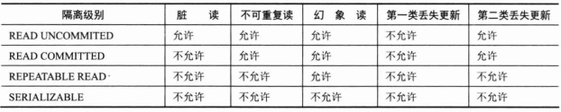

## ThreadLocal基础知识

Spring通过各种模板类降低了开发者使用各种数据持久化技术的难度。这些**模板类都是线程安全的**，也就是说，多个DAO可以复用同一个模板实例而不会发生冲突。使用模板类访问底层数据，根据持久化技术的不同，模板类*需要绑定数据连接或会话的资源*。但**这些资源本身是非线程安全的**，也就是说它们不能在同一时刻被多个线程共享。虽然模板类通过资源池获取数据连接或会话，但资源池本身解决的是数据连接或会话的缓存问题，并非数据连接或会话的线程安全问题。

### ThreadLocal是什么

ThreadLocal，它不是一个线程，而是保存线程本地化对象的容器。

当运行于多线程环境的某个对象使用ThreadLocal维护变量时，ThreadLocal为每个使用该变量的线程分配一个独立的变量副本。所以每个线程都可以独立地改变自己的副本，而不会影响其他线程所对应的副本。从线程的角度看，这个变量就像线程专有的本地变量，这也是类名中“Local”所要表达的意思。

Inheritable ThreadLocal继承于ThreadLocal，它自动为子线程复制一份从父线程那里继承而来的本地变量：在创建子线程时，子线程会接收所有可继承的线程本地变量的初始值。当必须将本地线程变量自动传送给所有创建的子线程时，应尽可能地使用Inheritable ThreadLocal,而非ThreadLocal。

### ThreadLocal的接口方法
ThreadLocal类接口很简单，只有4个方法，先来了解一下。

- `void set(Object value)`：设置当前线程的线程局部变量的值。
- `public Object get()`:返回当前线程所对应的线程局部变量。
- `public void remove()`:将当前线程局部变量的值删除，目的是为了减少内存的占用。该方法是Java5.0新增的。需要指出的是，当线程结束后，对应该线程的局部变量将自动被垃圾回收，所以显式调用该方法清除线程的局部变量并不是必需的操作，但它可以加快内存回收的速度。
- `protected Object initialValue()`:返回该线程局部变量的初始值。该方法是一个protected的方法，显然是为了让子类覆盖而设计的。这个方法是一个延迟调用方法，在线程第一次调用`get()`或`set(Object)`时才执行，并且仅执行一次。ThreadLocal 中的默认实现直接返回一个null。

ThreadLocal 是如何做到为每个线程维护一份独立的变量副本呢？其实实现的思路很简单：在ThreadLocal类中有一个Map，用于存储每个线程的变量副本，Map中元素的**键为线程对象，值为对应线程的变量副本**。

### ThreadLocal的使用

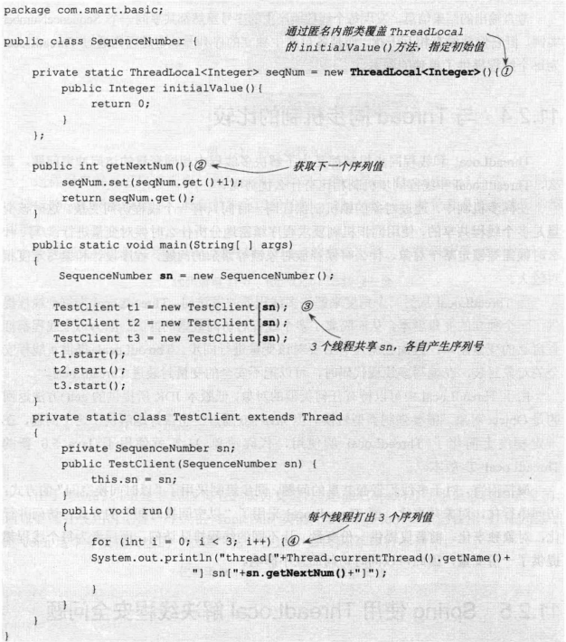

> 每个线程个自产生自己的序列号，互不影响

### 11.2.4与Thread同步机制的比较
ThreadLocal 和线程同步机制都是为了解决多线程中相同变量的访问冲突问题。

在同步机制中，通过对象的锁机制保证同一时间只有一个线程访问变量。这时该变量是多个线程共享的，使用同步机制要求程序缜密地分析什么时候对变量进行读/写、什么时候需要锁定某个对象、什么时候释放对象锁等繁杂的问题，程序设计和编写难度相对较大。

而ThreadLocal从另一个角度来解决多线程的并发访问。ThreadLocal为每个线程提供了一个独立的变量副本，从而隔离了多个线程对访问数据的冲突。因为每个线程都拥有自己的变量副本，因而也就没有必要对该变量进行同步。ThreadLocal提供了线程安全的对象封装，在编写多线程代码时，可以把不安全的变量封装进ThreadLocal。

**概括而言：**

- 对于多线程资源共享的问题，同步机制采用了“**以时间换空间**”的方式：访问串行化，对象共享化；
- ThreadLocal采用了“以空间换时间”的方式：访问并行化，对象独享化。
- 前者仅提供一份变量，让不同的线程排队访问；而后者为每个线程都提供了一份变量，因此可以同时访问而互不影响。

### Spring 使用ThreadLocal 解决线程安全问题
在一般情况下，只有无状态的Bean才可以在多线程环境下共享。在Spring中，绝大部分Bean都可以声明为singleton作用域。正是因为Spring 对一些Bean（如RequestContextHolder、TransactionSynchronizationManager、LocaleContextHolder等）中非线程安全的“状态性对象”采用ThreadLocal进行封装，让它们也成为线程安全的“状态性对象”，因此，有状态的Bean 就能够以singleton的方式在多线程中正常工作。

一般的Web应用划分为展现层、服务层和持久层3个层次，在不同的层中编写对应的逻辑，下层通过接口向上层开放功能调用。**在一般情况下，从接收请求到返回响应所经过的所有程序调用都同属于一个线程**，如图所示。

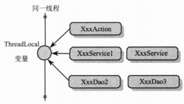

这样用户就可以根据需要，**将一些非线程安全的变量以ThreadLocal存放，在同一次请求响应的调用线程中，所有对象所访问的同一ThreadLocal 变量都是当前线程所绑定的**。

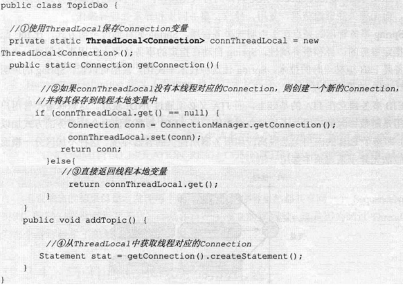

> 这个例子本身很粗糙，将Connection的ThreadLocal 直接放在DAO中只能做到本DAO的多个方法共享Connection时不发生线程安全问题，但无法和其他DAO共用同一个Connection。
>
> 要做到同一事务多DAO共享同一个Connection，必须在一个共同的外部类使用ThreadLocal 保存Connection。

## Spring对事务管理的支持

Spring为事务管理提供了一致的编程模板，在高层次建立了统一的事务抽象。也就是说，不管是选择SpringJDBC、Hibernate、JPA还是选择MyBatis，Spring都可以让用户用统一的编程模型进行事务管理。

**编程式事务管理**: 将事务管理代码嵌入到业务方法中来控制事务的提交和回滚. 在编程式管理事务时, 必须在每个事务操作中包含额外的事务管理代码.

**声明式事务管理**: 大多数情况下比编程式事务管理更好用. 它**将事务管理代码从业务方法中分离出来**, 以声明的方式来实现事务管理. **事务管理作为一种横切关注点, 可以通过 AOP 方法模块化. Spring 通过 Spring AOP 框架支持声明式事务管理.**

### 事务管理关键抽象
在Spring 事务管理SPI（Service Provider Interface)的抽象层主要包括3个接口，分别是`PlatformTransactionManager`、`TransactionDefinition`和`TransactionStatus`，它们位于org.springframework.transaction包中。

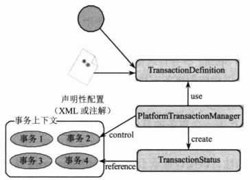

-----

**PlatformTransactionManagerPlatform**

`TransactionManager`接口是Spring提供的平台事务管理器，主要用于管理事务。该接口中提供了3个事务操作的方法，具体如下。 

- TransactionStatus getTransaction（TransactionDefinitiondefinition）：用于获取事务状态信息。
- void commit（TransactionStatus status）：用于提交事务。
- void rollback（TransactionStatus status）：用于回滚事务。

`getTransaction(TransactionDefinitiondefinition)`方法会根据TransactionDefinition参数返回一个TransactionStatus对象，TransactionStatus对象就表示一个事务，它被关联在当前执行的线程上。

PlatformTransactionManager接口只是代表事务管理的接口，它并不知道底层是如何管理事务的，它只需要事务管理提供上面的3个方法，但*具体如何管理事务则由它的实现类来完成*。

---

**TransactionDefinition**

TransactionDefinition接口是事务定义（描述）的对象，该对象中定义了事务规则，并提供了获取事务相关信息的方法，具体如下

- String getName()：获取事务对象名称。
- int getIsolationLevel()：获取事务的隔离级别。
- int getPropagationBehavior()：获取事务的传播行为。· 
- int getTimeout()：获取事务的超时时间。· 
- boolean isReadOnly()：获取事务是否只读。

---

**TransactionStatus**

TransactionStatus接口是事务的状态，它描述了某一时间点上事务的状态信息。该接口中包含6个方法，具体如下

- void flush()：刷新事务。· 
- boolean hasSavepoint()：获取是否存在保存点。·
- boolean isCompleted()：获取事务是否完成。· 
- boolean isNewTransaction()：获取是否是新事务。· 
- boolean isRollbackOnly()：获取是否回滚。· 
- void setRollbackOnly()：设置事务回滚。

### 事务管理器实现类
Spring将事务管理委托给底层具体的持久化实现框架来完成。因此，**Spring为不同的持久化框架提供了Platform TransactionManager接口的实现类。**

要实现事务管理，首先要在Spring中配置好相应的事务管理器，为事务管理器指定数据资源及一些其他事务管理控制属性。下面来看一下几个常见的事务管理器的配置。

-----

**Spring JDBC和MyBatis**

如果使用Spring JDBC或MyBatis，由于它们都基于数据源的Connection访问数据库，所以可以使用`DataSourceTransactionManager`，只要在Spring中进行以下配置就可以了

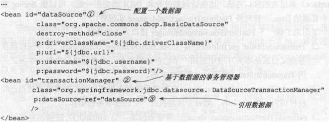

### 事务同步管理器
Spring将JDBC的Connection、Hibernate的Session 等访问数据库的连接或会话对象统称为**资源**，这些资源在同一时刻是不能多线程共享的。为了让DAO、Service类可能做到singleton，Spring的事务同步管理器类org.springframework.transaction.support.`TransactionSynchronizationManager `**使用ThreadLocal为不同事务线程提供了独立的资源副本，同时维护事务配置的属性和运行状态信息**。**事务同步管理器是Spring事务管理的基石**，不管用户使用的是编程式事务管理，还是声明式事务管理，都离不开事务同步管理器。

> TransactionSynchronizationManager将DAO、Service类中影响线程安全的所有“状态”统一抽取到该类中，并用ThreadLocal进行替换

Spring框架为不同的持久化技术提供了一套从`TransactionSynchronizationManager`中获取对应线程绑定资源的工具类。

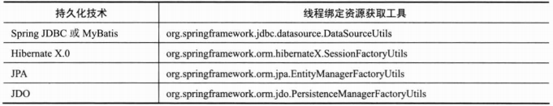

> 这些工具类都提供了静态的方法，通过这些方法可以获取和当前线程绑定的资源，如DataSourceUtils.getConnection(DataSource dataSource)方法可以从指定的数据源中获取和当前线程绑定的Connection
>
> Spring为不同的持久化技术提供了**模板类**，模板类在内部通过资源获取工具类间接访问TransactionSynchronizationManager中的线程绑定资源。所以，如果DAO使用模板类进行持久化操作，这些DAO就可以配置成singleton。如果不使用模板类，也可以直接通过资源获取工具类访问线程相关的资源。

### 事务传播行为

当我们遇用一个基于Spring的Service接口方法（如UserService#addUser0)时，它将运行于Spring管理的事务环境中，Service 接口方法可能会在<u>内部调用其他的Service接口方法</u>以共同完成一个完整的业务操作，因此就会产生**服务接口方法嵌套调用的情况**，Spring通过事务传播行为控制当前的事务如何传播到被嵌套调用的目标服务接口方法中。

Spring在`TransactionDefinition`接口中规定了7种类型的事务传播行为，它们规定了事务方法和事务方法发生嵌套调用时事务如何进行传播。

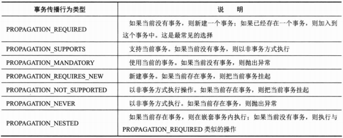

### 编程式事务

在实际应用中很少需要通过编程来进行事务管理Spring还是为编程式事务管理提供了模板类org.springframework.transaction.support.`TransactionTemplate`,以满足一些特殊场合的需要。

Transaction Template和那些持久化模板类一样是线程安全的，因此，可以在多个业务类中共享Transaction Template 实例进行事务管理。

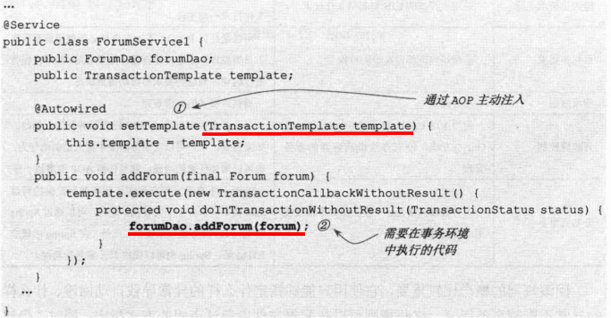

### 使用XML配置声明式事务
大多数Spring用户选择声明式事务管理的功能，这种方式对代码的侵入性最小，可以让事务管理代码完全从业务代码中移除，非常符合非侵入式轻量级容器的理念。

Spring的声明式事务管理是通过Spring AOP实现的，通过事务的声明性信息，Spring负责将事务管理增强逻辑动态织入业务方法的相应连接点中。这些逻辑包括获取线程绑定资源、开始事务、提交/回滚事务、进行异常转换和处理等工作。

----

- **服务接口编写：**

原始Service类：

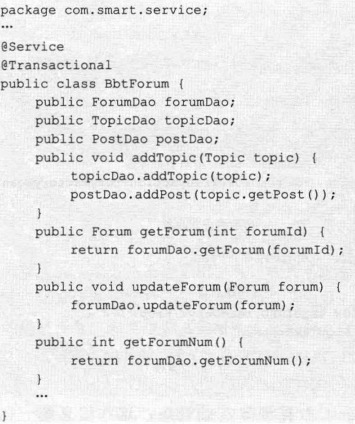

> **过时的**：TransactionProxyFactoryBean;有助于理解原理
>
> 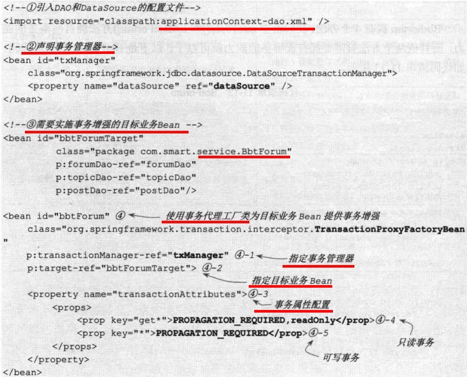

- #### applicationContext-tx.xml:**使用aop/tx命名空间**

> 事务管理是一种**横切关注点**
>
> - 首先声明事务管理器
> - 为了在 Spring 2.x 中启用声明式事务管理, 可以通过 tx Schema 中定义的 `<tx:advice> `元素声明**事务通知（增强事务行为）**, 为此必须事先将这个 Schema 定义添加到` <beans> `根元素中去.
>
> - 声明了事务通知后, 就需要**将它与切入点（定位业务方法）关联起来**. 由于事务通知是在 `<aop:config> `元素外部声明的, 所以它无法直接与切入点产生关联. 所以必须在 `<aop:config> `元素中声明一个增强器通知与切入点关联起来.
>
> 由于 Spring AOP 是基于代理的方法, 所以**只能增强公共方法**. 因此, 只有公有方法才能通过 Spring AOP 进行事务管理.

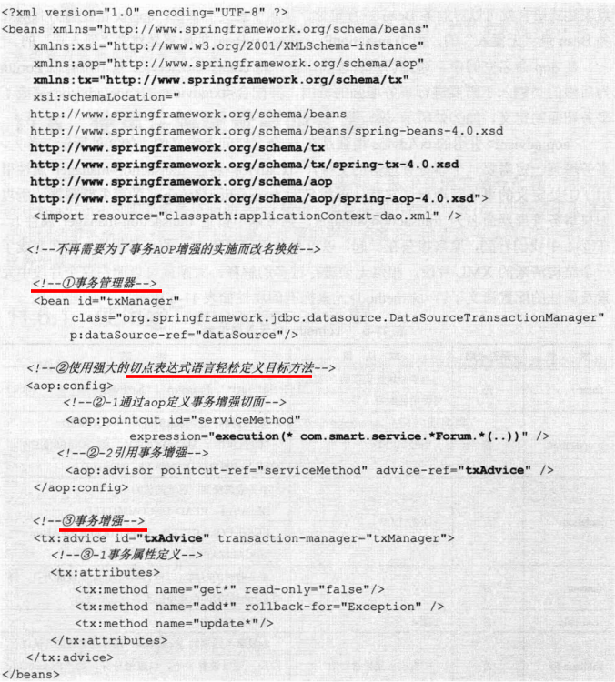

在这一过程中我们看到了3种角色：**通过aop/tx定义的声明式事务配置信息、业务Bean、Spring容器**。

Spring容器自动将第一者应用于第二者，从容器中返回的业务Bean已经是被织入事务增强的代理Bean，即第一者和第二者在配置时不直接发生关系。

而在使用TransactionProxyFactoryBean 进行事务配置时，TransactionProxyFactoryBean需要直接通过target属性引用目标业务Bean，结果造成目标业务Bean往往需要使用target进行命名（如userService Target），以避免和最终代理Bean名称（如userService)冲突。

使用aop/tx方式后，业务Bean的名称不需要做任何“配合性”的调整，aop直接通过切点表达式语言就可以对业务Bean进行定位。从这个意义上来说，aop/tx的配置方式对业务Bean是“无侵入”的，而TransactionProxyFactoryBean的配置显然是“侵入式”的。

在aop命名空间中，通过**切点表达式语言**，将com.smart.service包下所有以Forum为后缀的类纳入了需要进行事务增强的范围，并配合·`<tx:advice>`的`<aop:advisor>`完成了事务切面的定义，如②处所示。

`<aop:advisor>`引用的`txAdvice`增强是在tx命名空间上定义的，如③处所示。首先，**事务增强一定需要一个事务管理器的支持**，`<tx:advice>`通过transaction-manager 属性引用了①处定义的事务管理器（它默认查找名为transactionManager的事务管理器，所以如果事务管理器命名为transactionManager，则可以不指定transaction-manager属性）。在③-1中我们看到，原来掺杂在一起，以逗号分隔字符串定义的事务属性，现在变成了一个结构清晰的XML片段。

> 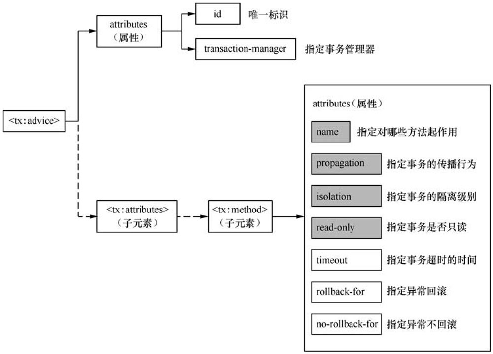
>
> `<tx:method>`元素属性表：
>
> 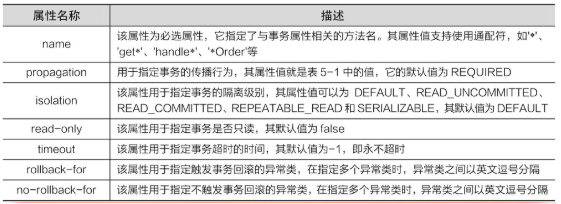

### 使用注解配置声明式事务

- 使用`@Transactional`注解

因为注解本身具有一组普适性的默认事务属性，所以往往只要在需要事务管理的业务类中添加一个`@Transactional`注解，就完成了业务类事务属性的配置。（**只能标注公有方法**）

当然，注解只提供元数据，它本身并不能完成事务切面织入的功能。因此，还需要**在Spring 配置文件中配置事务管理器**“通知”Spring 容器对标注@Transactional注解的Bean进行加工处理，如代码所示。

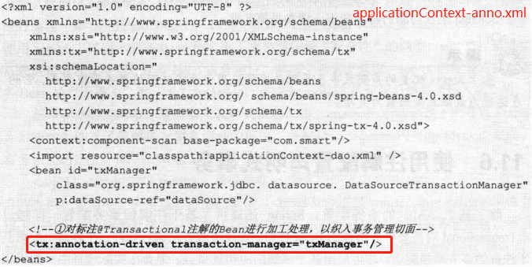

在默认情况下，`<tx:annotation-driven>`会自动使用名为“transactionManager”的**事务管理器**。所以，如果用户的事务管理器id为“transactionManager”，则可以进一步将①处的配置简化为“`<tx:annotation-driven/>`”。
`<tx:annotation-driven>`还有另外两个属性。

- `proxy-target-class`:如果为true，则Spring将通过创建子类来代理业务类；如果为false，则使用基于接口的代理。如果使用子类代理，则需要在类路径中添加CGLib.jar类库。
- `order`：如果业务类除事务切面外，还需要织入其他的切面，则通过该属性可以控制事务切面在目标连接点的织入顺序。

----

1. 关于@Transactional的属性

基于@Transactional注解的配置和基于XML的配置方式一样，它拥有一组普适性很强的默认事务属性，往往可以直接使用这些默认的属性。

- 事务传播行为：PROPAGATION_REQUIRED。
- 事务隔离级别：ISOLATION_DEFAULT。
- 读写事务属性：读/写事务。
- 超时时间：依赖于底层的事务系统的默认值。
- 回滚设置：任何运行期异常引发回滚，任何检查型异常不会引发回滚。

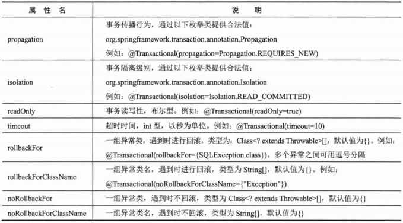

----

2. 在何处标注@Transactional 注解

@Transactional 注解可以被应用于接口定义和接口方法、类定义和类的public方法上。

**但Spring 建议在业务实现类上使用@Transactional注解**。当然也可以在业务接口上使用@Transactional注解，但这样会留下一些容易被忽视的隐患。因为注解不能被继承，所以在业务接口中标注的@Transactional 注解不会被业务实现类继承。

另外在方法处使用@Transactional 注解会覆盖类定义上的注解

---

3. 使用不同的事务管理器

一般情况下，一个应用仅需使用一个事务管理器。如果希望在不同的地方使用不同的事务管理器，则可以通过如下方式实现：

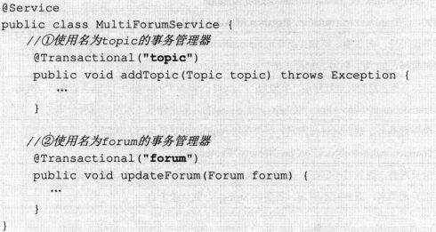

并且在XML中配置不同的事务管理器：

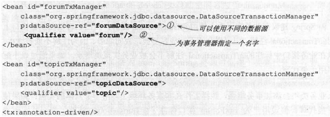

------

-----

# 10-2 Spring事务管理的难点

## DAO与事务管理

事务管理的目的是保证数据操作的事务性（原子性、一致性、隔离性、持久性，即所谓的ACID)，脱离了事务性，DAO照样可以顺利地进行数据操作。

