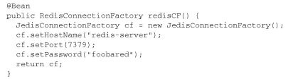
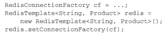
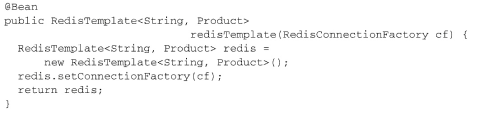
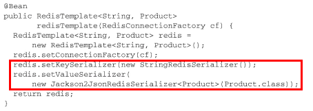

# 11使用NoSQL数据库

## MongoDB

## Redis

Spring Data Redis包含了多个模板实现， 用来完成Redis数据库的数据存取功能。但是为了创建SpringData Redis的模板， 我们首先需要有一个Redis连接工厂。Spring Data Redis提供了四个连接工厂供我们选择。  

- JedisConnectionFactory
- JredisConnectionFactory
- LettuceConnectionFactory
- SrpConnectionFactory  

### 连接Redis

将连接工厂配置为Spring中的bean  :

Redis连接工厂会生成到Redis key-value存储的连接（以RedisConnection的形式） 。 借助RedisConnection， 可以存储和读取数据。   

### 使用RedisTemplate

与其他的Spring Data项目类似， Spring Data Redis以模板的形式提供了较高等级的数据访问方案。 实际上， Spring Data Redis提供了两个模板：

- RedisTemplate
- StringRedisTemplate  

> RedisTemplate可以极大地简化Redis数据访问， 能够让我们持久化各种类型的key和value， 并不局限于字节数组。   
>
> StringRedisTemplate扩展了RedisTemplate， 只关注String类型。  

构建RedisTemplate  :

> 尽管这并非必须的， 但是如果你经常使用RedisTemplate或StringRedisTemplate的话， 你可以考虑将其配置为bean， 然后注入到需要的地方。   
>
> 

### 使用key和value的序列化器  

当某个条目保存到Redis key-value存储的时候， key和value都会使用Redis的序列化器（serializer） 进行序列化。  

- GenericToStringSerializer： 使用Spring转换服务进行序列化；
- JacksonJsonRedisSerializer： 使用Jackson 1， 将对象序列化为JSON；
- Jackson2JsonRedisSerializer： 使用Jackson 2， 将对象序列化为JSON；
- JdkSerializationRedisSerializer： 使用Java序列化；
- OxmSerializer： 使用Spring O/X映射的编排器和解排器（marshaler和unmarshaler） 实现序列化， 用于XML序列化；
- StringRedisSerializer： 序列化String类型的key和value。  

