# Git

**Git**：一款分布式源代码管理工具，是 Linux 之父李纳斯的第二个伟大作品。

SVN：集中式管理

- 在集中式下，开发者只能将代码提交到服务器；
- 在集中式下，只有远程服务器上有代码数据库。

Git：分布式管理

- 在分布式下，开发者可以本地提交，也可以提交到远程服务器；
- 在分布式下，每个开发者机器上都有一个代码仓库。

## Git 工作原理

工作区和版本库:

- 工作区：仓库文件夹里面，除了 .git 目录以外的内容
- 版本库：Git 目录，用于存储记录版本信息
- 版本库中的暂缓区（stage）
- 版本库中的分支（master）：Git 自动创建的第一个分支
- 版本库中的 HEAD 指针：用于指向当前分支

|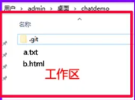|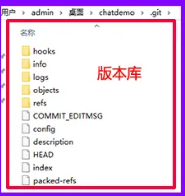|

在工作区中有文件 a.txt、b.html，经过执行 `git add .` 命令之后会将工作区的文件添加到**暂缓区**中，再经过执行 `git commit -m "说明文字"` 命令之后，会将暂缓区的文件添加到**版本库的分支**当中去。

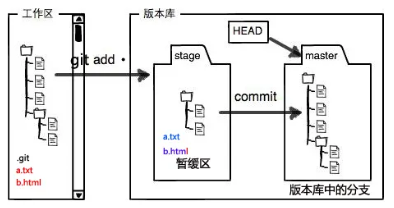

## Git 基本命令

[learning online](https://learngitbranching.js.org/?locale=zh_CN)

#### `git help`：Git 指令帮助手册

#### `git init`：（个人仓库）仓库初始化

首先我们在桌面新建一个 project 空文件夹之后，鼠标右键以 `git bash here` 打开 Git 终端，输入 `git init` 命令之后，观察 project 文件夹之后多了一个隐藏文件夹 Git 目录。这时我们就创建好了一个受 Git 管理的仓库，这个仓库就在本地。

`.git`目录：

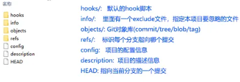

在使用 Git 之前，我们需要配置用户基本信息，即配置用户名和邮箱。（防止跑路）

当前项目下配置用户名与邮箱命令如下：

- 配置用户名：`git config user.name "用户名"`（跟踪 who 修改记录）
- 配置邮箱：`git config user.email "邮箱"`（多人开发间的沟通）

#### `git config -l`：查看配置信息命令

配置全局用户名与邮箱命令如下（适用于所有项目）：

- 配置全局用户名：`git config --global user.name "用户名"`（跟踪 who 修改记录）
- 配置全局邮箱：`git config --global user.email "邮箱"`（多人开发间的沟通）

#### `git status` ：查看文件的状态

- 查看某个文件的状态：`git status 文件名`
- 查看当前路径所有文件的状态：`git status`

#### `git add`：将工作区的文件保存到暂缓区

- 保存某个文件到暂缓区：`git add 文件名`
- 保存当前路径的所有文件到暂缓区：`git add .`（注意，最后是一个点 `.` ）

#### `git commit`：将暂缓区的文件提交到当前分支

- 提交某个文件到分支：`git commit -m "注释"` 文件名
- 保存当前路径的所有文件到分支：`git commit -m "注释"`

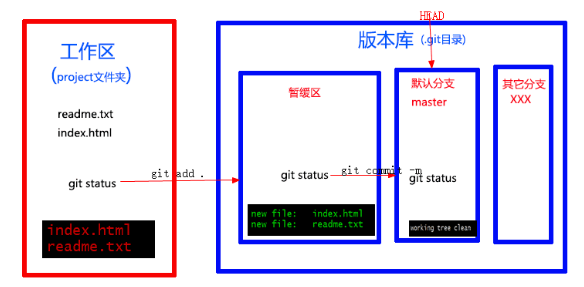

#### `git log`：查看文件的修改日志

在工作区再新增 git.txt 文件，并将该文件添加到主分支（执行上述命令），然后输入 `git log` 命令，如下图所示，我们可以清楚的看到什么时候谁（**who**）干了什么事。

#### `git reflog` ：查看分支引用记录（能够查看所有的版本号）

输入 `git reflog` 命令，我们可以清楚的看到版本号下对应做了什么事（以简短的方式查看日志）。

#### `git diff`：查看文件最新改动的地方

我们为工作区中的文件 index.html 添加了一段代码如下所示，然后因为工作区文件 index.html 被修改，所以我们再次将修改后的文件提交到主分支中。

#### `git branch <分支名>`：创建新的分支

#### `git merge <分支名>`:合并分支

在 Git 中合并两个分支时会产生一个特殊的提交记录，它有两个父节点。翻译成自然语言相当于：“我要把这两个父节点本身及它们所有的祖先都包含进来。”

`git merge bugFix`：创建一个新的节点，把`bugFix`分支合并到当前`HEAD`指向的`master`分支中

#### `git rebase <分支名>`

Rebase 实际上就是取出一系列的提交记录，“复制”它们，然后在另外一个地方逐个的放下去。Rebase 的优势就是可以创造更线性的提交历史

`git rebase master`:把当前分支（`HEAD`指向）中的工作复制到master分支上，移动后**两个分支上的工作看起来像是顺序提交的**，并且**当前分支的工作在master分支的最顶端**。

然后需要更新master分支：`git checkout master`;

**让master指向最顶端：**`git rebase bugFix`

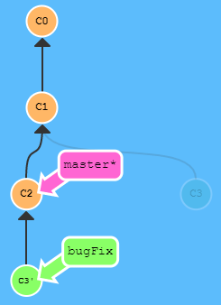

### 高级命令

-----

#### `git checkout <分支名/版本号>`：切换HEAD指向

 HEAD 是一个对当前检出记录的符号引用 —— 也就是指向你正在其基础上进行工作的提交记录。

HEAD 总是指向当前分支上最近一次提交记录。大多数修改提交树的 Git 命令都是从改变 HEAD 的指向开始的。

HEAD 通常情况下是指向分支名的（如 bugFix）。在你提交时，改变了 bugFix 的状态，这一变化通过 HEAD 变得可见。

如果想看 HEAD 指向，可以通过 `cat .git/HEAD` 查看， 如果 HEAD 指向的是一个引用，还可以用 `git symbolic-ref HEAD` 查看它的指向

---

#### 相对位置`^`/`~<num>`

相对引用非常给力，这里我介绍两个简单的用法：

- 使用 `^` 向上移动 1 个提交记录
- 使用 `~` 向上移动多个提交记录，如 `~3`

`git checkout HEAD~4`:HEAD 回退4步

`git checkout bugFix^`:HEAD 指向bugFix分支的上一个节点

----

#### `git branch -f <分支名> <版本号>`强制修改分支位置

我使用相对引用最多的就是移动分支。可以直接使用 `-f` 选项让分支指向另一个提交。例如:

`git branch -f master HEAD~3`:将 master 分支强制指向 HEAD 的第 3 级父提交。

----

#### `git reset <位置>`：版本回退（建议加上––hard 参数，Git 支持无限次后悔）

`git reset` 通过把分支记录回退几个提交记录来实现撤销改动。你可以将这想象成“改写历史”。`git reset` 向上移动分支，原来指向的提交记录就跟从来没有提交过一样。

- 回退到上一个版本：`git reset ––hard HEAD^`
- 回退到上上一个版本：`git reset ––hard HEAD^^`
- 回退到上 N 个版本：`git reset ––hard HEAD~num`
- 回退到任意一个版本：`git reset ––hard 版本号`

---

#### `Git Revert <位置>`

虽然在你的本地分支中使用 `git reset` 很方便，但是这种“改写历史”的方法对大家一起使用的远程分支是无效的哦！为了撤销更改并**分享**给别人，我们需要使用 `git revert`。

`git revert HEAD`：撤销当前操作，会创建新的节点表示对上一步操作的恢复

-------

#### `git cherry-pick <版本号>...`

如果你想将一些提交复制到当前所在的位置（`HEAD`）下面的话， Cherry-pick 是最直接的方式了。我个人非常喜欢 `cherry-pick`，因为它特别简单。

`git cherry-pick c2 c3 c5`:复制c2、c3、c5提交到master分支下

> 当你知道你所需要的提交记录（**并且**还知道这些提交记录的哈希值）时, 用 cherry-pick ,不清楚哈希值时候使用交互式的rebase

----

#### ` rebase --interactive`

交互式的rebase 指的是使用带参数 `--interactive` 的 rebase 命令, 简写为 `-i`

如果你在命令后增加了这个选项, Git 会打开一个 UI 界面并列出将要被复制到目标分支的备选提交记录，它还会显示每个提交记录的哈希值和提交说明，提交说明有助于你理解这个提交进行了哪些更改。

当 rebase UI界面打开时, 你能做3件事:

- 调整提交记录的顺序（通过鼠标拖放来完成）
- 删除你不想要的提交（通过切换 `pick` 的状态来完成，关闭就意味着你不想要这个提交记录）
- 合并提交。

`git rebase -i HEAD~4`：修改前四步提交记录

-----


## GitHub 简单使用

远程仓库并不复杂, 在如今的云计算盛行的世界很容易把远程仓库想象成一个富有魔力的东西, 但实际上它们只是你的仓库在另个一台计算机上的拷贝。你可以通过因特网与这台计算机通信 —— 也就是增加或是获取提交记录

话虽如此, 远程仓库却有一系列强大的特性

- 首先也是最重要的的点, 远程仓库是一个强大的备份。本地仓库也有恢复文件到指定版本的能力, 但所有的信息都是保存在本地的。有了远程仓库以后，即使丢失了本地所有数据, 你仍可以通过远程仓库拿回你丢失的数据。
- 还有就是, 远程让代码社交化了! 既然你的项目被托管到别的地方了, 你的朋友可以更容易地为你的项目做贡献(或者拉取最新的变更)

> GitHub 是一个面向开源及私有软件项目的托管平台，因为只支持 Git 作为唯一的版本库格式进行托管，故名 [GitHub](https://github.com/)。

使用 GitHub 之前，我们需要去 GitHub 官网注册一个属于自己的账号，然后登录你的 GitHub 账号。选择你的仓库：

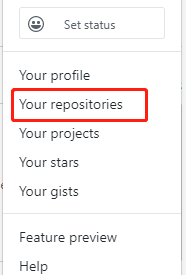

点击右侧 New 新建一个仓库，并给改仓库起一个名字，可以描述该仓库是什么项目，如下图所示：

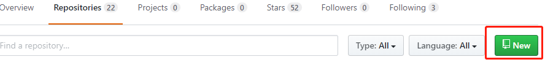

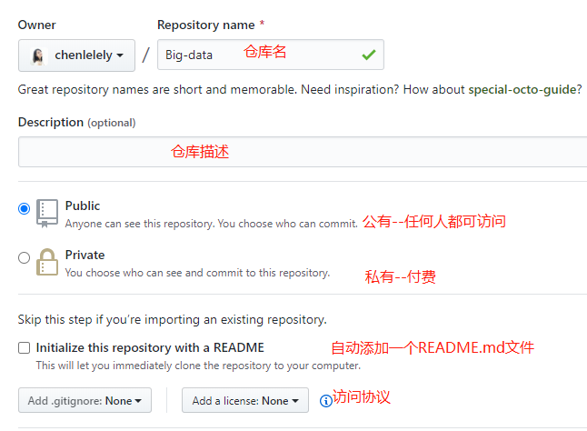

在之前本地仓库的bash窗口中输入：

`git remote add origin git@github.com:.........git`

`git push -u origin master`

刷新GitHub，即可看到GitHub仓库中出现提交的文件

----

#### `git clone`：下载远程仓库到本地

`git clone` 命令在真实的环境下的作用是在**本地**创建一个远程仓库的拷贝（比如从 github.com）

- 下载远程仓库到当前路径：`git clone 仓库的URL`
- 下载远程仓库到特定路径：`git clone 仓库的URL 存放仓库的路径`

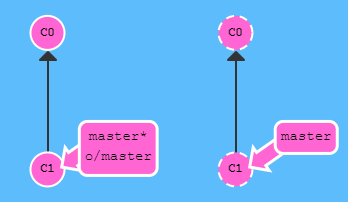

你可能注意到的第一个事就是在我们的本地仓库多了一个名为 `o/master` 的分支, 这种类型的分支就叫**远程**分支。由于远程分支的特性导致其拥有一些特殊属性。

远程分支反映了远程仓库(在你上次和它通信时)的**状态**。这会有助于你理解本地的工作与公共工作的差别 —— 这是你与别人分享工作成果前至关重要的一步.

远程分支有一个特别的属性，在你检出时自动进入分离 HEAD 状态。Git 这么做是出于不能直接在这些分支上进行操作的原因, 你必须在别的地方完成你的工作, （更新了远程分支之后）再用远程分享你的工作成果。

> ##### 为什么有 `o/`？
>
> 你可能想问这些远程分支的前面的 `o/` 是什么意思呢？好吧, 远程分支有一个命名规范 —— 它们的格式是:
>
> - `/`
>
> 因此，如果你看到一个名为 `o/master` 的分支，那么这个分支就叫 `master`，远程仓库的名称就是 `o`。
>
> 大多数的开发人员会将它们主要的远程仓库命名为 `origin`，并不是 `o`。这是因为当你用 `git clone` 某个仓库时，Git 已经帮你把远程仓库的名称设置为 `origin` 了
>
> 不过 `origin` 对于我们的 UI 来说太长了，因此不得不使用简写 `o` ，但是要记住, 当你使用真正的 Git 时, 你的远程仓库默认为 `origin`!

----

####  `git fetch`：从远程仓库获取数据

`git fetch` 完成了仅有的但是很重要的两步:

- 从远程仓库下载本地仓库中缺失的提交记录
- 更新远程分支指针(如 `o/master`)

> #### `git fetch` 做了什么？
>
> `git fetch` 实际上将**本地仓库中的远程分支**更新成了远程仓库相应分支最新的状态。
>
> 远程分支反映了远程仓库在你**最后一次与它通信时**的状态，`git fetch` 就是你与远程仓库通信的方式了
>
> `git fetch` 通常通过互联网（使用 `http://` 或 `git://` 协议) 与远程仓库通信。
>
> #### `git fetch` 不会做什么？
>
> `git fetch` 并不会改变你本地仓库的状态。它不会更新你的 `master` 分支，也不会修改你磁盘上的文件。
>
> 理解这一点很重要，因为许多开发人员误以为执行了 `git fetch` 以后，他们本地仓库就与远程仓库同步了。它可能已经将进行这一操作所需的所有数据都下载了下来，但是**并没有**修改你本地的文件。我们在后面的课程中将会讲解能完成该操作的命令
>
> 所以, 你可以将 `git fetch` 的理解为单纯的下载操作。

------

#### `git pull`：下载远程仓库的最新信息到本地仓库

既然我们已经知道了如何用 `git fetch` 获取远程的数据, 现在我们学习**如何将这些变化更新到我们的工作当中**。

其实有很多方法的 —— 当远程分支中有新的提交时，你可以像合并本地分支那样来合并远程分支。也就是说就是你可以执行以下命令:

- `git cherry-pick o/master`
- `git rebase o/master`
- `git merge o/master`
- 等等

实际上，由于先抓取更新再合并到本地分支这个流程很常用，因此 Git 提供了一个专门的命令来完成这两个操作。它就是我们要讲的 `git pull`。

 **`git pull` 就是` git fetch `和` git merge `的缩写！**

-----

#### `git push`：将本地的仓库信息推送到远程仓库

`git push` 负责将**你的**变更上传到指定的远程仓库，并在远程仓库上合并你的新提交记录。

如果提交本地修改`C2`，可以看到远程仓库接收了 `C2`，远程仓库中的 `master` 分支也被更新到指向 `C2` 了，我们的远程分支 (o/master) 也同样被更新了。所有的分支都同步了！

> #### 偏离的工作
>
> 在push的时候远程仓库已经被同事修改，GitHub会阻止提交，则需要：
>
> `git fetch;git rebase o/master;git push`:用 `git fetch` 更新了本地仓库中的远程分支，然后用 rebase 将我们的工作移动到最新的提交记录下，最后再用 `git push` 推送到远程仓库。
>
> 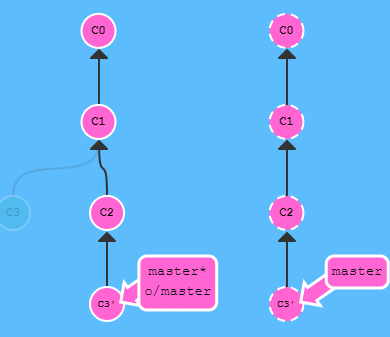
>
> 还可以使用 `merge`
>
> `git fetch;git merge o/master;git push;`
>
> 尽管 `git merge` 不会移动你的工作（它会创建新的合并提交），但是它会告诉 Git 你已经合并了远程仓库的所有变更。这是因为远程分支现在是你本地分支的祖先，也就是说**你的提交已经包含了远程分支的所有变化**。
>
> 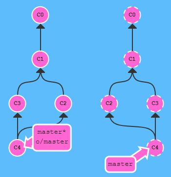
>
> - **前面已经介绍过 `git pull` 就是 fetch 和 merge 的简写，类似的 `git pull --rebase` 就是 fetch 和 rebase 的简写！**:`git pull --rebase;git push`同`rebase`
>
> - **换用常规的` git pull`同样可以。**`git pull; git push`同`merge`


----

#### 远程服务器拒绝!(Remote Rejected)

如果你是在一个大的合作团队中工作, 很可能是master被锁定了, 需要一些Pull Request流程来合并修改。如果你直接提交(commit)到本地master, 然后试图推送(push)修改, 你将会收到这样类似的信息:

> ! [远程服务器拒绝] master -> master (TF402455: 不允许推送(push)这个分支; 你必须使用pull request来更新这个分支.) 
>
> #### 为什么会被拒绝?
>
> 远程服务器拒绝直接推送(push)提交到master, 因为策略配置要求 pull requests 来提交更新.
>
> 你应该按照流程,新建一个分支, 推送(push)这个分支并申请pull request,但是你忘记并直接提交给了master.现在你卡住并且无法推送你的更新.
>
> #### 解决办法
>
> 新建一个分支feature, 推送到远程服务器. 然后reset你的master分支和远程服务器保持一致, 否则下次你pull并且他人的提交和你冲突的时候就会有问题.

`git branch feature`

`git push origin feature`

`git reset o/master`

----

#### 远程跟踪

`master` 和 `o/master` 的关联关系就是由分支的“remote tracking”属性决定的。`master` 被设定为跟踪 `o/master` —— 这意味着为 `master` 分支指定了推送的目的地以及拉取后合并的目标。

你可能想知道 `master` 分支上这个属性是怎么被设定的，你并没有用任何命令指定过这个属性呀！好吧, 当你克隆仓库的时候, Git 就自动帮你把这个属性设置好了。

当你克隆时, Git 会为远程仓库中的每个分支在本地仓库中创建一个远程分支（比如 `o/master`）。然后再创建一个跟踪远程仓库中活动分支的本地分支，默认情况下这个本地分支会被命名为 `master`。

克隆完成后，你会得到一个本地分支（如果没有这个本地分支的话，你的目录就是“空白”的），但是可以查看远程仓库中所有的分支（如果你好奇心很强的话）。这样做对于本地仓库和远程仓库来说，都是最佳选择。

-----

#### `git push`参数

`git push <remote> <place>`

`git push origin master`

*切到本地仓库中的“master”分支，获取所有的提交，再到远程仓库“origin”中找到“master”分支，将远程仓库中没有的提交记录都添加上去，搞定之后告诉我。*

我们通过“place”参数来告诉 Git 提交记录来自于` master分支`, 要推送到远程仓库中的 master。它实际就是要同步的**来源和去向两个仓库**的位置。


要同时为源和目的地指定 `<place>` 的话，只需要用冒号 `:` 将二者连起来就可以了：

`git push origin <source>:<destination>`

这个参数实际的值是个 refspec，“refspec” 是一个自造的词，意思是 Git 能识别的位置（比如分支 `foo` 或者 `HEAD~1`）

> 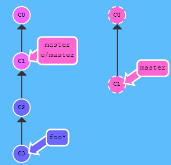
>
> `git push origin foo^:master`
>
> 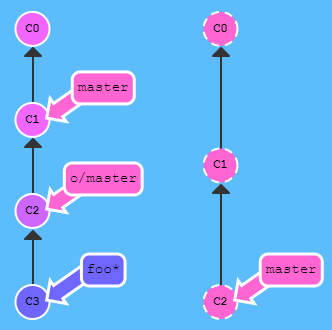

如果你要推送到的目的分支不存在，Git 会在远程仓库中根据你提供的名称帮你创建这个分支！

#### Git fetch 的参数

`git fetch` 的参数和 `git push` 极其相似。他们的概念是相同的，只是方向相反罢了（因为现在你是下载，而非上传）

`git fetch origin <place>`

`git fetch origin foo`:Git 会到远程仓库的 `foo` 分支上，然后获取所有本地不存在的提交，放到本地的 `o/foo` 上。

> 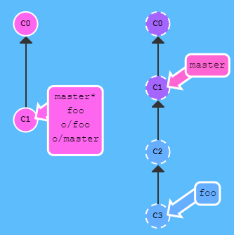
>
> 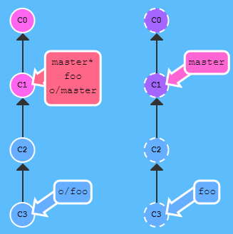
>
> 
>
> 为何 Git 会将新提交放到 `o/foo` 而不是放到我本地的 foo 分支呢？之前不是说这样的 参数就是同时应用于本地和远程的位置吗？
>
> 好吧, 本例中 Git 做了一些特殊处理，因为你可能在 foo 分支上的工作还未完成，你也不想弄乱它。还记得在 `git fetch` 课程里我们讲到的吗 —— 它不会更新你的本地的非远程分支, 只是下载提交记录（这样, 你就可以对远程分支进行检查或者合并了）。

指定 `<source>:<destination>` 会直接更新本地分支

 `source` 现在指的是远程仓库中的位置，而 `destination` 才是要放置提交的本地仓库的位置。它与 git push 刚好相反，这是可以讲的通的，因为我们在往相反的方向传送数据。

> 如果 `git fetch` 没有参数，它会下载所有的提交记录到各个远程分支
>
> 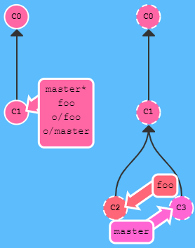

-----

#### `<source>`参数

Git 有两种关于 `` 的用法是比较诡异的，即你可以在 git push 或 git fetch 时不指定任何 `source`，方法就是仅保留冒号和 destination 部分，source 部分留空。

- `git push origin :side`
- `git fetch origin :bugFix`

> 以下命令在 Git 中是等效的:
>
> `git pull origin foo` 相当于：
>
> ```
> git fetch origin foo; git merge o/foo
> ```
>
> 还有...
>
> `git pull origin bar~1:bugFix` 相当于：
>
> ```
> git fetch origin bar~1:bugFix; git merge bugFix
> ```
>
> 看到了? git pull 实际上就是 fetch + merge 的缩写, git pull 唯一关注的是提交最终合并到哪里（也就是为 git fetch 所提供的 destination 参数）