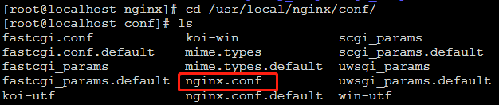
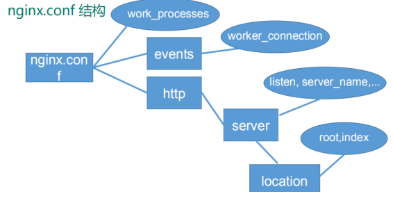
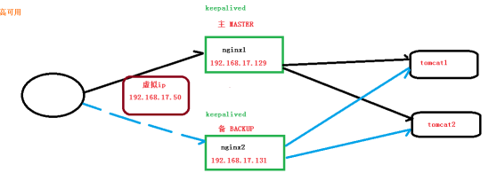
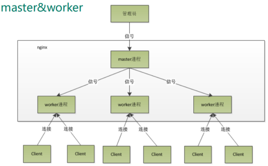
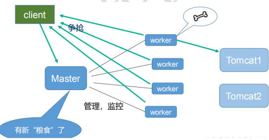

Nginx 从入门到实践，万字详解！](https://mp.weixin.qq.com/s?__biz=Mzg2OTA0Njk0OA==&mid=2247486730&idx=1&sn=2031330f25c91be1b1bbb4b48aeba63e&chksm=cea242c1f9d5cbd7896d2f3ccdc474afcba389e1f469bda8e125ee5e9cac3d68588eeb675dd6&scene=126&sessionid=1588743000&key=94c60dadcfa48efc3af6646f57fc04e3dc47a17e0c3f0efd89a6d80d1408961da7976ee8355bfb5a1c0043d43ec2cb4f9f02e2b35ce23b63c4341af0f183679366a3587abb65bdb0dc447f46d648f0da&ascene=1&uin=MTQ5MTEwODgxMg%3D%3D&devicetype=Windows+10+x64&version=62090070&lang=zh_CN&exportkey=ATWiJgezQsCSxC1Yt%2FyxAGY%3D&pass_ticket=Sl07EavL3GDrwmp10oJIXSvp2T9Jtt%2FtpJOddNKt1yFjF2D0rVLhQBt%2BPIvAN55j)

## Nginx简介

Nginx ("engine x") 是一个高性能的 HTTP 和反向代理服务器,特点是占有内存少，并发能力强  

### 正向代理

正向代理：如果把局域网外的 Internet 想象成一个巨大的资源库，则局域网中的客户端要访问 Internet，则需要通过代理服务器来访问，这种代理服务就称为正向代理。  

> 客户端需要配置代理服务器，通过代理服务器去访问外网

### 反向代理

反向代理，其实客户端对代理是**无感知的**，因为客户端不需要任何配置就可以访问，我们只需要将请求发送到反向代理服务器，由反向代理服务器去选择目标服务器获取数据后，在返回给客户端，此时反向代理服务器和目标服务器对外就是一个服务器，暴露的是代理服务器地址，隐藏了真实服务器 IP 地址。  

> 客户端不需要配置，暴露的是代理服务器地址，隐藏了真实服务器 IP 地址。

### 负载均衡

增加服务器的数量，然后将请求分发到各个服务器上，将原先请求集中到单个服务器上的 情况改为将请求分发到多个服务器上，将负载分发到不同的服务器，也就是我们所说的负 载均衡

### 动静分离


# 

## Nginx 安装

1. 安装相关的依赖包

```
yum install gcc -c++
yum install -y pcre pcre-devel
yum install -y zlib zlib-devel
yum install -y openssl openssl-devel
```

2. 安装nginx

`wget -c https:``//nginx.org/download/nginx-1.10.1.tar.gz`

`tar -zxvf nginx-1.10.1.tar.gz`

`cd nginx-1.10.1`

自定义配置:`./configure`

编译安装:`make`,`make install`

查找安装路径:`whereis nginx`

进入安装路径，启动nginx:

```
cd /usr/local/nginx/sbin/
./nginx
```

3. 防火墙设置

查看开放的端口号:`firewall-cmd --list-all  `

设置开放的端口号 :`sudo firewall-cmd --add-port=80/tcp --permanent  `

重启防火墙  :`systemctl restart firewalld.service`

## nginx 常用的命令

启动、停止、重启

```
cd /usr/local/nginx/sbin
./nginx
./nginx -s stop
./nginx -s quit
./nginx -s reload
```

## 配置文件

### nginx.conf 配置文件  



```
worker_processes  1;
events {
    worker_connections  1024;
}

http {
    include       mime.types;
    default_type  application/octet-stream;

    sendfile        on;
		keepalive_timeout  65;
    server {
        listen       80;
        server_name  localhost;
        location / {
            root   html;
            index  index.html index.htm;
        }
        error_page   500 502 503 504  /50x.html;
        location = /50x.html {
            root   html;
        }
		}
}
```



#### 一：全局块

从配置文件开始到 events 块之间的内容，主要会设置一些影响 nginx 服务器整体运行的配置指令，主要包括配置运行 Nginx 服务的用户（组）、允许生成的 worker process 数， 进程 PID 存放路径、日志存放路径和类型以及配置文件的引入等。  

```
worker_processes  1;
```

> worker_processes 值越大，可以支持的并发处理量也越多，但是会受到硬件、软件等设备的制约  

#### 二： events 块  

```
events {
    worker_connections  1024;
}
```

events 块涉及的指令主要影响 Nginx 服务器与用户的网络连接，常用的设置包括是否开启对多 work process下的网络连接进行序列化，是否允许同时接收多个网络连接，选取哪种事件驱动模型来处理连接请求，**每个 work_process 可以同时支持的最大连接数**等。

上述例子就表示每个 work process 支持的最大连接数为 1024.

这部分的配置对 Nginx 的性能影响较大，在实际中应该灵活配置。  

#### 三： http 块  

```
http {
    include       mime.types;
    default_type  application/octet-stream;

    sendfile        on;
		keepalive_timeout  65;
    server {
        listen       80;
        server_name  localhost;
        location / {
            root   html;
            index  index.html index.htm;
        }
        error_page   500 502 503 504  /50x.html;
        location = /50x.html {
            root   html;
        }
		}
}
```

代理、缓存和日志定义等绝大多数功能和第三方模块的配置都在这里  

> 需要注意的是： http 块也可以包括 http 全局块、 server 块。  

##### 1.http 全局块  

http 全局块配置的指令包括文件引入、 MIME-TYPE 定义、日志自定义、连接超时时间、单链接请求数上限等。  

##### 2.server 块（多）  

这块和虚拟主机有密切关系，虚拟主机从用户角度看，和一台独立的硬件主机是完全一样的，该技术的产生是为了节省互联网服务器硬件成本。

每个 http 块可以包括**多个 server 块**，而每个 server 块就相当于一个虚拟主机。而每个 server 块也分为**全局 server 块**，以及可以同时包含**多个 locaton 块**。

**1、全局 server 块**

最常见的配置是**本虚拟机主机的监听配置**和**本虚拟主机的名称或 IP 配置**。

**2、 location 块**（多）

一个 server 块可以配置多个 location 块。

这块的主要作用是基于 Nginx 服务器接收到的**请求字符串**（例如 server_name/uri-string），对**虚拟主机名称**（也可以是 IP 别名）之外的字符串（例如 前面的 /uri-string）进行匹配，对特定的请求进行处理。地址定向、数据缓存和应答控制等功能，还有许多第三方模块的配置也在这里进行。  

## 实例-反向代理

### 实例一：

使用 nginx 反向代理，访问 `www.123.com:80` 直接跳转到` 127.0.0.1:8080  `

1. `Linux`中启动一个Tomcat，开放8080端口，浏览器输入`192.168.0.113:8080`,出现Tomcat页面
2. 通过修改本地 host 文件，将 `www.123.com `映射到` 192.168.0.113 ` ：`C:\Windows\System32\drivers\etc\hosts`,hosts文件中加入`192.168.0.113      www.123.com`
   配置完成之后，我们便可以通过 `www.123.com:8080` 访问到第一步出现的 Tomcat 初始界面。  
3. 在 nginx.conf 配置文件中增加如下配置  

```
server {
        listen       80;
        server_name  192.168.0.113;
        location / {
            proxy_pass http://127.0.0.1:8080;
            index  index.html index.htm;
        }
		}
```

如上配置，我们监听 80 端口，访问域名为 `www.123.com`，不加端口号时默认为 80 端口，故访问该域名时会跳转到 `127.0.0.1:8080 `路径上。在浏览器端输入 `www.123.com `也会跳转到Tomcat初始页面。

### 实例二：

使用使用 nginx 反向代理，根据访问的路径跳转到不同端口的服务中 nginx 监听端口为 9001，

- 访问 http://192.168.0.113:9001/edu/ 直接跳转到 127.0.0.1:8080 
- 访问 http:// 192.168.0.113:9001/vod/ 直接跳转到 127.0.0.1:8081

1. Linux启动两个Tomcat，一个8080，一个8081（注意防火墙）
2. 创建文件夹和测试页面`tomcat8081/webapps/edu/a.html`,访问`192.168.0.113:8080/edu/a.html`测试
3. Nginx配置,开放9001端口号

```
server {
        listen       9001;
        server_name  192.168.0.113;
        location ~ /edu/ {
            proxy_pass http://127.0.0.1:8080;
        }
        location ~ /vod/ {
            proxy_pass http://127.0.0.1:8081;
        }
		}
```

访问`http://www.123.com:9001/edu/a.html`

访问`http://www.123.com:9001/vod/a.html`

----

location 指令说明

该指令用于匹配 URL。

语法如下：  

```
location [= | ~ | ~* | ^~]uri{

}
```

1.  `=` ：用于不含正则表达式的 uri 前，要求请求字符串与 uri 严格匹配，如果匹配成功，就停止继续向下搜索并立即处理该请求。
2. ` ~`：用于表示 uri 包含正则表达式，并且区分大小写。
3. ` ~*`：用于表示 uri 包含正则表达式，并且不区分大小写。
4. ` ^~`：用于不含正则表达式的 uri 前，要求 Nginx 服务器找到标识 uri 和请求字符串匹配度最高的 location 后，立即使用此 location 处理请求，而不再使用 location块中的正则 uri 和请求字符串做匹配。
5. 注意：如果 uri 包含正则表达式，则必须要有` ~ `或者 `~* `标识。  

----

## 实例-负载均衡

浏览器地址栏输入地址 http://192.168.17.129/edu/a.html，负载均衡效果，平均 8080 和8081 端口中

1. Linux中两台Tomcat，在Tomcat里面webapps 目录中，创建名称是 edu 文件夹，在edu 文件夹中创建 页面 a.html，用于测试
2. Nginx配置

````
upstream myserver{	           	#1
		server 192.168.0.113:8080 ;
		server 192.168.0.113:8081;
}
server {
        listen       80;
        server_name  192.168.0.113;
        location ~ /edu/ {
            proxy_pass http://myserver;   #2
        }
		}
````

----

**nginx 分配服务器策略** 

- 第一种` 轮询`（默认） 每个请求按时间顺序逐一分配到不同的后端服务器，如果后端服务器 down 掉，能自动剔除。 
- 第二种` weight` weight 代表权重默认为 1,权重越高被分配的客户端越多 

```
upstream myserver{		
		server 192.168.0.113:8080 weight=5;
		server 192.168.0.113:8081 weight=10;
}
```

- 第三种` ip_hash` 每个请求按访问 ip 的 hash 结果分配，这样每个访客固定访问一个后端服务器 (解决session共享问题)

```
upstream myserver{	
		ip_hash
		server 192.168.0.113:8080;
		server 192.168.0.113:8081;
}
```

- 第四种` fair`（第三方） 按后端服务器的响应时间来分配请求，响应时间短的优先分配。

````
upstream myserver{	
		server 192.168.0.113:8080;
		server 192.168.0.113:8081;
		fair
}
````

----

## 实例-动静分离

1. Linux中准备静态资源，在根目录下创建`data/image,data/www`两个目录
2. Nginx中配置

````
server {
    listen       80;
    server_name  192.168.0.113;
    location /www/ {
    	root /data/;
    	index  index.html index.htm;
    }
    location /image/ {
    	root /data/;
    	autoindex on;
    }
}
````

3. 测试：浏览器输入`192.168.0.113/image/1.jpg`
4. 测试：在浏览器地址栏输入`192.168.0.113/www/a.html`

## 高可用集群



> 主服务器宕机后自动切换到备服务器
>
> 必须提供一个虚拟的IP地址，用户通过虚拟IP进行访问

1. 两个虚拟机环境，`192.168.17.129` 和 `192.168.17.131`
2. 两个linux环境中都安装Nginx，keepalived
3. `yum install keepalived –y`
4. 完成高可用配置（主从配置）

修改`/etc/keepalived/keepalivec.conf `配置文件

````
global_defs {#全局定义
	notification_email {
		acassen@firewall.loc
		failover@firewall.loc
		sysadmin@firewall.loc
	}
  notification_email_from Alexandre.Cassen@firewall.loc
    smtp_server 192.168.17.129 #IP地址
    smtp_connect_timeout 30
    router_id LVS_DEVEL #访问到主机
  }
  vrrp_script chk_http_port {
    script "/usr/local/src/nginx_check.sh"
    interval 2 #（检测脚本执行的间隔2s）
    weight 2 #设置当前服务器的全重
  }
  vrrp_instance VI_1 {
    state MASTER # 备份服务器上将 MASTER 改为 BACKUP
    interface ens33 //网卡
    virtual_router_id 51 # 主、备机的 virtual_router_id 必须相同
    priority 100 # 主、备机取不同的优先级，主机值较大100，备份机值较小90
    advert_int 1
    authentication {
      auth_type PASS
      auth_pass 1111
  	}
  }
  virtual_ipaddress {
    192.168.17.50        # VRRP H 虚拟IP地址
	}
}
````

在`/usr/local/src` 添加检测脚本

```bash
#!/bin/bash
A=`ps -C nginx – no-header |wc -l`
if [ $A -eq 0 ];then
	/usr/local/nginx/sbin/nginx
	sleep 2
	if [ `ps -C nginx --no-header |wc -l` -eq 0 ];then
		killall keepalived
	fi
fi
```

5. 把两台服务器上 nginx 和 keepalived 启动 
   1. 启动 nginx：` ./nginx `
   2. 启动 keepalived： `systemctl start keepalived.service`

6. 最终测试
   1. 在浏览器地址栏输入 虚拟 ip 地址 `192.168.17.50`
   2. 把主服务器（192.168.17.129） nginx 和 keepalived 停止，再输入 `192.168.17.50`

## Nginx原理





**master-workers 的机制的好处：**

首先，对于**每个 worker 进程来说，独立的进程，不需要加锁，所以省掉了锁带来的开销，同时在编程以及问题查找时，也会方便很多**。

其次，采用独立的进程，可以让互相之间会影响，一个进程退出后，其它进程还在工作，服务不会中断， master 进程则很快启动新的worker 进程。当然， worker 进程的异常退出，肯定是程序有 bug 了，异常退出，会导当前 worker 上的所有请求失败，不过不会影响到所有请求，所以降低了风险。  

**需要设置多少个worker 数：**

Nginx 同 redis 类似都采用了 **io 多路复用机制**，每个 worker 都是一个独立的进程，但每个进程里只有一个主线程，通过异步非阻塞的方式来处理请求， 即使是千上万个请求也不在话下。每个 worker 的线程可以把一个 cpu 的性能发挥到极致。所以 **worker 数和服务器的 cpu数相等是最为适宜的**。设少了会浪费 cpu，设多了会造成 cpu 频繁切换上下文带来的损耗。  

```
#设置 worker 数量。
worker_processes 4
#work 绑定 cpu(4 work 绑定 4cpu)。
worker_cpu_affinity 0001 0010 0100 1000
#work 绑定 cpu (4 work 绑定 8cpu 中的 4 个) 。
worker_cpu_affinity 0000001 00000010 00000100 00001000
```

**连接数 `worker_connection`**

这个值是表示每个 worker 进程所能建立连接的最大值，所以，一个 nginx 能建立的最大连接数，应该是 `worker_connections * worker_processes`。当然，这里说的是最大连接数，对于HTTP 请 求 本 地 资 源 来 说 ， 能 够 支 持 的 最 大 并 发 数 量 是 `worker_connections * worker_processes`，  如果是支持 http1.1 的浏览器每次访问要占两个连接，所以普通的**静态访问最大并发数是**：` worker_connections * worker_processes /2`，而如果是 HTTP 作 为反向代理来说，最大并发数量应该是 `worker_connections *worker_processes/4`。因为作为反向代理服务器，每个并发会建立与客户端的连接和与后端服务的连接，会占用两个连接。  