## Maven 目录结构

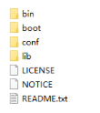

- bin：含有mvn运行的脚本
- boot：含有plexus-classworlds类加载器框架
- conf：含有settings.xml配置文件
- lib：含有Maven运行时所需要的java类库
- **Settings.xml 中默认的用户库: ${user.home}/.m2/repository[通过maven下载的jar包都会存储到指定的个人仓库中]**
- Maven默认仓库下载地址在: maven的lib目录下maven-model-builder-3.0.4.jar的pom.xml中

## 为什么使用Maven

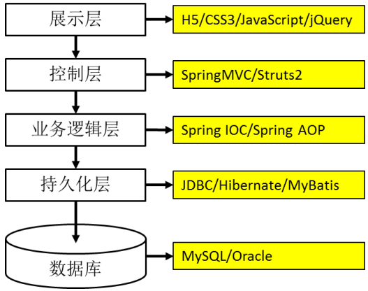

1. 添加第三方 jar 包  

> 使用 Maven 后每个 jar 包本身只在本地仓库中保存一份，需要 jar 包的工程只需要以坐标的方式简单的引用一下就可以了。  

2. jar 包之间的依赖关系  

> jar 包往往不是孤立存在的，很多 jar 包都需要在其他 jar 包的支持下才能够正常工作，我们称之为jar 包之间的依赖关系。  Maven 就可以替我们自动的将当前 jar 包所依赖的其他所有 jar 包全部导入进来，无需人工参与  

3. 获取第三方 jar 包  

> Maven 有统一规范的 jar 包管理体系。 你只需要在你的项目中以坐标的方式依赖一个 jar 包， Maven 就会自动从中央仓库进行下载，并同时下载这个 jar 包所依赖的其他 jar 包  

4. 将项目拆分成多个工程模块  

> 大的项目已经不可能通过package 结构来划分模块，必须将项目拆分成多个工程协同开发。多个模块工程中有的是 Java 工程，有的是 Web 工程。  工程拆分后又如何进行互相调用和访问呢？这就需要用到 Maven 的依赖管理机制。  

## 什么是Maven

Maven 是 Apache 软件基金会组织维护的一款**自动化构建工具**， 专注服务于 Java 平台的**项目构建和依赖管理**。 Maven 这个单词的本意是： 专家，内行。   

### 构建

构建并不是创建，创建一个工程并不等于构建一个项目。   

1. **纯 Java 代码**  

> .java 扩展名的源文件需要编译成.class 扩展名的字节码文件才能够执行。   

2. **Web 工程**  

> 需要通过浏览器访问 Java 程序时就必须将包含 Java 程序的 Web 工程编译的结果“拿”到服务器上的指定目录下，并启动服务器才行。 这个“拿”的过程我们叫**部署**。  
>
> Web 工程和其编译结果的目录结构对比见下图：  
>
> 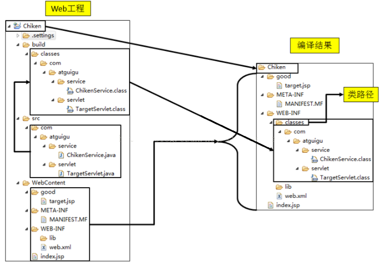

3. **实际项目**  

> 实际项目中整合第三方框架， Web 工程中除了 Java 程序和 JSP 页面、 图片等静态资源之外，还包括第**三方框架的 jar 包以及各种各样的配置文件**。   所有这些资源都必须按照正确的目录结构部署到服务器上， 项目才可以运行。  

**构建就是以我们编写的 Java 代码、框架配置文件、 国际化等其他资源文件、 JSP 页面和图片等静态资源作为“原材料”， 去“生产”出一个可以运行的项目的过程。**  

### 构建过程的几个主要环节  

1. **清理**：删除以前的编译结果，为重新编译做好准备。
2. **编译**：将 Java 源程序编译为字节码文件。
3. **测试**：针对项目中的关键点进行测试，确保项目在迭代开发过程中关键点的正确性。
4. 报告：在每一次测试后以标准的格式记录和展示测试结果。
5. **打包**：将一个包含诸多文件的工程封装为一个压缩文件用于安装或部署。 Java 工程对应 `jar `包，Web工程对应 `war `包。
6. **安装**：在 Maven 环境下特指将打包的结果——jar 包或 war 包安装到本地仓库中。
7. **部署**：将打包的结果部署到远程仓库或将 war 包部署到服务器上运行。  

**Maven 可以自动的从构建过程的起点一直执行到终点：**  

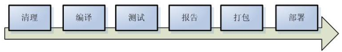

## Maven 核心概念  

①POM
②约定的目录结构
③坐标
④依赖管理
⑤仓库管理
⑥生命周期
⑦插件和目标
⑧继承
⑨聚合  

### 1. POM
`Project Object Model`：项目对象模型。将 Java 工程的相关信息封装为对象作为便于操作和管理的模型。Maven 工程的核心配置。

**POM怎么理解呢？？？**

- **我们使用Java是面向对象编程，对象就是我们的类**
- **而Maven是面向项目，把我们的项目看做成是一个对象来进行管理**

```xml
<?xml version="1.0" encoding="UTF-8"?>
<project xmlns="http://maven.apache.org/POM/4.0.0"
         xmlns:xsi="http://www.w3.org/2001/XMLSchema-instance"
         xsi:schemaLocation="http://maven.apache.org/POM/4.0.0 http://maven.apache.org/xsd/maven-4.0.0.xsd">
    <modelVersion>4.0.0</modelVersion>

    <groupId>ali</groupId>
    <artifactId>tianmao</artifactId>
    <version>1.0-SNAPSHOT</version>
		<dependenices>
      <dependency></dependency>
  	</dependenices>
	<!-- build配置自动构建的信息，需要在命令行使用mvn deploy-->
  <build>
  </build>
</project>
```


### 2. 约定的目录结构  

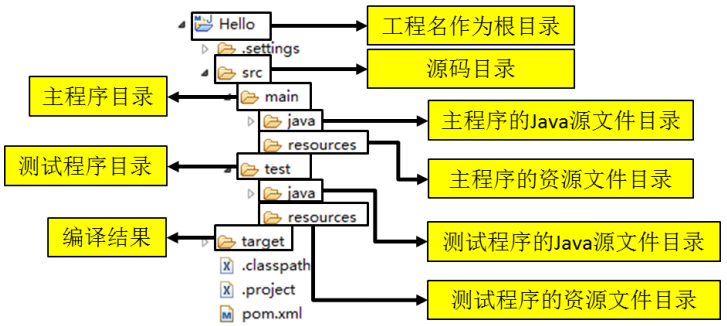

### 3. 坐标  

使用如下三个向量在 Maven 的仓库中唯一的确定一个 Maven 工程。

1. groupid：公司或组织的域名倒序+当前**项目名称**
2. artifactId：当前项目的**模块名称**
3. version：当前模块的**版本**

```xml
<groupId>com.atguigu.maven</groupId> 
<artifactId>Hello</artifactId> 
<version>0.0.1-SNAPSHOT</version>
```

如何通过坐标到仓库中查找 jar 包？

1. 将` gav `三个向量连起来

`com.atguigu.maven+Hello+0.0.1-SNAPSHOT`

2. 以连起来的字符串作为目录结构到仓库中查找

`com/atguigu/maven/Hello/0.0.1-SNAPSHOT/Hello-0.0.1-SNAPSHOT.jar`

> ※注意：我们自己的 Maven 工程必须执行安装操作才会进入仓库。 安装的命令是：` mvn install`

### 4. 依赖  

使用 dependency 标签指定被依赖 jar 包的坐标就可以了

```xml
<dependency>
  <groupId>com.atguigu.maven</groupId>
  <artifactId>Hello</artifactId>
  <version>0.0.1-SNAPSHOT</version>
  <scope>compile</scope>
</dependency>
```

> 如果引用自己写的项目模块，被引用的模块需要`mvn install`	安装到仓库中，其他项目再使用 dependency 标签进行依赖就可以用了（本质还是从对应目录中找jar包）

#### 依赖的范围:

 scope标签 设置是依赖的范围。 依赖的范围有几个可选值， 我们用得到的是：` compile`、` test`、 `provided `三个。  

1. 对主程序是否有效
2. 对测试程序是否有效
3. 是否参与编译打包

- 从项目结构角度理解 compile 和 test 的区别  

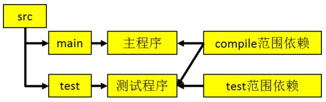

> 主程序中是找不到标注test范围的依赖的，如Junit

- 从开发和运行这两个不同阶段理解 compile 和 provided 的区别  

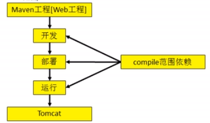

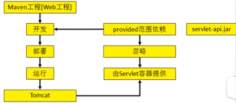


> 典型的如servlet-api.jar，部署时候由服务器提供

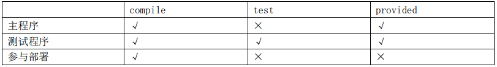

#### 依赖的传递性
A 依赖 B， B 依赖 C， A 能否使用 C 呢？ 那要看 B 依赖 C 的范围**是不是 compile， 如果是则可用， 否则不可用**。  

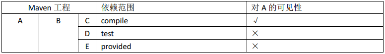

#### 依赖的排除  

如果我们在当前工程中引入了一个依赖是 A，而 A 又依赖了 B，那么 Maven 会自动将 A 依赖的 B 引入当前工程，但是个别情况下 B 有可能是一个不稳定版，或对当前工程有不良影响。 这时我们可以在引入 A 的时候将 B 排除。  

```xml
<dependency>
  <groupId>com.atguigu.maven</groupId>
  <artifactId>HelloFriend</artifactId>
  <version>0.0.1-SNAPSHOT</version>
  <type>jar</type>
  <scope>compile</scope>
  <exclusions>
    <exclusion>
      <groupId>commons-logging</groupId>
      <artifactId>commons-logging</artifactId>
    </exclusion>
  </exclusions>
</dependency>
```

#### 统一管理所依赖 jar 包的版本  

对同一个框架的一组 jar 包最好使用相同的版本。为了方便升级框架，可以将 jar 包的版本信息统一提取出来  

1. 统一声明版本号

```xml
<properties>
	<atguigu.spring.version>4.1.1.RELEASE</atguigu.spring.version>
</properties>
```

其中 atguigu.spring.version 部分是**自定义标签**。

2. 引用前面声明的版本号

```xml
<dependencies>
  <dependency>
    <groupId>org.springframework</groupId>
    <artifactId>spring-core</artifactId>
    <version>${atguigu.spring.version}</version>
  </dependency>
</dependencies>
```

#### 依赖的原则： 解决 jar 包冲突  

[1]路径最短者优先

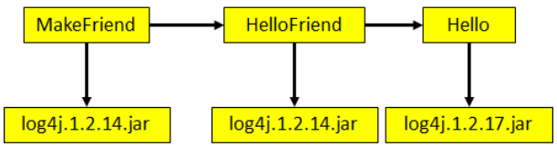

[2]路径相同时先声明者优先

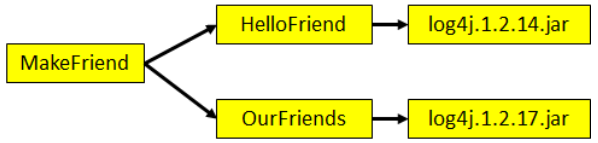

这里“声明”的先后顺序指的是 dependency 标签配置的先后顺序  

### 5. 仓库  

#### 分类

1. 本地仓库：为当前本机电脑上的所有 Maven 工程服务。
2. 远程仓库
   1. 私服：架设在当前局域网环境下，为当前局域网范围内的所有 Maven 工程服务。  
      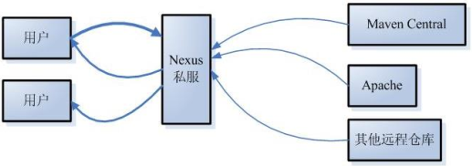
   2. 中央仓库：架设在 Internet 上，为全世界所有 Maven 工程服务。
   3. 中央仓库的镜像：架设在各个大洲，为中央仓库分担流量。减轻中央仓库的压力，同时更快的响应用户请求    

#### 仓库中的文件
1. Maven 的插件
2. 我们自己开发的项目的模块
3. 第三方框架或工具的 jar 包

> ※不管是什么样的 jar 包，在仓库中都是按照坐标生成目录结构，所以可以通过统一的方式查询或依赖。  

### 6. 生命周期  

Maven 生命周期定义了各个构建环节的执行顺序，有了这个清单， Maven 就可以自动化的执行构建命令了。  

Maven 有三套相互独立的生命周期， 分别是：

- Clean Lifecycle 在进行真正的构建之前进行一些清理工作。

- Default Lifecycle 构建的核心部分，编译，测试，打包，安装，部署等等。

- Site Lifecycle 生成项目报告，站点，发布站点。

它们是相互独立的，你可以仅仅调用 clean 来清理工作目录，仅仅调用 site 来生成站点。 当然你也可以直接运行 mvn clean install site 运行所有这三套生命周期  

每套生命周期都由一组阶段(Phase)组成  

#### Clean 生命周期  

Clean 生命周期一共包含了三个阶段：

1. pre-clean 执行一些需要在 clean 之前完成的工作
2. clean 移除所有上一次构建生成的文件
3. post-clean 执行一些需要在 clean 之后立刻完成的工作  

#### Site 生命周期

1. pre-site 执行一些需要在生成站点文档之前完成的工作
2. site 生成项目的站点文档
3. post-site 执行一些需要在生成站点文档之后完成的工作，并且为部署做准备
4. site-deploy 将生成的站点文档部署到特定的服务器上

这里经常用到的是 site 阶段和 site-deploy 阶段，用以生成和发布 Maven 站点  

#### ☆☆Default 

Default 生命周期是 Maven 生命周期中最重要的一个，绝大部分工作都发生在这个生命周期中。  

常用的阶段：

- **validate**
- generate-sources
- process-sources  
- generate-resources
- process-resources 复制并处理资源文件，至目标目录，准备打包。
- **compile 编译项目的源代码。**
- process-classes
- generate-test-sources
- process-test-sources
- generate-test-resources
- process-test-resources 复制并处理资源文件，至目标测试目录。
- test-compile 编译测试源代码。
- process-test-classes
- **test 使用合适的单元测试框架运行测试。这些测试代码不会被打包或部署。**
- prepare-package
- **package 接受编译好的代码，打包成可发布的格式，如 JAR。**
- pre-integration-test
- integration-test
- post-integration-test
- **verify**
- **install 将包安装至本地仓库，以让其它项目依赖。**
- **deploy 将最终的包复制到远程的仓库，以让其它开发人员与项目共享或部署到服务器上运行。**  

> 运行任何一个阶段的时候，它前面的所有阶段都会被运行， 例如我们运行 mvn install 的时候，代码会被编译，测试，打包。 这就是 Maven 为什么能够自动执行构建过程的各个环节的原因。  

### 7. 插件和目标
- Maven 的核心仅仅定义了抽象的生命周期，具体的任务都是交由插件完成的。
- 每个插件都能实现多个功能，**每个功能就是一个插件目标**。
- Maven 的生命周期与插件目标相互绑定，以完成某个具体的构建任务  

**声明周期插件:**

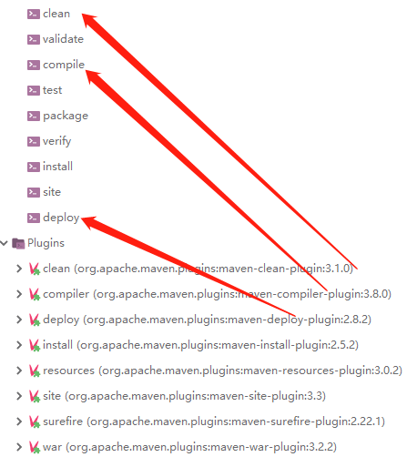

### 8.profiles

#### 1pom配置

 在开发过程中，我们的项目会存在不同的运行环境，比如开发环境、测试环境、生产环境，而我们的项目在不同的环境中，有的配置可能会不一样，比如数据源配置、日志文件配置、以及一些软件运行过程中的基本配置 

```xml
 <profiles>
        <profile>
            <!--不同环境Profile的唯一id-->
            <id>dev</id>
            <properties>
                <!--profiles.active是自定义的字段（名字随便起），自定义字段可以有多个-->
                <profiles.active>dev</profiles.active>
            </properties>
        </profile>
        <profile>
            <id>prod</id>
            <properties>
                <profiles.active>prod</profiles.active>
            </properties>
            <activation>
                <activeByDefault>true</activeByDefault>
            </activation>
        </profile>
        <profile>
            <id>test</id>
            <properties>
                <profiles.active>test</profiles.active>
            </properties>
        </profile>
    </profiles>
```

 可以看到定义了多个profile，每个profile都有**唯一的id**，也包含**properties属性**。这里为每个profile都定义一个名为`profiles.active`的properties，每个环境的值不同。当我们打包项目时，激活不同的环境，profiles.active字段就会被赋予不同的值。

#### **2结合resource属性**

       

这个profiles.active字段可以应用到许多地方，及其灵活。可以在配置文件里被引用；也可以结合pom文件里的resource和filter属性，作为文件名的一部分或者文件夹名的一部分

这里定义了dev，prod，test三个文件夹，用来演示maven中profile的使用。注意，每个文件夹里还定义了`application-{xxx}.properties`件，这里相当于结合springboot的Profile的使用，是我比较推荐的方式，和本文maven的profile使用无关系，在`application.properties`都有`spring.profiles.active=xxx`去加载对应的application-{xxx}.properties。

#### 3激活

1. 通过pom文件里的`activation`属性，pom文件里的关键配置为：

```xml
 <build>
        <plugins>
            <plugin>
                <groupId>org.springframework.boot</groupId>
                <artifactId>spring-boot-maven-plugin</artifactId>
                <executions>
                    <execution>
                        <goals>
                            <goal>repackage</goal>
                        </goals>
                    </execution>
                </executions>
                <configuration>
                    <executable>true</executable>
                </configuration>
            </plugin>
        </plugins>

        <resources>
            <resource>
                <directory>src/main/resources/</directory>
                <!--打包时先排除掉三个文件夹-->
                <excludes>
                    <exclude>dev/*</exclude>
                    <exclude>prod/*</exclude>
                    <exclude>test/*</exclude>
                </excludes>
                <includes>
                    <!--如果有其他定义通用文件，需要包含进来-->
                    <!--<include>messages/*</include>-->
                </includes>
            </resource>
            <resource>
                <!--这里是关键！ 根据不同的环境，把对应文件夹里的配置文件打包-->
                <directory>src/main/resources/${profiles.active}</directory>
            </resource>
        </resources>
    </build>

    <profiles>
        <profile>
            <!--不同环境Profile的唯一id-->
            <id>dev</id>
            <properties>
                <!--profiles.active是自定义的字段，自定义字段可以有多个-->
                <profiles.active>dev</profiles.active>
            </properties>
        </profile>
        <profile>
            <id>prod</id>
            <properties>
                <profiles.active>prod</profiles.active>
            </properties>
            <!--activation用来指定激活方式，可以根据jdk环境，环境变量，文件的存在或缺失-->
            <activation>
                <!--这个字段表示默认激活-->
                <activeByDefault>true</activeByDefault>
            </activation>
        </profile>
        <profile>
            <id>test</id>
            <properties>
                <profiles.active>test</profiles.active>
            </properties>
        </profile>
    </profiles>
```

2. `mvn clean package -Ptest`

 即在使用maven打包时通过-P参数，-P后跟上profile的唯一id 

## 继承  

由于非 compile 范围的依赖信息是不能在“依赖链”中传递的， 所以有需要的工程只能单独配置，可能版本号不一致出现问题。  

使用继承机制就可以将这样的**依赖版本号统一提取到父工程模块中进行统一管理**，子工程不需要配置版本号。   

1. 创建父工程

创建父工程和创建一般的 Java 工程操作一致，唯一需要注意的是： **打包方式处要设置为 pom**。  

```xml
<?xml version="1.0" encoding="UTF-8"?>
<project xmlns="http://maven.apache.org/POM/4.0.0"
         xmlns:xsi="http://www.w3.org/2001/XMLSchema-instance"
         xsi:schemaLocation="http://maven.apache.org/POM/4.0.0 http://maven.apache.org/xsd/maven-4.0.0.xsd">
    <modelVersion>4.0.0</modelVersion>
    <groupId>com.atguigu.maven</groupId>
    <artifactId>Parent</artifactId>
    <version>0.0.1-SNAPSHOT</version>
  	<packaging>pom</packaging>
</project>
```


2. 在子工程中引用父工程  :

```xml
<parent>
  <!-- 父工程坐标 -->
  <groupId>com.atguigu.maven</groupId>
  <artifactId>Parent</artifactId>
  <version>0.0.1-SNAPSHOT</version>
  <!-- 指定从当前子工程的pom.xml文件出发，查找父工程的pom.xml的路径 -->
  <relativePath>../Parent/pom.xml</relativePath>
</parent>
```

3. 在父工程中管理依赖

将 Parent 项目中的 dependencies 标签，用 dependencyManagement 标签括起来  

```xml
<dependencyManagement>
  <dependencies>
    <dependency>
      <groupId>junit</groupId>
      <artifactId>junit</artifactId>
      <version>4.9</version>
      <scope>test</scope>
    </dependency>
	</dependencies>
</dependencyManagement>
```

4. 在子项目中重新指定需要的依赖，删除范围和版本号  

```xml
<dependencies>
  <dependency>
    <groupId>junit</groupId>
    <artifactId>junit</artifactId>
  </dependency>
</dependencies>
```

> 配置继承后，使用安装命令时候需要先安装父工程

## 聚合  

将多个工程拆分为模块后， 需要手动逐个安装到仓库后依赖才能够生效。 修改源码后也需要逐个手动进行 clean 操作。 而使用了聚合之后就可以**批量进行 Maven 工程的安装、清理工作**  

如何配置聚合？在**总的聚合工程（如父工程）中使用 modules/module 标签组合**， 指定模块工程的相对路径即可，安装的时候在聚合工程上执行命令就可以了。  

```xml
<modules>
  <module>../Hello</module>
  <module>../HelloFriend</module>
  <module>../MakeFriends</module>
</modules>
```


## Maven 酷站

我们可以到 http://mvnrepository.com/搜索需要的 jar 包的依赖信息。  