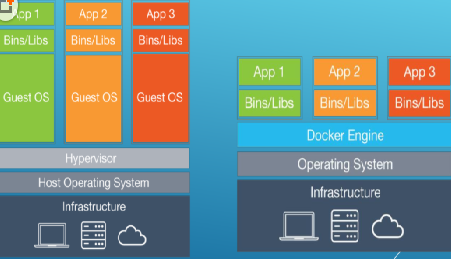
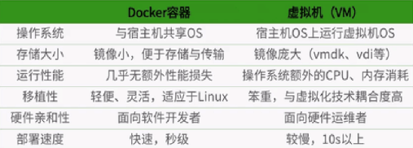

# 1. Dokcer简介

是什么：解决了运行环境和配置问题的软件容器，方便做持续集成并有助于整体发布的容器虚拟化技术

能干嘛：一次构建、随处运行

- 更快速的应用交付和部署
- 更便捷的升级和扩缩容
- 更简单的系统运维
- 更高效的计算资源利用

docker中文网站：https://www.docker-cn.com/

仓库：Docker Hub官网: https://hub.docker.com/

## 基本组成

**Docker 镜像（Image）**

就是一个只读的模板。镜像可以用来创建 Docker 容器，一个镜像可以创建很多容器

1. 容器--对象
2. 镜像--类

**容器（Container**

Docker 利用容器（Container）独立运行的一个或一组应用。容器是用镜像创建的**运行实例**。

它可以被启动、开始、停止、删除。每个容器都是相互隔离的、保证安全的平台。

可以把容器看做是一个简易版的 Linux 环境（包括root用户权限、进程空间、用户空间和网络空间等）和运行在其中的应用程序。

容器的定义和镜像几乎一模一样，也是一堆层的统一视角，唯一区别在于容器的最上面那一层是可读可写的。

**仓库（Repository）**

仓库（Repository）是集中存放镜像文件的场所。

仓库(Repository)和仓库注册服务器（Registry）是有区别的。仓库注册服务器上往往存放着多个仓库，每个仓库中又包含了多个镜像，每个镜像有不同的标签（tag）。

仓库分为公开仓库（Public）和私有仓库（Private）两种形式。

最大的公开仓库是 Docker Hub(https://hub.docker.com/)，存放了数量庞大的镜像供用户下载。国内的公开仓库包括阿里云 、网易云 等

> 需要正确的理解仓储/镜像/容器这几个概念:
>
>  Docker 本身是一个容器运行载体或称之为管理引擎。我们把应用程序和配置依赖打包好形成一个可交付的运行环境，这个打包好的运行环境就似乎 image镜像文件。只有通过这个镜像文件才能生成 Docker 容器。image 文件可以看作是容器的模板。Docker 根据 image 文件生成容器的实例。同一个 image 文件，可以生成多个同时运行的容器实例。
>
> *  image 文件生成的容器实例，本身也是一个文件，称为镜像文件。
>
> *  一个容器运行一种服务，当我们需要的时候，就可以通过docker客户端创建一个对应的运行实例，也就是我们的容器
>
> *  至于仓储，就是放了一堆镜像的地方，我们可以把镜像发布到仓储中，需要的时候从仓储中拉下来就可以了。

# 2. docker安装

CentOS7安装Docker：

官网中文安装参考手册：https://docs.docker-cn.com/engine/installation/linux/docker-ce/centos/#prerequisites

1. yum安装gcc相关

```
yum -y install gcc
yum -y install gcc-c++
```

2. 卸载旧版本

```
yum -y remove docker docker-common docker-selinux docker-engine
```

3. 安装需要的软件包

```
yum install -y yum-utils device-mapper-persistent-data lvm2
```

4. 设置stable镜像仓库

```
yum-config-manager --add-repo http://mirrors.aliyun.com/docker-ce/linux/centos/docker-ce.repo
```

5. 更新yum软件包索引

```
yum makecache fast
```

6. 安装DOCKER CE

```
yum -y install docker-ce
```

7. 启动docker

```
systemctl start docker
```

8. 测试

````
docker version
````

9. 卸载

```
systemctl stop docker 
yum -y remove docker-ce
rm -rf /var/lib/docker
```


## Helloworld

### 阿里云镜像加速

https://dev.aliyun.com/search.html

```
mkdir -p /etc/docker
```

```
vim  /etc/docker/daemon.json
#阿里云
{"registry-mirrors": ["https://｛自已的编码｝.mirror.aliyuncs.com"]}
```

```
systemctl daemon-reload
systemctl restart docker
```

Linux 系统下配置完加速器需要检查是否生效：`ps -ef|grep docker`

```
docker run hello-world
```


> Docker是一个Client-Server结构的系统，Docker守护进程运行在主机上， 然后通过Socket连接从客户端访问，守护进程从客户端接受命令并管理运行在主机上的容器。 容器，是一个运行时环境，就是我们前面说到的集装箱。
>
> 

> ##### 为什么Docker比较比VM快
>
> (1)docker有着比虚拟机更少的抽象层。由亍docker不需要Hypervisor实现硬件资源虚拟化,运行在docker容器上的程序直接使用的都是实际物理机的硬件资源。因此在CPU、内存利用率上docker将会在效率上有明显优势。
>
> (2)docker利用的是宿主机的内核,而不需要Guest OS。因此,当新建一个容器时,docker不需要和虚拟机一样重新加载一个操作系统内核。仍而避免引寻、加载操作系统内核返个比较费时费资源的过程,当新建一个虚拟机时,虚拟机软件需要加载Guest OS,返个新建过程是分钟级别的。而docker由于直接利用宿主机的操作系统,则省略了返个过程,因此新建一个docker容器只需要几秒钟。
>
> 
>
> 

# 3. Docker常用命令

### 帮助命令

```
docker version
docker info
docker --help
```

### 镜像命令

#### docker images

列出本地主机上的镜像

REPOSITORY：表示镜像的仓库源
TAG：镜像的标签
IMAGE ID：镜像ID
CREATED：镜像创建时间
SIZE：镜像大小

#### docker search 

`docker search [OPTIONS] 镜像名字`

> OPTIONS说明：
>
> --no-trunc : 显示完整的镜像描述
>
> -s : 列出收藏数不小于指定值的镜像。
>
> --automated : 只列出 automated build类型的镜像；

#### docker pull 

下载镜像

docker pull 镜像名字[:TAG]

#### docker rmi 

删除镜像

> 删除单个`docker rmi  -f 镜像ID`
>
> 删除多个`docker rmi -f 镜像名1:TAG 镜像名2:TAG `
>
> 删除全部`docker rmi -f $(docker images -qa)`

### 容器命令

有镜像才能创建容器，这是根本前提(下载一个CentOS镜像演示)：`docker pull centos`

启动交互式容器:`docker run -it centos /bin/bash`:#使用镜像centos:latest以交互模式启动一个容器,在容器内执行/bin/bash命令。

> 新建并启动容器:`docker run [OPTIONS] IMAGE [COMMAND] [ARG...]` 
>
> OPTIONS说明（常用）：有些是一个减号，有些是两个减号
>
> `--name=`"容器新名字": 为容器指定一个名称；
> `-d`: 后台运行容器，并返回容器ID，也即启动守护式容器；
> `-i`：以交互模式运行容器，通常与 -t 同时使用；
> `-t`：为容器重新分配一个伪输入终端，通常与 -i 同时使用；

列出当前所有正在运行的容器:`docker ps [OPTIONS]`

> OPTIONS说明（常用）：
>
> `-a` :列出当前所有正在运行的容器+历史上运行过的
> `-l` :显示最近创建的容器。
> `-n`：显示最近n个创建的容器。
> `-q` :静默模式，只显示容器编号。
> `--no-trunc` :不截断输出。

退出容器:

- exit:容器停止退出
- ctrl+P+Q:容器不停止退出

启动容器:`docker start 容器ID或者容器名`

重启容器:`docker restart 容器ID或者容器名`

停止容器:`docker stop 容器ID或者容器名`

强制停止容器:`docker kill 容器ID或者容器名`

删除已停止的容器:`docker rm 容器ID`

- 一次性删除多个容器:`docker rm -f $(docker ps -a -q)`;`docker ps -a -q | xargs docker rm`

-----

#### 启动守护式容器

`docker run -d 容器名`:只在后台运行，没有交互界面

#使用镜像centos:latest以后台模式启动一个容器`docker run -d centos`

问题：然后`docker ps -a `进行查看, 会发现容器已经退出

很重要的要说明的一点: **Docker容器后台运行,就必须有一个前台进程**.容器运行的命令如果不是那些一直挂起的命令（比如运行top，tail），就是会自动退出的。

这个是docker的机制问题,比如你的web容器,我们以nginx为例，正常情况下,我们配置启动服务只需要启动响应的service即可。例如`service nginx start`

但是,这样做,nginx为后台进程模式运行,就导致docker前台没有运行的应用,这样的容器后台启动后,会立即自杀因为他觉得他没事可做了.所以，最佳的解决方案是,将你要运行的程序以前台进程的形式运行

#### 查看容器日志

`docker logs -f -t --tail 容器ID`

- `-t `是加入时间戳

*   `-f` 跟随最新的日志打印
*   `--tail `数字 显示最后多少条

#### 查看容器内运行的进程

`docker top 容器ID`

#### 查看容器内部细节

`docker inspect 容器ID`

#### 进入正在运行的容器并以命令行交互

- `docker exec -it 容器ID bashShell`
- `重新进入docker attach 容器ID`

> exec 是在容器中打开新的终端，并且可以启动新的进程
>
> attach 直接进入容器启动命令的终端，不会启动新的进程

#### 从容器内拷贝文件到主机上

`docker cp  容器ID:容器内路径 目的主机路径`

## 命令总结


> attach    Attach to a running container                 # 当前 shell 下 attach 连接指定运行镜像
> build     Build an image from a Dockerfile              # 通过 Dockerfile 定制镜像
> commit    Create a new image from a container changes   # 提交当前容器为新的镜像
> cp        Copy files/folders from the containers filesystem to the host path   #从容器中拷贝指定文件或者目录到宿主机中
> create    Create a new container                        # 创建一个新的容器，同 run，但不启动容器
> diff      Inspect changes on a container's filesystem   # 查看 docker 容器变化
> events    Get real time events from the server          # 从 docker 服务获取容器实时事件
> exec      Run a command in an existing container        # 在已存在的容器上运行命令
> export    Stream the contents of a container as a tar archive   # 导出容器的内容流作为一个 tar 归档文件[对应 import ]
> history   Show the history of an image                  # 展示一个镜像形成历史
> images    List images                                   # 列出系统当前镜像
> import    Create a new filesystem image from the contents of a tarball # 从tar包中的内容创建一个新的文件系统映像[对应export]
> info      Display system-wide information               # 显示系统相关信息
> inspect   Return low-level information on a container   # 查看容器详细信息
> kill      Kill a running container                      # kill 指定 docker 容器
> load      Load an image from a tar archive              # 从一个 tar 包中加载一个镜像[对应 save]
> login     Register or Login to the docker registry server    # 注册或者登陆一个 docker 源服务器
> logout    Log out from a Docker registry server          # 从当前 Docker registry 退出
> logs      Fetch the logs of a container                 # 输出当前容器日志信息
> port      Lookup the public-facing port which is NAT-ed to PRIVATE_PORT    # 查看映射端口对应的容器内部源端口
> pause     Pause all processes within a container        # 暂停容器
> ps        List containers                               # 列出容器列表
> pull      Pull an image or a repository from the docker registry server   # 从docker镜像源服务器拉取指定镜像或者库镜像
> push      Push an image or a repository to the docker registry server    # 推送指定镜像或者库镜像至docker源服务器
> restart   Restart a running container                   # 重启运行的容器
> rm        Remove one or more containers                 # 移除一个或者多个容器
> rmi       Remove one or more images             # 移除一个或多个镜像[无容器使用该镜像才可删除，否则需删除相关容器才可继续或 -f 强制删除]
> run       Run a command in a new container              # 创建一个新的容器并运行一个命令
> save      Save an image to a tar archive                # 保存一个镜像为一个 tar 包[对应 load]
> search    Search for an image on the Docker Hub         # 在 docker hub 中搜索镜像
> start     Start a stopped containers                    # 启动容器
> stop      Stop a running containers                     # 停止容器
> tag       Tag an image into a repository                # 给源中镜像打标签
> top       Lookup the running processes of a container   # 查看容器中运行的进程信息
> unpause   Unpause a paused container                    # 取消暂停容器
> version   Show the docker version information           # 查看 docker 版本号
> wait      Block until a container stops, then print its exit code   # 截取容器停止时的退出状态值

# 4. docker 镜像

镜像是一种轻量级、可执行的独立软件包，用来打包软件运行环境和基于运行环境开发的软件，它包含运行某个软件所需的所有内容，包括代码、运行时、库、环境变量和配置文件。

### UnionFS（联合文件系统）

Union文件系统（UnionFS）是一种分层、轻量级并且高性能的文件系统，它支持对文件系统的修改作为一次提交来一层层的叠加，同时可以将不同目录挂载到同一个虚拟文件系统下(unite several directories into a single virtual filesystem)。Union 文件系统是 Docker 镜像的基础。镜像可以通过分层来进行继承，基于基础镜像（没有父镜像），可以制作各种具体的应用镜像。

特性：一次同时加载多个文件系统，但从外面看起来，只能看到一个文件系统，联合加载会把各层文件系统叠加起来，这样最终的文件系统会包含所有底层的文件和目录


### Docker镜像加载原理：

   docker的镜像实际上由一层一层的文件系统组成，这种层级的文件系统UnionFS。

**bootfs(boot file system)**主要包含bootloader和kernel, bootloader主要是引导加载kernel, Linux刚启动时会加载bootfs文件系统，在Docker镜像的最底层是bootfs。这一层与我们典型的Linux/Unix系统是一样的，包含boot加载器和内核。当boot加载完成之后整个内核就都在内存中了，此时内存的使用权已由bootfs转交给内核，此时系统也会卸载bootfs。

**rootfs (root file system)** ，在bootfs之上。包含的就是典型 Linux 系统中的 /dev, /proc, /bin, /etc 等标准目录和文件。rootfs就是各种不同的操作系统发行版，比如Ubuntu，Centos等等。 


> 平时我们安装进虚拟机的CentOS都是好几个G，为什么docker这里才200M？？
>
> 对于一个精简的OS，rootfs可以很小，只需要包括最基本的命令、工具和程序库就可以了，因为底层直接用Host的kernel，自己只需要提供 rootfs 就行了。由此可见对于不同的linux发行版, bootfs基本是一致的, rootfs会有差别, 因此不同的发行版可以公用bootfs。

> 为什么 Docker 镜像要采用这种分层结构呢?
>
> 最大的一个好处就是 - 共享资源
>
> 比如：有多个镜像都从相同的 base 镜像构建而来，那么宿主机只需在磁盘上保存一份base镜像，
> 同时内存中也只需加载一份 base 镜像，就可以为所有容器服务了。而且镜像的每一层都可以被共享。

Docker镜像都是只读的:当容器启动时，一个新的可写层被加载到镜像的顶部。这一层通常被称作“容器层”，“容器层”之下的都叫“镜像层”。

----

> #### Docker镜像commit操作补充

`docker commit`提交容器副本使之成为一个新的镜像

`docker commit -m=“提交的描述信息” -a=“作者” 容器ID 要创建的目标镜像名:[标签名]`

> eg:
>
> 1. 从Hub上下载tomcat镜像到本地并成功运行`docker run -it -p 8080:8080 tomcat`
>
> > -p 主机端口:docker容器端口
> >
> > -P 随机分配端口
> >
> > i:交互
> >
> > t:终端
>
> 2. 故意删除上一步镜像生产tomcat容器的文档
> 3. 也即当前的tomcat运行实例是一个没有文档内容的容器，以它为模板commit一个没有doc的tomcat新镜像atguigu/tomcat02
> 4. 启动我们的新镜像并和原来的对比

----

# 5. Docker容器数据卷

先来看看Docker的理念：
*  将运用与运行的环境打包形成容器运行 ，运行可以伴随着容器，但是我们对数据的要求希望是持久化的
*  容器之间希望有可能共享数据


Docker容器产生的数据，如果不通过docker commit生成新的镜像，使得数据做为镜像的一部分保存下来，
那么当容器删除后，数据自然也就没有了。

**为了能保存数据在docker中我们使用卷**。

---

**卷就是目录或文件**，存在于一个或多个容器中，由docker挂载到容器，但不属于联合文件系统，因此能够绕过Union File System提供一些用于持续存储或共享数据的特性：

 卷的设计目的就是**数据的持久化**，完全独立于容器的生存周期，因此Docker不会在容器删除时删除其挂载的数据卷

特点：

1. 数据卷可在容器之间共享或重用数据
2. 卷中的更改可以直接生效
3. 数据卷中的更改不会包含在镜像的更新中
4. 数据卷的生命周期一直持续到没有容器使用它为止

---

### 数据卷操作

` docker run -it -v /宿主机绝对路径目录:/容器内目录      镜像名`

查看数据卷是否挂载成功·`docker inspect 容器ID`

> 这样容器和宿主机之间两个目录之间的文件就会保持同步

带权限：` docker run -it -v /宿主机绝对路径目录:/容器内目录:ro 镜像名`

- 只读权限，容器不可以修改数据，只能宿主机可以修改文件数据

# 6. DockerFile解析

Dockerfile是用来构建Docker镜像的构建文件，是由一系列命令和参数构成的脚本。

构建三步骤：

- 编写DockerFile文件
- docker build
- docker run


### DockerFile构建过程解析

Docker执行Dockerfile的大致流程：

1. docker从基础镜像运行一个容器
2. 执行一条指令并对容器作出修改
3. 执行类似`docker commit`的操作提交一个新的镜像层
4. docker再基于刚提交的镜像运行一个新容器
5. 执行dockerfile中的下一条指令直到所有指令都执行完成

----

从应用软件的角度来看，Dockerfile、Docker镜像与Docker容器分别代表软件的三个不同阶段，

*  Dockerfile是软件的原材料
*  Docker镜像是软件的交付品
*  Docker容器则可以认为是软件的运行态。

Dockerfile面向开发，Docker镜像成为交付标准，Docker容器则涉及部署与运维，三者缺一不可，合力充当Docker体系的基石。


1. Dockerfile，需要定义一个Dockerfile，Dockerfile定义了进程需要的一切东西。Dockerfile涉及的内容包括执行代码或者是文件、环境变量、依赖包、运行时环境、动态链接库、操作系统的发行版、服务进程和内核进程(当应用进程需要和系统服务和内核进程打交道，这时需要考虑如何设计namespace的权限控制)等等;

2. Docker镜像，在用Dockerfile定义一个文件之后，docker build时会产生一个Docker镜像，当运行 Docker镜像时，会真正开始提供服务;

3. Docker容器，容器是直接提供服务的。

### DockerFile体系结构(保留字指令)

| 保留字     | 说明                                                         |
| ---------- | ------------------------------------------------------------ |
| FROM       | 基础镜像，当前新镜像是基于哪个镜像的                         |
| MAINRAINER | 镜像维护者的姓名和邮箱地址                                   |
| RUN        | 容器构建时需要运行的命令                                     |
| EXPOSE     | 当前容器对外暴露出的端口                                     |
| WORKDIR    | 指定在创建容器后，终端默认登陆的进来工作目录，一个落脚点     |
| ENV        | 用来在构建镜像过程中设置环境变量                             |
| ADD        | 将宿主机目录下的文件拷贝进镜像且ADD命令会自动处理URL和解压tar压缩包 |
| COPY       | 类似ADD，拷贝文件和目录到镜像中。将从构建上下文目录中 <源路径> 的文件/目录复制到新的一层的镜像内的 <目标路径> 位置`COPY src dest`;`COPY ["src", "dest"]` |
| VOLUME     | 容器数据卷，用于数据保存和持久化工作                         |
| CMD | 指定一个容器启动时要运行的命令 ;Dockerfile 中可以有多个 CMD 指令，但只有最后一个生效，CMD 会被 docker run 之后的参数替换|
|ENTRYPOINT  |指定一个容器启动时要运行的命令;ENTRYPOINT 的目的和 CMD 一样，都是在指定容器启动程序及参数 |
|ONBUILD |当构建一个被继承的Dockerfile时运行命令，父镜像在被子继承后父镜像的onbuild被触发|


### DockerFile案例

Base镜像(scratch)：Docker Hub 中 99% 的镜像都是通过在 base 镜像中安装和配置需要的软件构建出来的`FROM scratch`

#### 自定义镜像mycentos

以dockerhub中的centos为基础，增加vim等功能，制作自定义centos

1. 编写

> 在宿主机`/zzyyuse/mydockerfile`下编写`Dockerfile`文件
>
> ```bash
> FROM centos
> MAINTAINER zzyy<zzyy167@126.com>
>  
> ENV MYPATH /usr/local
> WORKDIR $MYPATH
>  
> RUN yum -y install vim
> RUN yum -y install net-tools
>  
> EXPOSE 80
>  
> CMD echo $MYPATH
> CMD echo "success--------------ok"
> CMD /bin/bash
> ```

2. 构建

> `docker build -t 新镜像名字:TAG .`
>
> 会看到 docker build 命令最后有一个 `.`表示当前目录
>
> 

3. 运行

> `docker run -it 新镜像名字:TAG`
>
> 

4. 列出镜像的变更历史

> `docker history 镜像名`

#### 自定义镜像Tomcat9

1. `mkdir -p /zzyyuse/mydockerfile/tomcat9`
2. `在上述目录下touch c.txt`
3. 将jdk和tomcat安装的压缩包拷贝进上一步目录`apache-tomcat-9.0.8.tar.gz`;`jdk-8u171-linux-x64.tar.gz`
4. 在/zzyyuse/mydockerfile/tomcat9目录下新建Dockerfile文件

> ```
> FROM         centos
> MAINTAINER    zzyy<zzyybs@126.com>
> #把宿主机当前上下文的c.txt拷贝到容器/usr/local/路径下
> COPY c.txt /usr/local/cincontainer.txt
> #把java与tomcat添加到容器中
> ADD jdk-8u171-linux-x64.tar.gz /usr/local/
> ADD apache-tomcat-9.0.8.tar.gz /usr/local/
> #安装vim编辑器
> RUN yum -y install vim
> #设置工作访问时候的WORKDIR路径，登录落脚点
> ENV MYPATH /usr/local
> WORKDIR $MYPATH
> #配置java与tomcat环境变量
> ENV JAVA_HOME /usr/local/jdk1.8.0_171
> ENV CLASSPATH $JAVA_HOME/lib/dt.jar:$JAVA_HOME/lib/tools.jar
> ENV CATALINA_HOME /usr/local/apache-tomcat-9.0.8
> ENV CATALINA_BASE /usr/local/apache-tomcat-9.0.8
> ENV PATH $PATH:$JAVA_HOME/bin:$CATALINA_HOME/lib:$CATALINA_HOME/bin
> #容器运行时监听的端口
> EXPOSE  8080
> #启动时运行tomcat
> # ENTRYPOINT ["/usr/local/apache-tomcat-9.0.8/bin/startup.sh" ]
> # CMD ["/usr/local/apache-tomcat-9.0.8/bin/catalina.sh","run"]
> CMD /usr/local/apache-tomcat-9.0.8/bin/startup.sh && tail -F
> /usr/local/apache-tomcat-9.0.8/bin/logs/catalina.out
> ```
>
> 

5. 构建

> `docker build -t zzyytomcat9`

6. run

> ````bash
> docker run -d -p 9080:8080 --name myt9 
> -v /zzyyuse/mydockerfile/tomcat9/test:/usr/local/apache-tomcat-9.0.8/webapps/test 
> -v /zzyyuse/mydockerfile/tomcat9/tomcat9logs/:/usr/local/apache-tomcat-9.0.8/logs 
> --privileged=true zzyytomcat9
> ````
>
> Docker挂载主机目录Docker访问出现`cannot open directory .: Permission denied`
> 解决办法：在挂载目录后多加一个--privileged=true参数即

# 7. Docker常用安装

## 安装MySQL

1. docker hub上面查找mysql镜像·：`docker search mysql`

2. hub上(阿里云加速器)拉取mysql镜像到本地标签为5.6：`docker pull mysql:5.6`

3. 使用mysql5.6镜像创建容器(也叫运行镜像)

> 使用mysql镜像:
>
> ```
> docker run -p 12345:3306 --name mysql 
> -v /zzyyuse/mysql/conf:/etc/mysql/conf.d 
> -v /zzyyuse/mysql/logs:/logs 
> -v /zzyyuse/mysql/data:/var/lib/mysql 
> -e MYSQL_ROOT_PASSWORD=123456 
> -d mysql:5.6
> ```
>
> 命令说明：
>
> - `-p 12345:3306`：将主机的12345端口映射到docker容器的3306端口。
> - `--name mysql`：运行服务名字
>   `-v /zzyyuse/mysql/conf:/etc/mysql/conf.d` ：将主机/zzyyuse/mysql录下的conf/my.cnf 挂载到容器的 /etc/mysql/conf.d
> - `-v /zzyyuse/mysql/logs:/logs`：将主机/zzyyuse/mysql目录下的 logs 目录挂载到容器的 /logs。
> - `-v /zzyyuse/mysql/data:/var/lib/mysql` ：将主机/zzyyuse/mysql目录下的data目录挂载到容器的 /var/lib/mysql 
> - `-e MYSQL_ROOT_PASSWORD=123456`：初始化 root 用户的密码。
> - `-d mysql:5.6` : 后台程序运行mysql5.6
>
> `docker exec -it MySQL运行成功后的容器ID     /bin/bash`

外部Win10终端也来连接运行在dokcer上的mysql服务

数据备份

> `docker exec myql服务容器ID sh -c ' exec mysqldump --all-databases -uroot -p"123456" ' > /zzyyuse/all-databases.sql`

## 安装Redis

从docker hub上(阿里云加速器)拉取redis镜像到本地标签为3.2`docker pull redis:3.2`

使用redis

> ```
> docker run -p 6379:6379 
> -v /zzyyuse/myredis/data:/data 
> -v /zzyyuse/myredis/conf/redis.conf:/usr/local/etc/redis/redis.conf  
> -d redis:3.2 redis-server /usr/local/etc/redis/redis.conf 
> --appendonly yes
> ```

在主机/zzyyuse/myredis/conf/redis.conf目录下新建redis.conf文件

> `vim /zzyyuse/myredis/conf/redis.conf/redis.conf`
>
> ```
> # Redis configuration file example.
> #
> # Note that in order to read the configuration file, Redis must be
> # started with the file path as first argument:
> #
> # ./redis-server /path/to/redis.conf
>  
> # Note on units: when memory size is needed, it is possible to specify
> # it in the usual form of 1k 5GB 4M and so forth:
> #
> # 1k => 1000 bytes
> # 1kb => 1024 bytes
> # 1m => 1000000 bytes
> # 1mb => 1024*1024 bytes
> # 1g => 1000000000 bytes
> # 1gb => 1024*1024*1024 bytes
> #
> # units are case insensitive so 1GB 1Gb 1gB are all the same.
> ################################## INCLUDES ###################################
>  
> # Include one or more other config files here.  This is useful if you
> # have a standard template that goes to all Redis servers but also need
> # to customize a few per-server settings.  Include files can include
> # other files, so use this wisely.
> #
> # Notice option "include" won't be rewritten by command "CONFIG REWRITE"
> # from admin or Redis Sentinel. Since Redis always uses the last processed
> # line as value of a configuration directive, you'd better put includes
> # at the beginning of this file to avoid overwriting config change at runtime.
> #
> # If instead you are interested in using includes to override configuration
> # options, it is better to use include as the last line.
> #
> # include /path/to/local.conf
> # include /path/to/other.conf
> ```
>
> 

测试redis-cli连接上来：`docker exec -it 运行着Rediis服务的容器ID redis-cli`