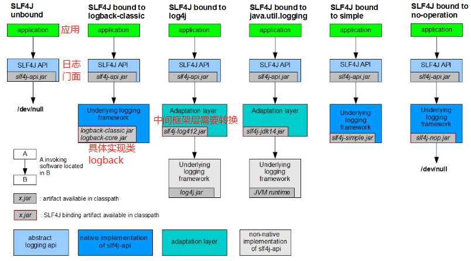
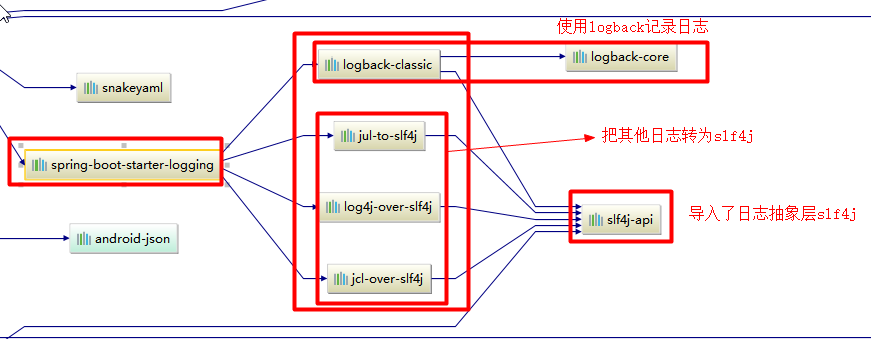

# 日志框架

[SpringBoot日志官方文档](https://docs.spring.io/spring-boot/docs/2.3.1.RELEASE/reference/html/spring-boot-features.html#boot-features-logging)

## 1. 日志框架

**市面上的日志框架；**

JUL、JCL、Jboss-logging、logback、log4j、log4j2、slf4j....

| 日志门面  （日志的抽象层）                                   | 日志实现                                             |
| ------------------------------------------------------------ | ---------------------------------------------------- |
| ~~JCL（Jakarta  Commons Logging）~~    SLF4j（Simple  Logging Facade for Java）   ~~jboss-logging~~ | Log4j  JUL（java.util.logging）  Log4j2  **Logback** |

左边选一个门面（抽象层）、右边来选一个实现；

- 日志门面：  SLF4J；
- 日志实现：Logback；

SpringBoot：底层是Spring框架，Spring框架默认是用JCL；

​	**==SpringBoot选用 SLF4j和logback；==**

## 2. SLF4j使用

http://www.slf4j.org/index.html

### 使用SLF4j

以后开发的时候，日志记录方法的调用，不应该来直接调用日志的实现类，而是调用日志抽象层里面的方法；

- 给系统里面导入 **slf4j的jar** 和  **logback的实现jar**

```java
import org.slf4j.Logger;
import org.slf4j.LoggerFactory;
public class HelloWorld {
  public static void main(String[] args) {
    Logger logger = LoggerFactory.getLogger(HelloWorld.class);
    logger.info("Hello World");
  }
}
```



每一个日志的实现框架都有自己的配置文件。使用slf4j以后，**配置文件还是做成日志实现框架自己本身的配置文件；**

### 遗留问题

例如：springboot应用（slf4j+logback）​-->​ Spring（commons-logging）-->Hibernate（jboss-logging）-->MyBatis、xxxx

- 不同应用层使用不同的日志框架


**如何让系统中所有的日志都统一到slf4j；**

==1、将系统中其他日志框架先排除出去；==

==2、用中间包来替换原有的日志框架；==

==3、我们导入slf4j其他的实现==

## 3. SpringBoot日志关系

```xml
		<dependency>
			<groupId>org.springframework.boot</groupId>
			<artifactId>spring-boot-starter</artifactId>
		</dependency>
```

SpringBoot使用它来做日志功能；

```xml
	<dependency>
			<groupId>org.springframework.boot</groupId>
			<artifactId>spring-boot-starter-logging</artifactId>
		</dependency>
```

底层依赖关系



总结：

​	1）、SpringBoot底层也是使用`slf4j+logback`的方式进行日志记录

​	2）、SpringBoot也把其他的日志都替换成了slf4j；

​	3）、中间替换包？

```java
@SuppressWarnings("rawtypes")
public abstract class LogFactory {

    static String UNSUPPORTED_OPERATION_IN_JCL_OVER_SLF4J = "http://www.slf4j.org/codes.html#unsupported_operation_in_jcl_over_slf4j";

    static LogFactory logFactory = new SLF4JLogFactory();
```


​	4）、如果我们要引入其他框架？一定要把这个框架的默认日志依赖移除掉？

​			Spring框架用的是commons-logging；

```xml
		<dependency>
			<groupId>org.springframework</groupId>
			<artifactId>spring-core</artifactId>
			<exclusions>
				<exclusion>
					<groupId>commons-logging</groupId>
					<artifactId>commons-logging</artifactId>
				</exclusion>
			</exclusions>
		</dependency>
```

**==SpringBoot能自动适配所有的日志，而且底层使用slf4j+logback的方式记录日志，引入其他框架的时候，只需要把这个框架依赖的日志框架排除掉即可；==**

## 4. 日志使用

### 默认配置

SpringBoot默认帮我们配置好了日志；

```java
	//记录器
	Logger logger = LoggerFactory.getLogger(getClass());
	@Test
	public void contextLoads() {
		logger.trace("这是trace日志...");
		logger.debug("这是debug日志...");
		//SpringBoot默认给我们使用的是info级别的，没有指定级别的就用SpringBoot默认规定的级别；root级别
		logger.info("这是info日志...");
		logger.warn("这是warn日志...");
		logger.error("这是error日志...");
	}
```

> 日志的级别:
>
> - 由低到高   trace<debug<info<warn<error
> - 可以调整输出的日志级别(日志配置文件中设置)；日志就只会在这个级别以以后的高级别生效
> - SpringBoot默认给我们使用的是info级别的，没有指定级别的就用SpringBoot默认规定的级别；root级别

:cat:日志输出格式：`%d{yyyy-MM-dd HH:mm:ss.SSS}=== [%thread] ===%-5level=== %logger{50} === %msg%n`

- `%d`表示日期时间，%thread表示线程名，		
- `%-5level`：级别从左显示5个字符宽度
- `%logger{50}` 表示logger名字最长50个字符，否则按照句点分割。 
- `%msg`：日志消息，
- `%n`是换行符


:dog:SpringBoot修改日志的默认配置(例如在`application.properties`中设置)

```properties
#日志级别
logging.level.com.atguigu=trace 
# 不指定logging.path路径在当前项目下生成springboot.log日志
# 可以指定完整的路径；
#logging.file=G:/springboot.log
# 在当前磁盘的根路径下创建spring文件夹和里面的log文件夹；使用 spring.log 作为默认文件
logging.path=/spring/log
#  在控制台输出的日志的格式
logging.pattern.console=%d{yyyy-MM-dd} [%thread] %-5level %logger{50} - %msg%n
# 指定文件中日志输出的格式
logging.pattern.file=%d{yyyy-MM-dd} === [%thread] === %-5level === %logger{50} ==== %msg%n
```

| logging.file | logging.path | Example  | Description                        |
| ------------ | ------------ | -------- | ---------------------------------- |
| (none)       | (none)       |          | 只在控制台输出                     |
| 指定文件名   | (none)       | my.log   | 输出日志到当前项目下my.log文件     |
| (none)       | 指定目录     | /var/log | 输出到指定目录的 spring.log 文件中 |

### 自定义配置

给类路径`/resources`下放上每个日志框架自己的配置文件即可；SpringBoot就不使用他默认配置的了

| Logging System          | Customization                                                |
| ----------------------- | ------------------------------------------------------------ |
| Logback                 | `logback-spring.xml`, `logback-spring.groovy`, `logback.xml` or `logback.groovy` |
| Log4j2                  | `log4j2-spring.xml` or `log4j2.xml`                          |
| JDK (Java Util Logging) | `logging.properties`                                         |

logback.xml：直接就被日志框架识别了；

**logback-spring.xml**：日志框架就不直接加载日志的配置项，由**SpringBoot解析日志配置**，可以使用SpringBoot的高级Profile功能

```xml
<!--配置在日志配置文件中-->
<springProfile name="staging">
    <!-- configuration to be enabled when the "staging" profile is active -->
  	<!--可以指定某段配置只在某个环境下生效-->
</springProfile>
```

如：

```xml
<appender name="stdout" class="ch.qos.logback.core.ConsoleAppender">
        <layout class="ch.qos.logback.classic.PatternLayout">
            <springProfile name="dev">
                <pattern>%d{yyyy-MM-dd HH:mm:ss.SSS} ----> [%thread] ---> %-5level %logger{50} - %msg%n</pattern>
            </springProfile>
            <springProfile name="!dev">
                <pattern>%d{yyyy-MM-dd HH:mm:ss.SSS} ==== [%thread] ==== %-5level %logger{50} - %msg%n</pattern>
            </springProfile>
        </layout>
    </appender>
```

如果使用logback.xml作为日志配置文件，还要使用profile功能，会有以下错误 `no applicable action for [springProfile]`

## 5. 切换日志框架

可以按照slf4j的日志适配图，进行相关的切换；

### slf4j+log4j的方式；

```xml
<dependency>
  <groupId>org.springframework.boot</groupId>
  <artifactId>spring-boot-starter-web</artifactId>
  <exclusions>
    <exclusion>
      <artifactId>logback-classic</artifactId>
      <groupId>ch.qos.logback</groupId>
    </exclusion>
    <exclusion>
      <artifactId>log4j-over-slf4j</artifactId>
      <groupId>org.slf4j</groupId>
    </exclusion>
  </exclusions>
</dependency>

<dependency>
  <groupId>org.slf4j</groupId>
  <artifactId>slf4j-log4j12</artifactId>
</dependency>

```

### 切换为log4j2

```xml
   <dependency>
            <groupId>org.springframework.boot</groupId>
            <artifactId>spring-boot-starter-web</artifactId>
            <exclusions>
                <exclusion>
                    <artifactId>spring-boot-starter-logging</artifactId>
                    <groupId>org.springframework.boot</groupId>
                </exclusion>
            </exclusions>
        </dependency>

<dependency>
  <groupId>org.springframework.boot</groupId>
  <artifactId>spring-boot-starter-log4j2</artifactId>
</dependency>
```

