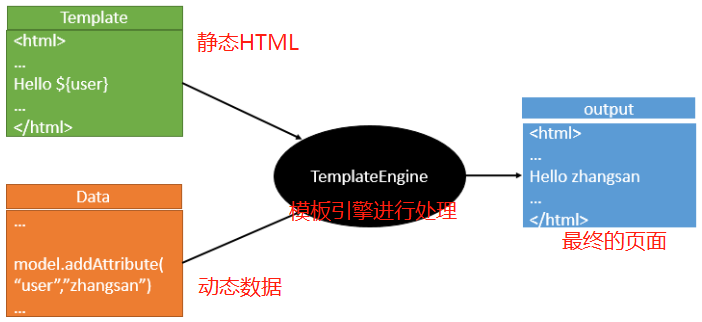
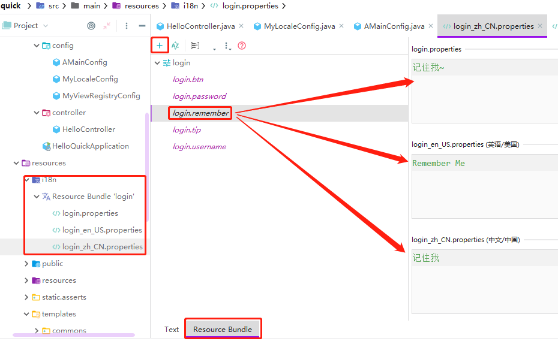

# Web开发

[ Developing Web Applications官方文档](https://docs.spring.io/spring-boot/docs/2.3.1.RELEASE/reference/html/spring-boot-features.html#boot-features-developing-web-applications)

使用SpringBoot:

**1）创建SpringBoot应用，选中我们需要的模块；**

**2）SpringBoot已经默认将这些场景配置好了，只需要在配置文件中指定少量配置就可以运行起来**

**3）自己编写业务代码；**

## 1. SpringMVC自动配置

### 1. Spring MVC auto-configuration

Spring Boot 自动配置好了SpringMVC，以下是SpringBoot对SpringMVC的默认配置:**==（WebMvcAutoConfiguration）==**

1. Inclusion of `ContentNegotiatingViewResolver` and `BeanNameViewResolver` beans.
   - 自动配置了ViewResolver（视图解析器：根据方法的返回值得到视图对象（View），视图对象决定如何渲染（转发？重定向？））
   - ContentNegotiatingViewResolver：组合所有的视图解析器的；
   - ==如何定制：我们可以自己给容器中添加一个视图解析器；自动的将其组合进来；==

2. Support for serving static resources, including support for WebJars (see below).静态资源文件夹路径,webjars
   - Static `index.html` support. 静态首页访问
   - Custom `Favicon` support (see below).  favicon.ico


3. 自动注册了 of `Converter`, `GenericConverter`, `Formatter` beans.
   - Converter：转换器；  public String hello(User user)：类型转换使用Converter
   - `Formatter`  格式化器；  2017.12.17===Date；
   - ==自己添加的格式化器转换器，我们只需要放在容器中即可==

```java
		@Bean
		@ConditionalOnProperty(prefix = "spring.mvc", name = "date-format")//在文件中配置日期格式化的规则
		public Formatter<Date> dateFormatter() {
			return new DateFormatter(this.mvcProperties.getDateFormat());//日期格式化组件
		}
```

4. Support for `HttpMessageConverters` (see below).
	- `HttpMessageConverter`：SpringMVC用来转换Http请求和响应的；User---Json；
	- `HttpMessageConverters` 是从容器中确定；获取所有的HttpMessageConverter；
-  ==自己给容器中添加HttpMessageConverter，只需要将自己的组件注册容器中（@Bean/@Component）==
   


5. Automatic registration of `MessageCodesResolver` (see below).定义错误代码生成规则

6. Automatic use of a `ConfigurableWebBindingInitializer` bean (see below).
   - ==我们可以配置一个ConfigurableWebBindingInitializer来替换默认的；（添加到容器）==

```
初始化WebDataBinder；
请求数据=====JavaBean；
```

-----

**org.springframework.boot.autoconfigure.web：web的所有自动场景；**

If you want to keep those Spring Boot MVC customizations and make more [MVC customizations](https://docs.spring.io/spring/docs/5.2.7.RELEASE/spring-framework-reference/web.html#mvc) (interceptors, formatters, view controllers, and other features), you can add your own `@Configuration` class of type `WebMvcConfigurer` but **without** `@EnableWebMvc`.

If you want to provide custom instances of `RequestMappingHandlerMapping`, `RequestMappingHandlerAdapter`, or `ExceptionHandlerExceptionResolver`, and still keep the Spring Boot MVC customizations, you can declare a bean of type `WebMvcRegistrations` and use it to provide custom instances of those components.

If you want to take complete control of Spring MVC, you can add your own `@Configuration` annotated with `@EnableWebMvc`, or alternatively add your own `@Configuration`-annotated `DelegatingWebMvcConfiguration` as described in the Javadoc of `@EnableWebMvc`.

### 2. 扩展SpringMVC示例

- 之前Spring中使用xml配置：

```xml
    <mvc:view-controller path="/hello" view-name="success"/>
    <mvc:interceptors>
        <mvc:interceptor>
            <mvc:mapping path="/hello"/>
            <bean></bean>
        </mvc:interceptor>
    </mvc:interceptors>
```

- SpringBoot中配置一个

**==编写一个配置类（@Configuration），是`WebMvcConfigurer `类型；不能标注@EnableWebMvc==**;既保留了所有的自动配置，也能用我们扩展的配置；

```java
//使用WebMvcConfigurerAdapter可以来扩展SpringMVC的功能
@Configuration
public class HelloMVCConfig  implements WebMvcConfigurer {
    public void addViewControllers(ViewControllerRegistry registry) {
      //浏览器发送 /guigu 请求来到 success
        registry.addViewController("/guigu").setViewName("sucess");
    }
}
```

原理：(代码过时)

​	1）`WebMvcConfigurer`接口 是SpringMVC的自动配置类

​	2）在做其他自动配置时会导入`@Import(**EnableWebMvcConfiguration**.class)`

```java
    @Configuration
	public static class EnableWebMvcConfiguration extends DelegatingWebMvcConfiguration {
      private final WebMvcConfigurerComposite configurers = new WebMvcConfigurerComposite();

	 //从容器中获取所有的WebMvcConfigurer
      @Autowired(required = false)
      public void setConfigurers(List<WebMvcConfigurer> configurers) {
          if (!CollectionUtils.isEmpty(configurers)) {
              this.configurers.addWebMvcConfigurers(configurers);
            	//一个参考实现；将所有的WebMvcConfigurer相关配置都来一起调用；  
            	@Override
             // public void addViewControllers(ViewControllerRegistry registry) {
              //    for (WebMvcConfigurer delegate : this.delegates) {
               //       delegate.addViewControllers(registry);
               //   }
              }
          }
	}
```

​	3）容器中所有的WebMvcConfigurer都会一起起作用；

​	4）我们的配置类也会被调用；

​	效果：SpringMVC的自动配置和我们的扩展配置都会起作用；

### 3. 全面接管SpringMVC；

SpringBoot对SpringMVC的自动配置不需要了，所有都是我们自己配置；所有的SpringMVC的自动配置都失效了

**我们需要在配置类中添加@EnableWebMvc即可；**

```java
@EnableWebMvc
@Configuration
public class MyMvcConfig extends WebMvcConfigurerAdapter {
    @Override
    public void addViewControllers(ViewControllerRegistry registry) {
        registry.addViewController("/atguigu").setViewName("success");
    }
}
```

原理：

为什么@EnableWebMvc自动配置就失效了；

1）@EnableWebMvc的核心

```java
@Import(DelegatingWebMvcConfiguration.class)//这里导入了WebMvcConfigurationSupport.class实现类
public @interface EnableWebMvc {}
```

2）

```java
@Configuration
public class DelegatingWebMvcConfiguration extends WebMvcConfigurationSupport {
```

3）

```java
@Configuration
@ConditionalOnWebApplication
@ConditionalOnClass({ Servlet.class, DispatcherServlet.class,
		WebMvcConfigurerAdapter.class })
//容器中没有这个组件的时候，这个自动配置类才生效
@ConditionalOnMissingBean(WebMvcConfigurationSupport.class)
@AutoConfigureOrder(Ordered.HIGHEST_PRECEDENCE + 10)
@AutoConfigureAfter({ DispatcherServletAutoConfiguration.class,
		ValidationAutoConfiguration.class })
public class WebMvcAutoConfiguration {
```

4）@EnableWebMvc将`WebMvcConfigurationSupport`组件导入进来；

5）导入的`WebMvcConfigurationSupport`只是SpringMVC最基本的功能；

### 4. 如何修改SpringBoot的默认配置

模式：

​	1）SpringBoot在自动配置很多组件的时候，先看容器中有没有用户自己配置的（@Bean、@Component）如果有就用用户配置的，如果没有，才自动配置；如果有些组件可以有多个（ViewResolver）将用户配置的和自己默认的组合起来；

​	2）在SpringBoot中会有非常多的`xxxConfigurer`帮助我们进行扩展配置

​	3）在SpringBoot中会有很多的`xxxCustomizer`帮助我们进行定制配置

## 2. 静态资源的映射规则

==:cry:代码过时==

```java
@ConfigurationProperties(prefix = "spring.resources", ignoreUnknownFields = false)
public class ResourceProperties implements ResourceLoaderAware {
  //可以设置和静态资源有关的参数，缓存时间等
```

```java
WebMvcAuotConfiguration：
		@Override
		public void addResourceHandlers(ResourceHandlerRegistry registry) {
			if (!this.resourceProperties.isAddMappings()) {
				logger.debug("Default resource handling disabled");
				return;
			}
			Integer cachePeriod = this.resourceProperties.getCachePeriod();
			if (!registry.hasMappingForPattern("/webjars/**")) {
				customizeResourceHandlerRegistration(
						registry.addResourceHandler("/webjars/**")
								.addResourceLocations(
										"classpath:/META-INF/resources/webjars/")
						.setCachePeriod(cachePeriod));
			}
			String staticPathPattern = this.mvcProperties.getStaticPathPattern();
          	//静态资源文件夹映射
			if (!registry.hasMappingForPattern(staticPathPattern)) {
				customizeResourceHandlerRegistration(
						registry.addResourceHandler(staticPathPattern)
								.addResourceLocations(
										this.resourceProperties.getStaticLocations())
						.setCachePeriod(cachePeriod));
			}
		}

        //配置欢迎页映射
		@Bean
		public WelcomePageHandlerMapping welcomePageHandlerMapping(
				ResourceProperties resourceProperties) {
			return new WelcomePageHandlerMapping(resourceProperties.getWelcomePage(),
					this.mvcProperties.getStaticPathPattern());
		}

       //配置喜欢的图标
		@Configuration
		@ConditionalOnProperty(value = "spring.mvc.favicon.enabled", matchIfMissing = true)
		public static class FaviconConfiguration {

			private final ResourceProperties resourceProperties;

			public FaviconConfiguration(ResourceProperties resourceProperties) {
				this.resourceProperties = resourceProperties;
			}

			@Bean
			public SimpleUrlHandlerMapping faviconHandlerMapping() {
				SimpleUrlHandlerMapping mapping = new SimpleUrlHandlerMapping();
				mapping.setOrder(Ordered.HIGHEST_PRECEDENCE + 1);
              	//所有  **/favicon.ico 
				mapping.setUrlMap(Collections.singletonMap("**/favicon.ico",
						faviconRequestHandler()));
				return mapping;
			}

			@Bean
			public ResourceHttpRequestHandler faviconRequestHandler() {
				ResourceHttpRequestHandler requestHandler = new ResourceHttpRequestHandler();
				requestHandler
						.setLocations(this.resourceProperties.getFaviconLocations());
				return requestHandler;
			}

		}

```

==1）所有 /webjars/** ，都去 classpath:/META-INF/resources/webjars/ 找资源；==

​	webjars：以jar包的方式引入静态资源；`localhost:8080/webjars/jquery/3.3.1/jquery.js`

http://www.webjars.org/

==2）"/**" 访问当前项目的任何资源，都去（静态资源的文件夹）找映射==

- `"classpath:/META-INF/resources/"`, 
- `"classpath:/resources/"`,
- `"classpath:/static/"`, 
- `"classpath:/public/"` 
- `"/"`：当前项目的根路径

> localhost:8080/abc ===  去静态资源文件夹里面找abc

==3）欢迎页； 静态资源文件夹下的所有index.html页面；被"/**"映射；==

> ​	localhost:8080/   找index页面

==4）所有的 **/favicon.ico  都是在静态资源文件下找；==


## 3. 模板引擎

包括JSP、Velocity、Freemarker、Thymeleaf



### 1. 引入Thymeleaf

https://www.thymeleaf.org/documentation.html

```xml
<dependency>
  <groupId>org.springframework.boot</groupId>
  <artifactId>spring-boot-starter-thymeleaf</artifactId>
</dependency>
切换thymeleaf版本
<properties>
		<thymeleaf.version>3.0.9.RELEASE</thymeleaf.version>
		<!-- 布局功能的支持程序  thymeleaf3主程序  layout2以上版本 -->
		<!-- thymeleaf2   layout1-->
		<thymeleaf-layout-dialect.version>2.2.2</thymeleaf-layout-dialect.version>
  </properties>
```


### 2. Thymeleaf使用

- 查看自动配置中的`ThymeleafProperties`，可以看到默认的配置属性

```java
@ConfigurationProperties( prefix = "spring.thymeleaf")
public class ThymeleafProperties {
    private static final Charset DEFAULT_ENCODING;
    public static final String DEFAULT_PREFIX = "classpath:/templates/";
    public static final String DEFAULT_SUFFIX = ".html";
    private boolean checkTemplate = true;
    private boolean checkTemplateLocation = true;
    private String prefix = "classpath:/templates/";
    private String suffix = ".html";
  //............}
```

因此只要我们把HTML页面放在`classpath:/templates/`，thymeleaf就能自动渲染

1. :beer:HTML中导入thymeleaf的名称空间（语法提示）

```html
<html lang="en" xmlns:th="http://www.thymeleaf.org">
```

2. :beer:使用thymeleaf语法

```html
<!DOCTYPE html>
<html lang="en" xmlns:th="http://www.thymeleaf.org">
<head>
    <meta charset="UTF-8">
    <title>Title</title>
</head>
<body>
    <h1>成功！</h1>
    <!--th:text 将div里面的文本内容设置为 -->
    <div th:text="${hello}">这是显示欢迎信息</div>
</body>
</html>
```

### 3. thymeleaf语法

 [Thymeleaf语法知识](../../前端技术/Thymeleaf.md) 


:cat:1）`th:text`：改变当前元素里面的文本内容；

​	`th`：用在任意html属性中来替换原生属性的值


:cat:2）表达式

:o: `${...}`：获取变量值

1. 获取对象的属性、调用方法
2. 使用内置的基本对象：
   - #ctx : the context object.
   - #vars: the context variables.
   - #locale : the context locale.
   - #request : (only in Web Contexts) the HttpServletRequest object.
   - #response : (only in Web Contexts) the HttpServletResponse object.
   - #session : (only in Web Contexts) the HttpSession object.
   - #servletContext : (only in Web Contexts) the ServletContext obj
   - eg:` ${session.foo}`
3. 内置的一些工具对象：
   - #execInfo : information about the template being processed.
   - #messages : methods for obtaining externalized messages inside variables expressions, in the same way as they would be obtained using #{…} syntax.
   - #uris : methods for escaping parts of URLs/URIs
   - #conversions : methods for executing the configured conversion service (if any).
   - #dates : methods for java.util.Date objects: formatting, component extraction, etc.
   - #calendars : analogous to #dates , but for java.util.Calendar objects.
   - #numbers : methods for formatting numeric objects.
   - #strings : methods for String objects: contains, startsWith, prepending/appending, etc.
   - #objects : methods for objects in general.
   - #bools : methods for boolean evaluation.
   - #arrays : methods for arrays.
   - #lists : methods for lists.
   - #sets : methods for sets.
   - #maps : methods for maps.
   - #aggregates : methods for creating aggregates on arrays or collections.
   - #ids : methods for dealing with id attributes that might be repeated (for example, as a result of an iteration).

:o:` *{...}`：选择表达式，和`${}`在功能上是一样
	补充：配合 `th:object="${session.user}`：

```html
<div th:object="${session.user}">
    <p>Name: <span th:text="*{firstName}">Sebastian</span>.</p>
    <p>Surname: <span th:text="*{lastName}">Pepper</span>.</p>
    <p>Nationality: <span th:text="*{nationality}">Saturn</span>.</p>
</div>
```

:o:`#{...}`：获取国际化内容

:o: `@{...}`：定义URL；`@{/order/process(execId=${execId},execType='FAST')}`

:o:` ~{...}`：片段引用表达式


    <div th:insert="~{commons :: main}">...</div>
Literals（字面量）
      Text literals: 'one text' , 'Another one!' ,…
      Number literals: 0 , 34 , 3.0 , 12.3 ,…
      Boolean literals: true , false
      Null literal: null
      Literal tokens: one , sometext , main ,…
Text operations:（文本操作）
    String concatenation: +
    Literal substitutions: |The name is ${name}|
Arithmetic operations:（数学运算）
    Binary operators: + , - , * , / , %
    Minus sign (unary operator): -
Boolean operations:（布尔运算）
    Binary operators: and , or
    Boolean negation (unary operator): ! , not
Comparisons and equality:（比较运算）
    Comparators: > , < , >= , <= ( gt , lt , ge , le )
    Equality operators: == , != ( eq , ne )
Conditional operators:条件运算（三元运算符）
    If-then: (if) ? (then)
    If-then-else: (if) ? (then) : (else)
    Default: (value) ?: (defaultvalue)
Special tokens:
    No-Operation: _

:o:`[[#{login.remember}]]`：直接写入表达式，替代标记属性

```html
<p>Hello, [[${session.user.name}]]!</p>
```

# Web开发实例

## 1. 默认访问首页

添加一个配置类，专门进行视图解析，注意不需要`@Configuration`注解

视图默认去`/templates/`下寻找页面

```java
public class MyViewRegistryConfig implements WebMvcConfigurer {
    Logger logger = LoggerFactory.getLogger(MyLocaleConfig.class);
    @Override
    public void addViewControllers(ViewControllerRegistry registry) {
        logger.info("视图解析========");
        registry.addViewController("/").setViewName("login");
        registry.addViewController("/index.html").setViewName("login");
    }
}
```

主配置类中添加

```java
@Configuration//多个配置类同时起作用
@Import(value = {MyViewRegistryConfig.class})
public class AMainConfig implements WebMvcConfigurer {
}
```

> 访问`http://localhost:8080`,`http://localhost:8080/index.html`会跳转到login.html

## 2. 国际化信息

> #### SpringMVC 的编码过程：
>
> 1. 编写国际化配置文件；
>
> 2. 使用ResourceBundleMessageSource管理国际化资源文件
>
> 3. 在页面使用fmt:message取出国际化内容

### SpringBoot编码过程：

:one:编写国际化配置文件，抽取页面需要显示的国际化消息



> SpringBoot自动配置好了管理国际化资源文件的组件`ResourceBundleMessageSource`
>
> ```java
> @ConfigurationProperties(prefix = "spring.messages")
> public class MessageSourceAutoConfiguration {
> 	private String basename = "messages";  
>     //我们的配置文件可以直接放在类路径下叫messages.properties；
>     
>     @Bean
> 	public MessageSource messageSource() {
> 		ResourceBundleMessageSource messageSource = new ResourceBundleMessageSource();
> 		if (StringUtils.hasText(this.basename)) {
>             //设置国际化资源文件的基础名（去掉语言国家代码的）
> 			messageSource.setBasenames(StringUtils.commaDelimitedListToStringArray(
> 					StringUtils.trimAllWhitespace(this.basename)));
> 		}
> 		if (this.encoding != null) {
> 			messageSource.setDefaultEncoding(this.encoding.name());
> 		}
> 		messageSource.setFallbackToSystemLocale(this.fallbackToSystemLocale);
> 		messageSource.setCacheSeconds(this.cacheSeconds);
> 		messageSource.setAlwaysUseMessageFormat(this.alwaysUseMessageFormat);
> 		return messageSource;
> 	}
> ```

:two:前端页面获取国际化的值

```html
<!DOCTYPE html>
<html lang="en"  xmlns:th="http://www.thymeleaf.org">
	<head>
		<meta http-equiv="Content-Type" content="text/html; charset=UTF-8">
		<meta name="viewport" content="width=device-width, initial-scale=1, shrink-to-fit=no">
		<meta name="description" content="">
		<meta name="author" content="">
		<title>Signin Template for Bootstrap</title>
		<!-- Bootstrap core CSS  POM文件中需要导入bootstrap-->
		<link href="asserts/css/bootstrap.min.css" th:href="@{/webjars/bootstrap/4.0.0/css/bootstrap.css}" rel="stylesheet">
		<!-- Custom styles for this template -->
		<link href="asserts/css/signin.css" th:href="@{/asserts/css/signin.css}" rel="stylesheet">
	</head>

	<body class="text-center">
		<form class="form-signin" action="dashboard.html">
			
			<h1 class="h3 mb-3 font-weight-normal" th:text="#{login.tip}">Please sign in</h1>
			<label class="sr-only" th:text="#{login.username}">Username</label>
			<input type="text" class="form-control" placeholder="Username" th:placeholder="#{login.username}" required="" autofocus="">
			<label class="sr-only" th:text="#{login.password}">Password</label>
			<input type="password" class="form-control" placeholder="Password" th:placeholder="#{login.password}" required="">
			<div class="checkbox mb-3">
				<label>
          		<input type="checkbox" value="remember-me"/> [[#{login.remember}]]
        </label>
			</div>
			<button class="btn btn-lg btn-primary btn-block" type="submit" th:text="#{login.btn}">Sign in</button>
			<p class="mt-5 mb-3 text-muted">© 2017-2018</p>
			<a class="btn btn-sm">中文</a>
			<a class="btn btn-sm">English</a>
		</form>
	</body>
</html>
```

> 以上设置只是更改浏览器语言设置才会显示国际化信息
>
> 原理：国际化Locale（区域信息对象）；LocaleResolver（获取区域信息对象）；
>
> ```java
> 		@Bean
> 		@ConditionalOnMissingBean
> 		@ConditionalOnProperty(prefix = "spring.mvc", name = "locale")
> 		public LocaleResolver localeResolver() {
> 			if (this.mvcProperties
> 					.getLocaleResolver() == WebMvcProperties.LocaleResolver.FIXED) {
> 				return new FixedLocaleResolver(this.mvcProperties.getLocale());
> 			}
> 			AcceptHeaderLocaleResolver localeResolver = new AcceptHeaderLocaleResolver();
> 			localeResolver.setDefaultLocale(this.mvcProperties.getLocale());
> 			return localeResolver;
> 		}
> 默认的就是根据请求头带来的区域信息获取Locale进行国际化
> ```
>

:three:根据​自定义连接更改信息

```html
<!==前端页面中增加两个标签==>
<a class="btn btn-sm" th:href="@{/index.html(l='zh_CN')}">中文</a>
<a class="btn btn-sm" th:href="@{/index.html(l='en_US')}">English</a>
```

```java
//增加LocaleResolver组件，对请求连接进行解析
public class MyLocaleResolver implements LocaleResolver {
    private Logger logger = LoggerFactory.getLogger(MyLocaleResolver.class);
    @Override
    public Locale resolveLocale(HttpServletRequest httpServletRequest) {
        String l = httpServletRequest.getParameter("l");
        Locale locale = Locale.getDefault();
        logger.info("LocaleResolver解析成功");
        logger.info("locale_default:"+ locale);
        if(!StringUtils.isEmpty(l)){
            String[] ls = l.split("_");
            locale = new Locale(ls[0],ls[1]);
        }
        logger.info("locale Country:"+locale.getCountry());
        logger.info("locale Language:"+locale.getLanguage());
        return locale;
    }
    @Override
    public void setLocale(HttpServletRequest httpServletRequest, HttpServletResponse httpServletResponse, Locale locale) {
    }
}
```

```java
//增加配置类，添加到注配置类中；也可以直接在主配置类中添加方法
public class MyLocaleConfig implements WebMvcConfigurer {
    Logger logger = LoggerFactory.getLogger(MyLocaleConfig.class);
    @Bean("localeResolver")//自定义国际化位置获取{要保证容器中的名字必须是"localeResolver"}
    public LocaleResolver myLocaleResolver(){
        logger.info("国际化配置");
        return new MyLocaleResolver();
    }
}
```

## 3. 拦截器登录检查

:cat:登录控制层

```java
@Controller
public class LoginController {
    @PostMapping("/user/login")
    public String login(@RequestParam(name = "username") String username,
                        @RequestParam(name = "password") String password,
                        HttpSession session, Map<String,Object> map){
        if(!StringUtils.isEmpty(username) && "123456".equals(password)){
            session.setAttribute("loginUser",username);//成功需要session中添加用户
            return "redirect:/dashboard";//重定向防止重复提交，需要添加视图解析
        }else{
            map.put("msg","用户名或密码不正确");//添加错误提示信息
            return "login";//不正确回到登录页面
        }
    }
}
```

> #### 开发技巧
>
> 1. 禁用模板引擎的缓存
>
> ```
> spring.thymeleaf.cache=false 
> ```
>
> 2. 页面修改完成以后ctrl+f9：重新编译；
>
> 3. 登陆错误消息的显示
>
> ```html
> <p style="color: red" th:text="${msg}" th:if="${not #strings.isEmpty(msg)}"></p>
> ```
>

:dog:编写拦截器

```java
public class LoginHandlerInterceptor implements HandlerInterceptor {
    @Override
    public boolean preHandle(HttpServletRequest request, HttpServletResponse response, Object handler) throws Exception {
        Object loginUser = request.getSession().getAttribute("loginUser");
        if(loginUser == null){//session中没有用户，登录失败转发到登录页面
            request.setAttribute("msg","用户没有登录");
            request.getRequestDispatcher("/index.html").forward(request,response);
            return false;
        }else{
            return true;//登录成功放行
        }
    }
  .......}
```

:bird:配置类中添加拦截器组件

```java
@Configuration//多个配置类同时起作用
@Import(value = {MyLocaleConfig.class,MyViewRegistryConfig.class})
public class AMainConfig implements WebMvcConfigurer {
    @Override//添加拦截器组件
    public void addInterceptors(InterceptorRegistry registry) {
        registry.addInterceptor(new LoginHandlerInterceptor()).addPathPatterns("/**")
                .excludePathPatterns("/","/index.html","/user/login");//排除掉不需要拦截的登录路径
    }
}
```

## 4. CRUD

