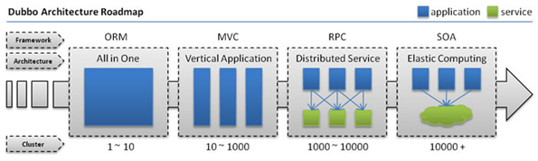
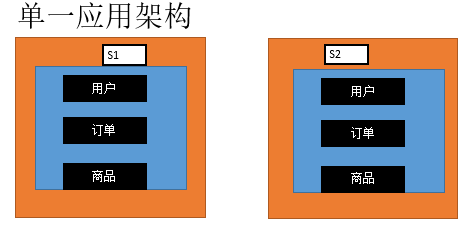
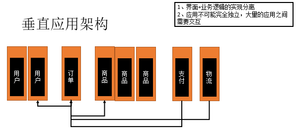
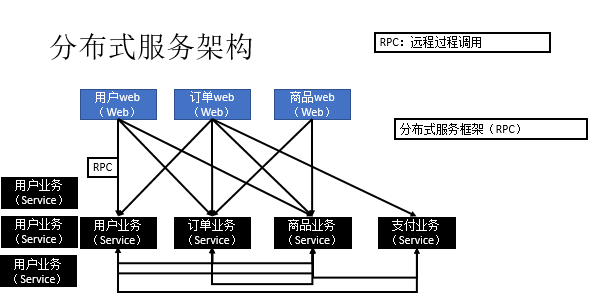
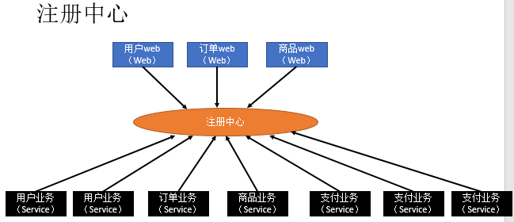
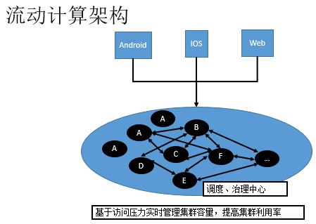

## 分布式基础

什么是分布式系统？

分布式系统是若干独立计算机的集合，这些计算机对于用户来说就像单个相关系统

### 发展演变

#### 单一应用架构

当网站流量很小时，只需一个应用，将所有功能都部署在一起，以减少部署节点和成本。此时，用于简化增删改查工作量的数据访问框架(ORM)是关键

#### 垂直应用架构

通过切分业务来实现各个模块独立部署，降低了维护和部署的难度，团队各司其职更易管理，性能扩展也更方便，更有针对性。

缺点： 公用模块无法重复利用，开发性的浪费

#### 分布式服务架构
当垂直应用越来越多，应用之间交互不可避免，将核心业务抽取出来，作为独立的服务，逐渐形成稳定的服务中心，使前端应用能更快速的响应多变的市场需求。此时，用于**提高业务复用及整合的分布式服务框架(RPC)**是关键

#### 流动计算架构
当服务越来越多，容量的评估，小服务资源的浪费等问题逐渐显现，此时需增加一个调度中心基于访问压力实时管理集群容量，提高集群利用率。此时，用于**提高机器利用率的资源调度和治理中心(SOA)[ Service Oriented Architecture]**是关键。

### RPC

RPC【Remote Procedure Call】是指远程过程调用，是一种进程间通信方式，他是一种技术的思想，而不是规范。它允许程序调用另一个地址空间（通常是共享网络的另一台机器上）的过程或函数，而不用程序员显式编码这个远程调用的细节。即程序员无论是调用本地的还是远程的函数，本质上编写的调用代码基本相同。

#### RPC基本原理

>RPC两个核心模块：通讯，序列化。