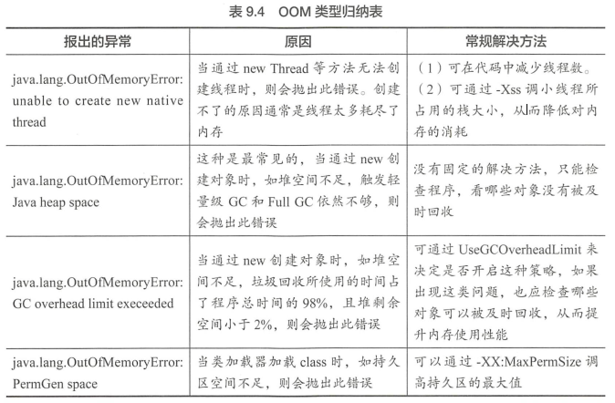
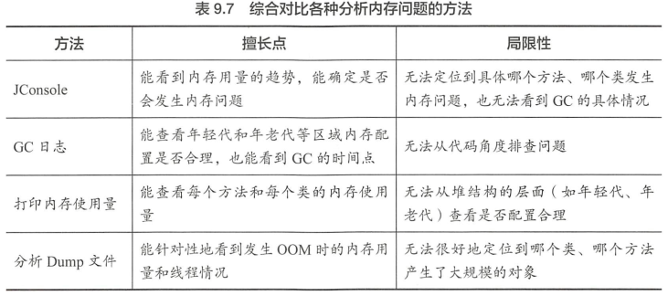

# 1.垃圾收集器与内存分配策略
[https://blog.csdn.net/ityouknow/article/details/78037470](https://blog.csdn.net/ityouknow/article/details/78037470)
## 1.1对象存活判断
**引用计数法：** 对象中添加一个计数器，有一个地方引用它的时候就+1；无法解决循环引用
**可达性分析法：** 通过一系列“GC Roots”的对象作为起点开始向下搜索
    *   虚拟机栈中引用的对象
    *   本地方法栈中Native方法引用的对象
    *   方法区中类静态属性引用的对象
    *   方法区中常量引用的对象

**对象死亡：** 至少要经历两次标记过程：如果对象在进行可达性分析后发现没有与GCRoots相连接的引用链，那它将会被第一次标记并且进行一次筛选，筛选的条件是此对象是否有必要执行finalize方法。当对象没有覆盖finalize()方法，或者finalize方法已经被虚拟机调用过，虚拟机将这两种情况都视为“没有必要执行”。如果这个对象被判定为有必要执行finalize方法，那么这个对象将会放置在一个叫做F-Queue的队列之中，并在稍后由一个由虚拟机自动建立的、低优先级的Finalizer线程去执行它。

**finalize方法:** 是对象逃脱死亡命运的最后一次机会，稍后GC将对F-Queue中的对象进行第二次小规模的标记，如果对象要在finalize中成功拯救自己——只要重新与引用链上的任何一个对象建立关联即可;finalize()方法只会调用一次。

### 四种引用
1.  **强引用：** 强引用就是指在程序代码之中普遍存在的，类似“Object.obj=new Object()”这类的引用，只要强引用还存在，垃圾收集器永远不会回收掉被引用的对象
2.  **软引用：** 是用来描述一些还有用但并非必需的对象。对于软引用关联着的对象，在系统将要发生内在溢出异常之前，将会把这些象回收范围之中进行第一次回收。在JDK1.2之后，提供了SoftReference 类来实现软引用。
3.  **弱引用：** 也是用来描述非必需对象的，被弱引用关联的对象只能生存到下一次垃圾收集发生之前。当垃圾收集器工作时，无论当前内存是否足够，都会回收掉只被弱引用关联的对象。在JK1.2之后，提供了WeakReferernee类来实现弱引用。
4.  **虚引用：** 也称为幽灵引用或者幻影引用，它是最弱的一种引用关系。一个对象是否有虚引用的存在，完全不会对其生存时间构成影响，也无法通过虚引用来取得一个对象实例。为一个对象设置虚引用关联的唯一目的就是能在这个对象被收集器回收收到个系统通知。在JDK1.2之后，提供了PhantomReference类来实现虚引用。

## 1.2垃圾回收
**方法区回收：** 永久代的垃圾收集主要回收两部分内容=**废弃常量**和**无用的类**。回收废弃常量与回收Java堆中的对象非常类似。

**判定一个类是否是“无用的类”：**  
    - 该类所有的**实例**都已经被回收，也就是Java堆中不存在该类的任何实例。
    - 加载该类的**ClassLoader**已经被回收。
    - 该类对应的**java.lang.Class对象**没在在任何地方被引用，无法在任何地方通过反射访问该类的方法。

### 垃圾收集算法：
- **标记-清除：**“标记”和“清除”两个阶段：首先标记出所有需要回收的对象，在标记完成后统一回收所有被标记的对象。（效率低、产生空间碎片）
- **复制算法**：内存按容量划分为小相等的两块，每次使用其中的一块。当这一块的内存用完了，就将还存活着的对象复制到另外一上面，然后再把已使用过的内存空间一次清理掉。（缩小了可使用的内存；优化 Eden：fromSurvivor：toSurvivor=8：1：1）
- **标记-整理：** 标记过程仍然与“标记-清除”算法一样，但后续步骤不是直接对可回收对象进行清理，而是让所有存活的对象都向一端移动，然后直接清理掉端边界以外的内存；
- **分代收集**：新生代---复制算法；老年代---标记整理算法。把Java堆分为新生代和老年代，这样就可以根据各个年代的特点采用最适当的收集算法。在新生代中，每次垃圾收集时都发现有大批对象死去，只有少量存活，那就选用复制算法，只需要付出少量存活对象的复制成本就可以完成收集。而老年代中因为对象存活率高、没有额外空间对它进行分配担保，就必须使用“标记-清理”或“标记-整理”算法来进行回收。

## 1.3垃圾收集器
> 如果说收集算法是内存回收的方法论，垃圾收集器就是内存回收的具体实现


**serial收集器：单线程、stop the world  
Serial Old收集器：Serial的老年代版本**
- 串行收集器是最古老，最稳定以及效率高的收集器，可能会产生较长的停顿，只使用一个线程去回收。新生代、老年代使用串行回收；新生代复制算法、老年代标记-压缩；垃圾收集的过程中会Stop The World（服务暂停）
- 参数控制：`-XX:+UseSerialGC` 串行收集器


**ParNew收集器：serial收集器的多线程版本**
- ParNew收集器其实就是Serial收集器的多线程版本。新生代并行，老年代串行；新生代复制算法、老年代标记-压缩
- 参数控制：`-XX:+UseParNewGC` ParNew收集器；`-XX:ParallelGCThreads` 限制线程数量


**Parallel Scavenge：复制算法、吞吐量**
- Parallel Scavenge收集器类似ParNew收集器，Parallel收集器更关注系统的吞吐量。可以通过参数来打开自适应调节策略，虚拟机会根据当前系统的运行情况收集性能监控信息，动态调整这些参数以提供最合适的停顿时间或最大的吞吐量；也可以通过参数控制GC的时间不大于多少毫秒或者比例；新生代复制算法、老年代标记-压缩
- 参数控制：-XX:+UseParallelGC 使用Parallel收集器+ 老年代串行

**Parallel Old收集器： Parallel Scavenge的老年代版本**
- 使用多线程和“标记－整理”算法。
- 控制最大垃圾收集停顿时间的-XX:MaxGCPauseMillis 参数；直接设置吞吐量大小的-XX：GCTimeRatio参数。


**CMS收集器（Concurrent Mark Sweep)：**  
获取最短回收停顿时间、标记清除算法；优点：并发收集、低停顿；缺点：产生空间碎片、无法处理浮动垃圾、对CPU资源敏感
- 初始标记（eMS initial mark）：暂停所有的其他线程，标记一下GC.Roots能直接关联到的对象，速度很快（STW）
- 并发标记（CMS concurrent mark）：同时开启GC和用户线程，用一个闭包结构去记录可达对象。但在这个阶段结束，这个闭包结构并不能保证包含当前所有的可达对象。因为用户线程可能会不断的更新引用域，所以GC线程无法保证可达性分析的实时性。所以这个算法里会跟踪记录这些发生引用更新的地方。
- 重新标记（CMS remark）：修正并发标记期间因用户程序继续运作而导致标记产生变动的那一部分对象的标记记录（STW），这个阶段的停顿时间一般会比初始标记阶段的时间稍长，远远比并发标记阶段时间短
- 并发清除（CMS concurrent sweep)：开启用户线程，同时GC线程开始对为标记的区域做清扫。
- 参数控制：
    -XX:+UseConcMarkSweepGC 使用CMS收集器  
    -XX:+ UseCMSCompactAtFullCollection Full GC后，进行一次碎片整理；整理过程是独占的，会引起停顿时间变长  
    -XX:+CMSFullGCsBeforeCompaction 设置进行几次Full GC后，进行一次碎片整理  
    -XX:ParallelCMSThreads 设定CMS的线程数量（一般情况约等于可用CPU数量）


**G1收集器：**  
面向服务端应用、并行与并发、分代收集、标记整理算法、低停顿  
1. 空间整合，G1收集器采用标记整理算法，不会产生内存空间碎片。分配大对象时不会因为无法找到连续空间而提前触发下一次GC。  
2. 可预测停顿，这是G1的另一大优势，降低停顿时间是G1和CMS的共同关注点，但G1除了追求低停顿外，还能建立可预测的停顿时间模型，能让使用者明确指定在一个长度为N毫秒的时间片段内，消耗在垃圾收集上的时间不得超过N毫秒，这几乎已经是实时Java（RTSJ）的垃圾收集器的特征了。

- **G1收集器在后台维护了一个****优先列表****，每次根据允许的收集时间，优先选择回收价值最大的Region(这也就是它的名字Garbage-First的由来)**。这种使用Region划分内存空间以及有优先级的区域回收方式，保证了GF收集器在有限时间内可以尽可能高的收集效率（把内存化整为零）。

> 使用G1收集器时，Java堆的内存布局就与其他收集器有很大差别，它将整个Java堆划分为多个大小相等的独立区域（Region)，虽然还保留有新生代和老年代的概念，但新生代和老年代不再是物理隔离的了，它们都是一部分Region（不需要连续）的集合。
> 
> G1跟踪各个Region里面的垃圾堆积的价值大小（回收所获得的空间大小以及回收所需时间的经验值），在后台维护一个优先列表，每次根据允许的收集时间，优先回收价值最大的Region（这也就是Garbage-First名称的来由）。
- 初始标记（Initial Marking)这个阶段是停顿的(Stop the World Event)，并且会触发一次普通Mintor GC。对应GC log:GC pause (young) (inital-mark)
- 并发标记（Concurrent Marking)：在整个堆中进行并发标记(和应用程序并发执行)，此过程可能被young GC中断。在并发标记阶段，若发现区域对象中的所有对象都是垃圾，那个这个区域会被立即回收。同时，并发标记过程中，会计算每个区域的对象活性(区域中存活对象的比例)。
- 最终标记（Final Marking)：再标记，会有短暂停顿(STW)。再标记阶段是用来收集 并发标记阶段 产生新的垃圾(并发阶段和应用程序一同运行)；G1中采用了比CMS更快的初始快照算法:snapshot-at-the-beginning (SATB)。
- 筛选回收（Live Data Counting and Evacuation)：多线程清除失活对象，会有STW。G1将回收区域的存活对象拷贝到新区域，清除Remember Sets，并发清空回收区域并把它返回到空闲区域链表中。


## 1.4内存分配

1.  **对象分配：**
    1.  对象优先在Eden上分配；空间不足Minor GC，将Eden和fromSurvivor中存活的移动到toSurvivor
    2.  大对象直接进入老年代，目的是避免在Eden区和两个Survivor区之间发生大量的内存拷贝（新生代采用复制算法收集内存）
    3.  长期存活对象进入老年代，虚拟机为每个对象定义了一个年龄计数器，如果对象经过了1次Minor GC那么对象会进入Survivor区，之后每经过一次Minor GC那么对象的年龄加1，知道达到阀值对象进入老年区。
    4. 老年代满了后进行FullGC，对年轻代、年老代和持久代进行全面回收
    5.  动态判断对象的年龄。如果Survivor区中相同年龄的所有对象大小的总和大于Survivor空间的一半，年龄大于或等于该年龄的对象可以直接进入老年代。

2.  **空间分配担保：**
    1.  如果允许，那么会继续检查老年最大可用的连续空间是否大于历次晋升到老年代对象的平均大小，如果大于，将尝试着进行三次Minor.GC，尽管这次MinorGC是有风险的：如果小于，或HandlePromotionFailure.设置不允许冒险，那这时也要改为进行次FullGC。
    2.  在发生Minor GC之前，虚拟机会先检查老年代最大可用的连续空间是否大于Survivor区移至老年区的对象的平均大小，如果这个条件成立，那么Minor GC可以确保是安全的。
    3.  如果不成立，则虚拟机会查看HandiePromotionFailure设置值是否允诈担保失败；

3. **触发MinorGC(Young GC)**
虚拟机在进行minorGC之前会判断老年代最大的可用连续空间是否大于新生代的所有对象总空间.
    1.  如果大于的话，直接执行minorGC
    2.  如果小于，判断是否开启HandlerPromotionFailure，没有开启直接FullGC
    3.  如果开启了HanlerPromotionFailure, JVM会判断老年代的最大连续内存空间是否大于历次晋升的大小，如果小于直接执行FullGC
    4.  如果大于的话，执行minorGC


4. **触发FullGC**
    1.  **老年代空间不足**  
    如果创建一个大对象，Eden区域当中放不下这个大对象，会直接保存在老年代当中，如果老年代空间也不足，就会触发Full GC，当执行Full GC后空间仍然不足，则抛出错误（java.lang.OutOfMemoryError: Java heap space）。为了避免这种情况，最好就是不要创建太大的对象。
    2.  **持久代空间不足**  
    如果有持久代空间的话，系统当中需要加载的类，调用的方法很多，同时持久代当中没有足够的空间，就出触发一次Full GC。
    3.  **YGC出现promotion failure**  
    promotion failure发生在Young GC, 如果Survivor区当中存活对象的年龄达到了设定值，会就将Survivor区当中的对象拷贝到老年代，如果老年代的空间不足，就会发生promotion failure， 接下去就会发生Full GC.
    4.  **统计YGC发生时晋升到老年代的平均总大小 大于 老年代的空闲空间**  
    在发生YGC是会判断，是否安全，这里的安全指的是，当前老年代空间可以容纳YGC晋升的对象的平均大小，如果不安全，就不会执行YGC,转而执行Full GC。
    5.  **显示调用System.gc**：调用这个方法后，虚拟机一般并不会直接启动，而是会找个合适的时间点。这与“程序员无法通过代码回收内存” 的i兑辞并不矛盾 。
    6.  通过设置虚拟机参数，定时执行FullGC
    

# [4.虚拟机性能监控与故障处理工具](https://blog.csdn.net/ityouknow/article/details/78209205)
## 4.1常见内存问题
1. **Stop the World**
    - 虚拟机的垃圾回收线程会先根据搜索算法标记那些可以回收的对象，之后不久开始进行回收工作；
    - 但是并发标记过程中工作线程和垃圾回收线程同时工作，在“标记对象可回收 ” 到 “对象真正被回收”的这段时间内 ， 如果主程序再给这个对象加上一个强引用，那么就会出现 “ 回收不该回收对象 ” 的问题 。
    - 虚拟机的解决万法是，在一些特定位置设置一些“安全点 ” ，安全点可能是循环的末尾也可能是抛出异常的位置 。 当虚拟机判断有必要进行垃坡回收，而且程序运行到这些“安全点”时，就会暂停所有运行的线程（ Stop the World ）， 只启动垃圾回收线程来进行回收工作 。
2. **内存溢出错误(OutOfMemory/OOM )**

3. **内存泄漏**
内存泄漏（ Memory Leak ）是指程序中己被分配的堆内存由于某种原因导致无法释放，从而造成内存的浪费 
常见导致内存泄漏的情况：
    - 某个程序运行时， 一些物理对象（如数据库连接对象或IO对象）在使用后没有及时关闭，那么在该程序结束前，这个物理对象所占用的内存是无法被回收的 。
    - 集合中存放的对象使用结束后没有对集合进行clear
4. 优化内存具体做法
    1. 物理对象（如 Connection 或IO等对象）在用好后应当立即被释放。
    2. 当使用完某个对象时，应及时把它设置成 null，如 obj= null ，这样就能撤销该引用对象上的强引用，从而捏升该对象的回收时间 。
    3. 不应当频繁地操作 String 对象 。 String 属于不可变类 ，频繁地操作 String 会产生大量的内存碎片，
从而加重内存的负担，尤其不建议在循环中操作 String 对象 。 
    4. 集合对象在用好后 ，应当及时 clear 。
    ```Java
    String num ＝new String("abc");
    List<String> list ＝new ArrayList<String>();
    list.add(num);
    num=null;    //撤掉强引用，但是该内存上仍然有list的强引用
    list.clear(); //用完后需要及时 clear 掉
    ```
    5. 合理地使用弱引用和软引 用，能减少对象上的强引用个数，从而能让该对象被回收的时间提前。
    
## 4.2性能监控工具进行内存监控
1. **JDK命令工具：**
    1. **jps：**JVM Process Status Tool,显示指定系统内所有的HotSpot 虚拟机进程
    2. **jstat：**JVM Statistics Monitoring Tool,用于收集HotSpot 虚拟机各方面的运行数据。 jstat -gccause vmid:输出已使用空间占各自总空间的百分比；
    3. **jinfo：**Configuration Info for Java,显示虚拟机配置信息
    4. **jmap：**Memory Map for Java,生成虚拟机的内存转储快照（hcap dump文件） jmap -heap vmid:显示堆的详细信息，如参数配置，分代状况;jmap -histo vmid:显示堆中对象统计信息，包括类，实例数量，合计容量。
    5. **jhat：**JVM Heap Dump Browser，用手分析 heap dump文件，它会建立一个HTFP/HTM-服务器，让用户可以在浏览器上查看分析结果。
    6. **jstack：**Stack Trace for Java,显示虚拟机的线程快照
    
2. **JDK可视化工具：**
    1. **JConsole：**
        1. 启动：通过Java_Home/bin目录下的“jconsole.exe”启动；
        2. 内存监控：“内存”页签相当于可视化的jstat命令，用于监视受收集器管理的虚拟机内存（Java堆和永久代)的变化趋势。
        3. 线程监控：如果上面的“内存”页签相当于可视化的jstat命令的话，“线程”页签的功能相当于可视化的jstack命令，遇到线程停顿时可以使用这个页签进行监控分析。
    2. **VisualVM：？？？？**
        1. 启动与插件安装**
        2. 生成、浏览堆转储快照**
        3. 分析程序性能**
## 4.3通过GC 日志观察内存使用情况
可以在 Java 命令行中加入-XX:+PrintGC，-XX:+PrintGCDetails,-XX:+PrintGCTimestamps和-XX:+PrintGCApplicationStopedTime等参数，这样虚拟机就会输出垃圾回收的概要信患、详细信惠、 GC 时间信息和 GC 造成的应用暂停时间等信息 。还可以通过`－XLoggc:文件路径参数 `，把 GC 日志输出到指定的文件中 。
## 4.4通过打印内存使用量定位问题点
如果出现内存问题，我们应当定位到具体的代码块，如在哪个模块。那个方法产生了大量内存对象，定位到具体的代码块后我们才能有的放矢地修改。
通过下面的 3 个万法，我们能输出当前的内存空闲值、最大内存使用值和内存总量，单位都是兆（ MB ） 。
```java
System.out.println("内存空闲值："＋ runtime.freeMemory()/1024L/1024L + " M");
System.out.println("最大内存使用值："＋ runtime.maxMemory()/1024L/1024L +"M" );
System.out.println("内存总量："＋ runtime.totalMemory()/ 1024L/1024L + "M");
```
## 4.5出现 OOM 后如何获取和分析 Dump 文件
`java -XX:+HeapDumpOnOutOfMemoryError -XX:HeapDumpPath=/dumpSyncupData`
## 4.6总结：出现内存问题该怎样排查


1. 通过 JConole 确认发生内存问题 。
2.  一般写代码时 ， 在一些可能会导致内存问题的方法中添加打印当前内存使用量的语句，用这些打印信息和 GC 日志来综合判断 。
3. 通过 Dump 文件来重现 OOM 时的内存镜像 。
# [5.调优案例分析](https://blog.csdn.net/ityouknow/article/details/79078225)

**jvm调优思路：**

*   第一步：jps 获取jvm id；
    
*   第二步：获取jvm垃圾收集器种类
    
*   第三步：查看gc次数和时间，分析原因来优化
    

*   gc次数频繁：①、内存回收率低导致短时间内回收次数多；②、内存大小太小;
    
*   gc时间长：①、内存过大；②、内存扩展导致时间长（固定内存大小）
    

*   选择适合的收集器也可大幅度优化jvm。
    

  

**二、优化思路注意点：**

1、64位jdk的性能测试结果普遍低于32位jdk；

2、64位jdk由于指针膨胀和数据类型对齐补白导致消耗的内存比32位大；

3、使用nio时，堆外内存不足导致内存溢出。