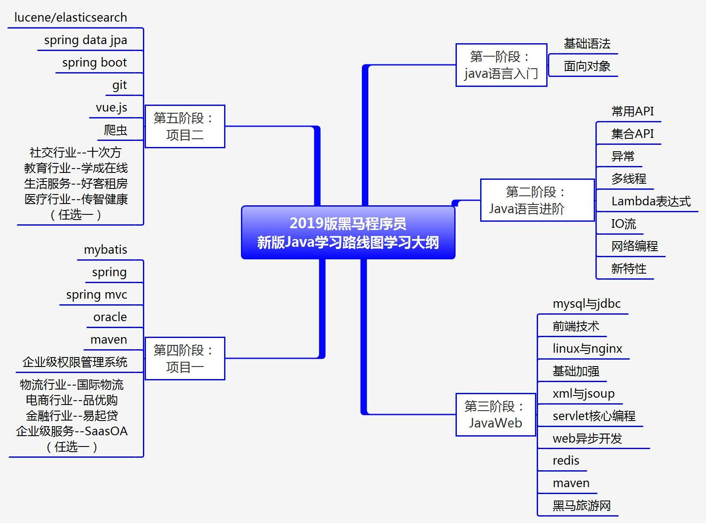

# HelpJava

|   [走向Java](#走向Java)   | [Java基础](#Java基础) | [网络编程](#网络编程) | [多线程](#多线程) |   [JVM](#JVM)   |    [SSM](#SSM)    |
| :-----------------------: | :-------------------: | :-------------------: | :---------------: | :-------------: | :---------------: |
|          :beer:           |        :bread:        |        :cloud:        |      :hand:       |       :v:       |       :pen:       |
|      [Linux](#Linux)      |    [MySQL](#MySQL)    |    [Redis](#Redis)    |    [git](#git)    | [Nginx](#Nginx) | [Docker](#Docker) |
|        :computer:         |        :mouse:        |         :cat:         |       :bee:       |      :pig:      |     :dolphin:     |
| [SpringBoot](#SpringBoot) | [设计模式](#设计模式) |                       |                   |                 |                   |
|          :boot:           |         :egg:         |                       |                   |                 |                   |

[尚硅谷2020最新版Java学习路线图](https://www.bilibili.com/read/cv5216534/?spm_id_from=333.788.b_636f6d6d656e74.9)

## 走向Java

 [Java新手电脑配置.md](走向Java/Java新手电脑配置.md) 

## Java基础
 [00.Java基础面试题.md](01.Java基础/00.Java基础面试题.md)   

 [01.编程基础.md](01.Java基础/01.编程基础.md)     

 [02.数据背后的二进制.md](01.Java基础/02.数据背后的二进制.md)     

 [03.面向对象.md](01.Java基础/03.面向对象.md)    

 [04.类的继承.md](01.Java基础/04.类的继承.md)    

 [05.类的扩展.md](01.Java基础/05.类的扩展.md)   

 [06.异常.md](01.Java基础/06.异常.md)   

 [07.常用基础类.md](01.Java基础/07.常用基础类.md)   

 [08.泛型.md](01.Java基础/08.泛型.md)   

 [09.列表和队列.md](01.Java基础/09.列表和队列.md)      

 [10.Map和Set.md](01.Java基础/10.Map和Set.md) 

 [11.堆与优先级队列.md](01.Java基础\11.堆与优先级队列.md) 

 [12.通用容器类.md](01.Java基础\12.通用容器类.md) 

 [13.文件IO.md](01.Java基础\13.文件IO.md) 

 [14.反射.md](01.Java基础\14.反射.md) 

 [15.注解.md](01.Java基础\15.注解.md) 

 [16.动态代理.md](01.Java基础\16.动态代理.md) 

 [17.序列化.md](01.Java基础\17.序列化.md) 

 [18.类的加载机制.md](01.Java基础\18.类的加载机制.md) 

 [19.正则表达式.md](01.Java基础\19.正则表达式.md) 

 [20.函数式编程.md](01.Java基础\20.函数式编程.md) 

 [21.JDBC.md](01.Java基础\21.JDBC.md) 

## 网络编程

 [01.计算机网络基础.md](02.网络编程/01.网络基础.md) 

### Java Web

 [00Tomcat.md](02.网络编程/JavaWeb/00Tomcat.md) 

 [01Servlet.md](02.网络编程/JavaWeb/01Servlet.md) 

 [02Filter](02.网络编程/JavaWeb/02Filter) 

 [03Listener.md](02.网络编程/JavaWeb/03Listener.md) 

 [04Cookie&Session.md](02.网络编程/JavaWeb/04Cookie&Session.md) 

 [05JDBC.md](02.网络编程/JavaWeb/05JDBC.md) 

 [06安全.md](02.网络编程/JavaWeb/06安全.md) 

 [07Rest.md](02.网络编程/JavaWeb/07Rest.md) 

## 多线程
 [01并发编程基础.md](03.多线程/01并发编程基础.md) 

 [02Java内存模型.md](03.多线程/02Java内存模型.md) 

 [03Java中的锁.md](03.多线程/03Java中的锁.md) 

 [04Java并发容器和框架.md](03.多线程/04Java并发容器和框架.md) 

 [05Java中的原子类.md](03.多线程/05Java中的原子类.md) 

 [06Java中的并发工具类.md](03.多线程/06Java中的并发工具类.md) 

 [07Java线程池相关.md](03.多线程/07Java线程池相关.md) 

 [08J.U.C源码.md](03.多线程/08J.U.C源码.md) 

 [09面试题.md](03.多线程/09面试题.md) 

## JVM 
 [01深入理解Java虚拟机のJVM内存区域与对象布局.md](04.JVM/01深入理解Java虚拟机のJVM内存区域与对象布局.md)   

 [02深入理解Java虚拟机の垃圾回收机制.md](04.JVM/02深入理解Java虚拟机の垃圾回收机制.md)    

 [03深入理解Java虚拟机の高效并发.md](04.JVM/03深入理解Java虚拟机の高效并发.md)   

## SSM
### Spring in Action(4ed)

 [01Spring简介.md](05.Spring/Spring in Action(4E)/01Spring简介.md) 

 [02装配bean.md](05.Spring/Spring in Action(4E)/02装配bean.md) 

 [03高级装配.md](05.Spring/Spring in Action(4E)/03高级装配.md) 

 [04面向切面.md](05.Spring/Spring in Action(4E)/04面向切面.md) 

 [05构建Spring Web.md](05.Spring/Spring in Action(4E)/05构建Spring Web.md) 

 [06渲染Web视图.md](05.Spring/Spring in Action(4E)/06渲染Web视图.md) 

 [07SpringMVC高级.md](05.Spring/Spring in Action(4E)/07SpringMVC高级.md) 

### Spring源码

 [Spring源码深度分析1--容器的实现与BeanDefinition注册.md](05.Spring/源码分析/Spring源码深度分析1--容器的实现与BeanDefinition注册.md)   

 [Spring源码深度分析2--从容器中获取bean对象.md](05.Spring/源码分析/Spring源码深度分析2--从容器中获取bean对象.md)   

### Maven

 [Maven安装配置.md](05.SSM\Maven\Maven安装配置.md) 

 [Maven使用.md](05.SSM\Maven\Maven使用.md) 

## Linux
 [鸟叔Linux私房菜.md](07.Linux/鸟叔Linux私房菜.md)     

 [Linux命令.md](07.Linux/Linux命令.md) 

 [Vim入门.md](07.Linux/Vim入门.md) 

## MySQL

 [MySQL必知必会.md](09.MySQL\MySQL必知必会.md) 

 [MySQL底层实现.md](09.MySQL\MySQL底层实现.md) 

 [01数据库理论.md](09.MySQL\01数据库理论.md) 

 [02MySQL.md](09.MySQL\02MySQL.md) 

## Redis

## 工具

### git

 [00Git基础.md](11.Git\00Git基础.md) 

### Nginx

 [Nginx入门.md](12.工具\Nginx\Nginx入门.md) 

### Docker

 [Docker入门.md](12.工具\Docker\Docker入门.md) 

## 微服务

### SpringBoot

 [01SpringBoot入门.md](13.微服务\1.SpringBoot\01SpringBoot入门.md) 

## 算法

###  01[程序员IT面试指南](算法/程序员IT面试指南) 

-  [1.栈和队列](算法/程序员IT面试指南/1.栈和队列) 
  - 
-  [2.链表问题](算法/程序员IT面试指南/2.链表问题) 
  - 
-  [3.二叉树问题](算法/程序员IT面试指南/3.二叉树问题) 
  - 
-  [4.递归和动态规划](算法/程序员IT面试指南/4.递归和动态规划) 
  - 
-  [5.字符串问题](算法/程序员IT面试指南/5.字符串问题) 

## 设计模式
 [00设计模式之基.md](08.设计模式/00设计模式之基.md)   

 [01单例模式Singleton.md](08.设计模式/01单例模式Singleton.md)     

 [02设计模式之Factory三种工厂模式.md](08.设计模式/02设计模式之Factory三种工厂模式.md)  

 [03设计模式之Prototype原型模式.md](08.设计模式/03设计模式之Prototype原型模式.md)   

 [04设计模式之Builder建造者模式.md](08.设计模式/04设计模式之Builder建造者模式.md)   

 [05设计模式之Adapter适配器模式.md](08.设计模式/05设计模式之Adapter适配器模式.md)   

 [06设计模式之Bridge桥接模式.md](08.设计模式/06设计模式之Bridge桥接模式.md)   

 [07设计模式之Composite组合模式.md](08.设计模式/07设计模式之Composite组合模式.md)   

 [08设计模式之Decorator装饰者模式.md](08.设计模式/08设计模式之Decorator装饰者模式.md)   

 [09设计模式之Facade外观模式.md](08.设计模式/09设计模式之Facade外观模式.md)   

 [10设计模式之Flyweight享元模式.md](08.设计模式/10设计模式之Flyweight享元模式.md)   

 [11设计模式之Proxy代理模式.md](08.设计模式/11设计模式之Proxy代理模式.md)   

