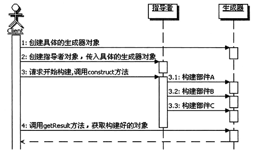

# 设计模式之Builder建造者模式
## 1、结构说明
1. **定义：将一个复杂对象的构建与他的表示分离，使得同样的构建过程可以创建不同的表示。**
2. **解决问题的思路：** 怎样实现同样的构建过程可以创建不同的表示？
    - 先将构建过程独立出来——Director:指导装配过程，但是不负责每一步的具体实现
    - 具体实现每一步的对象——Builder:负责每一步的具体实现
3. UML图  
    
    - Builder：抽象的建造者接口，定义创建一个Product对象所需要的各个部件(对象)的操作
    - ConcerteBuilder：具体的建造者，实现各个部件的创建，并负责组装Product对象的各个部件 ，还要提供一个可以让用户获取最终Product的方法
    - Director：指导者，主要来使用Builder接口，以一个统一的过程来构建所需要的的Product对象
    - Product：产品，表示被建造者构建的复杂对象，包含多个部件(对象)
>这个过程中Director根据注入的不同的Builder来创建出不同的Product
>相同的Director（整体创建过程），不同的Builder实现（不同的表示）

## 2、具体认识
1. 建造者模式的功能
    - 生成器模式的主要功能是构建复杂的产品，而且是细化的、分步骤的构建产品，也就是生成器模式重在一步一步解决构造复杂对象的问题。
    - 更为重要的是，这个**构建的过程是统一的、固定不变的，变化的部分放到生成 示器部分了，只要配置不同的生成器Builder，那么同样的构建过程，就能构建出不同的 产品来。**
2. 构成
    - 生成器模式分成两个很重要的部分。
        - 一个部分是Builder接口，这里是定义了如何构建各个部件，也就是知道每个部件功能如何实现，以及如何装配这些部件到产品中去
        - 一个部分是Director，Director是知道如何组合来构建产品，也就是说Director 负责整体的构建算法，而且通常是分步骤地来执行。
    - 不管如何变化，Builder模式都存在这么两个部分，一个部分是部件构造和产品装配， 另一个部分是整体构建的算法。认识这点是很重要的，因为在生成器模式中，强调的是 **固定整体构建的算法，而灵活扩展和切换部件的具体构造和产品装配的方式**，所以要严 格区分这两个部分。
3. 调用顺序示意图  
     - 
4. Builder的实现
    - 实际上在Builder接口的实现中，每个部件构建的方法里面，**除了部件装配外，也可 以实现如何具体地创建各个部件对象**。也就是说每个方法都可以有两部分功能，**一部分 是创建部件对象，另一部分是组装部件。**
    - 在构建部件的方法里面可以实现选择并创建具体的部件对象，然后再把这个部件对 象组装到产品对象中去。这样一来，Builder就可以和工厂方法配合使用了。
    - 再进一步，如果在实现Builder的时候，**只有创建对象的功能，而没有组装的功能， 那么这个时候的Builder实现跟抽象工厂的实现是类似的。**
    这种情况下，Builder接口就类似于抽象工厂的接口，Builder的具体实现就类似于具 体的工厂，而且Builder接口里面定义的创建各个部件的方法也是有关联的，这些方法是 构建一个复杂对象所需要的部件对象。
5. Director的实现
    - 在生成器模式里面，指导者承担的是整体构建算法部分，是相对不变的部分。因此 在实现指导者的时候，把变化的部分分离出去是很重要的。

## 3、相关模式
1. 建造者模式和工厂方法模式 
    - 这两个模式可以组合使用。
    - 生成器模式的Builder实现中，通常需要选择具体的部件实现。一个可行的方案 就是实现成为工厂方法，通过工厂方法来获取具体的部件对象，然后再进行部件的装配。

2. 生成器模式和抽象工厂模式 
    - 这两个模式既相似又有区别，也可以组合使用。
    - 先说相似性，如果在实现Builder的时候，只有创建对象的功能，而没有组装的功能， 那么这个时候的Builder实现跟抽象工厂的实现是类似的。这种情况下，Builder接口就类似于抽象工厂的接口，Builder的具体实现就类似于具 体的工厂，而且Builder接口里面定义的创建各个部件的方法也是有关联的，这些方法是 构建一个复杂对象所需要的部件对象。
    - 再说说区别：抽象工厂模式的主要目的是创建产品簇，这个产品簇里面的单个 产品就相当于是构成一个复杂对象的部件对象，抽象工厂对象创建完成后就立 即返回整个产品簇；而生成器模式的主要目的是按照构造算法，一步一步来构 建一个复杂的产品对象，通常要等到整个构建过程结束以后，才会得到最终的 产品对象。
    - 事实上，这两个模式是可以组合使用的。在生成器模式的Builder实现中，需要 创建各个部件对象，而这些部件对象是有关联的，通常是构成一个复杂对象的 部件对象。也就是说，Builder实现中，需要获取构成一个复杂对象的产品簇， 那自然就可以使用抽象工厂模式来实现。这样一来，由抽象工厂模式负责了部 件对象的创建，Builder实现里面则主要负责产品对象整体的构建了。

3. 生成器模式和模板方法模式 
    - 模板方法模式主要是**用来定义算法的骨架，把算法中某些步骤延迟到子类中实现**。再想想生成器模式， Director用来**定义整体的构建算法，把算法中某些涉及到具体部件对象的创建和装配的功能，委托给具体的Builder来实现。**
    - 虽然生成器不是延迟到子类，是委托给Builder，但那只是具体实现方式上的差 别，**从实质上看两个模式很类似，都是定义一个固定的算法骨架，然后把算法 中的某些具体步骤交给其他类来完成，都能实现整体算法步骤和某些具体步骤 实现的分离。**
    - 当然这两个模式也有很大的区别，首先是模式的目的，**生成器模式是用来构建 复杂对象的，而模板方法是用来定义算法骨架，尤其是一些复杂的业务功能的 处理算法的骨架**；其次是模式的实现，**生成器模式是采用委托的方法，而模板 方法采用的是继承的方式**；另外从使用的复杂度上，**生成器模式需要组合 Director 和Builder对象，然后才能开始构建，要等构建完后才能获得最终的对 象，而模板方法就没有这么麻烦，直接使用子类对象即可**。

