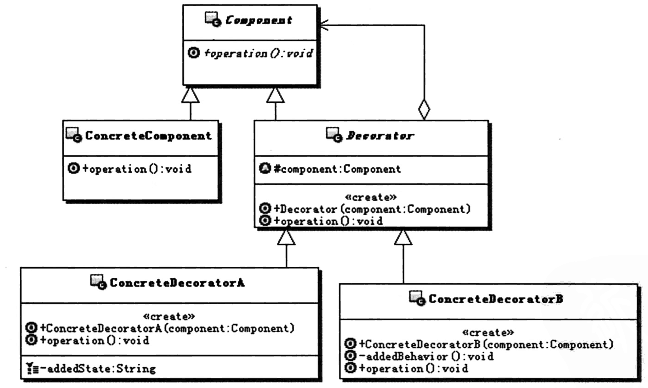

# 设计模式之Decorator装饰者模式
## 1、解决问题
1. 定义：动态的给一个对象添加一些额外的功能职责，就增加功能来说，装饰者模式比生成子类更加灵活。
2. 解决问题的思路：
    - 如何透明的给一个对象增加功能，即给一个对象添加功能却不能让这个对象知道，也就是说不能修改这个对象
    - 通过定义一个抽象类，让这个类实现与被修饰对象相同的接口，然后在具体的实现类中转调被修饰的对象，在转调前后增添一些额外的功能
3. UML图

    - Component:组件对象的接口，可以给这些对象动态地添加职责。
    - ConcreteComponent:具体的组件对象，实现组件对象接口，通常就是**被装饰器装饰的原始对象**，也就是可以给这个对象添加职责。
    - Decorator:所有装饰器的抽象父类，需要实现一个与组件接口一致的接口，并 持有一个Component对象，其实就是**持有一个被装饰的对象。**（注意这个被装饰的对象不一定是最原始的那个对象了，也可能是被其他装饰器 意装饰过后的对象，反正都是实现的同一个接口，也就是同一类型）
    - ConcreteDecorator:实际的装饰器对象，实现具体要向被装饰对象添加的功能。
## 2、具体认识
1. 装饰模式的功能 
    - 装饰模式能够实现动态地为对象添加功能，是**从一个对象外部来给对象增加功能， 相当于是改变了对象的外观**。当装饰过后，从外部使用系统的角度看，就不再是使用原 始的那个对象了，而是使用被一系列的装饰器装饰过后的对象。
2. 对象组合 
    - 一个类的功能的扩展方式，可以是继承，也可以是功能更强大、 更灵活的对象组合的方式。
    - 在面向对象的设计中，有一条基本的规则就是“尽量使用对象组合，而 不是对象继承”来扩展和复用功能。装饰模式的思考起点就是这个规则。
3. 装饰器 
    - 装饰器实现了对被装饰对象的某些装饰功能，可以在装饰器中调用被装饰对象的功能，获取相应的值，这其实是一种递归调用。
    - 在装饰器中不仅仅是可以给被装饰对象增加功能，还可以根据需要选择是否调用被装饰对象的功能，如果不调用被装饰对象的功能，那就变成完全重新实现了
4. 装饰器和组件类的关系 
    - 装饰器是用来装饰组件的，装饰器一定要实现和组件类一致的接口，保证它们是同 一个类型，并具有同一个外观，这样组合完成的装饰才能够递归调用下去。
    - 组件类是不知道装饰器的存在的，装饰器为组件添加功能是一种透明的包装，组件 类毫不知情。需要改变的是外部使用组件类的地方，现在需要使用包装后的类，接口是 一样的，但是具体的实现类发生了改变。
5. 退化形式 
    - 如果仅仅只是想要添加一个功能，就没有必要再设计装饰器的抽象类了，直接在装 饰器中实现跟组件一样的接口，然后实现相应的装饰功能就可以了。但是建议最好还是 设计上装饰器的抽象类，这样有利于程序的扩展。

## 3、应用场景
1. I/O流

## 4、相关模式
1. 装饰者模式和代理模式
2. 装饰模式与组合模式 
    - 这两个模式有相似之处，都涉及到对象的递归调用，从某个角度来说，可以把 装饰看做是只有一个组件的组合。
    - 它们的目的完全不一样，**装饰模式是要动态地给对象增加功能**；而组合模 式是想**要管理组合对象和叶子对象，为它们提供一个一致的操作接口给客户端， 方便客户端的使用。**
3. 装饰模式与策略模式 
    - 这两个模式可以组合使用。
    - 策略模式也可以实现动态地改变对象的功能，但是**策略模式只是一层选择，也 就是根据策略选择一下具体的实现类而已**。而**装饰模式不是一层，而是递归调 用，无数层都可以**，只要组合好装饰器的对象组合，那就可以依次调用下去。所以装饰模式更灵活。
    - 策略模式改变的是原始对象的功能，不像装饰模式，后面一个装饰器，改 变的是经过前一个装饰器装饰后的对象。也就是**策略模式改变的是对象的内核， 而装饰模式改变的是对象的外壳。**
4. 装饰者模式和模板方法模式
    - 模板方法模式主要应用在**算法骨架固定的情况**，那么要是算法步骤不固定呢， 也就是一个**相对动态的算法步骤，就可以使用装饰模式了**，因为在使用装饰模 式的时候，进行装饰器的组装，其实也相当于是一个调用算法步骤的组装，相 当于是一个动态的算法骨架。
    - 既然装饰模式可以实现动态的算法步骤的组装和调用，那么把这些算法步骤固 定下来，那就是模板方法模式实现的功能了，因此装饰模式可以模拟实现模板 方法模式的功能。
    - 但是请注意，仅仅只是可以模拟功能而已，**两个模式的设计目的、原本的功能、 本质思想等都是不一样的。**

