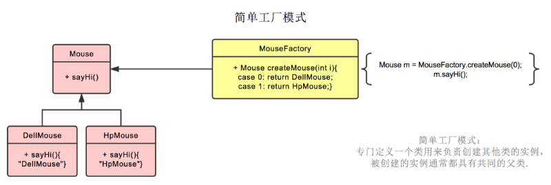
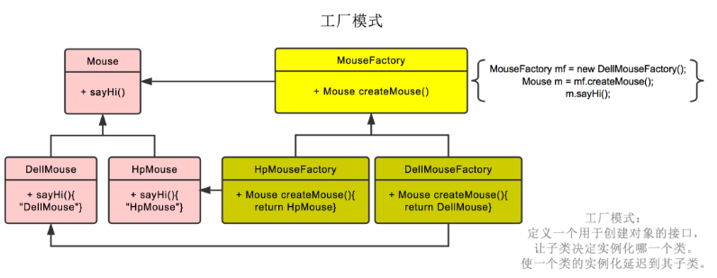
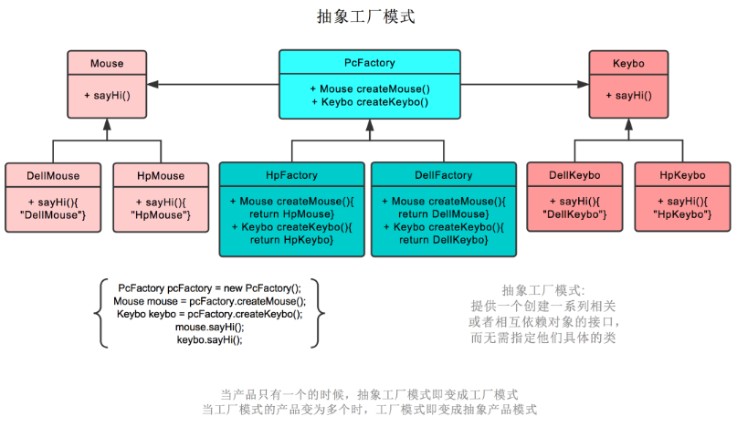
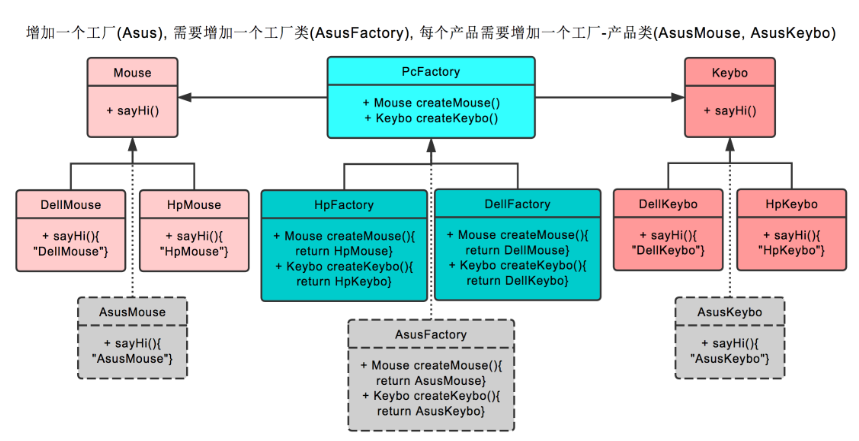
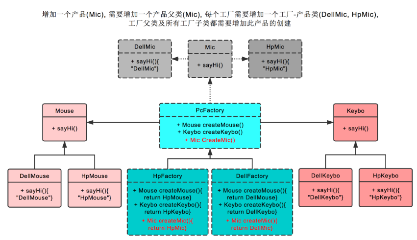

# 三种工厂模式

## 1、简单工厂模式
1.  **简单工厂的定义：** 提供一个创建对象实例的功能，而无须关心其具体实现。被创建实例的类型可以是接口、抽象类，也可以是具体的类。  
2.  **应用简单工厂来解决问题的思路：** 在模块内部新建一个**工厂类**，在这个类里面来**根据条件创建接口对象**，然后把创建好的接口对象返回给客户端，这样，外部应用就只需要根据这个工厂类来获取相应的接口对象，然后就可以操作接口定义的方法了。把这样的对象称为简单工厂，就叫它Factory吧。  

### 1.1简单工厂类图

1.  Api:定义客户所需要的功能接口（抽象产品）。  
2.  Impl:具体实现Api的实现类（具体产品），可能会有多个。  
3.  Factory:具体工厂，可以根据传入条件创建实现Api接口的产品对象。
4.  Client:客户端，通过Factory来获取Api接口对象，然后**面向Api接口编程**。  

**简单工厂调用顺序图**  

### 1.2简单工厂分析

1.  **简单工厂本质：选择实现**
    - 简单工厂的重点在选择，实现是已经做好了的。就算实现再简单，也要由具体的实现类来实现，而不是在简单工厂里面来实现。简单工厂的目的在于**为客户端来选择 相应的实现，从而使得客户端和实现之间解耦**。这样一来，具体实现发生了变化，就不 用变动客户端了，这个变化会被简单工厂吸收和屏蔽掉。
2.  **优点：**
    - 帮助封装  
    简单工厂虽然很简单，但是非常友好地帮助我们实现了组件的封装，然后让组件外部能真正面向接口编程。 
    - 解耦  
    通过简单工厂，实现了客户端和具体实现类的解耦。客户端根本就不知道具体是由谁来实现，也不知道具体是如 何实现的，客户端只是通过工厂获取它需要的接口对象。
3. **缺点**
    - 可能增加客户端的复杂度：如果工厂类通过客户端的参数来选择具体的实现类，那么就必须让客户端能理解各个 参数所代表的具体功能和含义，这样会增加客户端使用的难度，也部分暴露了内部实现，这种情况可以选用可配置的方式来实现。
    - 不方便扩展子工厂 ：私有化简单工厂的构造方法，使用静态方法来创建接口，也就不能通过写简单工厂类的子类来改变创建接口的方法的行为了。不过，通常情况下是不需要为 简单工厂创建子类的。
4.  **何时选用简单工厂** 
    - 如果想要完全封装隔离具体实现，让外部只能通过接口来操作封装体，那么可 以选用简单工厂，让客户端通过工厂来获取相应的接口，而无须关心具体的实 现。
    - 如果想要把对外创建对象的职责集中管理和控制，可以选用简单工厂，一个简 单工厂可以创建很多的、不相关的对象，可以把对外创建对象的职责集中到一 个简单工厂来，从而实现集中管理和控制。
5. **简单工厂和抽象工厂模式**  
    -  简单工厂是用来选择**实现**的，可以选择任意接口的实现。一个简单工厂可以有 多个用于选择并创建对象的方法，多个方法创建的对象可以有关系也可以没有 关系。
    -  抽象工厂模式是用来选择**产品簇的实现**的，也就是说一般抽象工厂里面有多个 用于选择并创建对象的方法，但是这些方法所创建的对象之间通常是有关系的， 这些被创建的对象通常是构成一个产品簇所需要的部件对象。
    - 某种意义上来说，简单工厂和抽象工厂是类似的，**如果抽象工厂退化成 为只有一个实现，不分层次，那么就相当于简单工厂**
6. **简单工厂和工厂方法模式**
    - 工厂方法的本质也是用来选择**实现**的，跟简单工厂的区别在于**工厂方法是把选择具体实现的功能延迟到子类去实现**。
    - 如果**把工厂方法模式中选择的实现放到父类直接实现，那就等同于简单工厂**。

## 2、工厂方法模式
工厂模式（Factory Pattern）是 Java 中最常用的设计模式之一。这种类型的设计模式属于创建型模式，它提供了一种创建对象的最佳方式。  
在工厂模式中，我们在创建对象时不会对客户端暴露创建逻辑，并且是通过使用一个共同的接口来指向新创建的对象。
**意图：** 定义一个用于创建对象的接口，内部通常会有一个返回一个产品类型的实例对象的抽象方法，让其子类自己决定实例化哪一个工厂类，工厂模式使其创建过程延迟到子类进行。
**主要解决：** 主要解决接口选择的问题。
**何时使用：** 我们明确地计划不同条件下创建不同实例时。
**如何解决：** 让其子类实现工厂接口，返回的也是一个抽象的产品。
**关键代码：** 创建过程在其子类执行。

### 2.1工厂方法模式类图

1.  Product:定义**抽象产品**接口。
2.  ConcreteProduct:具体的Product接口的实现对象（**具体产品**）。
3.  Creator: **抽象工厂** ，声明工厂方法，工厂方法通常会返回一个Product类型的实例对象，而且多是抽象方法。也可以在Creator里面提供工厂方法的默认实现，让工厂 方法返回一个缺省的Product类型的实例对象。
4.  ConcreteCreator: **具体工厂对象**，覆盖实现Creator定义的工厂方法，返回具体的Product实例。

### 2.2认识工厂方法模式
1. **工厂方法模式的功能**
    - 工厂方法模式的主要功能是让父类在不知道具体实现的情况下，完成自身的功能调用；而具体的实现延迟到子类来实现。
    - 这样在设计的时候，不用去考虑具体的实现，需要某个对象，把它通过工厂方法返 回就好了，在使用这些对象实现功能的时候还是通过接口来操作，这类似于IoC/DI的思 想
2. **实现成抽象类**
    - 工厂方法的实现中，通常父类会是一个抽象类，里面包含创建所需对象的抽象方法， 这些抽象方法就是工厂方法。
    - 这里要注意一个问题，子类在实现这些抽象方法的时候，通常并不是真正地由子类来实现具体的功能，而是在子类的方法里面做选择，选择具体的产品对象。
    - 父类里面，通常会有使用这些产品对象来实现一定的功能的方法，而且这些方法所实现的功能通常都是公共的功能，不管子类选择了何种具体的产品实现，这些方法的功能总是能正确执行。
3. **实现成具体的类**
    - 也可以把父类实现成为一个具体的类。这种情况下，通常是在父类中提供获取所需对象的默认实现方法，这样即使没有具体的子类，也能够运行。 
    - 通常这种情况还是需要具体的子类来决定具体要如何创建父类所需要的对象。也把 这种情况称为工厂方法为子类提供了挂钩。通过工厂方法，可以让子类对象来覆盖父类 的实现，从而提供更好的灵活性。
4. **工厂方法的参数和返回**
    - 工厂方法的实现中，可能需要参数，以便决定到底选用哪一种具体的实现。也就是说通过在抽象方法里面传递参数，在子类实现的时候根据参数进行选择，看看究竟应该 创建哪一个具体的产品对象。
    - 一般工厂方法返回的是被创建对象的接口对象，当然也可以是抽象类或者一个具体 的类的实例。
5. **谁来使用工厂方法创建的对象**
    - 事实上，在工厂方法模式里面，应该是Creator中的其他方法在使用工厂方法创建的 对象，虽然也可以把工厂方法创建的对象直接提供给Creator外部使用，但工厂方法模式 的本意，是由Creator对象内部的方法来使用工厂方法创建的对象，也就是说，工厂方法 一般不提供给Creator外部使用。
    - 客户端应该使用Creator对象，或者是使用由Creator创建出来的对象，一般不要直接使用工厂方法。对于客户端 使用Creator对象，这个时候工厂方法创建的对象，是Creator中的某些方法使用；对于使用那些由Creator创建出来的对象，这个时候工厂方法创建的对象，是构成客户端需要的对象的一部分。
6. **工厂方法模式的调用顺序**
    -  客户端使用Creator对象
    
    
    -  客户端使用由Creator创建出来的对象
    

### 2.3工厂方法模式使用分析

1. **本质：延迟到子类来选择实现**
    - 工厂方法模式中的工厂方法，在真正实现的时候， 一般是先选择具体使用哪一个具体的产品实现对象，然后创建这个具体产品对象的示例， 最后就可以返回去了。也就是说，工厂方法本身并不会去实现产品接口，具体的产品实 现是已经写好了的，工厂方法只要去选择实现就好了。  
2. **这不是跟简单工厂一样吗？**  
    - 在具体实现上都是“选择实现”。
        - 但是也存 在不同点，简单工厂是直接在工厂类里面进行“选择实现”；
        - 而工厂方法会把这个工作 延迟到子类来实现，工厂类里面使用工厂方法的地方是依赖于抽象而不是具体的实现， 从而使得系统更加灵活，具有更好的可维护性和可扩展性。  
    - 其实**如果把工厂模式中的Creator退化一下，只提供工厂方法，而且这些工厂方法还 都提供默认的实现，就变成简单工厂了**
3.  **对设计原则的体现：依赖倒置原则**
    - 依赖倒置原则告诉我们**“要依赖抽象，不要依赖于具体类”**，简单点说就是：不能让高层组件依赖于低层组件，而且不管高层组件还是低层组件，都应该依赖于抽象。
    - 倒置指的是这个接口的所有权，接口中定义的功能，都是由高层组件来提出的要求，也就是说接口中的功能，是高层组件需要的功能。但是高层组件只是提出要求，并不关心如何实现，而底层组件， 就是来真正实现高层组件所要求的接口功能的。因此看起来，低层实现的接口的所有权 并不在底层组件手中，而是倒置到高层组件去了。
4.  **优点：**
    - 一个调用者想创建一个对象，只要知道其名称就可以了。
    - 扩展性高，如果想增加一个产品，只要扩展一个工厂实现类就可以。
    - 屏蔽产品的具体实现，调用者只关心产品的接口。
7.  **缺点：**
    - 具体产品对象和工厂方法的耦合性
8.  **工厂方法模式和模板方法模式**
    - 这两个模式外观类似，都有一个抽象类，然后由子类来提供一些实现，但是**工厂方法模式的子类专注的是创建产品对象，而模板方法模式的子类专注的是为固定的算法骨架提供某些步骤的实现**。 
    - 这两个模式可以组合使用，通常在模板方法模式里面，使用工厂方法来创建模板方法需要的对象。
9.  **使用场景：**
    - 如果一个类需要创建某个接口的对象，但是又不知道具体的实现，这种情况可 以选用工厂方法模式，把创建对象的工作延迟到子类中去实现。
    - 如果一个类本身就希望由它的子类来创建所需的对象的时候，应该使用工厂方 法模式。

### 2.4工厂方法模式与loC/DI

1. **理解IoC/DI ：** IoC——Inversion of Control,控制反转。DI——Dependency Injection,依赖注入。
1. 参与者都有谁：一般有三方参与者，一个是某个对象；另一个是IoC/DI的容 器；还有一个是某个对象的外部资源。  
    某个对象指的就是任意的、普通的Java对象，loC/Dl的容器简单 释点说就是指用来实现loC/Dl功能的一个框架程序，对象的外部资源指的就是对象需要的，但是是从对象外部获取的，都统称为资源，比如，对象需要的其他对 象，或者是对象需要的文件资源等。
2. 谁依赖于谁：当然是某个对象依赖于IoC/DI的容器。
3. 为什么需要依赖：对象需要loC/DI的容器来提供对象需要的外部资源。
4. 谁注入于谁：很明显是loC/DI的容器注入某个对象。
5. 到底注入什么：就是注入某个对象所需要的外部资源。
6. 谁控制谁：当然是loC/DI的容器来控制对象了。
7. 控制什么：主要是控制对象实例的创建。
8. 为何叫反转：不是主动获取而是被动的等待IoC给自己对象
9. 依赖注入和控制反转是对同一件事情的不同描述。  
    从某个方面讲，就是它们描述的角度不同。依赖注入是从应用程序的角度去描述，可以 把依赖注入描述得完整点：应用程序依赖容器创建并注入它所需要的外部资源；而控制 反转是从容器的角度去描述，描述得完整点就是：容器控制应用程序，由容器反向地向 应用程序注入其所需要的外部资源。
    
## 3、抽象工厂模式介绍
1.  **抽象工厂模式的定义：**提供一个创建一系列相关或相互依赖对象的接口，而无需指定它们具体的类。
2.  应用抽象工厂模式来解决问题的思路
    - 要解决的问题是，要创建一系列的产品对象，而且这一系列对象是构建新的对象所需要的组成部分，也就是这一系列被创建的对象相互之间是有约束的。
    - 一个是只知道所需要的一系列对象的接 口，而不知具体实现，或者是不知道具体使用哪一个实现；
    - 另外一个是这**一系列对象是 相关或者相互依赖的，也就是说既要创建接口的对象，还要约束它们之间的关系**。

### 3.1类图

1.  Abstract Factory: **抽象工厂**，定义创建一系列产品对象的操作接口。
2.  Concrete Factory:**具体的工厂**，实现抽象工厂定义的方法，具体实现一系列产品对 象的创建。
3.  Abstract Product:定义一类**产品对象的接口**。
4.  Concrete Product:**具体的产品实现对象**，通常在具体工厂里面，会选择具体的产品 实现对象，来创建符合抽象工厂定义的方法返回的产品类型的对象。
5.  Client:客户端，主要使用抽象工厂来获取一系列所需要的产品对象，然后面向这 些产品对象的接口编程，以实现需要的功能。
    
### 3.2认识抽象工厂模式

1.  **本质：选择产品簇的实现**
    - 工厂方法是选择单个产品的实现，虽然一个类里面可以有多个工厂方法，但是这些 方法之间一般是没有联系的，即使看起来像有联系。
    - 抽象工厂着重的就是为一个产品簇选择实现，定义在抽象工厂里面的方法通常 是有联系的，它们都是产品的某一部分或者是相互依赖的。**如果抽象工厂里面只定义一 个方法，直接创建产品，那么就退化成为工厂方法了**。
3. 抽象工厂模式的功能
    - 抽象工厂的功能是为一系列相关对象或相互依赖的对象创建一个接口。一定要注意， 这个接口内的方法不是任意堆砌的，而是一系列相关或相互依赖的方法
    - 从某种意义上看，抽象工厂其实是一个产品系列，或者是产品簇。
5. 实现成接口
    - AbstractFactory在Java中通常实现成为接口，大家不要被名称误导了，以为是实现 成为抽象类。当然，如果需要为这个产品簇提供公共的功能，也不是不可以把 AbstractFactory实现成为抽象类，但一般不这么做。
7. 使用工厂方法
    - AbstractFactory定义了创建产品所需要的接口，具体的实现是在实现类里面，通常 在实现类里面就需要选择多种更具体的实现。所以AbstractFactory定义的创建产品的方法可以看成是工厂方法，而这些工厂方法的具体实现就延迟到了具体的工厂里面。也就是说使用 工厂方法来实现抽象工厂。
9. 切换产品簇
    - 由于抽象工厂定义的一系列对象通常是相关或者相互依赖的，这些产品对象就构成 一个产品簇，也就是抽象工厂定义了一个产品簇。这就带来非常大的灵活性，切换一个产品簇的时候，只要提供不同的 抽象工厂实现类 可以了，也就是说现在是以产品簇作为一个整体被切换。
11. 抽象工厂模式的调用顺序示意图
     

13. **优点：**
    - 分离接口和实现  
    客户端使用抽象工厂来创建需要的对象，而客户端根本就不知道具体的实现是 谁，客户端只是面向产品的接口编程而已。也就是说，客户端从具体的产品实 现中解耦。
    - 使得切换产品簇变得容易  
    因为一个具体的工厂实现代表的是一个产品簇，客户端选用不同的工厂实现，就相当于是在切换不同的产品簇。
    - 当一个产品族中的多个对象被设计成一起工作时，它能保证客户端始终只使用同一个产品族中的对象。
15. **缺点：**
    - 产品族扩展非常困难，要增加一个系列的某一产品，既要在抽象的 Creator 里加代码，又要在具体的里面加代码。
17. **何时使用：**
    - 系统的产品有多于一个的产品族，而系统只消费其中某一族的产品，换句话说，就是可以动 态地切换产品簇的时候。
    - 如果希望一个系统独立于它的产品的创建、组合和表示的时候。换句话说，希望 一个系统只是知道产品的接口，而不关心实现的时候。
    - 如果要强调一系列相关产品的接口，以便联合使用它们的时候。

## 4、总结

### 4.1简单工厂模式
简单工厂模式不是 23 种里的一种，简而言之，就是有一个专门生产某个产品的类。
比如下图中的鼠标工厂，专业生产鼠标，给参数 0，生产戴尔鼠标，给参数 1，生产惠普鼠标。

### 4.2工厂模式

工厂模式也就是鼠标工厂是个父类，有生产鼠标这个接口。

戴尔鼠标工厂，惠普鼠标工厂继承它，可以分别生产戴尔鼠标，惠普鼠标。

生产哪种鼠标不再由参数决定，而是创建鼠标工厂时，由戴尔鼠标工厂创建。

后续直接调用鼠标工厂.生产鼠标()即可

### 4.3抽象工厂模式

抽象工厂模式也就是不仅生产鼠标也生产键盘——产品簇

也就是 PC 厂商是个父类，有生产鼠标，生产键盘两个接口。

戴尔工厂，惠普工厂继承它，可以分别生产戴尔鼠标+戴尔键盘，和惠普鼠标+惠普键盘。

创建工厂时，由戴尔工厂创建。

后续`工厂.生产鼠标()`则生产戴尔鼠标，`工厂.生产键盘()`则生产戴尔键盘。

> 在抽象工厂模式中，假设我们需要增加一个工厂
假设我们增加华硕工厂，则我们需要增加华硕工厂，和戴尔工厂一样，继承 PC 厂商。
之后创建华硕鼠标，继承鼠标类。创建华硕键盘，继承键盘类即可。

> 在抽象工厂模式中，假设我们需要增加一个产品
假设我们增加耳麦这个产品，则首先我们需要增加耳麦这个父类，再加上戴尔耳麦，惠普耳麦这两个子类。
之后在PC厂商这个父类中，增加生产耳麦的接口。最后在戴尔工厂，惠普工厂这两个类中，分别实现生产戴尔耳麦，惠普耳麦的功能。 以上。

