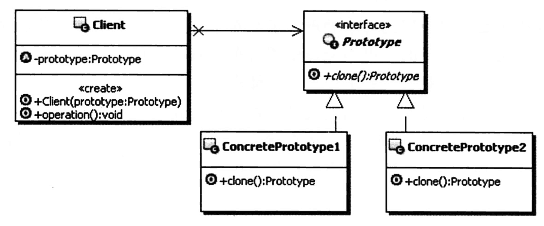
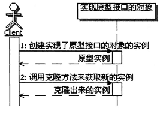

# 设计模式之Prototype原型模式
## 1、解决问题
1. 原型模式的定义：用原型模式指定创建对象的种类，并通过拷贝这些原型对象创建新对象。
2. 解决问题的思路：
    - 原型模式会要求对象实现一个可以克隆自身的接口，然后就可以通过拷贝或者克隆自己来创建一个新的对象；
    - 如果把这个方法定义在接口上，看起来就是通过接口来创建了新的接口对象
3. UML图

    - Prototype:声明一个克隆自身的接口，用来约束想要克隆自己的类，要求它们 都要实现这里定义的克隆方法。
    - ConcretePrototype:实现Prototype接口的类，这些类真正实现了克隆自身的功能。
    - Client:使用原型的客户端，首先要获取到原型实例对象（构造方法注入），然后通过原型实例克隆自身来创建新的对象实例。
## 2、认识分析
1. 原型模式的本质：克隆生成对象。
    - 克隆是手段，目的是生成新的对象实例。正是因为原型的目的是为了生成新的对象 实例，原型模式通常是被归类为创建型的模式。
    - 原型模式也可以用来解决“只知接口而不知实现的问题”，使用原型模式，可以出 现一种独特的“接口造接口”的景象，这在面向接口编程中很有用。
2. 原型模式的功能
    - 原型模式的功能实际上包含两个方面：
    一个是通过克隆来创建新的对象实例； 
    另一个是为克隆出来的新的对象实例复制原型实例属性的值。
3. 原型与new
    - 原型模式从某种意义上说，就像是new操作。但请注意，只是“类似于new”而不是“就是new”。
    - 克隆方法和new操作最明显的不同就在于：new一个对象实例，一般属性是没有值 的，或者是只有默认值；如果是克隆得到的一个实例，通常属性是有值的，属性的值就 是原型对象实例在克隆的时候，原型对象实例的属性的值。
4. 原型实例和克隆的实例
    - 原型实例和克隆出来的实例，本质上是不同的实例，克隆完成后，它们之间是没有 关联的，如果克隆完成后，克隆出来的实例的属性值发生了改变，是不会影响到原型实 例的。
5. 调用顺序示意图

6. 原型模式的优点 ·
    - 对客户端隐藏具体的实现类型：原型模式的客户端只知道原型接口的类型，并不知道具体的实现类型，从而减 少了客户端对这些具体实现类型的依赖。
    - 在运行时动态改变具体的实现类型：原型模式可以在运行期间，由客户来注册符合原型接口的实现类型，也可以动 态地改变具体的实现类型，看起来接口没有任何变化，但其实运行的已经是另 外一个类实例了。因为克隆一个原型就类似于实例化一个类。
7. 原型模式的缺点
    - 原型模式最大的缺点就在于每个原型的子类都必须实现clone的操作，尤其在 包含引用类型的对象时，clone方法会比较麻烦，必须要能够递归地让所有的相 关对象都要正确地实现克隆。
8. 何时选用原型模式
    - 如果一个系统想要独立于它想要使用的对象时，可以使用原型模式，让系统只面向接口编程，在系统需要新的对象的时候，可以通过克隆原型来得到。
    - 如果需要实例化的类是在运行时刻动态指定时，可以使用原型模式，通过克隆 原型来得到需要的实例。

>浅度克隆：只负责克隆按值传递的数据（比如基本数据类型、String类型）。
深度克隆：除了浅度克隆要克隆的值外，还负责克隆引用类型的数据，基本上 就是被克隆实例所有的属性数据都会被克隆出来。

## 3、相关模式
1. 原型模式与抽象工厂模式
    - 功能上都是用来获取一个新的对象实例
    - 不同的是，原型模式的**着眼点是在如何创造出实例对象来**，最后选择的方 案是通过克隆；而抽象工厂模式的**着眼点则在于如何来创造产品簇**，至于具体 如何创建出产品簇中的每个对象实例，抽象工厂模式则不是很关注。正是因为它们的关注点不一样，所以它们也可以配合使用，比如在抽象工厂模
2. 原型模式和建造者模式
    - 这两种模式可以配合使用。
    生成器模式关注的是构建的过程，而在构建的过程中，很可能需要某个部件的 实例，那么很自然地就可以应用上原型模式，通过原型模式来得到部件的实例。
